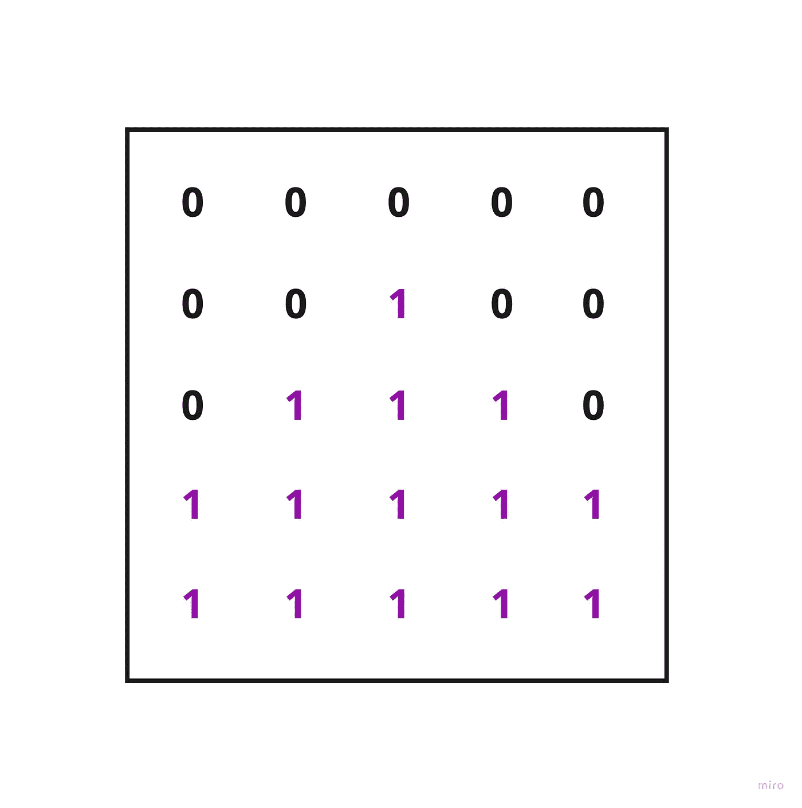
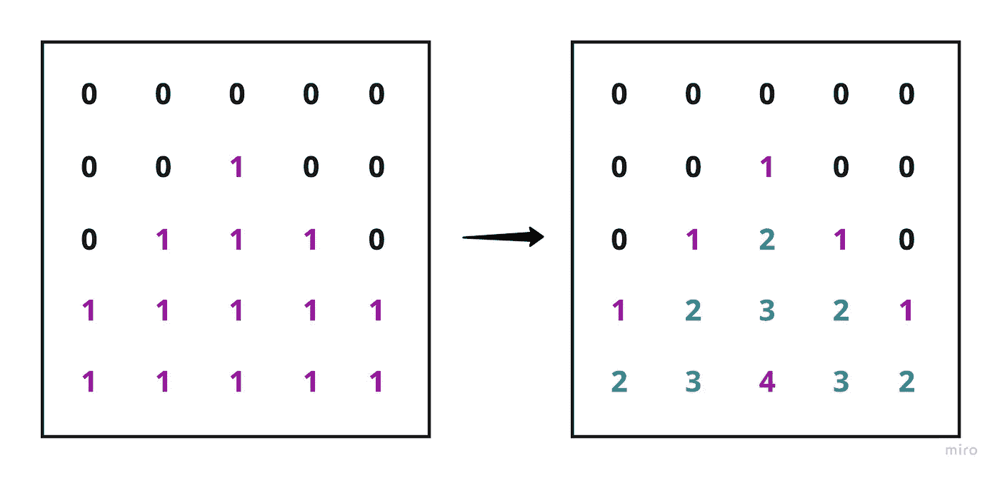
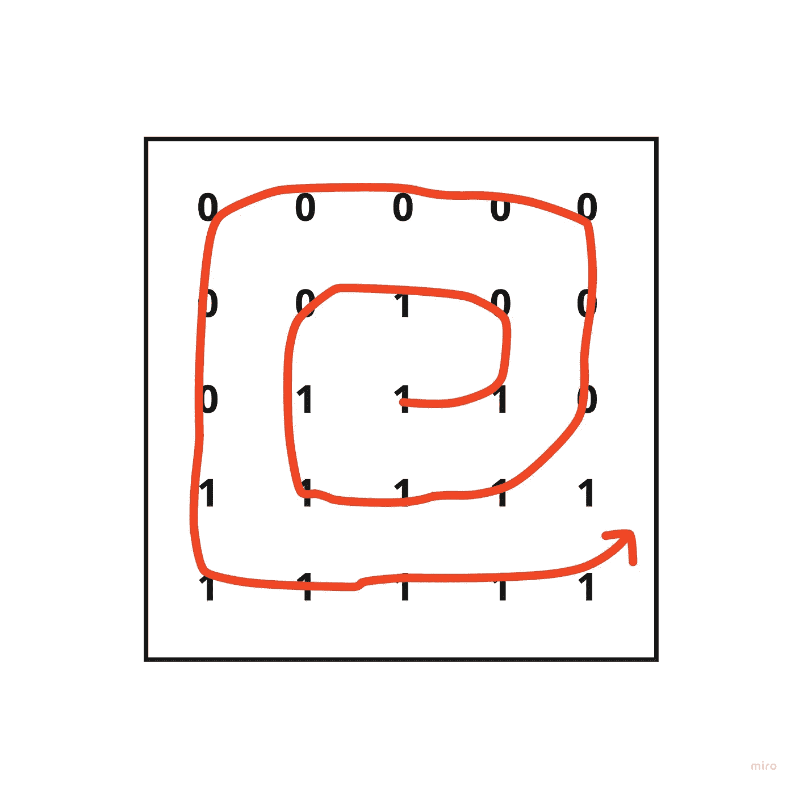

# LeetCode: 01 矩阵(两遍法)

> 原文：<https://javascript.plainenglish.io/01-matrix-two-pass-method-d9d92ea5ee67?source=collection_archive---------10----------------------->

## 使用 JavaScript 解决

我现在总结的 LeetCode 问题是一个叫做 [01 Matrix](https://leetcode.com/problems/01-matrix/) 的问题。这是一个中等水平的挑战，而且非常有趣。任务很简单，重新分配每个非零值以反映其到最近的零的距离。所以我们以这样的转换结束:

*   快速澄清说明-你的“脚步”可以通过*结合*水平和垂直运动达到最近的零。换句话说，取结果矩阵右下角的蓝色 3。这三个可以引用两个不同的零，一个在它的正上方(3 个垂直步骤之外),另一个是两个垂直步骤，然后一个水平。

虽然这对于大多数人来说可能是显而易见的，但直到我整理出一个非常干净、聪明且完全不正常的解决方案时，我才注意到这一点。

## ***问题的性质***

当使用矩阵时，我有一套基本的询问方法来帮助我。考虑到 Leetcode 的约束，它们的大小可能相当大(1 < n, m < 10⁴), my first question is “do I need to visit all of them?” followed almost immediately with “how many times?”

My first solution was to iterate through the matrix, stop at each one and perform what I like to think of as a ‘spiral check’. So if I’m starting at the 1 in the center of the matrix, I would check all surrounding values and then expand my search each time.

This search would have stopped more quickly than implied though, when the second value explored (0) was reached.

This approach comes with an obvious drawback though- there is much potential for overlap in how many times we’ll revisit the same locations.

***解***

所以最终，我决定采用两步法。首先，迭代矩阵并对所有的零位置进行编目

然后，重复，对于每个 1 值，检查其与所有先前建立的零的接近度(或“增量”)。对于 delta，只需考虑水平位置的变化+垂直位置的变化

完整的解决方案:

正如 Leetcode 所指出的，就空间复杂性而言，它似乎有些高性能，但当涉及到时间时，它肯定会留下一些需要改进的地方。

*更多内容请看*[***plain English . io***](https://plainenglish.io/)*。报名参加我们的* [***免费周报***](http://newsletter.plainenglish.io/) *。关注我们关于*[***Twitter***](https://twitter.com/inPlainEngHQ)*和*[***LinkedIn***](https://www.linkedin.com/company/inplainenglish/)*。加入我们的* [***社区不和谐***](https://discord.gg/GtDtUAvyhW) *。*