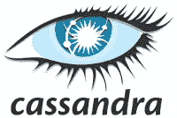
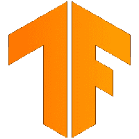

# 10 个最佳合作开源项目

> 原文：<https://javascript.plainenglish.io/10-best-open-source-projects-to-collaborate-in-2be1906c4e2f?source=collection_archive---------4----------------------->

## 找出你可以参与的最好的开源项目。

Photo by [Kiryl Sharkouski](https://unsplash.com/@kshar2) from [Unsplash](https://unsplash.com/s/photos/open)

外面有很多开源项目，你可以选择合作，成为 GitHub 上公认的开发者。其中一些很有名，有一些不可思议的公司参与其中，而另一些则是由较小的公司推动的。

开源世界是民主的，让每个人都能在开发者社区获得一些名气。所以，你只需要知道你可以开始合作的最好的项目。这是清单。

## 1.Visual Studio 代码

是的，最著名和最流行的 IDE 是开源的。

您可能知道，VSCode 是微软的一个 IDE，大多数开发人员用它来创建他们的编码项目。它速度惊人，功能强大。

它也是开源的，如果你愿意，你可以与代码库合作。它已经有超过 1635 个贡献者。

它主要是用 TypeScript 编写的，并且有关于如何开始投稿的非常准确的文档，以及您需要知道的一切。

GitHub 回购:[https://github.com/microsoft/vscode](https://github.com/microsoft/vscode)

## 2.反应

另一个巨头由科技领域五大公司之一创立。

React 是一个前端库，由脸书创建和维护，但在 GitHub 上也有，你可以在那里合作。

有 1556 个贡献者，真的很受欢迎。GitHub 表示，只有不到 10，000，000 的开发者在使用它。

它有非常有条理的文档，并且主要是用 JavaScript 编写的，所以它很好——如果你是初学者，也是一个不错的选择。

Github 回购:【https://github.com/facebook/react 

## 3.姜戈

这是第一个没有大公司控制的项目。

它是最著名的 Python 后端框架。真的是众所周知的可靠。它总是与社区一起开发，随着框架的成长，社区变得越来越强大。

它被将近 100 万人使用，有 2217 个贡献者。

正如您可能猜到的，它几乎完全是用 Python 编写的，社区和文档都非常好。

GitHub 回购:【https://github.com/django/django 

## 4.阿帕奇卡桑德拉

Cassandra 是一个 Apache DBMS，非常流行。

这是一个 NoSQL 数据库管理系统，以开放源代码、高性能和高可靠性而闻名。它的名字也是一种保险。

在这个项目中，有很好的文档，一切都很容易理解。它主要用 Java 编写，有 363 个贡献者。这也是一种高级俱乐部。

GitHub 回购:[https://github.com/apache/cassandra](https://github.com/apache/cassandra)

## 5.库伯内特斯

您需要搬运和移动集装箱吗？Kubernetes 是您正在寻找的解决方案。

它拥有 3000 多名贡献者，是 GitHub 上最受欢迎的开源项目之一。

该应用程序的主要焦点是执行，所以它是用 Go 编写的(我们将要谈论的下一个项目)，这也让您可以使用最未来的语言之一。这可能是一个不可思议的选择。

GitHub 回购:【https://github.com/kubernetes/kubernetes 

## 6.去

开源是最具创新性的编程语言之一。

它是 Go，谷歌在 2009 年开发的语言，目前也是开源的。尽管它是一个非常年轻的项目，但它有很多追随者和贡献者，这几乎是 1798 年。

主要是用 Go 和汇编写的，从纯高级编码的角度来看，在这个项目中协作真的不容易。这真的是一个伟大的项目，但也许它不适合初学者。

GitHub 回购:【https://github.com/golang/go 

## 7.某视频剪辑软件

VueJs 是最受欢迎的前端框架之一。

尤雨溪项目现在是最常用和最受赞赏的项目之一。它的流行是害怕反应和棱角，你有机会加入这个。

它几乎是唯一的，当我写这篇文章的时候，它只有 404 个贡献者，但是文档很漂亮，所以试试吧。

很明显，主要是用 Javascript 写的。

GitHub 回购:[https://github.com/vuejs/vue](https://github.com/vuejs/vue)

## 8.张量流

如果你想到机器学习，你会想到 TensorFlow。

它是开发 ML 和 AI 最流行的框架，主要由 Google 维护。显然，开源贡献者对应用程序的开发过程也有巨大的影响。

要为这个项目做贡献，你需要了解 C++或 Python，因为它们几乎占整个代码库的 85%。它有超过 3，100 个贡献者，所以你可以肯定地使用它在这个项目中获得成功的公关。

GitHub 回购:[https://github.com/tensorflow/tensorflow](https://github.com/tensorflow/tensorflow)

## 9.浏览器名

最著名的开源浏览器是哪个？

Mozilla 是有史以来最著名的软件之一。它设计得非常好，非常可靠。你也可以为它的发展做出贡献。

这是用很多语言写的，像 JavaScript，Python，Rust，Go 和 C++。这可能是记录最好的项目，它在你可以工作的领域非常丰富。搜一搜，只为一个眼神，值得。

GitHub 回购:[https://github.com/mozilla](https://github.com/mozilla)

## 10.重火力点

另一项谷歌服务。

它是一个创建和维护移动和网络应用程序的在线平台，提供许多服务和额外津贴。其中之一是它是开源的。

它有许多部分，用许多不同的语言编写，包括 Java、JavaScript、C++、C#和 Dart。所以，如果你正在寻找一个掌握语言的项目，看看这个吧，因为它丰富而完整。

GitHub 回购:【https://github.com/firebase 

# 结论

显然，还有很多其他项目。你可以在你使用的所有软件中找到它们，或者在互联网上搜索它们。

例如，有一个谷歌网站可以查找在线开源项目，你可以通过这个链接访问:【https://opensource.google/projects

*更多内容看* [***说白了就是 io***](https://plainenglish.io/) *。报名参加我们的* [***免费周报***](http://newsletter.plainenglish.io/) *。关注我们关于*[***Twitter***](https://twitter.com/inPlainEngHQ)*和*[***LinkedIn***](https://www.linkedin.com/company/inplainenglish/)*。查看我们的* [***社区不和谐***](https://discord.gg/GtDtUAvyhW) *加入我们的* [***人才集体***](https://inplainenglish.pallet.com/talent/welcome) *。*