# Web 开发人员的 10 个最佳生产工具

> 原文：<https://javascript.plainenglish.io/10-best-productive-tools-for-web-developers-da54b27b9838?source=collection_archive---------2----------------------->

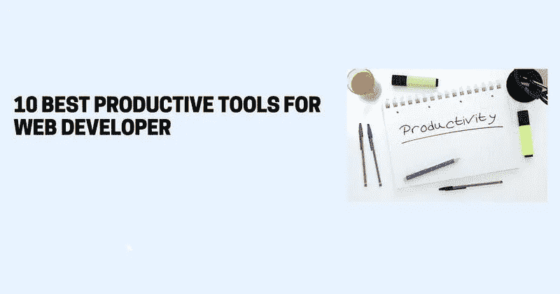

10 Best Productive Tools for Web Developer

建立一个有吸引力和功能性的网站需要时间。Web 开发人员致力于提供快速、可靠、高质量的网站。因此，为了提高我们的生产力，我们需要工具来帮助我们提供最好质量的软件，同时使我们的生活更容易。

在本文中，我们将讨论可以用来提高我们的生产力和管理我们在 web 开发中面临的一些挑战的工具。

# 1. [Animista](https://animista.net/)

Animista 是一个很棒的工具，可以用来创建自定义的 CSS 动画，有各种各样的效果。定制他们收藏的任何动画，包括背景、退出、文本等。，具有不同的效果。一旦你这样做了，你将能够找到代码来创建动画。然后你可以把它整合到你的网站上。

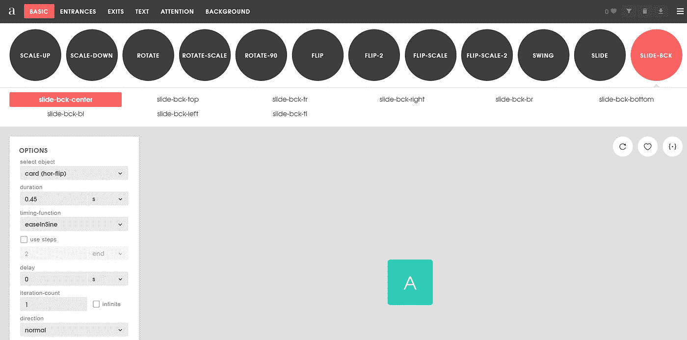

Animista

# 2.[责任人](https://www.responsinator.com/)

回应者是易于使用和免费的。当您输入页面的 URL 时，该工具会显示您的网页最流行的屏幕尺寸和形状。

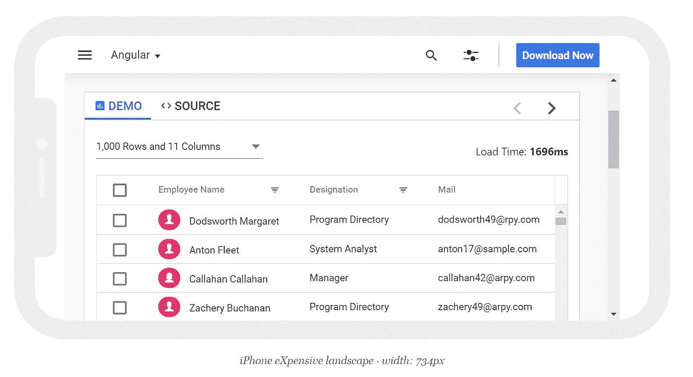

Responsinator

# 3.[提取 CSS](http://extractcss.com/)

通过使用这个工具，您可以从 HTML 文档中提取元素的 id、类和内联样式，并将它们作为 CSS 样式表输出。

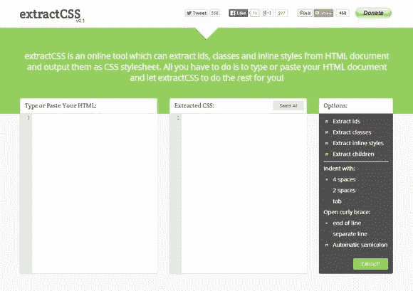

Extract CSS

# 4.[元标签](https://metatags.io/)

meta 标签是一个为任何网站调试和生成 Meta 标签的工具。如果你使用元标签，你可以编辑和试验你的内容，然后预览它在谷歌、脸书、推特等网站上的显示效果。

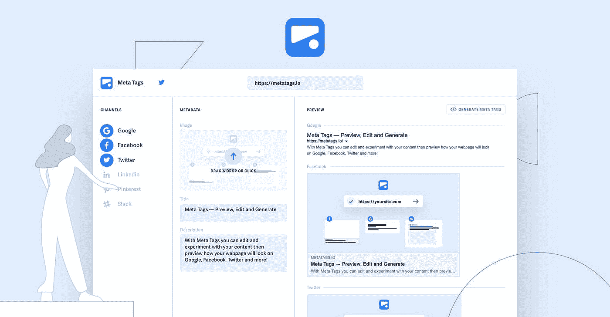

Meta Tags

# 5.[运行什么](https://www.whatruns.com/)

有了这个工具，你可以检查其他网站的主题、插件和服务器信息。WhatRuns 兼容 Chrome 和 Firefox。

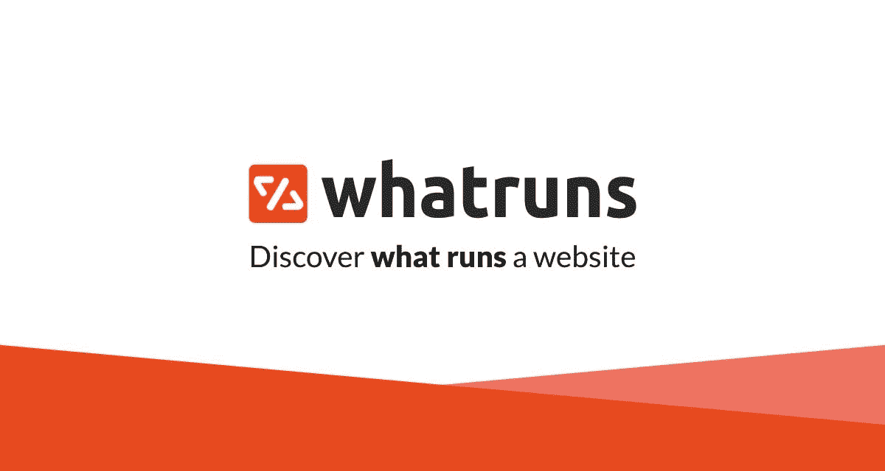

What Runs

# 6. [Grabient](https://www.grabient.com/)

为了给你的网站创建线性渐变，Grabient 提供了一个易于使用的用户界面。选择你的颜色，并根据需要调整角度。获得所需的渐变后，可以将渐变 CSS 应用到网页中。

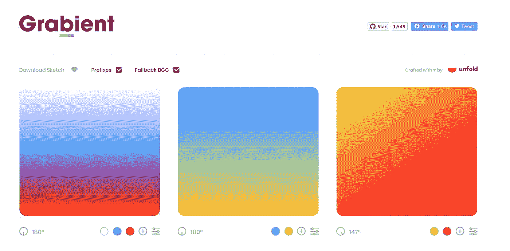

Grabient

# 7.[未混合](https://unminify.com/)

它是一个免费的工具，可以解包(解包，解压)JavaScript、CSS、HTML、XML 和 JSON 代码，使其可读且美观。

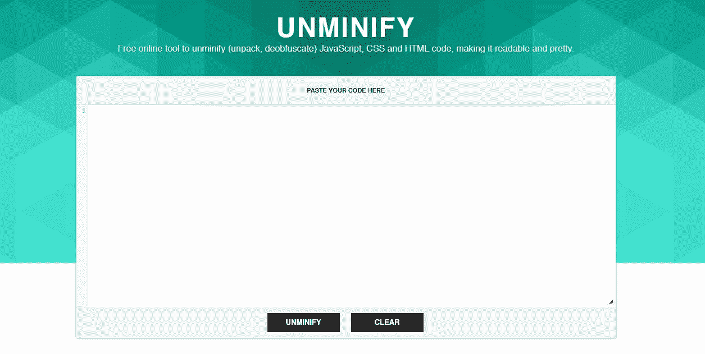

Unminify

# 8.[谷歌开发工具设备模式](https://developer.chrome.com/docs/devtools/device-mode/)

对于开发人员来说，Google DevTools 设备模式提供了一种在 Chrome 浏览器中模拟移动设备的简单方法。使用模拟器，您可以模拟设备输入，如触摸、地理位置和方向。

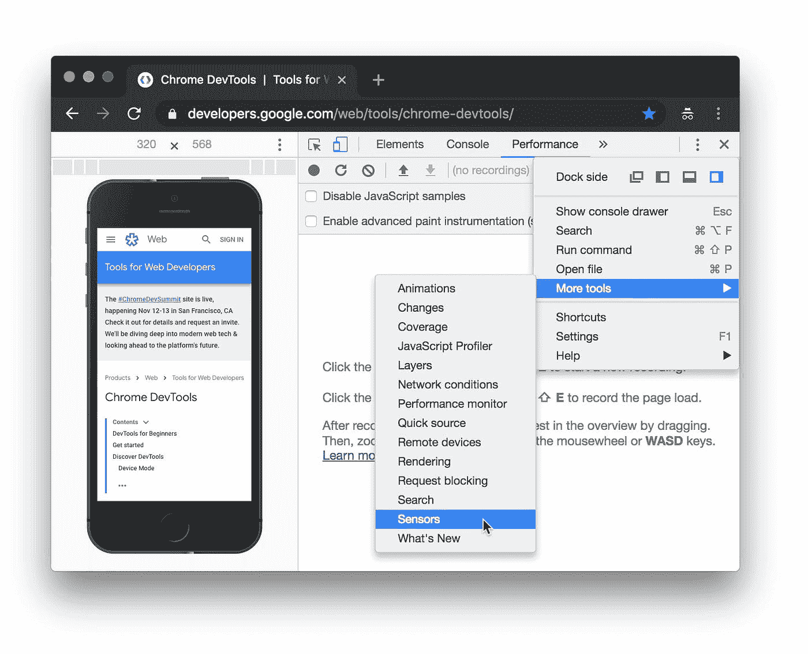

Google DevTools Device Mode

# 9.[浏览器检查](http://browserhacks.com/)

Browserhacks 包含一组特定于浏览器的 CSS 和 JavaScript 技巧，帮助您解决网站上奇怪而复杂的问题。

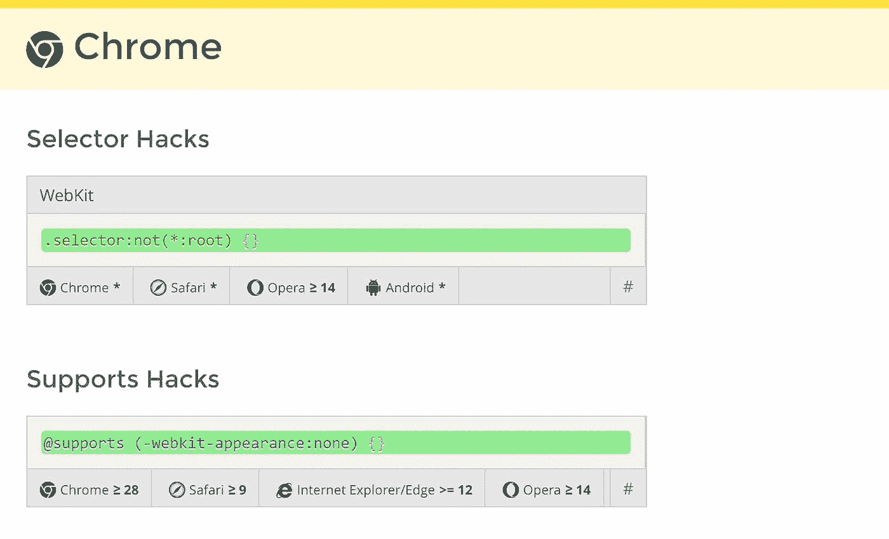

Browserhacks

# 10.[浏览器栈](https://www.browserstack.com/)

Browser Stack 是市场上顶级的测试工具之一，提供了全面的功能集。超过 1，000 个移动和桌面浏览器可以用这个付费工具进行测试。

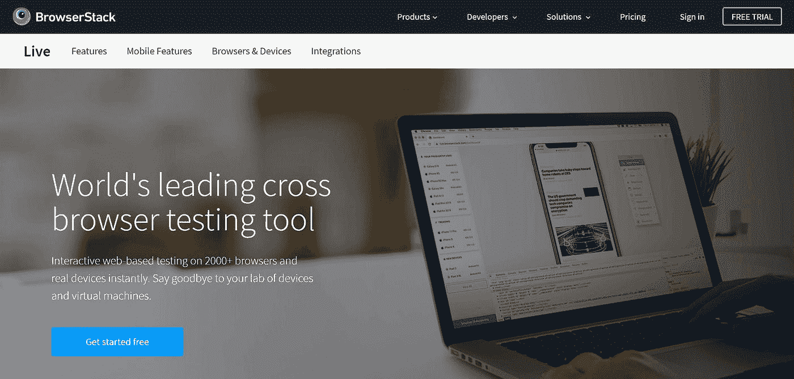

Browser Stack

如果你喜欢我的内容，请看看我的[博客](https://muthuannamalai.tech/)。我撰写关于 web 开发、技术和方法的文章，以使开发人员的生活更加轻松。

快乐学习！💻 😄

感谢阅读。😊

*更多内容看* [***说白了就是 io***](http://plainenglish.io/) *。报名参加我们的* [***免费周报***](http://newsletter.plainenglish.io/) *。在我们的* [***社区获得独家访问写作机会和建议***](https://discord.gg/GtDtUAvyhW) *。*