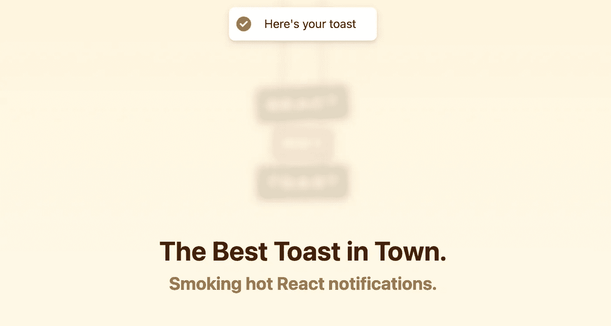
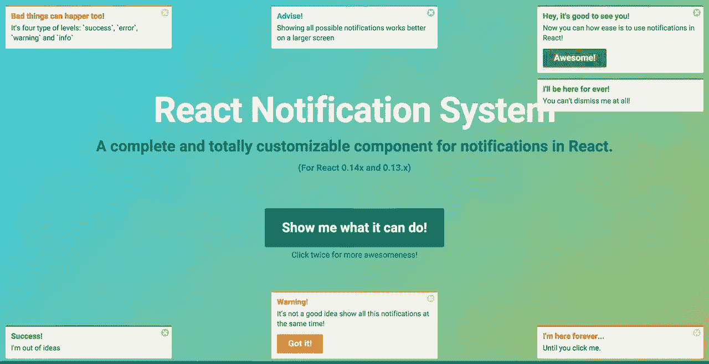
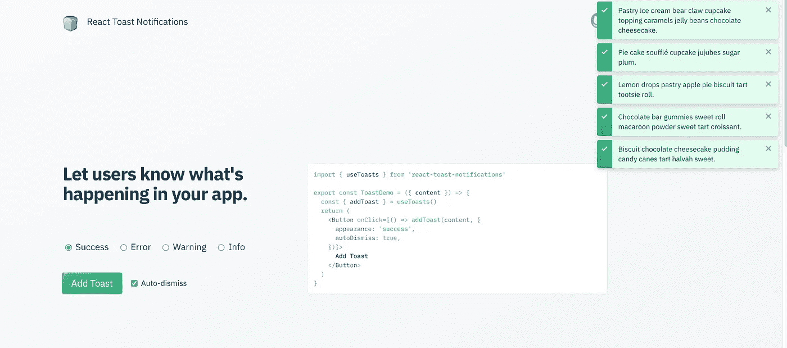
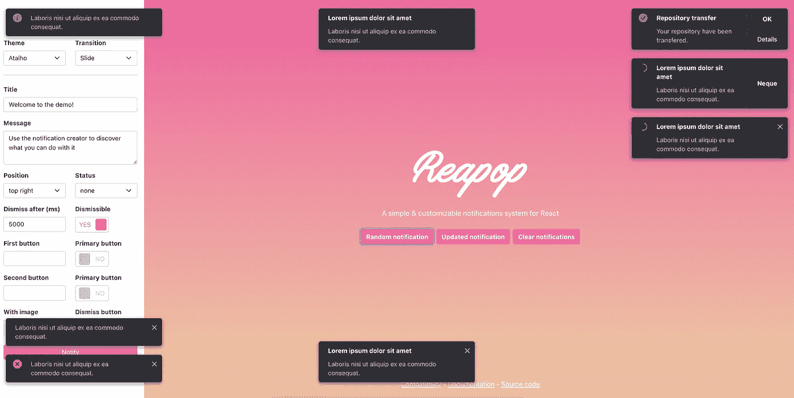
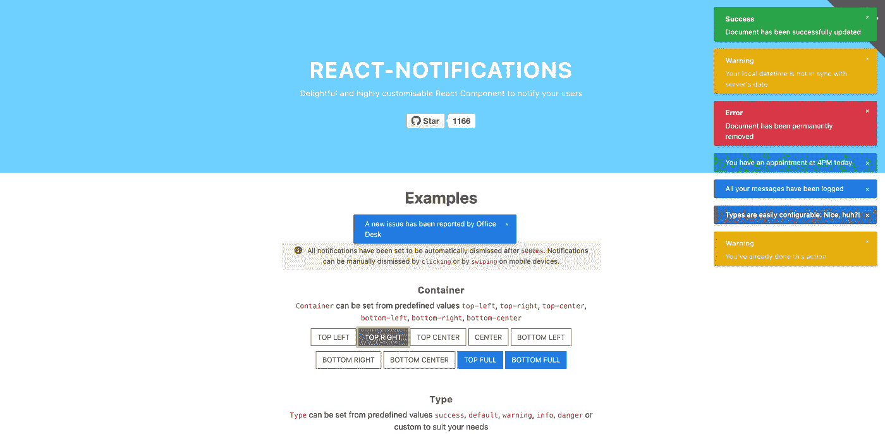
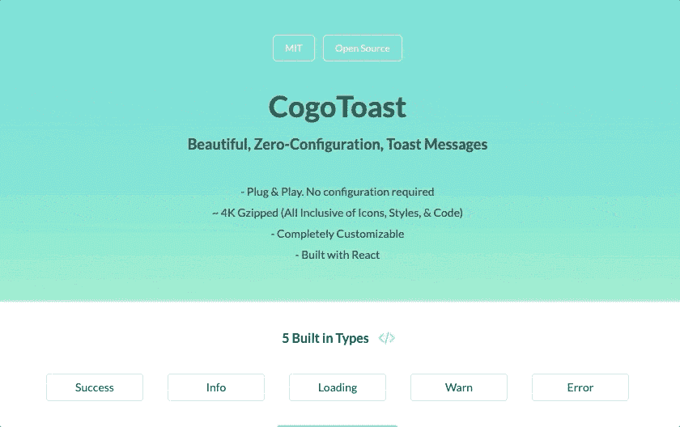
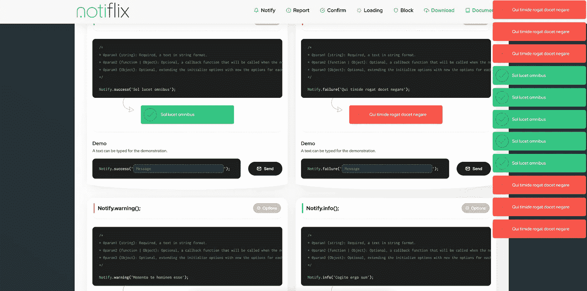
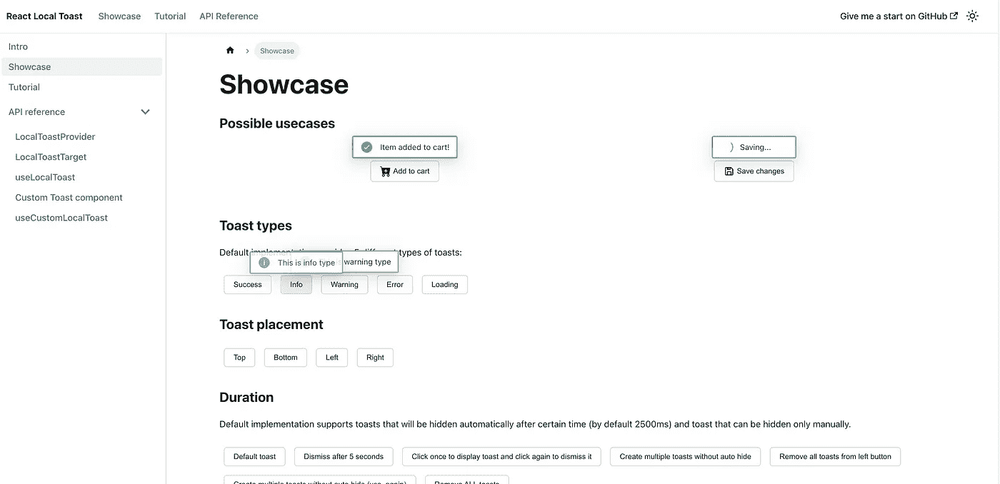

# 2022 年 10 大最佳反应通知库

> 原文：<https://javascript.plainenglish.io/10-best-react-notification-libraries-in-2022-e06e8d338bb3?source=collection_archive---------2----------------------->

React 是一个流行的前端开发库。它有完整强大的社区，推荐每个前端开发者学习。

我使用 React 已经很多年了，使用过很多 React 库，它们帮助我实现了很多业务功能。在这篇文章中，我将向您介绍一些很棒的 React 通知第三方库，以帮助您成为更好的 React 开发人员。

# 1.反应迟钝

*⭐ Github stars: 9.5k +*

🎉React-Toastify 允许你轻松地在应用程序中添加通知。不废话了！

 [## GitHub-fk hadra/React-toastify:React 通知变得简单🚀！

### 🎉React-Toastify 允许你轻松地在应用程序中添加通知。不废话了！$ npm 安装-保存…

github.com](https://github.com/fkhadra/react-toastify) 

# 2.反应热烤面包片

*⭐ Github 星辰:5.5k +*

📚React 的热点通知。轻巧，可定制，默认美观。

 [## GitHub-timolins/react-Hot-toast:冒烟热 React 通知🔥

### React 的热点通知。轻巧，可定制，默认美观。用 NPM npm 纱安装…

github.com](https://github.com/timolins/react-hot-toast) 

# 3.notistack

*⭐ Github 星空:3k +*

🔥Notistack 是一个通知库，它使得在 web 应用程序上显示通知变得非常容易。它是高度可定制的，可以让你把零食/面包一个接一个的堆叠起来。

 [## GitHub - iamhosseindhv/notistack:高度可定制的通知小吃条(祝酒词),可以…

### 当达到 maxSnack(这里是 3)时，堆叠行为取消最旧的使用您首选的软件包管理器:npm install…

github.com](https://github.com/iamhosseindhv/notistack) 

# 4.反应-通知-系统

*⭐ Github stars: 2.4k +*

🍊React 中一个完全可定制的通知组件。

 [## GitHub-igorprado/react-notification-system:一个完全可定制的完整组件，用于…

### React 中一个完全可定制的通知组件。最初是为 Eterpret @ Scalable Path 构建的…

github.com](https://github.com/igorprado/react-notification-system) 

# 5.反应-提示-通知

*⭐ Github stars: 2.2k +*

🍰一个用于 React 的可配置、可组合的 toast 通知系统。

 [## GitHub-joss MAC/react-toast-通知:🍞一种用于反应 toast 通知系统

### 这是一个值得学习的伟大项目，并且满足了它所设定的要求。不幸的是，我不能再…

github.com](https://github.com/jossmac/react-toast-notifications) 

# 6.收获报

*⭐ Github stars: 1.3k +*

📮一个简单的和可定制的反应通知系统。

 [## GitHub-LouisBarranqueiro/reapop:一个简单且可定制的 React 通知系统

### 一个简单的和可定制的反应通知系统 IE/Edge Firefox Chrome Safari Opera IE10，IE11，Edge last 2…

github.com](https://github.com/LouisBarranqueiro/reapop) 

# 7.反应-通知-组件

*⭐ Github 星辰:1.2k +*

🌈一个令人愉快的，易于使用的，高度可配置的组件，帮助您通知您的用户开箱即用。没有混乱的设置，只有漂亮的通知！

 [## GitHub-teodosii/react-notifications-Component:令人愉快且高度可定制的 React 组件…

### 一个令人愉快的，易于使用和高度可配置的组件，以帮助您通知您的用户开箱即用。不凌乱…

github.com](https://github.com/teodosii/react-notifications-component) 

# 8.协同预测

*⭐ Github 星级:659+*

🍨React ~4kb gzip 的漂亮的零配置 Toast 消息(带样式和图标)

 [## GitHub - Cogoport/cogo-toast:漂亮，零配置，React 的 toast 消息。只有大约 4kb…

### React ~4kb gzip 的漂亮的零配置 Toast 消息(带样式和图标)…

github.com](https://github.com/Cogoport/cogo-toast) 

# 9.notiflix

*⭐ Github stars: 382 +*

🌲Notiflix 是一个纯 JavaScript 库，用于客户端非阻塞通知、弹出框、加载指示器等，使您的 web 项目变得更好。

 [## GitHub-noti flix/noti flix:noti flix 是一个纯 JavaScript 库，用于客户端非阻塞…

### Notiflix 是一个纯 JavaScript 库，用于客户端非阻塞通知、弹出框、加载指示器和…

github.com](https://github.com/notiflix/Notiflix) 

# 10.反应-本地-吐司

*⭐ Github 星级:113 +*

🎩本地 toast 帮助您提供与页面上特定组件相关的反馈。

 [## GitHub-Oleg wock/react-Local-toast:Local toast 帮助您提供与以下内容相关的反馈

### 本地祝酒词帮助您提供与页面上特定组件相关的反馈，本地祝酒词链接到…

github.com](https://github.com/OlegWock/react-local-toast) 

感谢大家的阅读，希望大家喜欢。如果你写了，请留下你的关注，因为我会在未来上传更多的文章。:)

*更多内容看* [***说白了就是 io***](https://plainenglish.io/) *。报名参加我们的* [***免费周报***](http://newsletter.plainenglish.io/) *。关注我们上* [***推特***](https://twitter.com/inPlainEngHQ) ， [***领英***](https://www.linkedin.com/company/inplainenglish/) ***，*** *，* [***不和谐***](https://discord.gg/GtDtUAvyhW) ***。***