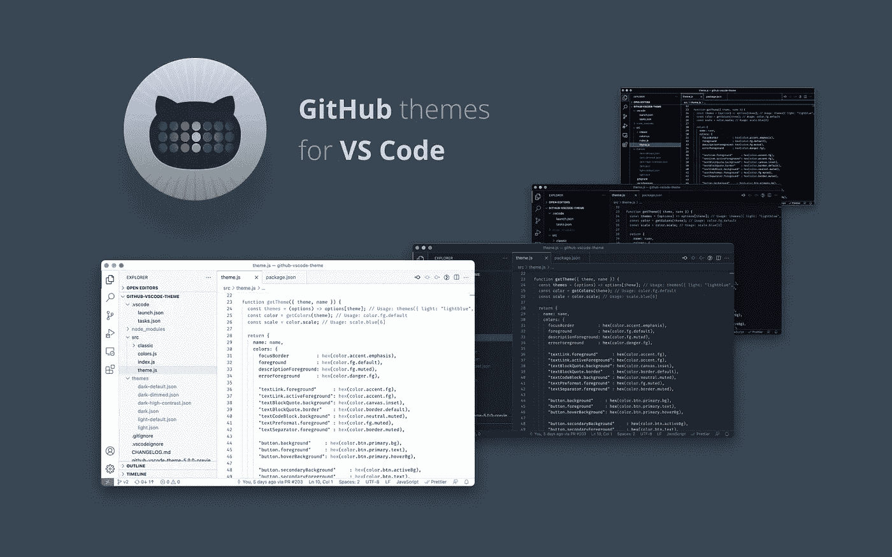

# 2022 年 10 大最佳代码主题

> 原文：<https://javascript.plainenglish.io/10-best-vs-code-themes-in-2022-7d44594a31e3?source=collection_archive---------0----------------------->

## VS 代码

## 你可以免费得到的最美观的 VS 代码主题。

Photo by [Mohammad Rahmani](https://unsplash.com/@afgprogrammer?utm_source=medium&utm_medium=referral) on [Unsplash](https://unsplash.com?utm_source=medium&utm_medium=referral)

主题可以帮助您关注项目文件中真正重要的内容，并且使您的 IDE 看起来更加美观。所以，我创建了一个 VS 代码主题的列表，你现在可以免费使用。

## 如何安装和设置

一旦我们打开 VS 代码并点击 extensions 选项卡或按下`Ctrl+Shift+X`，我们就可以搜索所有扩展的库。现在，我们键入主题的名称，我们可以单击绿色的`install`按钮。安装后，一个主题窗口将出现，在这里我们可以选择主题模式，如果有的话。

如果你不喜欢你之前选择的主题，你可以在任何窗口中按下`Ctrl+K Ctrl+T`来改变它，一个面板会显示每个已安装的主题。

## [1。吸血鬼官方](https://marketplace.visualstudio.com/items?itemName=dracula-theme.theme-dracula)

*黑暗主题*

德古拉官方主题对于很多编辑、贝壳等来说都是黑暗主题。本主题由`Dracula Theme`开发发布。目前，One Dark Pro 主题支持 2 种主题模式。

Dracula Official theme from VS Code Marketplace

## [2。一个黑暗职业](https://marketplace.visualstudio.com/items?itemName=zhuangtongfa.Material-theme)

*黑暗主题*

一个深色专业主题是 Atom 的 Visual Studio 代码的标志性深色主题。该主题由`binaryify`开发并发布。目前，One Dark Pro 主题支持 3 种主题模式。

One Dark Pro theme from VS Code Marketplace

## [3。合成波' 84](https://marketplace.visualstudio.com/items?itemName=RobbOwen.synthwave-vscode)

*黑暗主题*

SynthWave '84 [主题](https://marketplace.visualstudio.com/items?itemName=RobbOwen.synthwave-vscode)是一个“受 SynthWave 启发的色彩主题，以满足你的霓虹梦想。”这个主题是由 Robb Owen 开发并发布的。目前 SynthWave '84 主题支持 1 主题模式。

SynthWave ’84 theme from VS Code Marketplace

## [4。原子一暗](https://marketplace.visualstudio.com/items?itemName=akamud.vscode-theme-onedark)

*黑暗主题*

Atom One 暗黑主题是基于 Atom 的暗黑主题。这个主题是由马哈茂德·阿里提出并发表的。目前 Atom One 黑暗主题支持 1 主题模式。

Atom One Dark theme from VS Code Marketplace

## [5。东京之夜](https://marketplace.visualstudio.com/items?itemName=enkia.tokyo-night)

*黑暗主题*

东京之夜主题是一个黑暗的主题，庆祝东京市区晚上的灯光。这个主题是由 Enkia 开发和发布的。目前，东京之夜主题支持 3 种主题模式。

Tokyo Night theme from VS Code Marketplace

## [6。冬天来了](https://marketplace.visualstudio.com/items?itemName=johnpapa.winteriscoming)

*黑暗&光明主题*

冬天来了主题是一个黑暗和光明的主题，是约翰爸爸喜欢的。这个主题是由约翰爸爸开发并出版的。目前，冬天来了主题支持 6 种主题模式。

Winter is Coming theme from VS Code Marketplace

## [7。夜猫子](https://marketplace.visualstudio.com/items?itemName=sdras.night-owl)

*暗&亮主题*

夜猫子主题是为外面的夜猫子准备的一个黑暗和光明的主题。这个主题是由莎拉·德拉斯纳开发并出版的。目前，夜猫子主题支持 4 种主题模式。

Night Owl theme from VS Code Marketplace

## [8。GitHub](https://marketplace.visualstudio.com/items?itemName=GitHub.github-vscode-theme)

*黑暗&光明主题*

GitHub 主题是一个黑暗和光明的主题，有一种复古的感觉。这个主题由 GitHub 开发并发布。目前，GitHub 主题支持 9 种主题模式。

GitHub theme from VS Code Marketplace

## [9。静音灯](https://marketplace.visualstudio.com/items?itemName=onecrayon.theme-quietlight-vsc)

*灯光主题*

安静的光主题是一个和平编码的光主题。这个主题是由伊恩·贝克提出并发表的。目前静光主题支持 1 种主题模式。

Quiet Light theme from VS Code Marketplace

## [10。蓝光灯](https://marketplace.visualstudio.com/items?itemName=uloco.theme-bluloco-light)

*灯光主题*

Bluloco 灯光主题是一个别致的灯光主题，采用精心设计的配色方案。这个主题是由`Umut Topuzoğlu`开发并发布的。目前，Bluloco Light 主题支持 2 种主题模式。

Bluloco Light theme from VS Code Marketplace

## 结论

我上面列出的主题是 VS 代码市场上有史以来最受欢迎和最美丽的黑暗和光明主题。我希望，这些主题能点亮你的 IDEs，让它们看起来更有美感。也祝愿你下一个使用这些主题的项目取得巨大成功。

*更多内容请看*[***plain English . io***](https://plainenglish.io/)*。报名参加我们的* [***免费周报***](http://newsletter.plainenglish.io/) *。关注我们关于*[***Twitter***](https://twitter.com/inPlainEngHQ)*和*[***LinkedIn***](https://www.linkedin.com/company/inplainenglish/)*。加入我们的* [***社区不和谐***](https://discord.gg/GtDtUAvyhW) *。*