# Web 开发人员日常使用的 10 个最佳网站

> 原文：<https://javascript.plainenglish.io/10-best-websites-for-web-developers-for-daily-use-fd73e4565fa0?source=collection_archive---------10----------------------->

## 一些方便的网站，用于更快的网络开发。

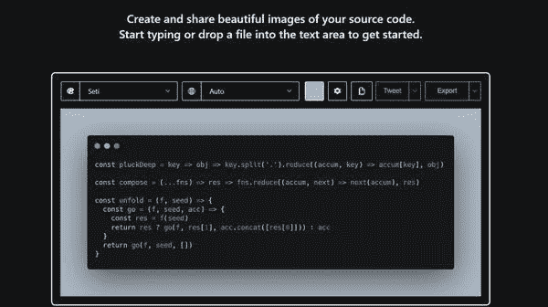

有时候我们需要更聪明地工作。并不是所有的开发者都知道这些帮助开发者日常使用的网站类型。所以，我想分享一些有用的网站及其链接。

# 1.免版税插图

在这个网站上，你会得到 2500+免费插图，你可以在任何地方使用这些插图。

你可以点击查看[。](https://www.manypixels.co/)

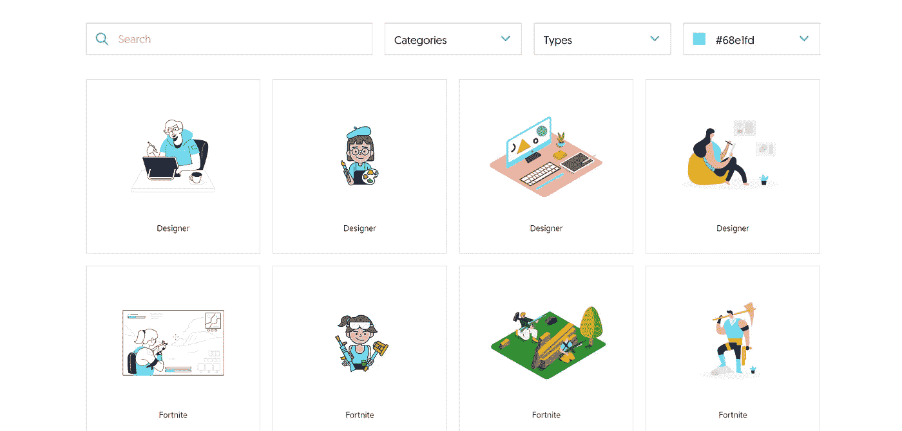

# 2.JavaScript 正则表达式可视化工具

正则表达式是所有开发人员最有用的工具之一。每次开发人员在使用正则表达式时都会感到困惑。所以，我发现了一个很棒的网站，它可以帮助使用正则表达式。你可以在这里查看。

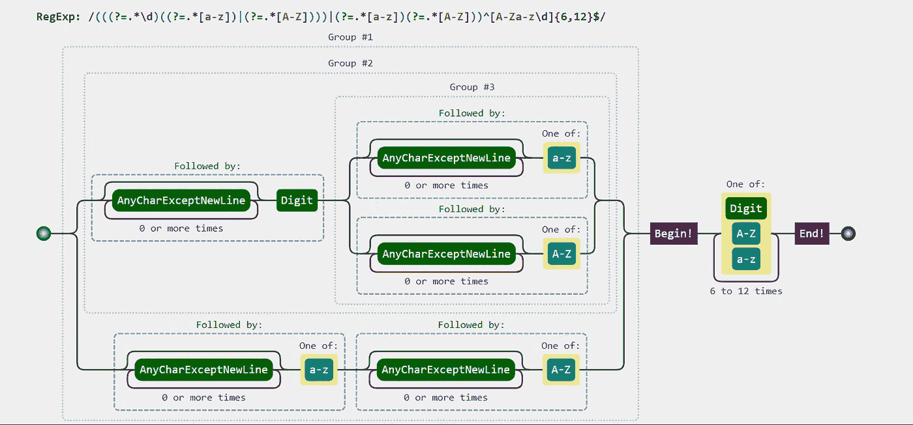

它有助于图形化地分析正则表达式的值。

# 3.开源图标

你可以从 Ionic 上找到你需要的任何图标，包括在网络、iOS、Android 和桌面应用上使用的高级设计的图标。支持 SVG 和网络字体。[完全开源，离子](https://ionic.io/)。

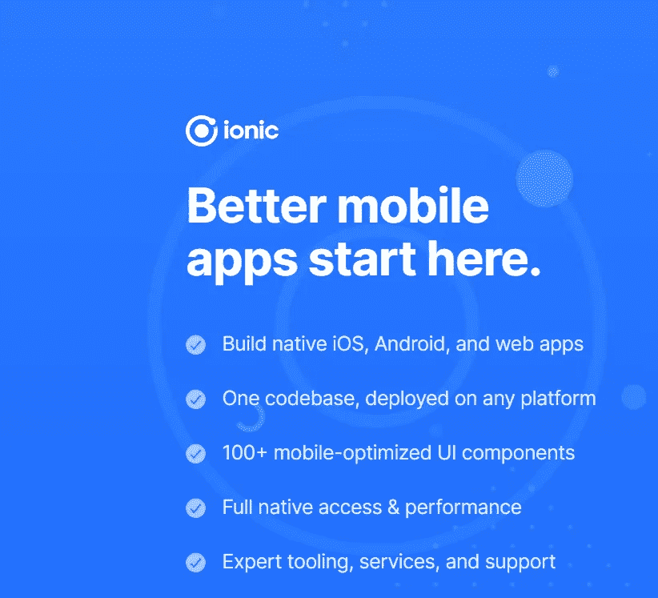

# 4.Carbon Now(为您的源代码创建美丽的图像)

当我们写一篇关于编程的文章时，那么 [carbon.now](https://carbon.now.sh/) 非常有用。

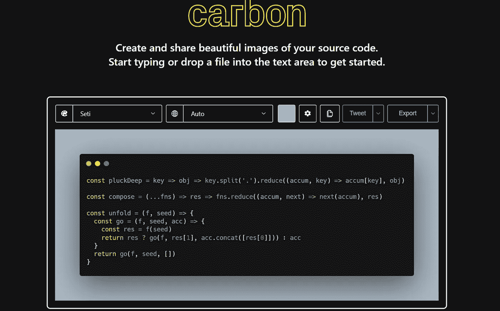

# 5.GTmetrix

查看您的网站运行情况，揭示速度缓慢的原因，并找出优化机会。检查你的网站加载有多快？

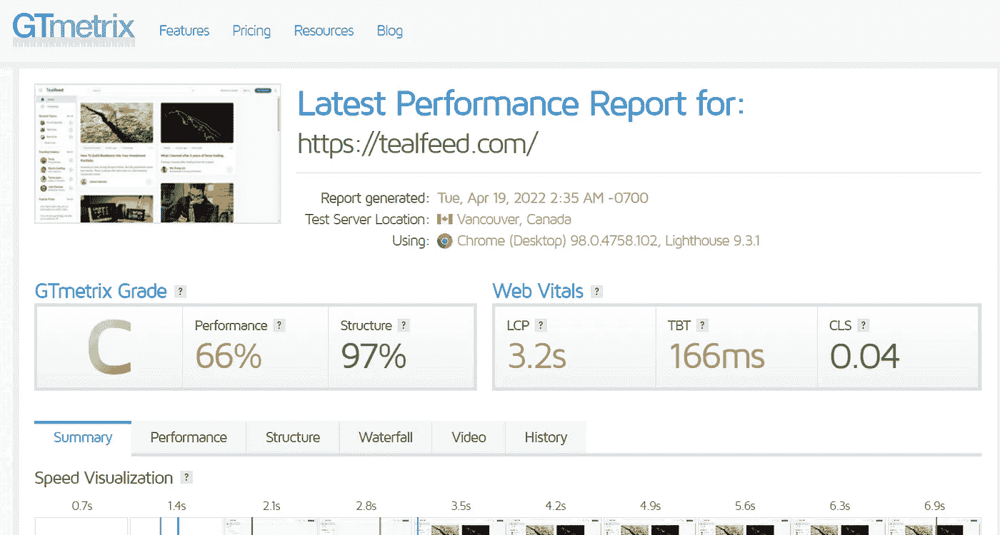

# 6.自述文件

这是创建自述文件的最简单方法，这个简单的编辑器允许您快速添加和自定义项目自述文件所需的所有部分。点击查看[。](https://readme.so/editor)

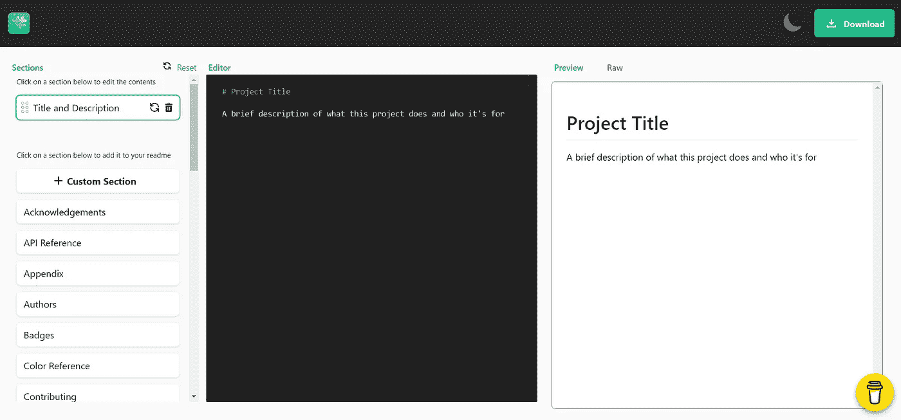

# 7.Cdnjs

有时候我们需要在线资源进行编程练习。 [cdnjs](https://cdnjs.com/) 可以帮助我们找到几乎所有的开源库。

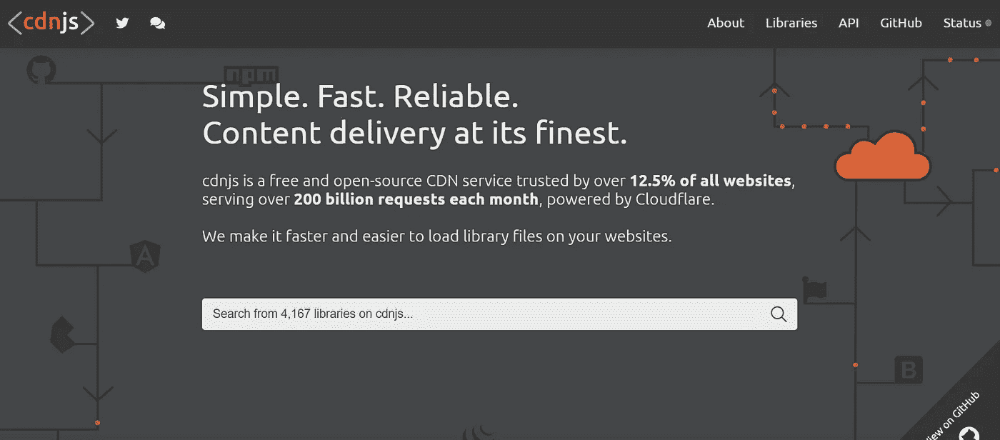

# 8.TinyPNG(图像压缩)

您可能经常需要压缩图像， [tinypng](https://tinypng.com/) 免费使用，压缩后的图像清晰度高。

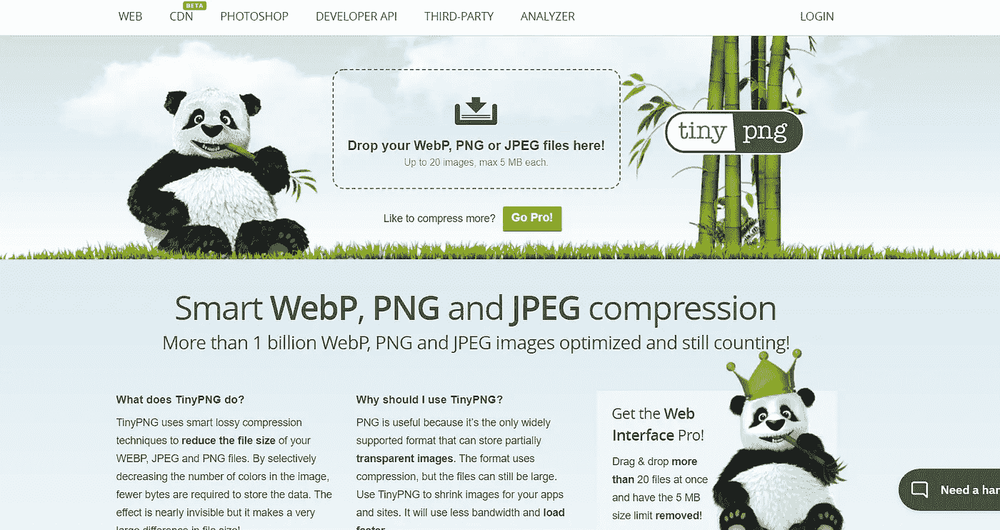

# 9.响应地

如果你想以 5 倍的速度开发应用和网站，作为前端开发人员，你必须拥有一个非常棒的开发工具。

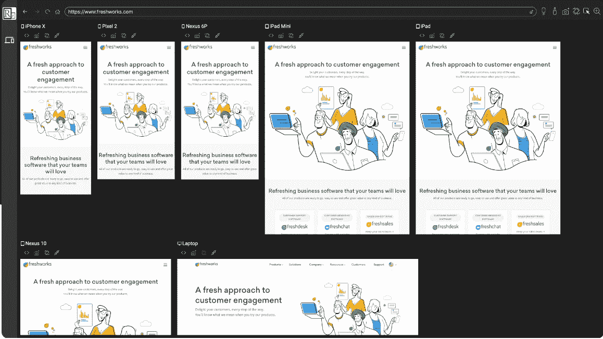

# 10.Charts.css

如果你想创建令人惊叹的数据可视化图表，这个工具正适合你。使用实用程序类的 css 框架使得开发人员更容易使用 HTML 和 CSS 构建图表。

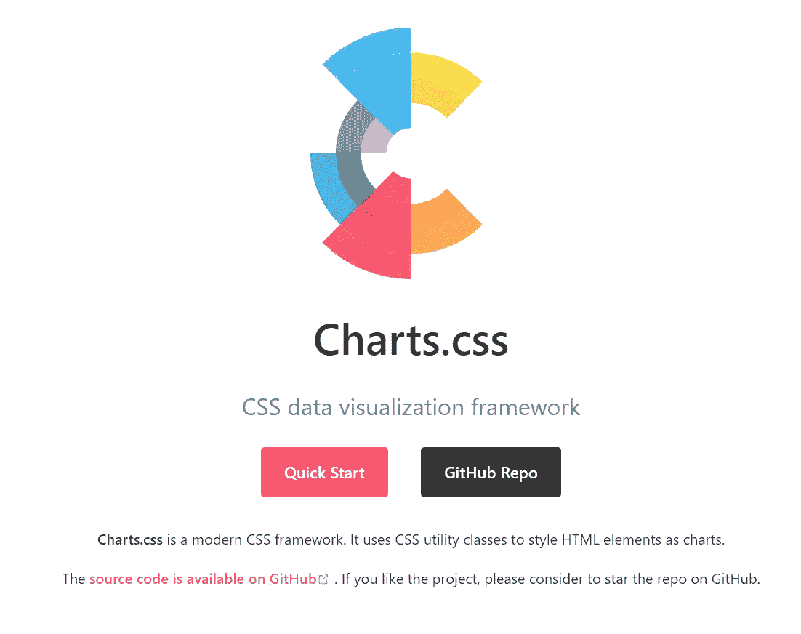

这些是提高开发人员开发时间的工具。

在 Instagram 上关注我 https://www.instagram.com/ewumesh/

*更多内容看* [***说白了就是***](https://plainenglish.io/) *。报名参加我们的* [***免费周报***](http://newsletter.plainenglish.io/) *。关注我们关于*[***Twitter***](https://twitter.com/inPlainEngHQ)*和*[***LinkedIn***](https://www.linkedin.com/company/inplainenglish/)*。查看我们的* [***社区不和谐***](https://discord.gg/GtDtUAvyhW) *加入我们的* [***人才集体***](https://inplainenglish.pallet.com/talent/welcome) *。*