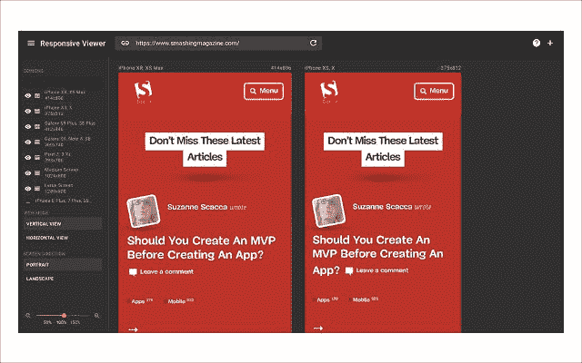
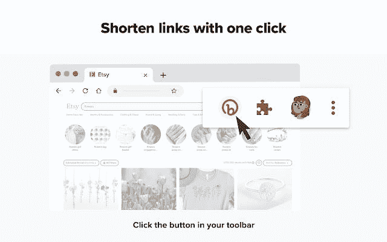
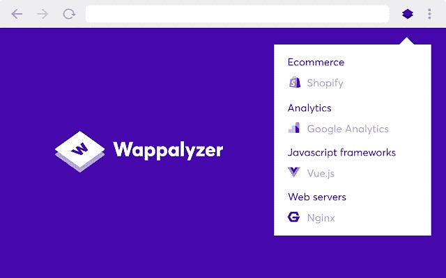
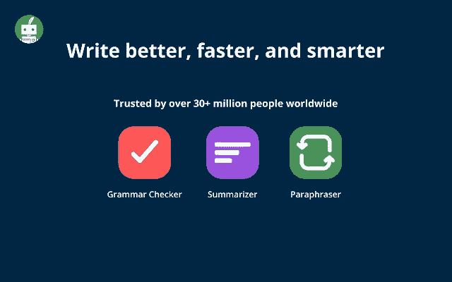

# 作为一名开发人员，你不能错过的 10 个 Chrome 扩展

> 原文：<https://javascript.plainenglish.io/10-chrome-extensions-you-cannot-miss-as-a-developer-for-a-productivity-boost-941610abbe85?source=collection_archive---------9----------------------->

## 为网络开发者列出 10 个必备的谷歌 Chrome 扩展，可以提高你的工作效率，节省时间。

Photo by [Carl Heyerdahl](https://unsplash.com/@carlheyerdahl?utm_source=medium&utm_medium=referral) on [Unsplash](https://unsplash.com?utm_source=medium&utm_medium=referral)

难怪谷歌浏览器是全世界数十亿人使用的最流行的网络浏览器之一。它还提供了一个庞大的扩展集合，您可以使用浏览器插入这些扩展。

作为一名 web 开发人员，您每天都要做许多任务，却没有意识到有一个扩展可以为您完成这些任务，例如抓取整个页面的屏幕截图，给老板写电子邮件时检查语法，或者管理待办事项列表。手动完成这些任务需要花费大量时间，但是我们可以通过使用一个可以为我们做同样工作的扩展来大幅提高我们的生产率。

作为一名网络开发人员，这些是**必备的 Chrome 扩展**，你可以用它们来提高你的工作效率和节省时间。

## 1.GoFullPage

**功能:**

*   一次性抓取整个网页的屏幕截图
*   以 PNG、JPG 和 PDF 格式保存截图的选项
*   进一步的编辑选项，添加笔记，形状，表情符号等。截图上

## **2。划线方法**

**功能:**

*   记录您的屏幕活动，并将其转换为分步指南
*   准备向客户展示的演示、入职产品教程
*   轻松共享、嵌入和导出的选项

## **3。相似网站**

**功能:**

*   查找与您当前访问的网站相似的网站
*   允许您找到更好的资源和替代选项
*   基于购物、内容、旅行或商业和研究来查找不同的网站非常有帮助

## 4.彩色 Zilla

**功能:**

*   获取页面上任意像素的颜色
*   高级颜色选择器
*   内置梯度发生器
*   网页颜色分析器-获得任何网站的调色板

## 5.字体忍者

**功能:**

*   找出网站使用的字体
*   检查字体以查看它们的大小、字母间距、行高和颜色规格
*   书签收藏字体信息

## 6.响应观众

**功能:**

*   一次显示多个尺寸的屏幕
*   有助于检查各种屏幕尺寸上的应用程序响应。

## 7.一点点

**功能:**

*   快速缩短长超链接
*   生成网页版链接和分析二维码的选项
*   付费计划，进一步定制生成的链接

## 8.YouTube 上的兔子洞

**功能:**

*   删除 YouTube 推荐并清空主页
*   隐藏评论和类似的视频建议，这样你就不会再掉进兔子洞了
*   隐藏横幅式广告，保持环境整洁，不受干扰

## 9.瓦帕里斯

**特性:**

*   高效识别网页背后的底层技术
*   展示了一千多种不同类别的技术，如编程语言、分析、营销工具、支付处理器、CRM、CDN 等

## 10.奎尔博特

**特色:**

*   帮助您重写和改进句子、段落或文章
*   使用最先进的人工智能系统为你的文本找到更好的替代品
*   内置的语法检查，以修复语法，拼写，标点符号和单词误用

*作为一名网站开发人员，我发现这 10 个扩展对我的日常工作非常有帮助。我希望你也会发现它们有助于提高你的工作效率。如果您使用任何其他对您有很大帮助并且对其他开发人员也有帮助的扩展，请随意将它们放在评论中。让我们帮助网络开发社区:)*

**暂时就这样吧！感谢您阅读这篇文章。**

## **延伸阅读**

 [## 在 Angular 中构建带内嵌编辑的注释组件系统

### 如何在 Angular 中创建具有添加、编辑和删除功能的注释组件系统的分步指南…

javascript.plainenglish.io](/building-a-comments-component-system-with-inline-editing-in-angular-56bd9ae1ae52)  [## 现在就开始使用这些 CSS 伪类选择器

### 一个功能性伪类选择器的解释，你应该使用它来使你的 CSS 代码看起来更整洁…

javascript.plainenglish.io](/start-using-these-css-pseudo-class-selectors-right-now-48786a7eee3e)  [## 有用的 CSS 技巧

### 开发人员日常工作中的一系列有用的 CSS 技巧。

medium.com](https://medium.com/codex/useful-css-snippets-d6bb0b6db130)  [## 有用的 CSS 技巧—第 2 部分

### 这是 CSS 技巧集的第 2 部分，对 web 开发人员的日常工作非常有用。

medium.com](https://medium.com/codex/useful-css-tricks-d9be18c8f902) 

***更多故事请*** [***关注我***](https://anishdhingra.medium.com/) ***上媒。***

*更多内容请看*[***plain English . io***](https://plainenglish.io/)*。报名参加我们的**[***免费周报***](http://newsletter.plainenglish.io/) *。关注我们关于* [***推特***](https://twitter.com/inPlainEngHQ) ， [***领英***](https://www.linkedin.com/company/inplainenglish/) *，以及* [***不和***](https://discord.gg/GtDtUAvyhW) *。**