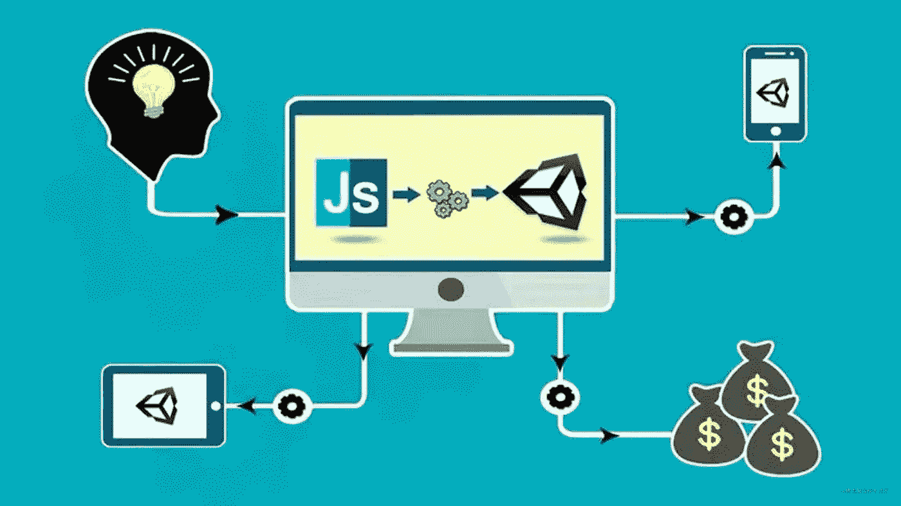

# 10 个常用的 JavaScript 工具库，2022 年 80%的项目都在使用

> 原文：<https://javascript.plainenglish.io/10-commonly-used-javascript-tool-libraries-80-of-the-projects-are-used-in-2022-6d6ff7c004b6?source=collection_archive---------1----------------------->

## 以下是 2022 年 80%的项目使用的最流行的 JS 工具库。



精英区别于一般人的重要一点是，他们善于使用工具，把更多的时间留给规划和思考。写代码也是如此。如果你很好地使用工具，你将有更多的时间来规划架构和克服难点。今天我们将与你分享最流行的 JS 工具库，如果你觉得它们有用，请竖起你的大拇指！

# **1。Day.js**

一个用于处理时间和日期的极简 JavaScript 库，旨在保持与 Moment.js API 相同，但大小只有 2KB。

## 安装

```
npm install dayjs
```

## 如何使用

```
import dayjs from 'dayjs' dayjs().format('YYYY-MM-DD HH:mm') 
dayjs('2022-1-3 15:06').toDate() 
```

# **2。qs**

用于 url 参数转换的轻量级 JavaScript 库。

## 安装

```
npm install qs
```

## 如何使用

```
import qs from 'qs' qs.parse('user=tom&age=22') // => { user: "tom", age: "22" } qs.stringify({ user: "tom", age: "22" }) // => user=tom&age=22
```

# **3。js-cookie**

一个简单、轻量级的 JS API，用于处理 cookies。

## 安装

```
npm install js-cookie
```

## 如何使用

```
import Cookies from 'js-cookie' Cookies.set('myName', 'Malvin', { expires: 7 }) *//* expires at 7 daysCookies.get('myName') *// value => '*Malvin*'*
```

# **4。flv.js**

一个开源的 HTML5 flash 视频播放器，允许浏览器在没有 flash 插件的帮助下播放 FLV 视频。是目前主流的直播、点播解决方案。

## 安装

```
npm install flv.js
```

## 如何使用

```
<video autoplay controls width="100%" height="500" id="myVideo"></video>import flvjs from 'flv.js'// after the rendering 
if (flvjs.isSupported()) {
  var myVideo = document.getElementById('myVideo')
  var flvPlayer = flvjs.createPlayer({
    type: 'flv',
    url: '[http://localhost:8080/test.flv'](http://localhost:8080/test.flv') // the flv video url
  })
  flvPlayer.attachMediaElement(myVideo)
  flvPlayer.load()
  flvPlayer.play()
}
```

# **5。vConsole**

一个轻量级、可扩展的前端开发人员调试面板，用于移动网页。如果你还在纠结如何在手机上调试代码，这是一个正确的选择。

## 安装

```
npm install vconsole
```

## 如何使用

```
import VConsole from 'vconsole'const vConsole = new VConsole()
console.log('Hello world')
```

# **6。Animate.css**

一个跨浏览器的 CSS3 动画库，内置了很多典型的 CSS3 动画，兼容性好，易于使用。

## 安装

```
npm install animate.css
```

## 如何使用

```
<h1 class="animate__animated animate__bounce">An animated element</h1>import 'animate.css'
```

# **7。animejs**

一个强大的 JavaScript 动画库。它可以与 CSS3 属性、SVG、DOM 元素和 JS 对象一起创建各种高性能、平滑过渡的动画效果。

## 安装

```
npm install animejs
```

## 如何使用

```
<div class="ball" style="width: 50px; height: 50px; background: blue"></div>import anime from 'animejs/lib/anime.es.js'// after the rendering
anime({
  targets: '.ball',
  translateX: 250,
  rotate: '1turn',
  backgroundColor: '#F00',
  duration: 800
})
```

# **8。lodash.js**

一个一致的、模块化的、高性能的 JavaScript 实用程序库。

## 安装

```
npm install lodash
```

## 如何使用

```
import _ from 'lodash'// return the max number of the array => 8
_.max([4, 2, 8, 6]) // return the intersection of  multi array => [2, 3]
_.intersection([1, 2, 3], [2, 3, 4]) 
```

# **9。mescroll.js**

一个运行在 H5 端的复杂的下拉刷新和上拉加载插件，主要用于列表分页、刷新和其他场景。

## 安装

```
npm install mescroll.js
```

## 如何使用

```
<template>
  <div>
    <mescroll-vue
      ref="mescroll"
      :down="mescrollDown"
      :up="mescrollUp"
      [@init](http://twitter.com/init)="mescrollInit"
    ></mescroll-vue>
  </div>
</template><script>
import MescrollVue from 'mescroll.js/mescroll.vue'export default {
  components: {
    MescrollVue
  },
  data() {
    return {
      mescroll: null, 
      mescrollDown: {}, 
      mescrollUp: {callback: this.upCallback
      },
      dataList: [] 
    }
  },
  methods: {
    mescrollInit(mescroll) {
      this.mescroll = mescroll
    },
    upCallback(page, mescroll) {
      axios
        .get('xxxxxx', {
          params: {
            num: page.num,
            size: page.size 
          }
        })
        .then(response => {
          let arr = response.data
          if (page.num === 1) this.dataList = []
          this.dataList = this.dataList.concat(arr)
          this.$nextTick(() => {
            mescroll.endSuccess(arr.length)
          })
        })
        .catch(e => {
          mescroll.endErr()
        })
    }
  }
}
</script><style scoped>
.mescroll {
  position: fixed;
  top: 44px;
  bottom: 0;
  height: auto;
}
</style>
```

# **10。Chart.js**

一个基于 HTML5 的简单、干净、有吸引力的 JavaScript 图表库。

## 安装

```
npm install chart.js
```

## 如何使用

```
<canvas id="myChart" width="400" height="400"></canvas>import Chart from 'chart.js/auto'const ctx = document.getElementById('myChart')
const myChart = new Chart(ctx, {
  type: 'bar',
  data: {
    labels: ['Red', 'Blue', 'Yellow', 'Green', 'Purple', 'Orange'],
    datasets: [
      {
        label: '# of Votes',
        data: [12, 19, 3, 5, 2, 3],
        backgroundColor: [
          'rgba(255, 99, 132, 0.2)',
          'rgba(54, 162, 235, 0.2)',
          'rgba(255, 206, 86, 0.2)',
          'rgba(75, 192, 192, 0.2)',
          'rgba(153, 102, 255, 0.2)',
          'rgba(255, 159, 64, 0.2)'
        ],
        borderColor: [
          'rgba(255, 99, 132, 1)',
          'rgba(54, 162, 235, 1)',
          'rgba(255, 206, 86, 1)',
          'rgba(75, 192, 192, 1)',
          'rgba(153, 102, 255, 1)',
          'rgba(255, 159, 64, 1)'
        ],
        borderWidth: 1
      }
    ]
  },
  options: {
    scales: {
      y: {
        beginAtZero: true
      }
    }
  }
})
```

你看到你正在使用的工具了吗？请评论并告诉我。

*更多内容请看*[***plain English . io***](https://plainenglish.io/)*。报名参加我们的* [***免费周报***](http://newsletter.plainenglish.io/) *。关注我们关于*[***Twitter***](https://twitter.com/inPlainEngHQ)[***LinkedIn***](https://www.linkedin.com/company/inplainenglish/)*[***YouTube***](https://www.youtube.com/channel/UCtipWUghju290NWcn8jhyAw)*[***不和***](https://discord.gg/GtDtUAvyhW) *。***