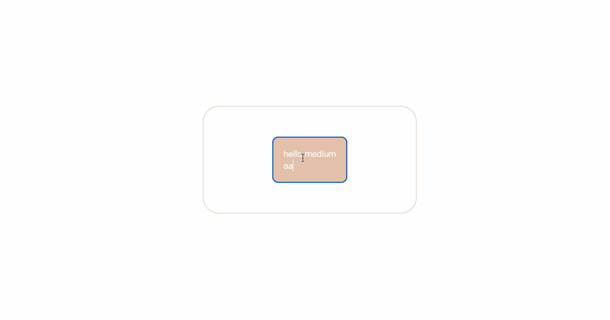

# 你应该知道的使元素居中的 10 个 CSS 技巧

> 原文：<https://javascript.plainenglish.io/10-css-tricks-you-should-know-for-centering-elements-61092d35b659?source=collection_archive---------3----------------------->

## 我希望我早点知道这些。

在前端开发工程师的日常生活中，使用 CSS 将元素居中是很常见的。也是面试中经常被问到的问题。

也许你已经使用了 **flex** 或者 **absolute + transform** 来实现它，但是你知道至少有 10 种方法可以做到吗？

这是一个文章目录，你可以选择你感兴趣的技术来阅读。

[1。绝对+ (-margin)](#154f)
[2。绝对+边距自动](#506b)
[3。绝对+计算](#79a7)
[4。flex](#d00c)
[5。网格](#7683)
[6。绝对+变换](#a1ed)
[7。文本对齐+行高+垂直对齐](#69a7)
[8。css-table](#6855)
[9。书写模式](#4ce3)
[10。表格](#c119)

# 1.绝对+(-边距)

如果**元素的宽度和高度是已知的**，我们可以使用至少 3 种方法来居中一个元素。比如下图，小猫的宽度和高度分别是‘500 px’和‘366 px’。应该如何居中？

用‘绝对+(-margin)’来完成就很容易了！

**HTML**

**CSS**

该方法简单易懂，兼容性好。缺点是我们需要知道子元素的宽度和高度。

# 2.绝对+自动边距

我们还可以通过将所有方向的距离设置为 0 并将边距设置为 auto 来使小猫居中。

**CSS**

和第一种方法一样，它的兼容性也很好，缺点是需要知道子元素的宽度和高度。

# 3.绝对+计算

CSS3 带来了`calc`计算属性，它允许我们通过它将一个元素居中。代码如下。

**CSS**

这种方法的兼容性取决于 calc 的兼容性，缺点是你需要知道子元素的宽度和高度

# 4.弯曲

以上三种方法必须事先知道元素的宽度和高度。元素的宽度和高度不确定怎么办？

`flex`很适合这个。

**HTML**

**CSS**

这真的很酷，我们可以用很少的代码使一个元素居中。这是我最喜欢的使用方式。

# 5.格子

和`flex`一样，`grid`也可以用来非常方便地将一个元素居中。

**CSS**

# 6.绝对+变换

使用`transform`,我们也可以在事先不知道元素的宽度和高度的情况下将元素居中。

**CSS**

# 7.文本对齐+行高+垂直对齐

以上 6 种方式很容易理解，在我们的工作中也经常用到。

接下来的 4 种方法似乎用得不太频繁，但也值得学习。

首先，我们可以将 **span** 的“显示”属性设置为“inline-block”。然后通过将**容器**的 **text-align** 属性设置为 center，span 元素可以水平居中。结合行高和其他属性，使其垂直居中。

**CSS**

# 8.CSS-表格

CSS 新的 table 属性可以让我们把普通的元素变成表格元素的真实感效果，通过这个特性，一个元素也可以居中。

**CSS**

# 9.书写模式

以前我习惯用`writing-mode`把内容的布局方向改成垂直。

但很神奇的是，它还能让一个元素居中。不过这种方法有点难懂，代码量会比较多。

**HTML**

**CSS**

# 10.桌子

最后，最后一种方法，当然是最不推荐的方法，但我提到它只是作为一个学习的例子。我不建议你在工作中使用它，因为它(在我看来)很糟糕。

**HTML**

**CSS**

# 最后

感谢阅读。我期待着您的关注和阅读更多高质量的文章。

 [## 采访者:“npm 跑 xxx”怎么了？

### 一个大多数人都不知道的秘密。

javascript.plainenglish.io](/interviewer-what-happened-to-npm-run-xxx-cdcb37dbaf44)  [## 每个开发人员都应该知道的 20 种 JavaScript 数组方法

### 你知道这 20 个数组方法是怎么实现的吗？

javascript.plainenglish.io](/20-javascript-array-methods-every-developer-should-know-6c04cc7a557d)  [## 让你看起来像高级开发人员的 8 个很酷的 GitHub 技巧

### 使用 GitHub 可以做的 8 件很酷的事情

javascript.plainenglish.io](/8-cool-github-tricks-to-make-you-look-like-a-senior-developer-ab8fe9ae9b14)  [## 面试官:可以“x！== x "在 JavaScript 中返回 True？

### 你可能不知道的五个神奇的 JavaScript 知识点！

javascript.plainenglish.io](/interviewer-can-x-x-return-true-in-javascript-7e1d1fa7b5cd)  [## 现在是 2022 年，不要再滥用箭头功能了

### 不应该使用箭头函数的 4 种情况。

javascript.plainenglish.io](/its-2022-don-t-abuse-the-arrow-function-anymore-905862a9c668) 

*更多内容请看*[***plain English . io***](https://plainenglish.io/)*。报名参加我们的* [***免费周报***](http://newsletter.plainenglish.io/) *。关注我们关于*[***Twitter***](https://twitter.com/inPlainEngHQ)*和*[***LinkedIn***](https://www.linkedin.com/company/inplainenglish/)*。查看我们的* [***社区不和谐***](https://discord.gg/GtDtUAvyhW) *加入我们的* [***人才集体***](https://inplainenglish.pallet.com/talent/welcome) *。*