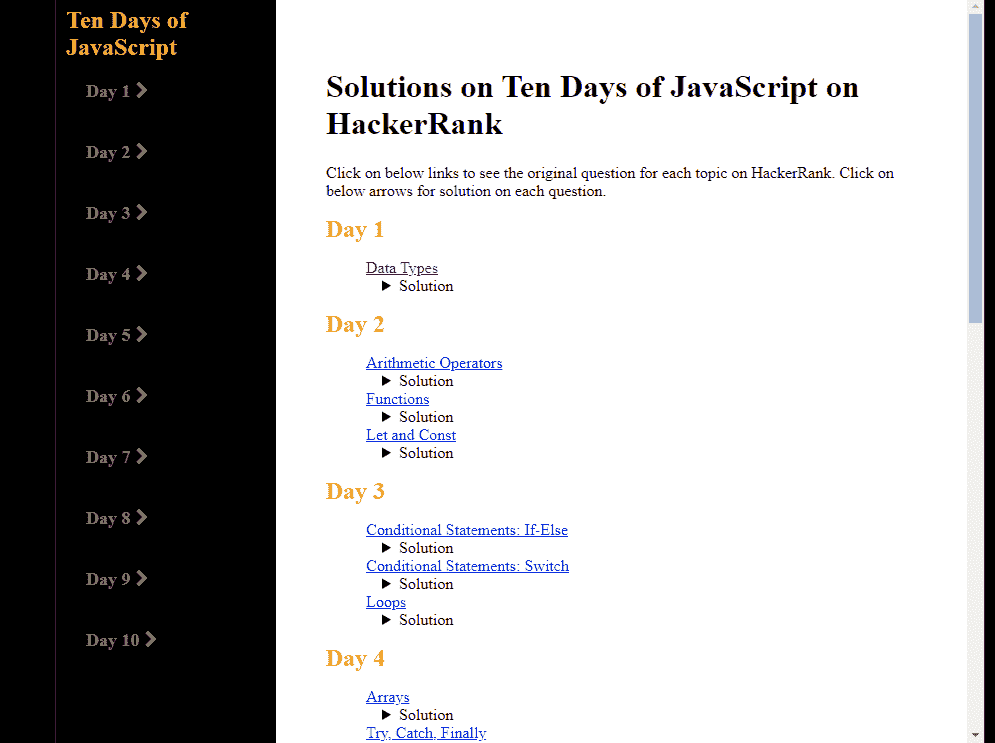

# HackerRank 上的 10 天 JavaScript

> 原文：<https://javascript.plainenglish.io/10-days-of-javascript-on-hacker-rank-e0c08e183e66?source=collection_archive---------18----------------------->

我如何在 10 天内征服 JavaScript？

大家好，

在短暂的休息之后，我再次来到这里，专注于我的学习。作为业余爱好，我仍在从事一些 web 应用程序项目。将来我的一些作品完成后，我会给你看。

今天我想和大家分享一下我刚刚完成的刷新 JavaScript 技能的内容。无论你是初学者还是有经验的开发者，你一定听说过 [HackerRank](https://www.hackerrank.com/) 这是一个解决编程问题的免费平台。许多雇主正在使用这个平台来获得他们的第一个任务，以测试他们潜在员工的编程/解决问题的技能。

有很多具有挑战性的面试问题，你可以自己练习。我认为如果你喜欢用编程解决问题，那会很有趣。但是，一定要先从容易的开始，这样第一次就不会不知所措。

上面的截图来自我创建的简单的 web 应用程序，它总结了 10 天 JavaScript (JS)的所有主题。每个主题都将有一个链接指向 HackerRank 上的原始问题。如果你想了解更多的细节，就去那里注册并尝试一下吧。

以下是我解决这些问题的策略:

*   仔细阅读问题。
*   如果你不熟悉这个主题，请阅读教程。
*   去 HackerRank 的讨论板得到一些提示。
*   去 HackerRank 的排行榜上找一些解决方案。
*   试着去理解解决方案。
*   用同一个问题再练习一遍。

我在这方面的经验是，同一个话题有很多解决方案。所以，只要你理解了题型，编程语法，一些基本的数据结构和算法，你就会找出最适合自己的解决方案。

这是[链接](https://ten-days-of-js.netlify.app/)，链接到我的网络应用程序，上面有每天每个主题的解决方案，以防你卡住了，想要一个快速的答案。如果你喜欢 CodePen 平台上的答案，你可以点击这里:

[hacker rank(code pen . io)上的 10 天 JS](https://codepen.io/juniHub/pen/qBVXeoK)

现在让我们挑战自我，一起练习。感谢您的阅读，下次再见！

*更多内容请看*[***plain English . io***](https://plainenglish.io/)*。报名参加我们的* [***免费周报***](http://newsletter.plainenglish.io/) *。关注我们关于*[***Twitter***](https://twitter.com/inPlainEngHQ)*和*[***LinkedIn***](https://www.linkedin.com/company/inplainenglish/)*。加入我们的* [***社区不和谐***](https://discord.gg/GtDtUAvyhW) *。*