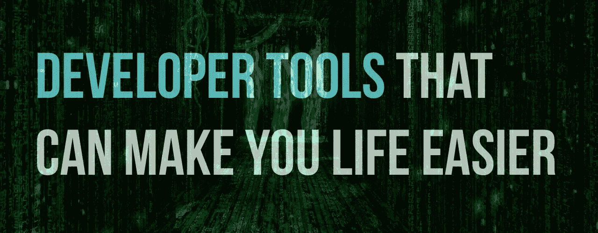
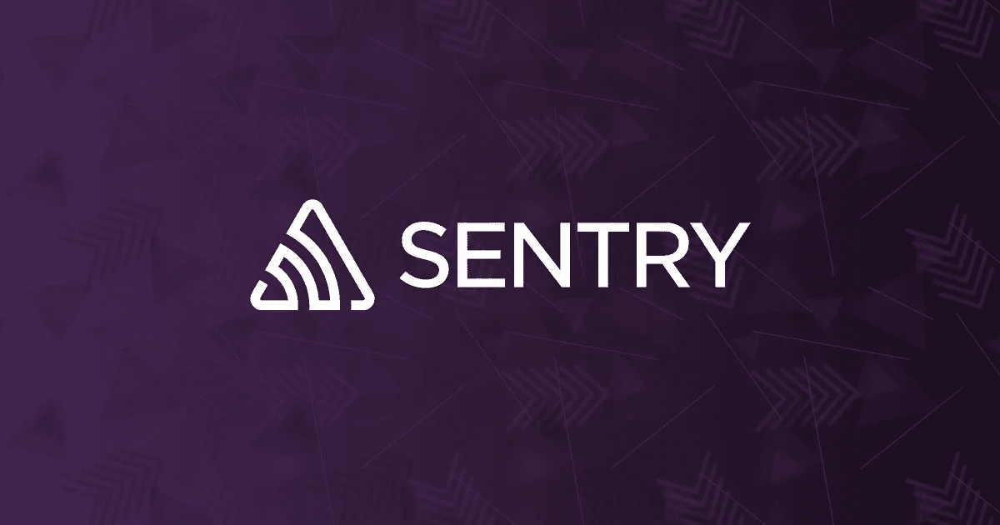
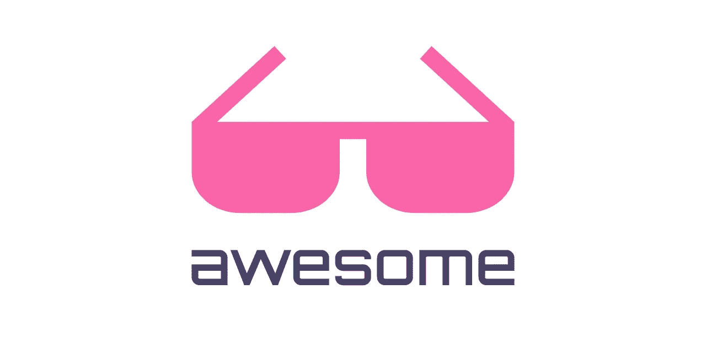
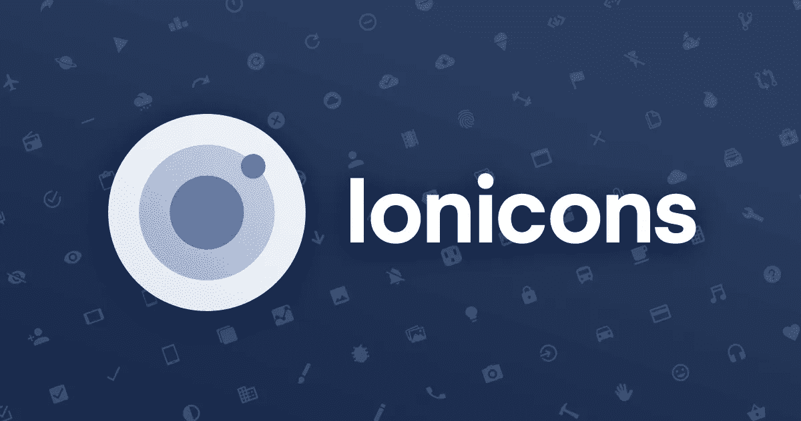
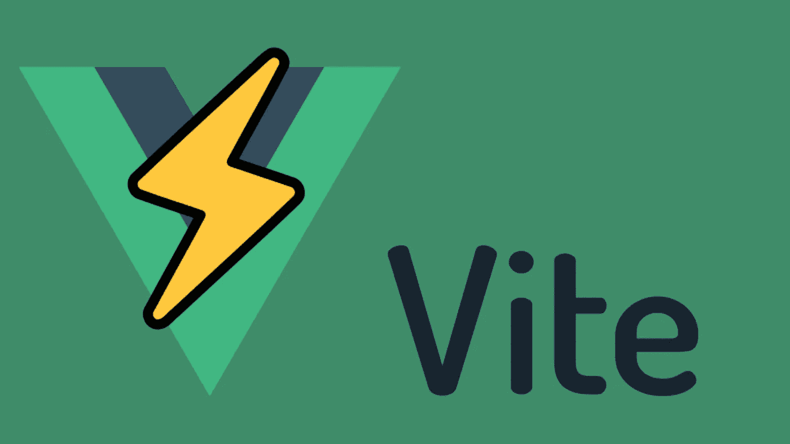
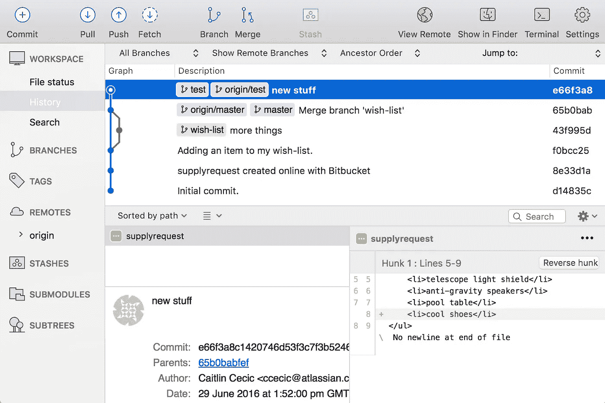

# 10 个你不知道自己需要的开发工具

> 原文：<https://javascript.plainenglish.io/10-developer-tools-that-you-didnt-know-that-you-needed-8b61b3306b07?source=collection_archive---------10----------------------->

## 有用的开发工具，让您的开发生活更加轻松。

跟上快速发展和不断变化的软件开发世界是非常重要的。这是一个快速发展的世界，有时很难跟上。拥有优秀的工具来优化工作日是非常重要的。最好的开发人员工具将帮助您管理工作的方方面面，从编写代码、跟踪新闻和趋势、管理项目工作流等等。

让我们来看看一些你可以使用的真正有用的工具。

# **熊猫 Chrome 扩展**

我喜欢关注开发人员社区的趋势和新闻。一个真正有助于我获取每日开发新闻的工具是使用 Panda Chrome 扩展。每当我打开一个新标签，我就能在一个地方获得最新的开发者新闻和趋势。我发现这个插件非常有用，我每天都在使用它。

[拿到这里](https://chrome.google.com/webstore/detail/panda-5-your-favorite-web/haafibkemckmbknhfkiiniobjpgkebko?hl=en)

# 哨兵. io

测试很难，这是毫无疑问的。发布代码时，事情可能会出错。用户可能正在使用你没有考虑到的浏览器和系统。这就是哨兵变得非常有用的地方，它可以帮助你的团队很多。Sentry 是一个开源的错误跟踪工具平台，帮助开发人员实时监控和修复崩溃。它能让你发现你自己不一定能发现的错误。真正有用的工具！

[拿到这里](http://sentry io)

# **Daily.dev**

如上所述，我真的很喜欢使用熊猫 Chrome 扩展。然而，我也开始关注 Daily.dev 工具。这也是一个聚合器插件/扩展，在一个地方给你所有的开发者新闻。我真的很喜欢这些应用程序，因为我可以在一个地方看到精选的新闻，这意味着我不必访问 5 个不同的网站来获得更新。

[拿到这里](https://daily.dev/)

# **超赞的 Github 回购**

如果你还不知道牛逼，是时候了。这个 Github repo 给了你一个精选的列表，比如:Vue，React，Python，Node JS 等等。这是开发者为开发者做的。它可以让你接触到许多不同主题、编程语言等方面的知识。绝对值得一游和一提。

[拿到这里](https://github.com/topics/awesome)

# **知足的**

如果你还没有尝试过 Contentful，你应该试试。这是一个非常容易使用和超级灵活的内容平台。我已经用 Contentful 和许多其他工具建立了自己的网站。由于它的灵活性和与 Netlify/GIT 的简单集成，我已经成为了它的忠实粉丝。唯一的缺点是，如果你不能住在免费层，它会有点贵。我仍然在私下使用“免费”版本，我发现对于许多中小型网站来说，这已经足够了。我建议你为你的下一个网站尝试一下

[拿到这里](https://www.contentful.com/)

# **离子加速器**

在构建应用程序时，开发人员经常发现自己需要漂亮的图标。Ionic 的团队正在提供免费的高级设计图标，用于 web、iOS、Android 和桌面应用程序。支持 SVG 和网络字体。完全开源，麻省理工学院许可。

[拿到这里](https://ionic.io/ionicons)

# **多芬利奥**

没有自己的网站？试试多芬利奥。这是一个免费的模板，你可以使用自己的投资组合。把你自己的开发者组合放在一起从来没有这么容易过，Dopefolio 是一个针对 SEO 优化的快速解决方案，并且开箱即用就有很强的 Lighthouse 评分。

[拿到这里](https://github.com/rammcodes/Dopefolio)

# **CSS 布局生成器**

想要以前所未有的速度创建漂亮的布局和网格吗？尝试使用这个工具。在几分钟内创建您的网格，获得 CSS 和 HTML，并直接在您的项目中使用它。你可能会节省一两个小时。

[拿到这里](https://layout.bradwoods.io/)

# **邀请**

多年来，Webpack 一直是捆扎机的首选工具。Webpack 的缺点是有时有点慢。似乎 Vite 解决了这个问题，并且变得越来越受欢迎。

> **“Vite 是下一代前端工具。它声称拥有即时服务器启动、快速模块替换、优化构建、通用插件等等。它是由 Vue 的创建者开发的，支持所有的主要框架。”**

[拿到这里](https://vitejs.dev/)

# 来源树

Sourcetree 是一个非常棒的 GIT GUI 桌面客户端。它简化了您与 Git 存储库的交互方式，因此您可以完全专注于编码。告别命令行——这个 GUI 使可视化和管理您的存储库变得容易。提高生产力不可或缺的工具。

[拿到这里](https://www.sourcetreeapp.com/)

感谢阅读，我希望你喜欢这篇文章，如果是的话，请点击按钮或订阅来支持我。

如果你还不是一个中等成员，考虑成为一个！你可以从成千上万的作者那里获得像这样的好内容！它有助于支持作家，你也有机会通过写作赚钱。[**在这里注册每月只需 5 美元。**](https://nickychristensen.medium.com/membership)

***如果您想订阅我的全部内容，可以点击*** [***这里进行订阅***](https://nickychristensen.medium.com/subscribe)

 [## 高效开发人员的 7 个习惯

### 提高效率和生产力的实用建议

blog.bitsrc.io](https://blog.bitsrc.io/7-habits-of-highly-effective-developers-94abf02c1e05)  [## 你可以做 7 个侧面的生意来赚取网上的被动收入

### 寻找这样的方法来赚取一些额外的钱，从长远来看，没有花费大量的时间？这里有一些…

medium.com](https://medium.com/the-side-hustle-club/7-side-hustles-you-can-do-to-earn-passive-income-online-a2d17bf29558)  [## Vue 3 提示和最佳实践

### 我将分享我的知识，在使用 Vue 的最新版本 Vue3 时给你一些提示和最佳实践。

medium.com](https://medium.com/js-dojo/vue-3-tips-best-practices-54aec91d95dc) 

*如果你想找个时间和我聊聊，请关注我的*[*Twitter*](https://twitter.com/nickycdk)*|*[*LinkedIn*](https://www.linkedin.com/in/dknickychristensen/)*或者直接访问我的* [*网站*](https://nickychristensen.dk/) *。*

*更多内容请看*[***plain English . io***](http://plainenglish.io/)*。报名参加我们的* [***免费周报***](http://newsletter.plainenglish.io/) *。在我们的* [***社区获得独家写作机会和建议***](https://discord.gg/GtDtUAvyhW) *。*