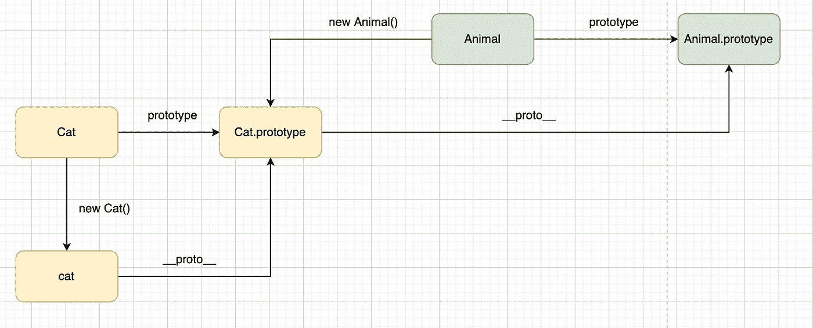

# 10 个你可能不知道答案的简单面试问题

> 原文：<https://javascript.plainenglish.io/10-easy-interview-questions-you-may-not-know-the-answer-e9421a0953b8?source=collection_archive---------0----------------------->

## 99%的人不一定知道答案。

# 前言

最近我的朋友 Candy 参加了一个面试，他被要求**在第一轮**回答 10 个问题。显然，作为一名经验丰富的工程师，他对这件事感到恼火，并认为，“我有 5 年的工作经验，为什么我需要做笔试？”

> ***提示:*** *每道题都会涉及到一个有趣的知识点，你可以试着思考一会再看答案！*

# Q1:使用对象作为属性键

请问产量是多少？

**分析**

众所周知，如果你用一个对象作为属性键，结果会是这样的。实际的键是`[object Object]`

**回答**

那么答案是什么呢？也许你觉得是 **fatfish** ，但是**中**才是最终答案。

# Q2:nums 的价值是什么？

请问产量是多少？

**分析与回答**

首先，我不认为这个问题是在看应聘者的编程能力。他正在检查候选人是否有眼睛问题。如果你没有注意到分号，你一定会认为 nums 是**【0，1，2，3，4】**。

# Q3:小心排序陷阱？

请问产量是多少？

**分析与回答**

直觉上我们认为答案应该是`[1, 4, 21, 30, 100000]`，但是我们没有通过一个比较函数，所以结果不是我们想的那样。

来自 [MDN](https://developer.mozilla.org/en-US/docs/Web/JavaScript/Reference/Global_Objects/Array/sort) :

> *提示:指定一个定义排序顺序的函数。如果省略，数组元素将被转换为字符串，然后根据每个字符的 Unicode 码位值进行排序。*

# Q4:定义变量的陷阱！

请问产量是多少？

**分析与回答**

可能 99%的工程师认为答案应该是* *未定义*，**未定义**，因为他们不知道如何定义全局变量。

# Q5:你知道一些基本的转换规则吗？

请问产量是多少？

**分析与回答**

# q6:JavaScript 中什么是变量提升？

请问产量是多少？

**分析与回答**

第一题和第二题的答案很简单，每个人都知道答案。但是 3 号和 4 号就没那么容易了。

特别是因为第 3 号涉及可变提升的问题。

# Q7:数组的长度？

请问产量是多少？

**分析与回答**

答案是 11 吗？如果是 11，说明你对数组的长度属性了解不够。

当你使用“nums.length = 0”时，意味着“nums”变成空的。

# q8:for 循环中的 SetTimeout？

请问产量是多少？

**分析与回答**

1 秒后是否打印 0，1，2？不，1 秒后 1 变成了 3，所以 3 会连续打印 3 次

如果想在 1 秒后打印出 0，1，2，应该怎么做？

# Q9:原型？

请问产量是多少？

**分析与回答**

看下图，我想你会知道答案的。

1.  `true`
2.  `true`

# Q10:ES6 模块导入导出知识

我相信这对你来说太容易了。直接写答案吧！

# 最后

**感谢阅读。**期待期待您的关注和阅读更多高质量的文章。

 [## 面试官:可以“x！== x "在 JavaScript 中返回 True？

### 你可能不知道的五个神奇的 JavaScript 知识点！

javascript.plainenglish.io](/interviewer-can-x-x-return-true-in-javascript-7e1d1fa7b5cd)  [## 123['toString']。length + 123)用 JavaScript 打印出来？

### 95%的前端开发者回答错误的问题。

javascript.plainenglish.io](/what-does-123-tostring-length-123-print-out-in-javascript-2c804a414325)  [## 面试官:你工作 3 年了，这种算法题你都不会答？

### 一个女生的面试经历

javascript.plainenglish.io](/interviewer-you-have-been-working-for-3-years-and-you-cant-answer-this-algorithm-question-5f79cba18e06)  [## 我老板:你知道 ES6，为什么不用？😠

### 老板的 10 条抱怨让我受益匪浅。

javascript.plainenglish.io](/my-boss-you-know-es6-but-why-dont-you-use-it-5e0316f14c67) 

*更多内容看* [***说白了。报名参加我们的***](https://plainenglish.io/) **[***免费周报***](http://newsletter.plainenglish.io/) *。关注我们关于*[***Twitter***](https://twitter.com/inPlainEngHQ)*和*[***LinkedIn***](https://www.linkedin.com/company/inplainenglish/)*。加入我们的* [***社区不和谐***](https://discord.gg/GtDtUAvyhW) *。***