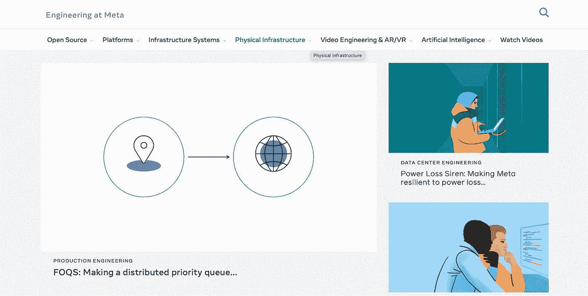
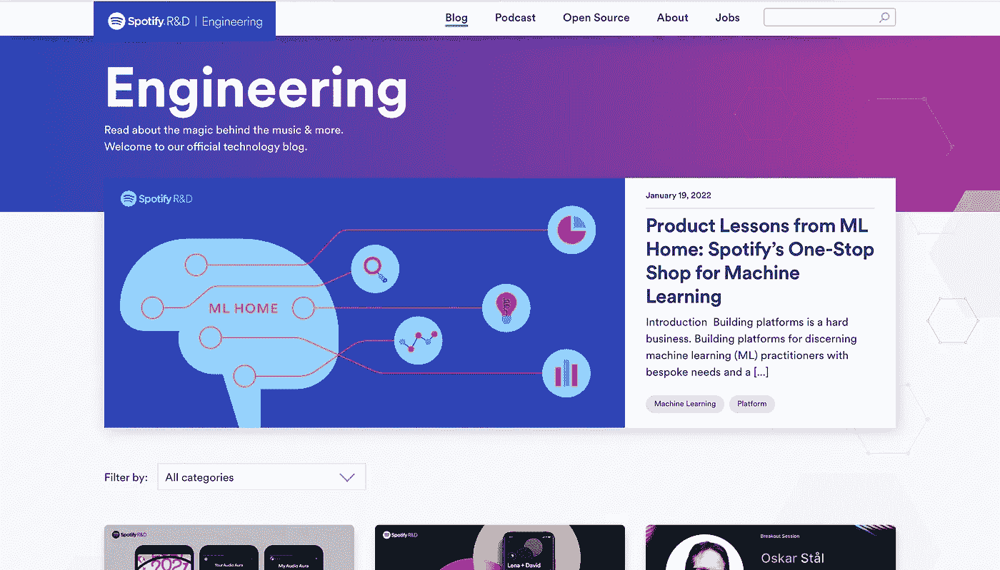
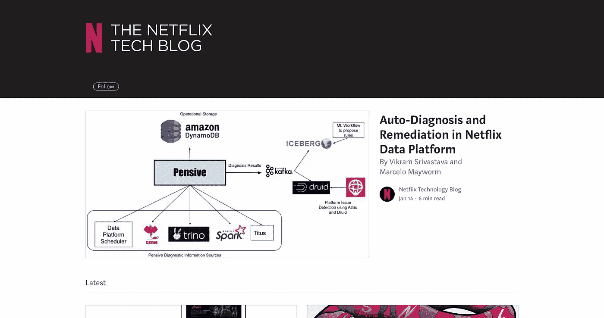
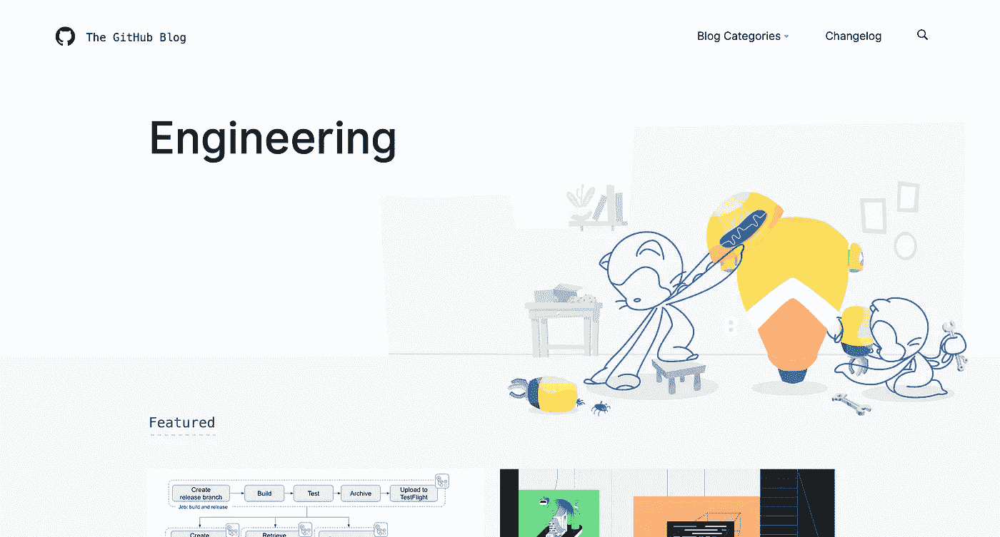
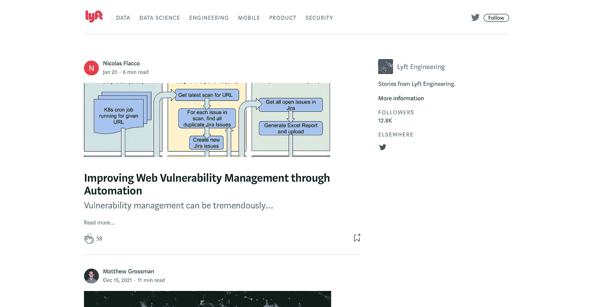
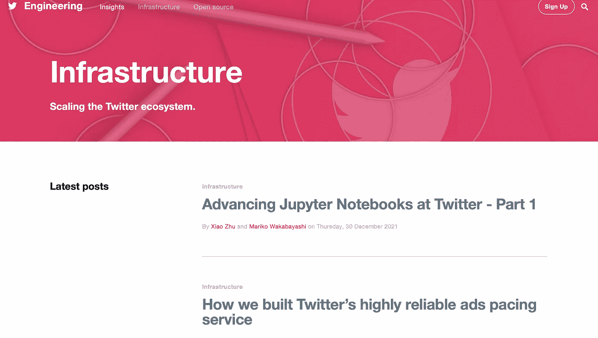
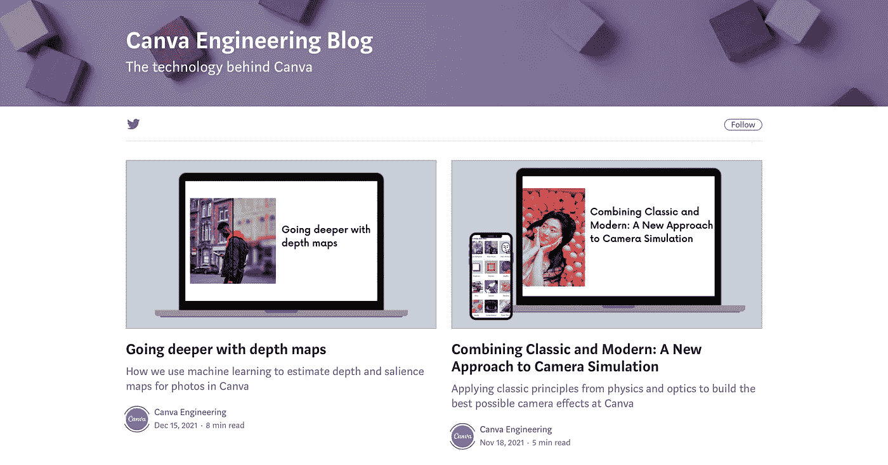

# 我阅读的 10 个工程博客，以跟上技术趋势

> 原文：<https://javascript.plainenglish.io/10-engineering-blogs-i-read-to-stay-up-to-date-with-technology-trends-faa006460fd9?source=collection_archive---------1----------------------->

## 2022 年及以后的顶级工程博客。

Photo by [Alexandra Tran](https://unsplash.com/@schimiggy?utm_source=unsplash&utm_medium=referral&utm_content=creditCopyText) on [Unsplash](https://unsplash.com/s/photos/blogger?utm_source=unsplash&utm_medium=referral&utm_content=creditCopyText)

对我们大多数人来说，编程并不容易。但是，如果有人说任何人都可以变得更好，那么我会说，是的。事情确实一天比一天容易。如果技术在进步，所有的开发者也会进步。他们也学习新的东西。一个很棒的事情是，开发人员不介意与他们的同龄人分享他们的学习。他们中的一些人就是这样变得更好的。

组织也不例外。他们通过博客与全世界以及其他软件开发人员和工程师分享他们的学习成果。这就是我们中的一些人如何跟上未来将会出现的技术或趋势。

当你与你的工程师同事分享时，他们会想出不同的方法来做同样的事情。好或坏，嗯，那根本不重要，只要每个人都学到一些东西。我总是说，只要东西不坏，技术上没有什么是错的。即使东西坏了，你也可以通过修理它们或使它们变得更好来学习新的东西。

在这里，我将分享我阅读的十个工程博客，以了解科技行业的最新动态。它们如下-

# 1.Meta 工程

screenshot

如果你曾经想知道在 Meta，以前被称为脸书，发生了什么和怎样的事情，那么这个博客是给你的。任何创新，框架，新闻内容，你都可以在工程博客上找到关于 Meta 的一切。

开发人员可以将它视为一个工程新闻资源，了解 Meta 如何用创新的解决方案处理大规模问题。

它包含到其他博客的链接，在那里您可以找到关于 Meta 的最新技术和框架以及开源项目的信息。

[链接到博客](https://engineering.fb.com)

# 2.Spotify 工程

screenshot

我喜欢 Spotify 的一点是平台背后的算法。作为一名程序员，我确实戴着耳机听音乐。听音乐是一件很棒的事情。每次我听 Spotify 的时候，这个平台都会莫名其妙地想出我想听的歌。那里没有秘密！每个人都会同意，它有一个伟大的机器学习算法。但是，如果你对平台背后的数学或任何与音乐平台相关的东西感兴趣，Spotify 的工程博客应该是你的第一资源。

[链接到博客](https://engineering.atspotify.com)

# 3.波士顿动力博客

screenshot

是的，机器人制造公司。波士顿动力公司每年发布三到四个视频，他们的创新仍然给每个人留下深刻印象。我很确定你们都在 Youtube 上看过他们的视频。如果没有，我强烈建议你们都去看。

不用说，你可以在这个工程博客中找到任何与该组织相关的内容。

[链接到博客](https://blog.bostondynamics.com)

# 4.网飞科技博客

screenshot

网飞是我发现的唯一一个技术博客在 Medium 上的组织。他们分享几乎所有与工程领域相关的东西(不是所有东西，而是很多很酷的东西)。有时，甚至是相同的代码。

数据工程，微服务，或新的开发工具，网飞通过与开发者社区分享他们的开发经验来帮助每个人。

如果你还没有订阅网飞理工大学的博客，现在就订阅吧

[链接到网飞博客](https://netflixtechblog.com) g

# 5.Github 工程

screenshot

Github 每个月发布两到三篇博客，帮助开发者更好地理解这个平台、它的新特性、创新和本质上的 DevOps。如果你在 DevOps 领域，这个博客是一个必须保持与社区同步的博客。

[链接到 Github 博客](https://github.blog/category/engineering/)

# 6.Lyft 工程

screenshot

你可以在 Medium 上找到并关注 Lyft 的工程博客。Lyft 通过其工程博客与开发者社区的其他成员公开分享其平台开发经验。

它有五个领域——工程、安全、移动、数据科学和产品。

如果你在上述行业领域之一，跟随博客，我保证你不会失望。相信我！你有很多材料要读。

[链接到 Lyft 工程博客](https://eng.lyft.com/tagged/mobile)

# 7.Twitter 工程

screenshot

每个名人都在推特上。名人的推文和报纸让他们成为明天的头条。因此，我不得不把它加入我的阅读清单。开发者不应该只是在 Twitter 上分享他们的观点，还应该阅读他们技术背后发生的事情。

如果你想找到关于洞察力、基础设施、安全性和技术的信息，那么这个博客就是为你准备的。

[链接到 Twitter 工程博客](https://blog.twitter.com/engineering/en_us/topics/insights)

问题是，每个技术组织都有一个工程博客。我可能不会在我的博客中列出来，但事实是有的，他们都与世界分享平台开发者的见解和新技术。

screenshot

其中有— [**优步工程**](https://eng.uber.com)**[**insta gram 工程**](https://instagram-engineering.com)**[**Canva 工程博客**](https://canvatechblog.com) **等**。一定要跟着他们。****

****邮报到此为止。我希望你喜欢它。****

****你觉得这篇文章有益吗？****

******我关注以上十个工程博客，以跟上技术发展趋势。你关注哪个工程博客？如果有的话。******

******或者你更喜欢看 YouTube 或者新闻？******

******在评论区写下。我很想知道你对此的看法。******

## ****进一步阅读****

**** [## 如何建立一个可组合的博客

### 从头开始创建一个博客需要很多。有许多移动的部件组合在一起形成一个…

比特云](https://bit.cloud/blog/how-to-build-a-composable-blog-l1jkl9f4) 

*更多内容看* [***说白了。报名参加我们的***](http://plainenglish.io/) **[***免费周报***](http://newsletter.plainenglish.io/) *。在我们的* [***社区不和谐***](https://discord.gg/GtDtUAvyhW) *获得独家获取写作机会和建议。*******