# 你应该知道的 10 个独家 CSS 事实，以便自信地获得初级开发人员的工作

> 原文：<https://javascript.plainenglish.io/10-exclusive-css-facts-you-should-know-to-confidently-land-a-junior-developer-job-33581198375b?source=collection_archive---------13----------------------->

## 加上备忘单，强化你的知识，让它永远伴随着你

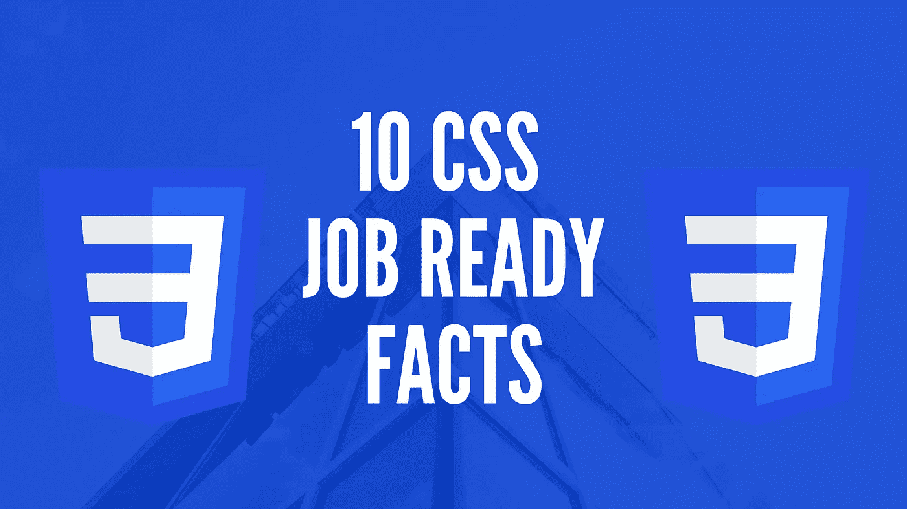

Made By The [Author](http://www.arnoldcode.com)

CSS 并不复杂，但有了这些秘密，你可以很容易地给面试官留下深刻印象，并获得一份初级 web 开发人员的工作。

CSS 有很多不常见的怪癖和特性。用精确的知识击败对手，获得真正的专业人士的地位。以下部分将让你在申请过程中比你的竞争对手更有优势。

那么你知道不同风格的人会争取展示的权利吗？

# 1.CSS 代表级联样式表和…

这种用法揭示了你对以下问题的答案:

*   *我如何让文字变红？*
*   *如何在(网页)布局的特定位置显示内容？*
*   如何用背景图片或颜色装饰我的网页？

***是设计你的网页的语言。***

🔥 **:** 相比较而言， [HTML 定义了应该显示哪些元素，CSS 决定了它们的外观。](http://seekoapp.io/61fd7686be65ea388fc3ca65)

第一部分👇

 [## 让你在求职面试中扭转局面的 8 个难忘的 HTML 秘密

### 包括小抄，让你拥有重要的知识

javascript.plainenglish.io](/8-memorable-html-secrets-that-let-you-turn-tables-at-your-job-interview-f405743e2c0e) 

# 2.以专业的方式设计你的 HTML 元素

您可以在名为**的 HTML 标签中轻松定义样式。**

为此，您需要定义一个 *id 选择器(前缀:#)* 、一个*类选择器(前缀:。)、*或*标签选择器(无前缀)*。

让我们来看一个用标签选择器制作的标题样式。

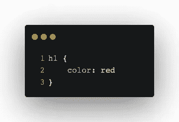

A simple tag selector for the <h1> tag

这是一个 CSS 标签选择器，因为它没有前缀，直接引用一个 HTML 标签 **< h1 >** 。当您在 HTML 文件中实现这个代码片段时，它会使标题的文本变成红色。

***但是那个类放在哪里呢？***

# 3.直接在 HTML 中实现你的风格

正如我之前提到的，你需要一对标签。

要创建并应用一个样式，你首先需要在你的 HTML 文件中有一对 **<样式>…</样式>** 标签。然后在这两个标记之间编写 h1 CSS 类。

这是您的文件应该包含的内容:

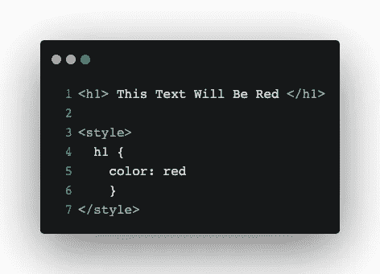

<h1> HTML Tag and CSS Class inside an HTML-file

如果你有一个包含该内容的 HTML 文件，并在你的浏览器中打开它，标题的文本将会是红色的。

# 4.将实现到外部 CSS 文件中

使用外部样式表是更好的技术。

你需要创建一个 **<链接>** 标签并添加属性 *href* 来定位你的 CSS 文件。使用 *rel* 属性将其确定为样式表，并添加 *type* 属性将其选择为 text/css(最后一步不是强制的)。

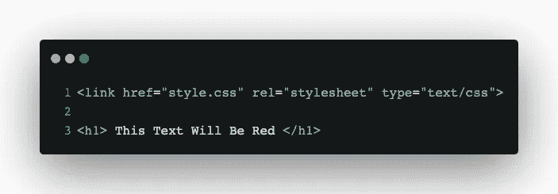

The HTML file with a link to a Stylesheet

The CSS file

当您为 href 属性提供属性时，必须命名 CSS 文件。在本例中， *style.css.*

您已经将样式从 HTML 文件中分离出来。这被称为 SOC 原则([关注点分离](http://seekoapp.io/61fd7688be65ea388fc3ca66))。

# 5.为什么没有内嵌样式？

HTML 带来了带有属性的内联样式。

CSS 样式普遍适用于网页的任何元素。但是你不应该用它们来设计我们的元素。这被认为是[不好的做法](http://seekoapp.io/61fd768ad492b9742453ba69),因为那些样式被明确地绑定到一个标签上。最后，你或任何其他人都可以正确理解你的 HTML 文档——它不会变得笨拙。

HTML 元素的样式是通过 CSS 实现的。[所有其他选项都被视为不良做法。](http://seekoapp.io/61fd768bd492b9742453ba6a)

比较以下示例:

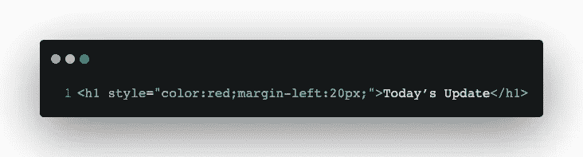

Inline style of HTML Tag <h1>

对多个标题应用相同的样式，您会看到:

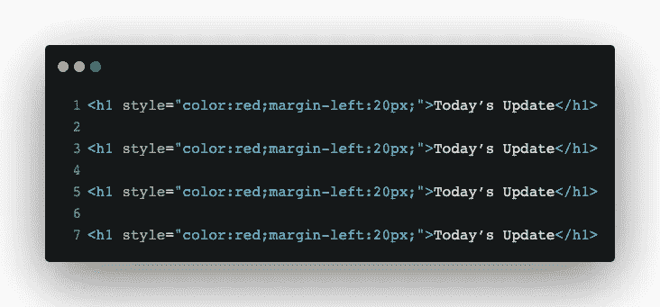

Same inline style applied to multiple <h1> tags

创建 CSS 样式看起来更简洁，每个人都能更容易理解 HTML 代码。

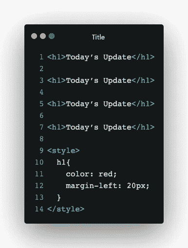

Simple h1 tag selector CSS class

瞧吧！总是使用 CSS 类来设计一个漂亮整洁的文档。为了更进一步，如前所示分割文件。

# 6.简单与复杂风格

CSS 有能力写出非常有效的风格。

例如嵌套的 HTML 元素。然后，如果类的层次结构类似于应用样式的层次结构，那么元素被填充到其他元素中。

这是 h1 标签的一个简单样式。它对文件中的每个 h1 元素都有效。不管你们互相塞了多少 h1。

Simple Style

只有当一个元素具有类*头*并且在具有类*段的元素内部时，才应用下面的样式。*

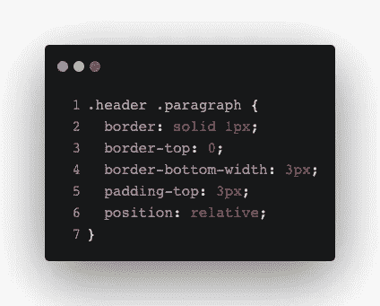

Complex Style

# 7.标签对类对 ID 选择器

为什么要使用一个类甚至一个 Id 选择器来用标签选择器设计每个元素的样式呢？

您希望使用它们，因为您的网站中会有多个带有相同标签的元素。标签选择器将其样式应用于所有现有的标签。如果你的网页有两次 **< h1 >** 并且你想把第一次变成绿色，第二次变成蓝色， **h1 { … }** 标签选择器已经不够用了。然后你只能用一种颜色来设计，而不能单独设计。

*   **h1{ … }** =是一个*标签选择器。*绑定最少，将其样式应用于所有现有元素。
*   **。header { … }** =是一个*类选择器。*当一个标签和一个类选择器被创建，并且你的 HTML 标签有一个类属性，这将覆盖标签选择器的样式。
*   **#heading { … }** =是一个 *id 选择器。*当一些先前的被创建/附加时，这个 id 选择器覆盖之前的一切。

🔥 **:** *Id 唯一。然后，创建一个样式只适用于拥有该 id 的单个元素。*

# 8.结合强度

您可以在下面的例子中看到不同之处，我准备了几个 **< h1 >** 标签，并给它们分配了不同的属性。

不同的风格搭配不同的选择器，会争取被展示的权利。正如你将看到的，这里有严格的等级制度。

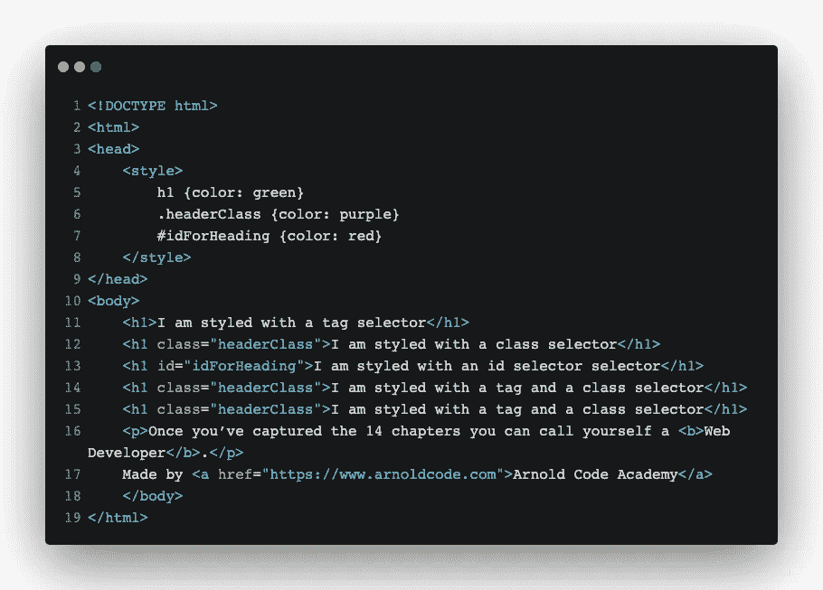

Example HTML for Binding Strengths

*要应用*一个类选择器样式，你必须添加属性 *class* 并指定你的 CSS 类的名称。**优点**:通过创建和分配不同的 CSS 类，你可以很容易地为同一类别的多个标签设计不同的样式。

*要应用*一个 id 选择器样式，你必须给一个元素一个带有属性 id 和" **your_id "的 id 优势**:虽然你已经指定了一个类选择器和一个标签选择器类，但是你可以对一个元素使用不同的样式。

这是上面 HTML 文件的结果。

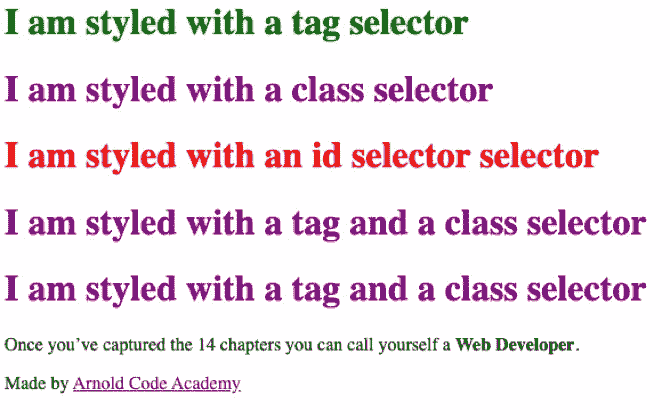

问题:你的整个 HTML 文档只能有一个 id。否则就不是身份证了。

# 9.常用的 CSS 属性

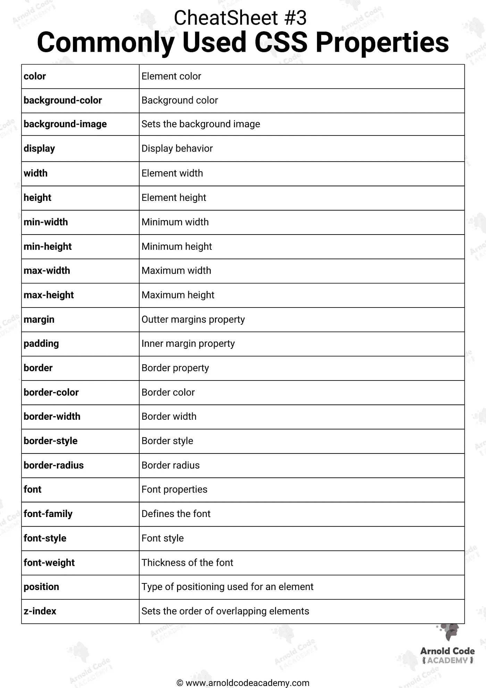

# 10.SASS & LESS 是更动态的 CSS

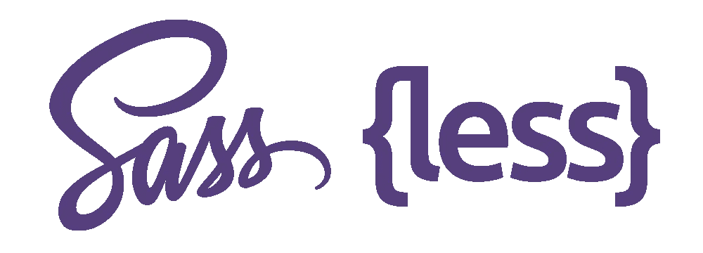

SASS and LESS Picture from [neusued GMBH](https://www.google.com/url?sa=i&url=https%3A%2F%2Fneusued.de%2Fcss-precompiler-fuer-windows%2F&psig=AOvVaw1sN_eDwQ_LwDP7dQFIrAdy&ust=1644085574229000&source=images&cd=vfe&ved=0CAwQjhxqFwoTCLiOwZjW5vUCFQAAAAAdAAAAABAT) (all rights reserved)

**SASS** 是 CSS3 语法的超集，它给你的样式表注入了许多好东西，比如变量、函数和混合。

**LESS** 和 **SASS** 在语法上有很多相似之处，包括:

*   **Mixins —** 类对类。
*   **参数混合—** 您可以向其传递参数的类，如函数。
*   **嵌套规则—** 类内的类，减少重复代码。
*   **操作—**CSS 内的数学。
*   **颜色功能—** 编辑您的颜色。
*   **名称空间—** 引用可以调用的样式组。
*   **范围—** 对样式进行局部更改。
*   **JavaScript 评估—** 在 CSS 中评估的 JavaScript 表达式。

获得 26 份备忘单，只研究你真正需要的东西，以获得你的第一份网络开发工作！

[Arnold Code Academy 26 Web Developer Cheatsheets](https://arnoldcodeacademy.ck.page/26-web-dev-cheat-sheets)

这篇文章是这个系列的第 2 部分。这是第一部分:

 [## 让你在求职面试中扭转局面的 8 个难忘的 HTML 秘密

### 包括小抄，让你拥有重要的知识

javascript.plainenglish.io](/8-memorable-html-secrets-that-let-you-turn-tables-at-your-job-interview-f405743e2c0e) 

*更多内容请看*[***plain English . io***](http://plainenglish.io/)*。报名参加我们的* [***免费周报***](http://newsletter.plainenglish.io/) *。在我们的* [***社区***](https://discord.gg/GtDtUAvyhW) *获得独家获得写作机会和建议。*