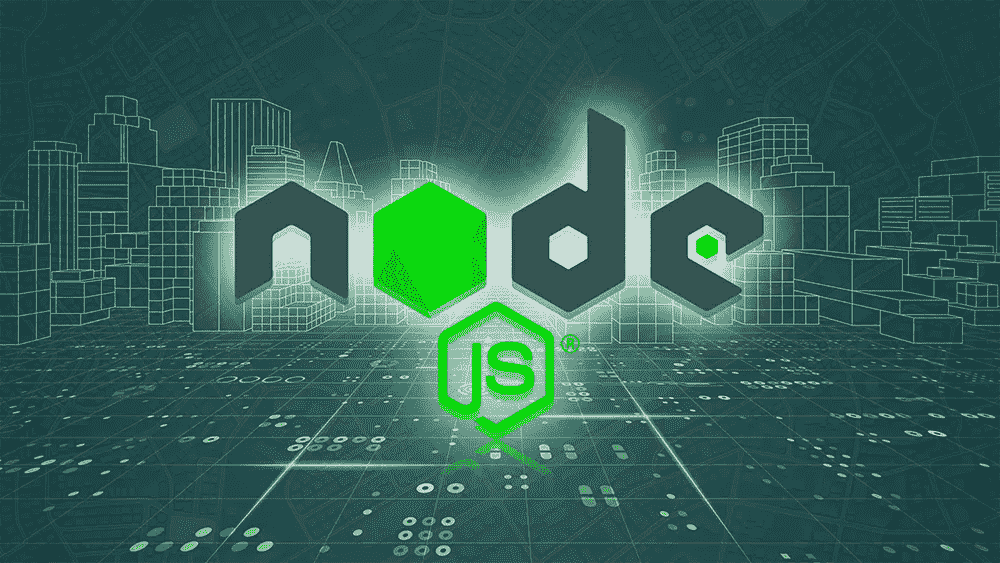

# 2022 年学习 Node.js 的 10 门免费课程—最好的

> 原文：<https://javascript.plainenglish.io/10-free-courses-to-learn-node-js-in-2022-best-of-the-lot-fe133983183a?source=collection_archive---------6----------------------->

## 这些在线课程对有兴趣成为全栈开发人员的程序员很有帮助。

Image credit- [https://zerotomastery.io/courses/learn-node-js/](https://zerotomastery.io/courses/learn-node-js/)

Node.js 彻底改变了 JavaScript 的开发方法。因为 JavaScript 在屏幕上运行，并且主要用于客户端验证、图形和交互，所以它以前被认为是一种客户端语言。 [36.42%的开发人员](https://www.enterpriseappstoday.com/stats/node-js-statistics.html#What_Is_Node_Js)使用 Node.js 生态系统的库、模块和工具。

由于 Node.js 和 JavaScript 被广泛接受，这些在线课程对有兴趣成为全栈开发人员的程序员非常有帮助。

此外，许多专业人士也在发现 JavaScript 和 Node.js 平台，以便成为专业人士。下面是你可以参加的学习 Node.js 的各种**顶级课程的集合。**

1.  [**学习 Node.js API 编程**](https://click.linksynergy.com/deeplink?id=JVFxdTr9V80&mid=39197&murl=https%3A%2F%2Fwww.udemy.com%2Fnode-js-api-tutorial%2F)

这是网上最棒的 Node.js 入门教程之一。在本课程中，您将从头开始学习 Node.js API 编程。

在本课程中，您将学习 Node.js 入门所需的所有知识，从 node . js 是什么以及为什么要学习 node . js，到设置开发平台，以及了解 JavaScript 如何在浏览器和没有浏览器的环境中工作。

在本课程中，您将了解现代 JavaScript、Node.js 事件电路、自适应编码、Node.js 组件、NPM 模块、生成功能、构建服务器、建立数据库连接以及传输 JSON 反应。

**2。** [**使用 Node.js、Express 和 MongoDB**](https://coursera.pxf.io/c/3294490/1164545/14726?u=https%3A%2F%2Fwww.coursera.org%2Flearn%2Fserver-side-nodejs) 对服务器进行编程

介绍了 web 技术，包括 HTTP 和 HTTP Secure，然后解释了 Node.js 和 Node.js 插件，如用于创建 Web 主机的 Express。最后，您将学习数据库的基本 CRUD 操作、一般的 NoSQL 系统、MongoDB 和从 Node.js 连接 MongoDB 的 Mongoose，包括关系数据库系统的基本 CRUD 活动。

最后，您将发现后端即系统(BaaS)战略，其中包含移动 BaaS 和开源及盈利性 BaaS 服务。React 全栈网站设计的另一个组成部分就是这个程序。你在这个项目中的表现将反映出你在完成后的学习专长。

**3。**[**node . js 简介**](https://www.awin1.com/cread.php?awinmid=6798&awinaffid=631878&clickref=&p=%5B%5Bhttps%3A%2F%2Fwww.edx.org%2Fcourse%2Fintroduction-to-nodejs)

来自微软和 edX 团队的 Node.js learning 项目的另一个**免费课程。利用 Node.js、Express 和 MongoDB 构建 web 应用程序的最佳初学者手册。在本开放式课件中，您可以掌握 Node.js 的基础知识及其主要组件。此外，您将发现如何使用 npm 来设置您的站点和安装额外的模块。**

此后，您将学习如何使用 Express 配置 web 服务，并利用 Mongoose 与 MongoDB 数据库进行通信。最后，通过完成本课程，您将使用 Node.js 构建几个实际应用程序，包括一个 web scraper、一个网站构建 API 和一个数字资产管理脚本——这是一个很好的 Node.js 入门培训。

[**4。Node.js 和 Express** 的概要](https://click.linksynergy.com/deeplink?id=JVFxdTr9V80&mid=39197&murl=https%3A%2F%2Fwww.udemy.com%2Fintro-to-node-js-express%2F)

在 Node.js 上为业余爱好者提供的另一个免费介绍培训可以在这里找到。该课程循序渐进地教授 Node.js 和 Express，极具教育意义。这个十集系列的主题是:

*   项目组织
*   静态资源
*   模板工具
*   适应性请求
*   处理帖子数据
*   动态数据建模
*   样式和图片
*   中间件
*   履行

一些公司**雇佣一个全栈开发者**。本课程结束后，你将能够创建一个完全正常工作的 web 应用程序，并理解 Node.js/Express 开发的基本原理。

**5。** [**以 Node.js 开始**](https://pluralsight.pxf.io/c/1193463/424552/7490?u=https%3A%2F%2Fwww.pluralsight.com%2Fcourses%2Fnode-intro)

该课程对 Node.js 进行了很好的介绍，涵盖了使用续集和通道构建异步编程，并解释了如何使用 NPM 来模块化您的程序()。

在本课程中，您将学习有关 Node.js 的以下主题:

*   Node.js:什么，为什么，以及如何。
*   Node.js 中的模式、全局变量和函数
*   Node.js 的包管理
*   常用的工作模块

您还将学习如何使用内置 API 和一些基本的第三方组件来创建和扩展 web 应用程序。

**6。** [**用 Node.js** 学习编码](https://click.linksynergy.com/deeplink?id=JVFxdTr9V80&mid=39197&murl=https%3A%2F%2Fwww.udemy.com%2Fcourse%2Fcode-with-node%2F)

这是**最佳 Node.js 在线课程**，涵盖了使用 Node.js 和 Express 的基础到专家级 web 编程和开发技能，面向新的和[有经验的 Node.js 开发人员](https://www.arkasoftwares.com/hire-nodejs-developer)，他们希望通过了解如何构建和启动 REST API 成为全栈开发人员。

您将学习构建实用功能，包括导航、搜索、分类、地理定位、聚类、地理映射、安全性、注册、管理界面、登录详情、图片上传、交易等。您还将学习如何在错误发生时进行故障排除。

**7。**[**3 小时 Node.js 课程**](https://www.youtube.com/watch?v=RLtyhwFtXQA)

另一个免费的 Node.js 培训可以在 youtube 上的 FreeCodeCamp 频道获得。在这个三小时无广告的会议中，您可以了解 Node.js 的所有信息。如果您的 Node.js 程序在 2:25:24 启动并显示“错误:找不到模块' ejs '”时出现问题，请运行“npm install ejs”来解决问题。

**8。** [**使用 Node.js 和 Express**](https://click.linksynergy.com/deeplink?id=JVFxdTr9V80&mid=39197&murl=https%3A%2F%2Fwww.udemy.com%2Fcourse%2Fportfolio-website-with-node-js-express%2F) 制作作品集的网站

在这个基于项目的实践项目中，您将使用 Node.js 和 Express 来构建一个功能齐全、功能强大的作品集网站。在这个过程中，您会发现请求处理、模板引擎、处理数据库、REST API、图片上传和使用 jQuery 的 AJAX 调用。你甚至可以提前在项目组合门户中准备你的项目报告。

最终，该计划将帮助您为以下步骤做好准备:

*   项目组织
*   临时引擎
*   需求路由
*   API REST
*   CRUD 程序
*   上传文件
*   用于项目和博客的 CMS
*   jQuery 和 AJAX

对于寻求进入网络开发公司的个人来说，这个在线 Node.js 课程是非常好的。你不必远行去参加他们，因为他们不是在教室里进行的。这些课程可以在网上找到。

9。 [**Web 开发使用 Node.js' Power**](https://www.edx.org/course/web-app-development-with-the-power-of-nodejs)

该计划没有任何条件，为期四周。学习者将在课程的第一周检查基本思想，而在第二周将介绍操作和实体等其他主题。该计划还将涵盖使用 Node.js 框架的原则。最后，web 平台的基础架构和组成应用程序的众多组件的基础将在第三周介绍。

还将向学员解释用于构建应用程序的许多工具和框架，以及如何使用 API 共享数据。此外，还将向学生讲授 Node.js 服务器的创建以及与几组网络的联系。

10。Node.js 认证课程

在 Node.js 课程的帮助下，学生可以创建正常工作的网络功能并理解服务器端编程。参与者将彻底解释 Express、Node.js 网络控制器、收缩包装、NPM Vet、Https 和 MongoDB、MySQL 和 CRUD 函数等概念。以下仅是本课程中涉及的几个重要主题:

*   jQuery 框架
*   Node.js 的项目
*   Node.js 和 HTTP 服务器
*   缓冲的通道和事件
*   Node.js 多重处理
*   学习快车

# 结论

最后，Node.js 在任何一个 [**全栈开发公司**](https://www.arkasoftwares.com/full-stack-development) 中都一直至关重要。事实是，JavaScript 将同时用于应用程序和数据库端。

使用 Node.js 后，开发费用减少了 **58%** ，在使用 Node.js 两年多后，企业的资本投入下降了 **12%** 。完成这些程序后，如果您继续学习更基本的 Node.js 概念或详细研究 Node.js，您也可以转向其他资料。即使它们不是免费的，它们也不太贵，不值得投资。

*更多内容请看*[***plain English . io***](https://plainenglish.io/)*。报名参加我们的* [***免费周报***](http://newsletter.plainenglish.io/) *。关注我们关于*[***Twitter***](https://twitter.com/inPlainEngHQ)[***LinkedIn***](https://www.linkedin.com/company/inplainenglish/)*[***YouTube***](https://www.youtube.com/channel/UCtipWUghju290NWcn8jhyAw)*[***不和***](https://discord.gg/GtDtUAvyhW) *。对增长黑客感兴趣？检查* [***电路***](https://circuit.ooo/) *。***