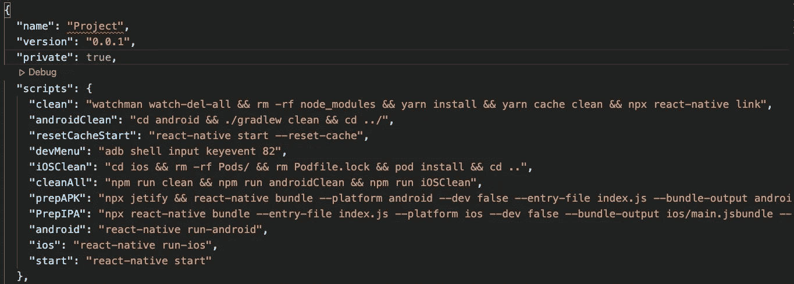

# 10 个高频 React 本机 CLI 命令和实用程序

> 原文：<https://javascript.plainenglish.io/10-high-frequency-react-native-cli-commands-and-utilities-6fbc653b8996?source=collection_archive---------11----------------------->

## 您可能需要这些 CLI 命令和实用程序来满足您的日常 React 本机开发需求。


Photo by [Nina Mercado](https://unsplash.com/@nina_mercado?utm_source=medium&utm_medium=referral) on [Unsplash](https://unsplash.com?utm_source=medium&utm_medium=referral)

React Native 是构建移动应用程序的优秀技术。它由脸书支持，被脸书、Shopify 等公司广泛使用。

本文将列出 React 本地开发人员几乎每天都在使用的一些 CLI。

## 1.启动 Metro 服务器

Metro 是一个 JS 捆绑器，它将所有 JS 文件编译成一个文件。要启动 metro 服务器，请编写以下内容:

```
react-native start
  # OR if you dont have react-native installed in machine
npx react-native start
```

## 2.在模拟器/仿真器上运行

这些是在 iOS 模拟器或 Android 模拟器上运行 React Native 的命令。如果您的机器上没有安装 react-native，请在前面追加`**npx**`。

```
react-native run-ios 
 # Will open iOS Simulatorreact-native run-android 
 # Will open Android Emulator
```

要打开特定的模拟器:

```
npx react-native run-ios — simulator= "iPhone SE (2nd generation)"
 # you can list available simulator via
xcrun simctl list devices
```

要打开特定的 Android 模拟器:

```
npx react-native run-android --deviceId='**DeviceId**'
 # To get **DeviceId**adb devices # Replace **9999xxx3434yyy** as **DeviceId**
# List of devices attached
# **9999xxx3434yyy**  device
```

## 3.Android 调试菜单

```
adb shell input keyevent 82
```

## 4.守夜人清洁

Watchman 是一个文件监视服务，它监视文件，并在文件发生变化时记录或触发操作。

```
watchman watch-del-all
```

## 5.节点模块清洁

```
rm -rf node_modules && yarn install && yarn cache clean
 # delete node modules, reinstall and then clean the cache
```

## 6.iOS 项目清理

```
cd ios && rm -rf Pods/ && rm Podfile.lock && pod install && cd ..
 # pod uninstall and then install
```

## 7.全新地铁捆绑包开始

```
react-native start --reset-cache
```

## 8.创建 Android 捆绑包

```
react-native bundle --platform android --dev false --entry-file index.js --bundle-output android/app/src/main/assets/index.android.bundle && cd ./android && ./gradlew app:assembleRelease
```

## 9.创建 iOS 捆绑包

```
react-native bundle --entry-file index.js --platform ios --dev false --bundle-output ios/main.jsbundle --assets-dest ios
```

## 10.更多的脚本

您也可以将这些脚本添加到您的`**package.json**` 文件中，如下图`**scripts**` **:** 下所示



`**package.json**`

```
"scripts": {"clean": "watchman watch-del-all && rm -rf node_modules && yarn install && yarn cache clean && npx react-native link","androidClean": "cd android && ./gradlew clean && cd ../","resetCacheStart": "react-native start --reset-cache","devMenu": "adb shell input keyevent 82","iOSClean": "cd ios && rm -rf Pods/ && rm Podfile.lock && pod install && cd ..","cleanAll": "npm run clean && npm run androidClean && npm run iOSClean","prepAPK": "npx jetify && react-native bundle --platform android --dev false --entry-file index.js --bundle-output android/app/src/main/assets/index.android.bundle && cd ./android && ./gradlew app:assembleRelease","PrepIPA": "npx react-native bundle --entry-file index.js --platform ios --dev false --bundle-output ios/main.jsbundle --assets-dest ios","android": "react-native run-android","ios": "react-native run-ios","start": "react-native start"},
```

感谢阅读。祝 Java 编写愉快。🍻

*更多内容看* [***说白了。报名参加我们的***](https://plainenglish.io/) **[***免费周报***](http://newsletter.plainenglish.io/) *。关注我们关于* [***推特***](https://twitter.com/inPlainEngHQ)[***领英***](https://www.linkedin.com/company/inplainenglish/)**和* [***不和***](https://discord.gg/GtDtUAvyhW) *。****