# 10 个搞笑的编程迷因

> 原文：<https://javascript.plainenglish.io/10-hilarious-programming-memes-c16efb22d3d5?source=collection_archive---------0----------------------->

## 最佳编程笑话汇编 2022 系列

Photo by [Christian Bowen](https://unsplash.com/@chrishcush?utm_source=medium&utm_medium=referral) on [Unsplash](https://unsplash.com?utm_source=medium&utm_medium=referral)

***模因和快乐有什么联系吗？*** 如果你是我这种类型的人，那么你可能也爱在下班后查看手机。猜猜我在那里看到了什么？

我主要是在互联网上看到**视频、抖音和模因**。我不知道为什么，但这有助于我提神醒脑，减轻工作压力。这就是为什么我相信*笑是人类最好的刷新按钮。*

在这篇文章中，我收集了一些我喜欢的网络迷因。

# 当后端开发者有了态度…

Picture Credit:[https://www.facebook.com/yuva.krishna.memes](https://www.facebook.com/yuva.krishna.memes)

# 事实上，开发人员认为一切都是好的，直到 QA 打破它…

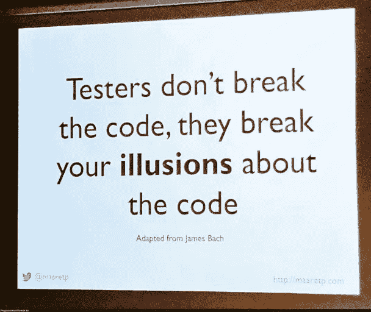

Picture Credit:[https://programmerhumor.io/](https://programmerhumor.io/)

# 当你发现 bug 与你的特性团队无关时…

Picture Credit:[https://programmerhumor.io/](https://programmerhumor.io/)

# 你使用哪种日志软件？我喜欢游戏机 lol

Picture Credit:[https://programmerhumor.io/](https://programmerhumor.io/)

# 当你可以使用箭头键时，为什么还要打字呢…

Picture Credit:[https://programmerhumor.io/](https://programmerhumor.io/)

# 即使 15 年后也不会改变…我向那些在 StackOverflow 中回答正则表达式相关问题的人致敬

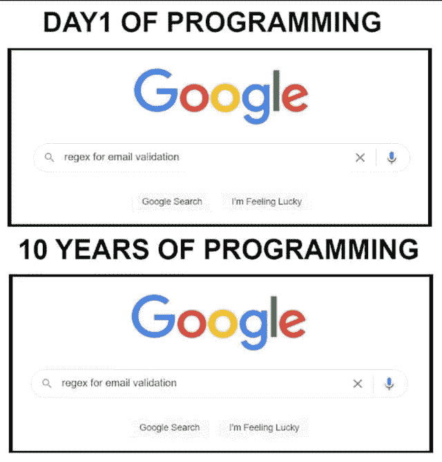

Picture Credit: [https://www.reddit.com/r/ProgrammerHumor/](https://www.reddit.com/r/ProgrammerHumor/)

# 当你请你的朋友支持你时…

Picture Credit:[https://programmerhumor.io/](https://programmerhumor.io/)

# “Hello world”是我们出生在编程世界时学到的第一件事

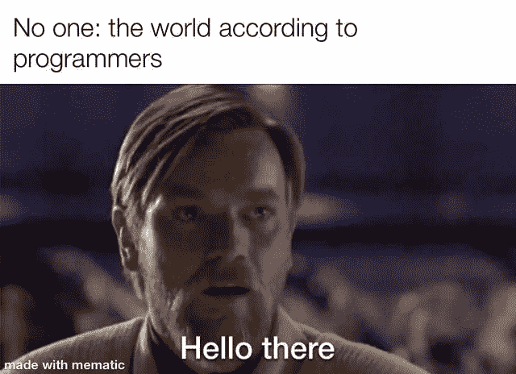

Picture Credit:[https://www.reddit.com/r/programmingmemes/](https://www.reddit.com/r/programmingmemes/)

# 当“网络”标签试图欺骗你时…

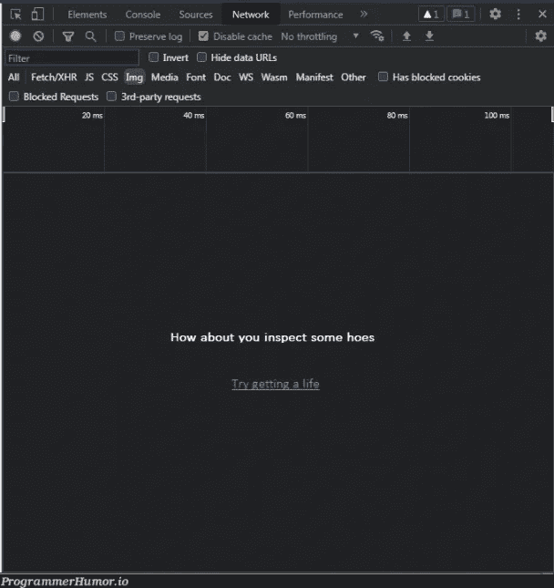

Picture Credit:[https://programmerhumor.io/](https://programmerhumor.io/)

# 直接或间接地，每个人在生活中都使用过 StackOverflow

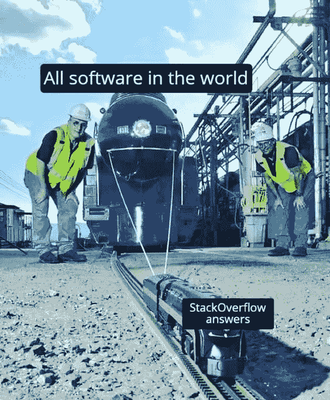

Picture Credit:[https://www.reddit.com/r/programmingmemes/](https://www.reddit.com/r/programmingmemes/)

# 是的，我们使用 2 台显示器和键盘…

Picture Credit:[https://www.reddit.com/r/programmingmemes/](https://www.reddit.com/r/programmingmemes/)

# 即使我们不看文档…只要看一个例子…

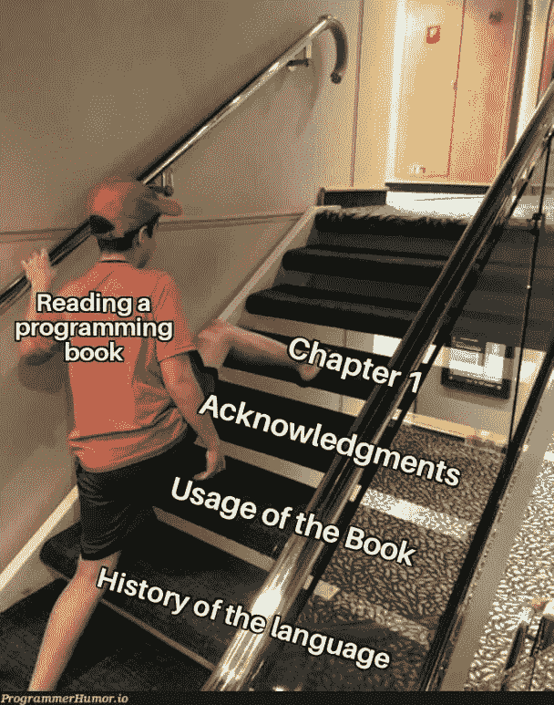

Picture Credit:[https://programmerhumor.io/](https://programmerhumor.io/)

# 是的，我做了很多工作来搜索和使用我们代码库中的代码…

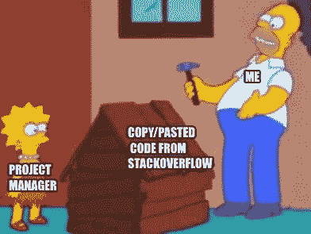

Picture Credit:[https://programmerhumor.io/](https://programmerhumor.io/)

# 奖金

# 当你要搬到另一个地方，请提供 KT 给新的人…

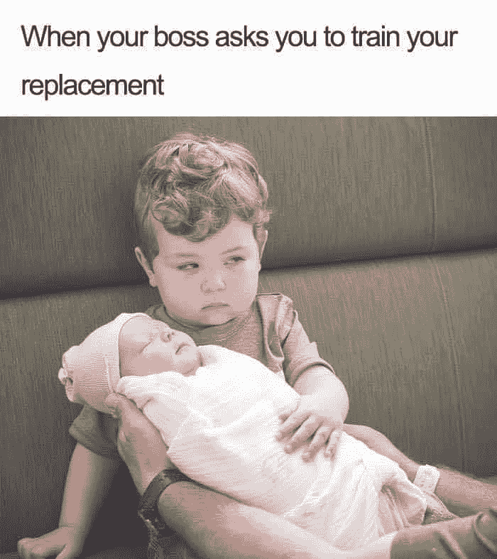

[https://www.facebook.com/yuva.krishna.memes/photos/a.105527467815845/400621604973095/](https://www.facebook.com/yuva.krishna.memes/photos/a.105527467815845/400621604973095/)

**来源:**[https://www.facebook.com/yuva.krishna.memes/](https://www.facebook.com/yuva.krishna.memes/photos/a.105527467815845/400621604973095/)

# 如果你只是热起来，那么它是完美的管理…

[https://www.facebook.com/yuva.krishna.memes/photos/a.105527467815845/399700421731880/](https://www.facebook.com/yuva.krishna.memes/photos/a.105527467815845/399700421731880/)

**来源:**[https://www.facebook.com/yuva.krishna.memes/](https://www.facebook.com/yuva.krishna.memes/photos/a.105527467815845/400621604973095/)

# 我们不一样…

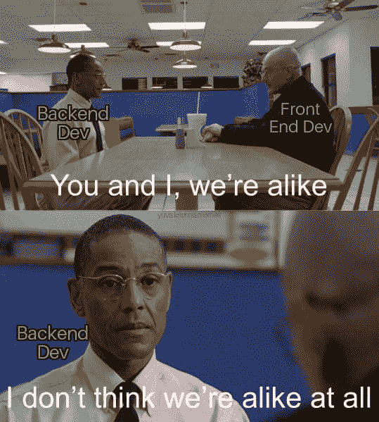

[https://www.facebook.com/yuva.krishna.memes/photos/a.105527467815845/395622472139675/](https://www.facebook.com/yuva.krishna.memes/photos/a.105527467815845/395622472139675/)

**来源:**[https://www.facebook.com/yuva.krishna.memes/](https://www.facebook.com/yuva.krishna.memes/photos/a.105527467815845/400621604973095/)

# 我不知道，但是它开始起作用了…也许我手里有魔法

[https://www.facebook.com/codevweb95/photos/a.109799858049136/125626996466422/](https://www.facebook.com/codevweb95/photos/a.109799858049136/125626996466422/)

**来源:**[https://www.facebook.com/codevweb95](https://www.facebook.com/codevweb95/photos/a.109799858049136/125626996466422/)

# 当两个分支合并时…这是在幕后发生的

[https://www.monkeyuser.com/2017/merging-branches/?sc=true&dir=random](https://www.monkeyuser.com/2017/merging-branches/?sc=true&dir=random)

**来源:**[https://www.monkeyuser.com/2017/merging-branches/?sc=true&dir = random](https://www.monkeyuser.com/2017/merging-branches/?sc=true&dir=random)

# 当我的代码没有任何问题地运行时，我感到非常高兴…

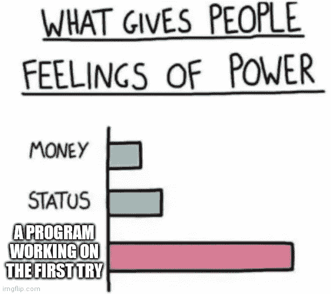

[https://www.reddit.com/r/ProgrammerHumor/comments/pb64yr/when_it_happens_you_feel_like_a_superior_being/](https://www.reddit.com/r/ProgrammerHumor/comments/pb64yr/when_it_happens_you_feel_like_a_superior_being/)

**来源:**【https://www.reddit.com/r/ProgrammerHumor/】T2

# 人工智能…我们想长大达到这个水平…

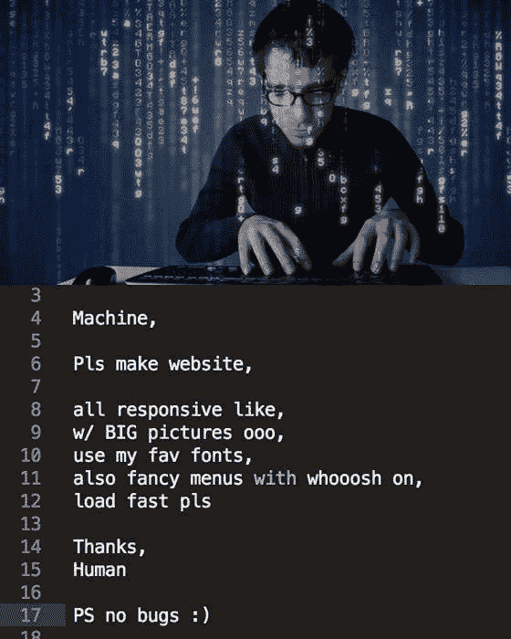

[https://www.facebook.com/codevweb95/photos/a.109799858049136/125112946517827/](https://www.facebook.com/codevweb95/photos/a.109799858049136/125112946517827/)

【https://www.facebook.com/codevweb95】来源:

# 当有人采访一个开发者时…

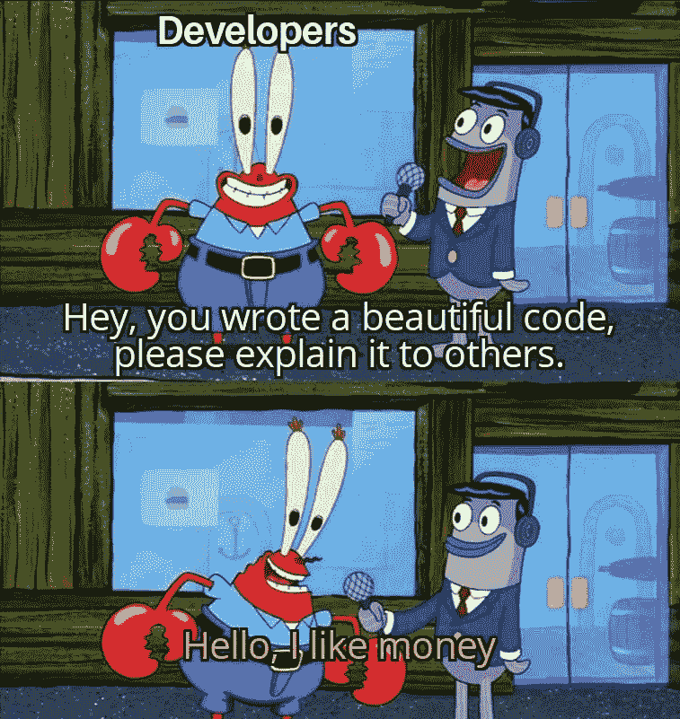

[https://www.facebook.com/jokesvala/photos/a.2330223400336101/6458330477525352/](https://www.facebook.com/jokesvala/photos/a.2330223400336101/6458330477525352/)

**来源:**[https://www.facebook.com/jokesvala/](https://www.facebook.com/jokesvala/photos/a.2330223400336101/6458330477525352/)

# 最佳优化技巧…

[https://www.facebook.com/photo?fbid=3939141809528876&set=gm.957487971476480](https://www.facebook.com/photo?fbid=3939141809528876&set=gm.957487971476480)

**来源:**[https://www.facebook.com/groups/151139362111349](https://www.facebook.com/groups/151139362111349)

# 当初级开发人员致力于该特性时…

[https://www.facebook.com/171693141223918/photos/a.171697311223501/326499809076583/](https://www.facebook.com/171693141223918/photos/a.171697311223501/326499809076583/)

**来源:**[https://www.facebook.com/groups/151139362111349](https://www.facebook.com/groups/151139362111349)

# 希望你有愉快的一天…

*更多内容请看* [***说白了就是***](https://plainenglish.io/) *。报名参加我们的* [***免费每周简讯***](http://newsletter.plainenglish.io/) *。关注我们*[***Twitter***](https://twitter.com/inPlainEngHQ)*和*[***LinkedIn***](https://www.linkedin.com/company/inplainenglish/)*。查看我们的* [***社区不和谐***](https://discord.gg/GtDtUAvyhW) *加入我们的* [***人才集体***](https://inplainenglish.pallet.com/talent/welcome) *。*