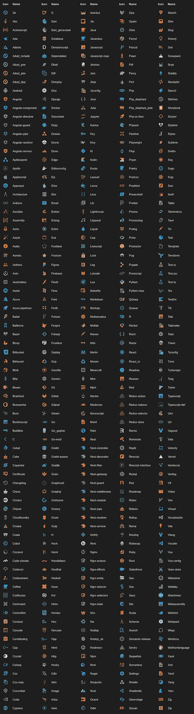

# 改善 VS 代码中文件外观的 10 个最佳图标包

> 原文：<https://javascript.plainenglish.io/10-icon-packs-for-vs-code-87d2ff700d0c?source=collection_archive---------0----------------------->

## VS 代码

## 应该下载到 VS 代码中的顶部图标包。

在你的 VS 代码软件中一个合适的文件包可以增强你在 IDE 中的信心，并且比默认的更能吸引你的眼球。我已经写了很多关于 VS 代码主题、扩展和其他增强的文章。你可以在这个列表[这里](https://medium.com/@oskarpetr/list/vs-code-0364bc74e263)查看一下。

## 1.材料图标主题

材料图标主题是 VS 代码中所有图标主题的终极经典，坦率地说，它是下载最多的一个。这个图标包包含了你能想到的所有图标，甚至包括那些不被认为是编程语言的图标。

这个包有将近 1300 万次下载，有一个可用的图标变体，由[菲利普·基夫](https://marketplace.visualstudio.com/publishers/PKief)开发。

marketplace.visualstudio.com

 [## 材料图标主题- Visual Studio 市场

### 在你的 VS 代码中加入材质设计图标。

marketplace.visualstudio.com](https://marketplace.visualstudio.com/items?itemName=PKief.material-icon-theme) 

## 2.虚拟代码-图标

Vscode-icons 是另一个经典，这个包也包含了你能想到的所有图标。这个图标包有大约 1100 万次下载，有 1 个可用的图标变体，由 [VSCode Icons 团队](https://marketplace.visualstudio.com/publishers/vscode-icons-team)开发。

marketplace.visualstudio.com

 [## vscode-icons - Visual Studio 市场

### 将图标添加到您的 Visual Studio 代码中(支持的最低版本:1.40.2)管理拉请求和行为代码…

marketplace.visualstudio.com](https://marketplace.visualstudio.com/items?itemName=vscode-icons-team.vscode-icons) 

## 3.Monokai Pro

这个图标包是由最初的 Monokai 颜色的作者设计的。精心选择的色调是不妥协、不分散注意力的用户界面的基础。

这个图标包有大约 150 万次下载，有 10 个可用的图标变体，由 [monokai](https://marketplace.visualstudio.com/publishers/monokai) 开发。

marketplace.visualstudio.com

 [## Monokai Pro - Visual Studio 市场

### 概述版本历史评级&审查 Monokai Pro 是一个配色方案，定制的用户界面主题和完整的…

marketplace.visualstudio.com](https://marketplace.visualstudio.com/items?itemName=monokai.theme-monokai-pro-vscode) 

## 4.材料主题图标

这个图标包有大约 140 万次下载，有 5 个可用的图标变体，由[equinuscio](https://marketplace.visualstudio.com/publishers/Equinusocio)开发。

 [## 材料主题图标- Visual Studio 市场

### 使用完整的源代码树上下文在您的 IDE 中管理拉取请求和进行代码审查。评论任何一行，不只是…

marketplace.visualstudio.com](https://marketplace.visualstudio.com/items?itemName=Equinusocio.vsc-material-theme-icons) 

## 5.阿玉

简单的主题，明亮的色彩，适合全天舒适的工作。这个图标包有大约 130 万次下载，有 3 个可用的图标变体，由 [teabyii](https://marketplace.visualstudio.com/publishers/teabyii) 开发。

marketplace.visualstudio.com

 [## Ayu - Visual Studio 市场

### 来源:https://github.com/dempfi/ayu 一个简单的主题，有明亮的颜色，有三个版本——深色，浅色…

marketplace.visualstudio.com](https://marketplace.visualstudio.com/items?itemName=teabyii.ayu) 

## 6.城市之光

“城市之光”图标主题是“城市之光”的一部分，这是 Atom & Visual Studio 代码的一套漂亮的暗色主题的东西。

这个图标包有大约 88000 次下载，有 2 个可用的图标变体，由 [Yummygum](https://marketplace.visualstudio.com/publishers/Yummygum) 开发。

marketplace.visualstudio.com

 [## 城市之光图标包- Visual Studio 市场

### “城市之光”颜色主题是一个华丽的深色语法主题，设计时重点突出。城市灯光的色彩主题有…

marketplace.visualstudio.com](https://marketplace.visualstudio.com/items?itemName=Yummygum.city-lights-icon-vsc) 

## 7.Nomo Dark

这个图标包有大约 36 万次下载，有 1 个可用的图标变体，由 [be5invis](https://marketplace.visualstudio.com/publishers/be5invis) 开发。

marketplace.visualstudio.com

 [## Nomo 深色图标主题- Visual Studio 市场

### Visual Studio 代码的扩展- Nomo 深色图标主题

marketplace.visualstudio.com](https://marketplace.visualstudio.com/items?itemName=be5invis.vscode-icontheme-nomo-dark) 

## 8.敏锐的中性图标主题

Visual Studio 代码中视觉噪音最小的浅色图标主题。这个图标包有大约 31000 次下载，有一个可用的图标变体，由 [Keenethics](https://marketplace.visualstudio.com/publishers/keenethics) 开发。

marketplace.visualstudio.com

 [## 敏锐的中性图标主题- Visual Studio 市场

### Visual Studio 代码中视觉噪音最小的浅色图标主题

marketplace.visualstudio.com](https://marketplace.visualstudio.com/items?itemName=keenethics.keen-neutral-icon-theme) 

## 9.简易图标主题

Easy icons 是 Visual Studio 代码的一个简单图标主题。

这个图标包有大约 196，000 次下载，有一个可用的图标变体，由詹姆斯·马奎尔开发。

marketplace.visualstudio.com

 [## 简单图标主题- Visual Studio 市场

### Easy icons 是 visual studio 代码的一个简单图标主题。简单图标有两个目标:图标旁边的文件名使它…

marketplace.visualstudio.com](https://marketplace.visualstudio.com/items?itemName=jamesmaj.easy-icons) 

## 10.核标准情报中心

这个图标包有大约 33000 次下载，有一个可用的图标变体，由 [Mhammed Talhaouy](https://marketplace.visualstudio.com/publishers/tal7aouy) 开发。

marketplace.visualstudio.com

 [## 图标- Visual Studio 市场

### 把图标放到你的 VS 代码中。打开 Visual Studio 代码上的扩展侧栏搜索图标单击安装单击…

marketplace.visualstudio.com](https://marketplace.visualstudio.com/items?itemName=tal7aouy.icons) 

## 结论

VS 代码中的图标和主题应该对你很重要。如果您只使用适合您的版本，那么您在使用 IDE 时会更加得心应手。所以，这些是你现在可以下载到你的 VS 代码中的最流行的图标包。

*更多内容请看*[***plain English . io***](https://plainenglish.io/)*。报名参加我们的* [***免费周报***](http://newsletter.plainenglish.io/) *。关注我们关于*[***Twitter***](https://twitter.com/inPlainEngHQ)*和*[***LinkedIn***](https://www.linkedin.com/company/inplainenglish/)*。查看我们的* [***社区不和谐***](https://discord.gg/GtDtUAvyhW) *加入我们的* [***人才集体***](https://inplainenglish.pallet.com/talent/welcome) *。*