# 你必须知道的 10 个重要的 JavaScript 数组方法

> 原文：<https://javascript.plainenglish.io/10-important-javascript-array-methods-you-must-know-bd791cbd6e43?source=collection_archive---------3----------------------->

## 重要的 JavaScript 数组方法:map()，forEach()，reduce()，filter()，sort()，includes()，find()，indexOf()，some()，concat()

数组方法在 JavaScript 中是不可或缺的，有许多数组方法。对于忙碌的初学者，我挑选了 10 个最常见的数组方法，为了节省时间，你一定要学会。

为了更容易理解，我为每个数组方法提供了一个用例。

## **Array.map()**

通过调用回调函数，map()方法遍历原始数组，并对数组的每个元素调用该函数。因为它是一个非变异方法，所以它创建一个新数组，而原始数组不变。简而言之，当您想要转换数组中的所有值时，可以使用它。

**示例用例**

您有一个客户列表，您有他们的名字，并且您希望将每个客户的姓氏都设置为“Smith”。

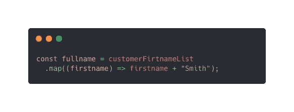

## **Array.forEach()**

这与 map()方法非常相似，它也对每个元素执行一次函数，只不过它在适当的位置改变了原始数组，而不是创建一个新数组。

**示例用例**

您希望打印列表中每个客户的姓名，并且不需要新的数组。

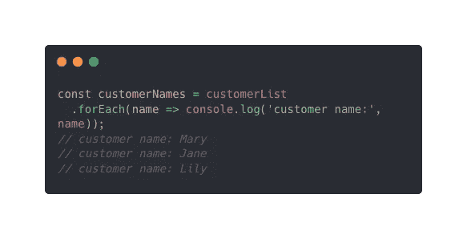

## **Array.reduce()**

Reduce 是最强大和最灵活的方法，因为它可以用来重新实现所有现有的数组方法，但它也是最难理解的。

reduce 方法接受两个参数:一个回调和一个初始值(`arr.reduce(callback, initialValue`)，回调接受 4 个参数，累加器、当前值、当前索引和初始值。简单地说，这个方法减少了返回一个值的数组。

由于谈论 reduce()方法的所有好处需要单独写一篇文章，所以我在这里只讨论两个有代表性的用例。

**示例用例**

1.  计算没有初始值的和

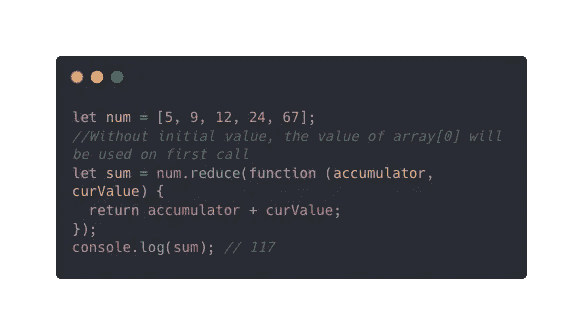

2.展平数组

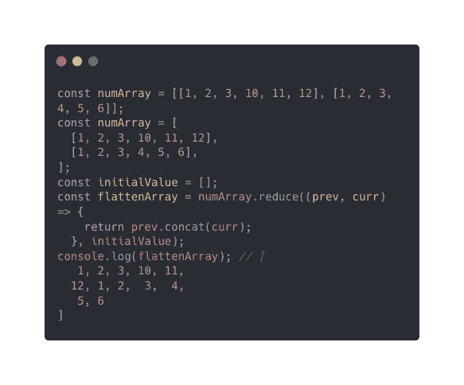

## **Array.filter()**

显然，当您需要过滤出值时，会使用 filter()方法。只需将测试函数作为回调函数传递，它将返回一个等于 true 的值来保留元素。

**示例用例**

假设您想从客户列表中删除一个特定的客户，Mary。因此，在回调中，您保留每个不等于 Mary 的名称。

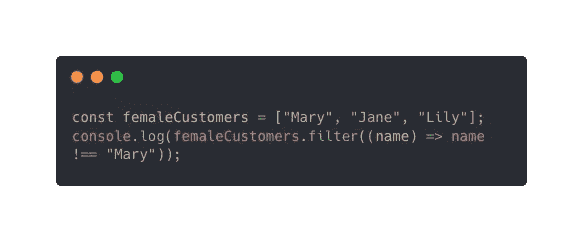

## **Array.sort()**

方法名已经说明了一切，它是用来对数组排序的。

**示例用例**

您有一个列出每个客户年龄的数组，您想按升序对它进行排序。

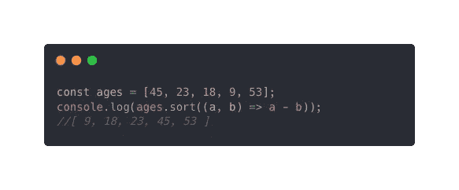

请注意，在没有回调的情况下使用 array.sort()将产生不同的结果，该结果仅参考第一个数字进行排序，而不是实际值。

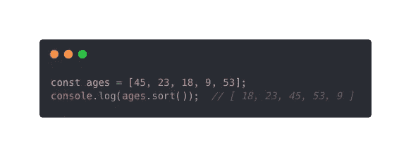

**includes()方法通过取值来确定数组是否包含某些元素。它返回一个布尔值。**

****示例用例****

**您想知道 Mary 是否包含在数组中。**

**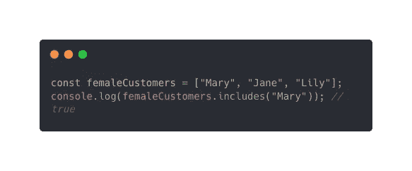**

## ****Array.find()****

**使用 find()方法，我们能够在一个数组中搜索一些东西。它接受一个测试函数，并返回所提供的数组中与条件匹配的第一个元素。换句话说，它不会返回满足测试的所有元素。**

****示例用例****

**您需要获得一个长度为四个字母的客户名称。**

**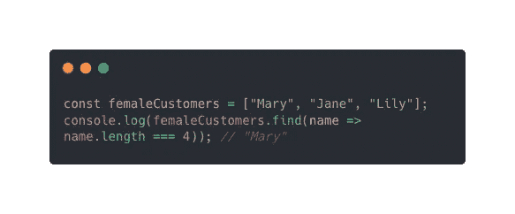**

## ****Array.indexOf()****

**这是另一种在数组中搜索内容的方法，但这次它返回的是索引。如果在数组中找不到该元素，则返回-1。**

****示例用例****

**你想确认 Jane 是否在你的客户名单上，这样你就可以给她定制的折扣。**

**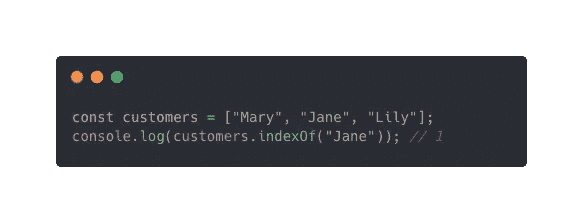**

## ****Array.some()****

**some()方法测试数组中是否至少有一个元素匹配特定条件。它不同于 includes 方法，因为它需要条件或测试函数，而不是值。如果满足条件，则返回 true，否则返回 false。**

****示例用例****

**当您希望检查是否至少有一个客户的名字以“s”开头时，可以使用此方法。**

**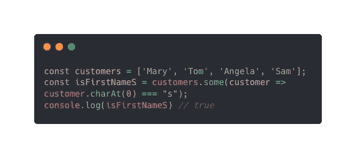**

## ****Array.concat()****

**当您想要合并两个或多个数组时，可以使用 contact()方法。**

****示例用例****

**您有两个数组，一个包含男性客户，另一个包含女性客户，现在您想要合并这些数组，以便一个数组包含所有客户。**

**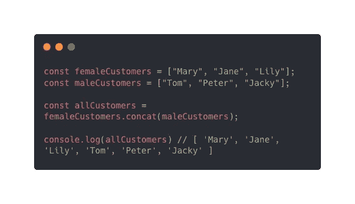**

**这个题目到此为止。感谢您的阅读。**

***更多内容请看*[***plain English . io***](https://plainenglish.io/)*。报名参加我们的* [***免费周报***](http://newsletter.plainenglish.io/) *。关注我们关于*[***Twitter***](https://twitter.com/inPlainEngHQ)[***LinkedIn***](https://www.linkedin.com/company/inplainenglish/)*[***YouTube***](https://www.youtube.com/channel/UCtipWUghju290NWcn8jhyAw)*[***不和***](https://discord.gg/GtDtUAvyhW) *。*****