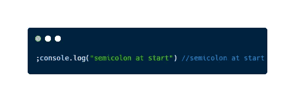
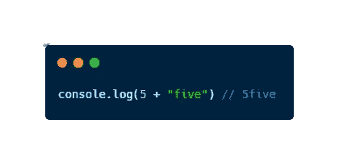
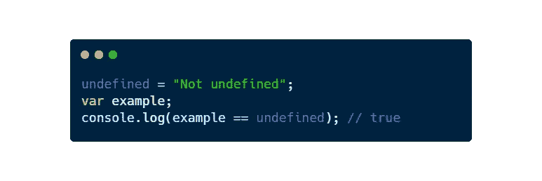
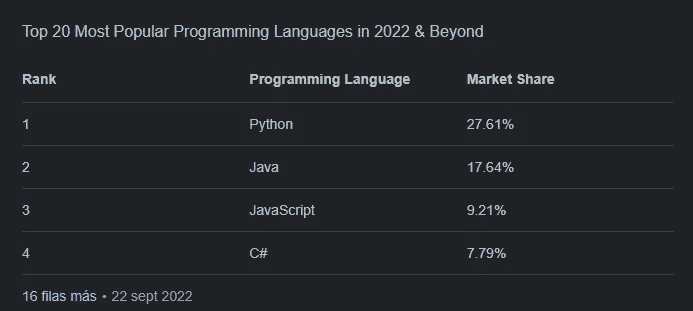
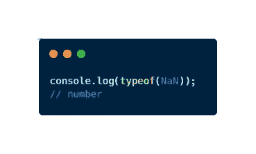
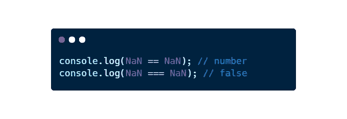
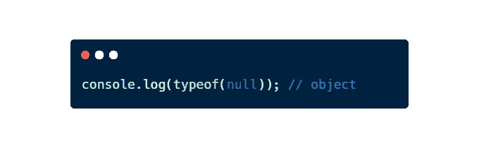
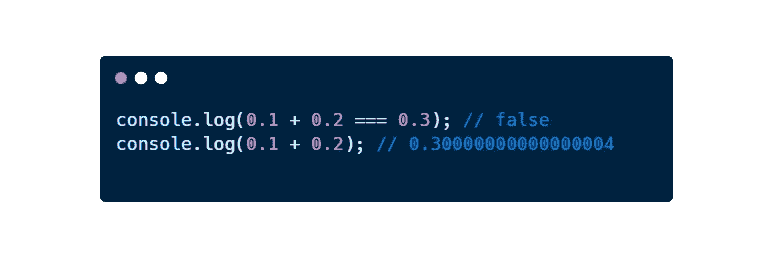

# 关于 JavaScript 你不知道的 10 个有趣事实

> 原文：<https://javascript.plainenglish.io/10-interesting-facts-about-javascript-you-didnt-know-7af83db4affa?source=collection_archive---------6----------------------->

## 发现这些你从来不知道的关于 JavaScript 的惊人事实，并改进你的代码

Photo by [Growtika Developer Marketing](https://unsplash.com/@growtika_developer_marketing_agency?utm_source=medium&utm_medium=referral) on [Unsplash](https://unsplash.com?utm_source=medium&utm_medium=referral)

目前，JavaScript 是网络开发最流行的语言之一。然而，自从它的第一个版本以来，它确实是一种奇怪的语言。它有一个非常有趣的故事，一路上有许多有趣的事实。

很可能你在过去开发个人项目或工作中使用过它。你可能认为你懂这门语言，但如果你能在会议中讲述有趣的事实(T4)，你就不会成为大师。

在本文中，我将重点介绍我发现的关于 JavaScript 的 10 个惊人事实。但是，要小心，因为当你读它们的时候，你会想立刻开始学习这门语言。

## 1.您也可以在行首使用分号

Using a semicolon at the beginning of a code line

## 2.你可以联系一个数字和一个字符串

Concatenating a number without parsing it

 [## 5 个可能已经存在于 JavaScript 代码中的代码味道示例

### 在当前的 JavaScript 代码中有 5 种代码味道。如果你想成为一名…

javascript.plainenglish.io](/5-code-smell-examples-that-are-probably-already-in-your-javascript-code-9292a9ba1f68) 

## 3.U `ndefined is not a reserved word`

Undefined is not a reserved word in JavaScript

## 4.JavaScript 是世界上第三大流行语言

Screenshot from first resulting Google

## 5.NaN(不是数字)是一个数字

NaN is a number

## 6.南不等于南

NaN is not NaN

 [## JavaScript 做的 5 件你无法解释的奇怪事情

### JavaScript 做的一系列奇怪的事情，我还无法解释

javascript.plainenglish.io](/5-strange-things-javascript-does-that-you-wont-be-able-to-explain-481a792862cf) 

## 7.Null 不是 null，是一个对象

Null is an object, not a null

## 8.JavaScript 并不精确

A mistake adding due to the precision of the JavaScript

## 9.JavaScript 是一个品牌

事实上，JavaScript 是甲骨文的注册品牌。如果你想了解更多[，你可以查看这个链接](https://tsdr.uspto.gov/#caseNumber=75026640&caseType=SERIAL_NO&searchType=statusSearch)。

## 10.它有一个亲戚叫 JScript

1996 年，微软开发了一种与 JavaScript 相关的叫做 JScript 的语言来与这种奇妙的语言竞争。可以想象，它为此目的失败了，JavaScript 赢了。

 [## 5 Chrome 扩展，让你在 2022 年成为更高效的网络开发者

### 使用这些有用的(免费的)Chrome 扩展，节省时间并提高开发人员的工作效率。

javascript.plainenglish.io](/5-chrome-extensions-for-being-a-more-productive-web-developer-in-2022-8d17de09ac2e) 

> *你在考虑买一个* [*中等会员*](https://medium.com/@jesuslagares/membership) *？如果你想在媒体上获得最好的内容，可以考虑使用我的推荐链接**[*。同样的价格，你会支持我的工作。*](https://medium.com/@jesuslagares/membership)*

# *结论👋*

*谢谢大家！非常感谢您阅读这篇文章。如果您想了解更多关于技术和发展的信息，请不要忘记**关注我**。我很想知道你对此的看法，所以不要花花公子**写在评论里**，我会读给你听。*

*如果这篇文章帮助你记住了，你可以**为它鼓掌**并与你的战友分享。*

# *关于作者🤓*

*嗨！很高兴见到你！我是**赫苏斯·拉加雷斯**。目前，我是一名后端软件工程师，正在加的斯大学完成我的计算机科学学位。*

*我的两大爱好是**技术**和**交流**，所以我会抓住一切机会谈论或撰写关于技术的文章。我喜欢把复杂的概念转换成每个人都能理解的简单概念。*

# *想要连接吗？📲*

*📸[**Instagram**](https://instagram.com/jesuslagares_)**|**💼 [**领英**](https://www.linkedin.com/in/jesus-lagares/) **|** 📹[Youtube](https://www.youtube.com/c/Jes%C3%BAsLagares)**|**🐦 [**推特**](https://twitter.com/jesuslagares_)*

*📩**jesuslagaresgalan@gmail.com***

*谢谢！❣️*

**更多内容请看*[***plain English . io***](https://plainenglish.io/)*。报名参加我们的* [***免费周报***](http://newsletter.plainenglish.io/) *。关注我们关于*[***Twitter***](https://twitter.com/inPlainEngHQ)[***LinkedIn***](https://www.linkedin.com/company/inplainenglish/)*[***YouTube***](https://www.youtube.com/channel/UCtipWUghju290NWcn8jhyAw)*[***不和***](https://discord.gg/GtDtUAvyhW) *。对增长黑客感兴趣？检查* [***电路***](https://circuit.ooo/) *。****