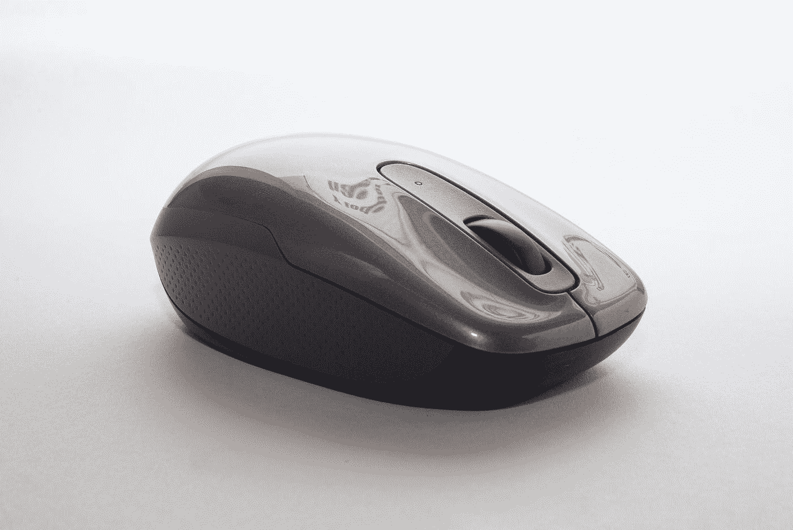

# 关于电脑鼠标你不知道的 10 个有趣事实

> 原文：<https://javascript.plainenglish.io/10-interesting-facts-you-dont-know-about-computer-mouse-948dca3f824c?source=collection_archive---------2----------------------->

## 咔嚓咔嚓咔嚓。

Photo by [Oscar Ivan Esquivel Arteaga](https://unsplash.com/es/@oscaresquivel?utm_source=medium&utm_medium=referral) on [Unsplash](https://unsplash.com?utm_source=medium&utm_medium=referral)

咔嚓咔嚓咔嚓。你听起来熟悉吗？

你答对了。我们今天谈论的是电脑鼠标。电脑输入设备让我们的生活变得简单多了。在此之前，在电脑鼠标发明之前，输入数据是一件令人厌烦的事情，需要用键盘输入命令。

你既不能否认电脑鼠标的贡献，也不能忽视它的重要性。此外，在单手鼠标的帮助下，你可以探索整个互联网世界。

今天，我将分享十个关于电脑鼠标的有趣事实，来欣赏它给我们的生活带来的价值。

让我们看看那些会让你大吃一惊的非常有趣的事实。

# **1。第一个电脑鼠标是木头做的**

20 世纪 60 年代初，道格拉斯·恩格尔巴特发明了第一只电脑鼠标。它远不同于我们现在使用的鼠标。

电脑鼠标的原型是由木头制成的。设计很简单:一个盒子，底部有两个轮子，只有一把钥匙。

当这种设备的使用增加时，公司已经出现了各种各样的设计。因此，现在大多数现代鼠标都是由塑料制成的。

# **2。鼠标有它的诽谤者**

我们知道历史上伟大的发明都被当代的批评家所阻挠。即使是现在，人们通常也不能接受改变。

在电脑鼠标发明的早期，电脑专栏作家约翰·c·德沃夏克(John C. Dvorak)写过一篇名为《没有证据表明人们想要使用这些东西》的文章。

现在你知道电脑鼠标有多有用了。然而，今天，人们取笑那些批评家，想知道他们在想什么。

# **3。老鼠狂怒是真实存在的**

你听说过老鼠狂怒吗？

一个自然现象是，当我们的电脑或鼠标无法响应或花费更多时间时，我们会变得暴力。甚至有时候，我们敢把鼠标往桌子上一扔，或者往桌子上一砸，就把它给毁了。

如果这种情况也发生在你身上，不要担心——没什么大不了的，只是一种消极的心理反应，会转变成情绪爆发。

# **4。名字一样的**

给老鼠命名有一段有趣的历史。发明者没有直接把它命名为“鼠标”。早期称之为“计算机辅助显示控制”。

后来在 1970 年，当恩格尔巴特获得专利时，他将其命名为“鼠标”。使用这个名称的原因是输入设备适合放在手掌下，由于背面有电线，它看起来像鼠标。

# **5。该设备在大多数国家被称为“鼠标”**

这种单手操作的输入设备在世界上大多数国家都有一个通用名称。在英语、德语、西班牙语、意大利语、俄语、法语和其他通用语言中，它被称为“鼠标”。

奇怪的是，如果你在大多数国家把这个设备称为“鼠标”，人们会认出你在说什么。

# **6。计算机鼠标速度以“Mickeys”衡量**

我们非常了解迪士尼的“米老鼠”这个角色，但我不是在谈论它。相反，米老鼠是一种计算计算机鼠标速度和移动方向的测量单位。

鼠标速度是光标在屏幕上持续移动的像素数和鼠标在鼠标垫上移动的厘米数之间的比例。

# 7 .**。点击鼠标就能燃烧卡路里**

坐在办公桌前燃烧一些额外的卡路里怎么样？听起来很可笑，但这是真的。点击鼠标就可以燃烧卡路里。

日本的一项研究证明，每次点击平均可以燃烧 1.42 卡路里。

你可能不想取消你的健身房会员资格，因为点击鼠标不应该代替锻炼。

# **8。一只或多只老鼠**

将“鼠标”一词复数化似乎很令人困惑。在现代用法中，小型啮齿动物的复数总是只有“老鼠”。

《牛津英语词典》规定，当你提到电脑鼠标时，复数形式可以是“鼠标”和“鼠标”

但是，如果你想安全起见，那么建议使用“鼠标设备”。

# **9。三种类型的鼠标**

市场上主要有三种类型的计算机鼠标。

*   **机械鼠标**:电脑鼠标的最早形态，内部有一个硬橡胶球。
*   **光电鼠标**:采用 LED 传感器技术的电脑鼠标的第二项发明。
*   **无绳/无线鼠标**:电脑鼠标的现代发明，使用无线电频率将其信号传输到您的电脑或笔记本电脑。

# **10。罗技卖出了超过 10 亿只鼠标**

从旅程的开始，许多公司制造鼠标。其中，微软、罗技、惠普、雷蛇值得一提。随着电脑鼠标的使用大量增加，顶级品牌之间产生了竞争。

开发电脑鼠标的先驱罗技公司在 20 世纪 80 年代开始了它的旅程。从那时起，罗技已经向全球 100 多个国家出售了电脑鼠标。早在 2008 年，该公司宣布已经售出第 10 亿只鼠标。

**最后的话**

瞧啊。现在你知道了一些关于电脑鼠标的有趣事实。

最后，我想说，我们不能否认这个输入设备的贡献。毫无疑问，鼠标的易用性是首屈一指的。感谢恩格尔巴特的革命性发明。

这 10 个事实你觉得哪个更有意思？让我们知道你的意见。

*感谢阅读！如果你想支持我，* [***加入我吧！***](https://thefemaleprogrammer.medium.com/membership)

*更多内容请看*[***plain English . io***](https://plainenglish.io/)*。报名参加我们的* [***免费周报***](http://newsletter.plainenglish.io/) *。关注我们关于*[***Twitter***](https://twitter.com/inPlainEngHQ)*和*[***LinkedIn***](https://www.linkedin.com/company/inplainenglish/)*。查看我们的* [***社区不和谐***](https://discord.gg/GtDtUAvyhW) *加入我们的* [***人才集体***](https://inplainenglish.pallet.com/talent/welcome) *。*