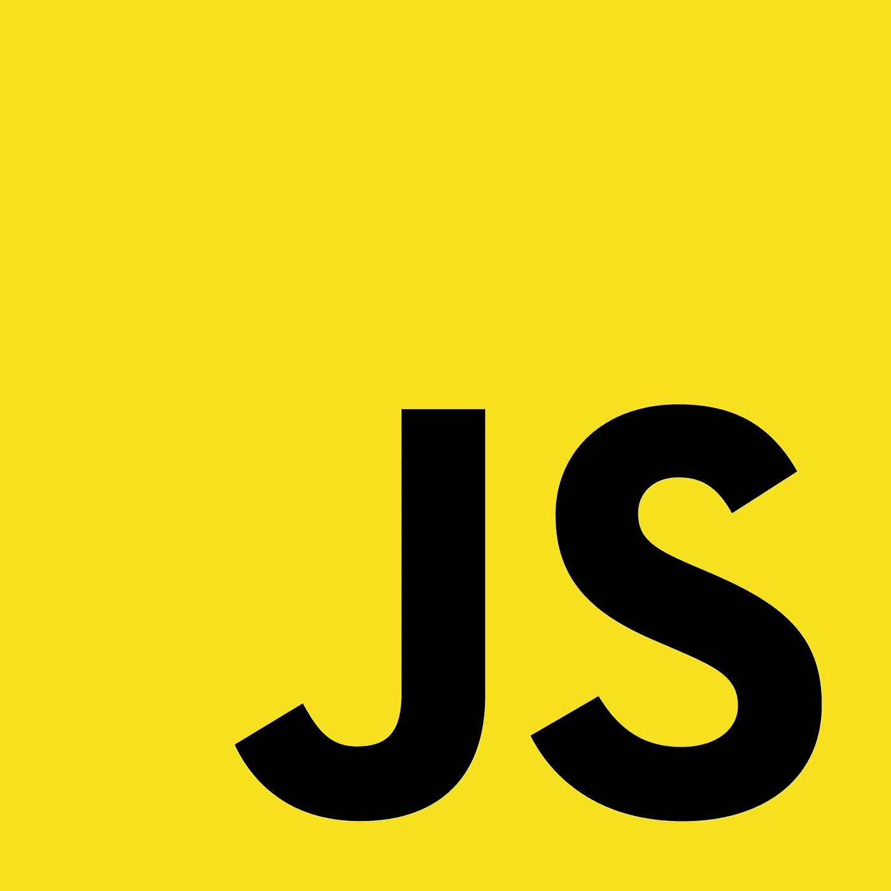

# 让你成为更好的开发者的 10 个 JavaScript 技巧和诀窍

> 原文：<https://javascript.plainenglish.io/10-javascript-tips-and-tricks-to-make-you-a-better-developer-22151defad04?source=collection_archive---------8----------------------->

## 让你成为更好、更灵活、更快的开发者的顶级 JavaScript 技巧和诀窍。

stackoverflow.com 年度开发者调查告诉我们，JavaScript 是世界上最流行和最常用的编程语言。这是因为他在大多数可能的用例中有很大的灵活性。因此，毫无疑问，如今学习 JavaScript 几乎是必须的。以下是 10 大 JavaScript 技巧和窍门，它们会让你成为这种不可思议的语言的更好、更灵活、更快的开发者。你准备好成为一名更好的 JavaScript 程序员了吗？我们开始吧。



Javascript

1.  **用三重等号(===)代替双等号(==)**

为什么？几乎所有其他编程语言都使用双等号。JavaScript 则不同。==运算符在操作数的类型之间执行自动转换，因此即使它们不同，它也能判断出它们是相同的。另一方面，===检查操作数是否相同。例如，这里有一些按照这个逻辑的输出:

```
[10] === 10 // false
[10] == 10  // true
[] == 0     // true
[] ===  0   // false
'' == false // true 
'' ===false // false
```

因此，当您得到一个字符串输入，并且您想要检查是否与给定的整数相同时,==运算符会很有用。在所有其他用例中，strict ===操作符要好得多，也更可信。因此，确保使用正确的等式检查器。

2.**创建自呼功能**

如果你想创建一个函数并立即调用它，有一个非常简单的方法，那也是非常简洁的。为什么要在定义了函数之后才调用它呢？它在代码测试期间非常有用，而且当您想要立即调用您刚刚编写的代码片段时也非常有用。所以，要做到这一点，你必须在最后一个花括号结束后放两个括号，并把所有需要的参数放在里面。这里有一个代码示例: `(function(a,b){return result;})(10,20)`

这里是全部，只有行尾的几个字符。这在调试中也可能是危险的，所以一定要记住函数在它被定义的确切时间运行。如果你运行程序，看到一些事情发生，但不知道为什么很难捕捉到。因此，为了避免这种情况，我们直接跳到下一个技巧

**3。在代码中写注释**

注释是代码中非常重要的一部分。新手经常问为什么。解释器不执行注释，他们认为注释几乎是浪费空间。事实是，注释对于创建良好的代码和增强可读性至关重要。想想:今天是星期三，你不想再编码了。你可以写一个注释，放到你停下来的地方，这样到了周一，你就能正常重启了。然后，如果你写了一些复杂而棘手的代码，注释可以帮助未来的你自己记住写这些代码的动机和原因。代码也是你写的代码的第一个文档，在一个团队项目中，无论大小，如果没有注释让其他人知道你应该写什么，这几乎是不可能的。如果你去看看像 React 这样的开源项目，你会注意到代码库的注释可能比代码多。所以，你需要对你的代码进行注释。此外，代码中未使用的部分可以被注释掉，因此如果将来需要，可以重用它们(这几乎是一种编程迷因)。下面是单行注释和多行注释的语法:

`//this is a single line comment`

`/*this is a multi-line comment*/`

**4。在一行中创建一个从 0 到 max 的数字数组**

这对于拥有从 0 到最大数的所有数字的数组是有用的，对应于数组的长度。当你需要一个排序的数组时，这是很有用的，这种情况并不常见。不管怎样，代码如下:

```
let numbersArray = [] , max = 100;

for( var i=1; numbersArray.push(i++) < max;)
```

请记住，这段代码最酷的地方在于它简洁而灵活，就像几乎所有的 Javascript 一样。因此，您可以很容易地修改代码来推送一个随机数或其他任何东西。这段代码的要点和真正的诀窍在于它只有一行，所以很棒。

**5。将一个数组追加到另一个数组**

这个功能很有用。你可以认为你有一个包含数据的数组，但是通过调用一个 API(应用程序编程接口)你获得了一个新的数组，你必须将它们融合在一起。怎么做呢？最好不要用一个又慢又贵又不好看的循环，当有这个无比简单又强大的函数:
`Array.prototype.push.apply(array1, array2);`

那么，array1 将等于这两个 1 融合后得到的数组。难以置信。

**6。清空一个数组的正确方法，也是比较便宜的方法**

这种情况经常发生，我们需要从他的内容中清除和排列，但通常，我们编写的代码是这样的:

`array = [];`

这是一个不错的工作方式。但是很贵。这是因为解释器需要删除数组中的所有内容，并用一个空结构来替代。这是一件相当烦人的工作。有一种更简洁的方法可以做到这一点，这也是一种对解释器来说更省力的操作。这是:

`array.length = 0;`

这样数组的长度为 0，解释器不需要删除重写任何东西。只有当有一个有效的改变时，它才会这样做，只需要另一种方式所需操作的一半

**7。三元运算符**

这是 if 检查的一行替代方法，工作方式相同，更好看，在代码空间中也更有效。但是，什么是三元算子呢？是有三个运算符的运算。首先是一个条件。如果条件为真，则表达式的值为第二个运算符，否则为第三个运算符。下面是一个带有解释的代码示例:

`value = condition ? trueCase : falseCase;`

`value = 4 > 3? "four is bigger" : "three is bigger";`

因此，如果四大于三(真)，变量值为值`"four is bigger",`否则为`"three is bigger"`。因此，在这种情况下，第一种选择。

**8。将函数映射到数组**

如果您想对数组的所有元素执行某种类型的操作，map 函数是执行该操作的最佳方式，可以避免其他循环并使代码更简洁。这里有一个例子:

```
elevation = [1,2,3,4].map(function (val) {  
    return val * val;  
}); 
// output : [1, 4, 9, 16]
```

**9。在循环外使用 Try-Catch**

最好将循环嵌套在 try-catch 中，而不是相反。这就是为什么在开始迭代之前检查一次条件比在开始执行之前检查一次要便宜的原因。这将会导致问题，还会因为无所事事而消耗资源。因此，下面是您应该避免的代码:

```
let obj = ['foo', 'bar'], i;  
for (i = 0, len = obj.length; i <len; i++) {  
    try {  
        // code
    }  
    catch (e) {   
        // code  
    } 
}
```

这里是你应该使用的:

```
let obj = ['foo', 'bar'], i;  
try { 
    for (i = 0, len = obj.length; i <len; i++) {  
        // code 
    } 
} 
catch (e) {   
    // code 
}
```

**10。使用字母，而不是变量**

这不会直接影响你的代码，但是 let 更有效，也更现代。Let 阻止了作用域。这意味着，如果在函数中定义 with let，那么该变量将只存在于该函数中。所以，在其他函数上，你可以用相同的名字创建不同的变量。对于 var，你不能，因为它是有作用域的。这意味着如果你用 var 创建了一个变量，你就不能在其他情况下，在函数内部使用这个变量名。这可能会很烦人。所有其他编程语言都倾向于阻塞作用域变量，这也是因为作用域变量导致了许多难以捕捉的错误和问题的产生。因此，请避免这种情况:

```
var num = 3;
```

这样做:

```
let num = 3;
```

**结论**

Javascript 是几乎可以创造一切的编程语言。这只取决于你的能力和对它的了解。所以，试着学习这些小技巧，让你的代码更干净，也更有效率。这是编写令人惊叹的代码和应用程序的关键。

如果您对更多 JavaScript 相关内容感兴趣，请关注我。

感谢阅读。

这里还有一些与 Javascript 相关的文章:

JavaScript 框架:

[](/javascript-most-famous-libraries-and-framework-in-2022-90c6560f5ca4) [## 2022 年最著名的 JavaScript 库和框架

### JavaScript 库和框架及其多种用例。

javascript.plainenglish.io](/javascript-most-famous-libraries-and-framework-in-2022-90c6560f5ca4) 

Java 与 JavaScript:

[](/java-vs-javascript-are-they-the-same-88bbacd03386) [## Java 和 JavaScript:它们是一样的吗？

### 在这个世界上，编程语言有各种各样的形式和大小，而我们只知道最著名的语言的名字…

javascript.plainenglish.io](/java-vs-javascript-are-they-the-same-88bbacd03386) 

反应与角度:

[](/java-vs-javascript-are-they-the-same-88bbacd03386) [## Java 和 JavaScript:它们是一样的吗？

### 在这个世界上，编程语言有各种各样的形式和大小，而我们只知道最著名的语言的名字…

javascript.plainenglish.io](/java-vs-javascript-are-they-the-same-88bbacd03386) 

布伦丹·艾希:

[](/brendan-eich-the-father-of-javascript-f5baaae43a60) [## 布兰登·艾希:JavaScript 之父

### 在编程领域，有很多重要的人物，他们在这个世界上设计了一些不可思议的东西…

javascript.plainenglish.io](/brendan-eich-the-father-of-javascript-f5baaae43a60) 

全栈 JavaScript:

[](/is-javascript-enough-to-make-yourself-a-fullstack-developer-c2ba0f1e8f07) [## JavaScript 足以让自己成为全栈开发者吗？

### 了解 JavaScript 基础知识及其主要框架会让你成为全栈开发人员吗？你应该投资时间在…

javascript.plainenglish.io](/is-javascript-enough-to-make-yourself-a-fullstack-developer-c2ba0f1e8f07) 

Python VS JavaScript:

[](/python-vs-javascript-e8590d346c3b) [## Python 与 JavaScript:两种最流行的编程语言的比较

### 两种最重要的编程语言的历史和特点

javascript.plainenglish.io](/python-vs-javascript-e8590d346c3b) 

*更多内容请看*[***plain English . io***](http://plainenglish.io/)*。报名参加我们的* [***免费周报***](http://newsletter.plainenglish.io/) *。在我们的* [***社区***](https://discord.gg/GtDtUAvyhW) *获得独家获得写作机会和建议。*