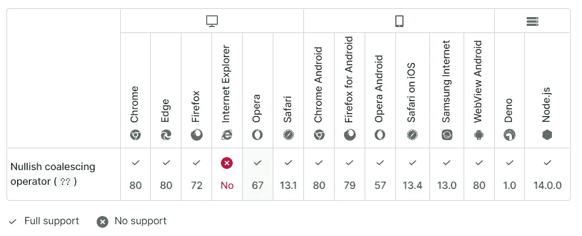
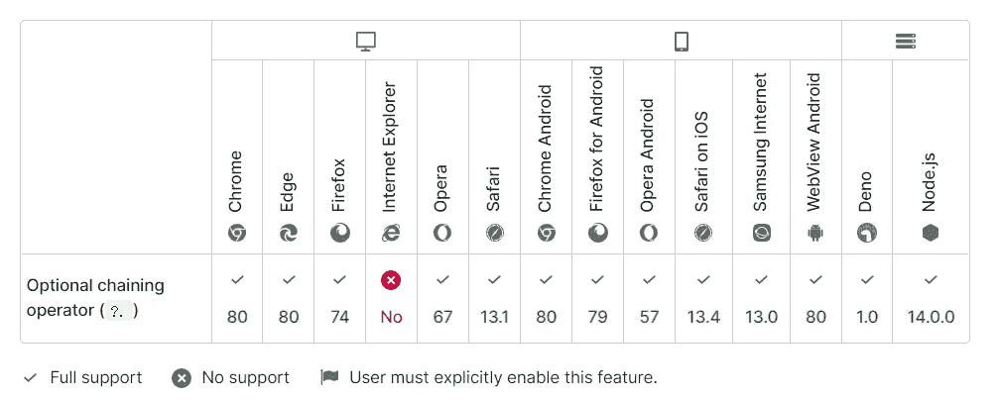
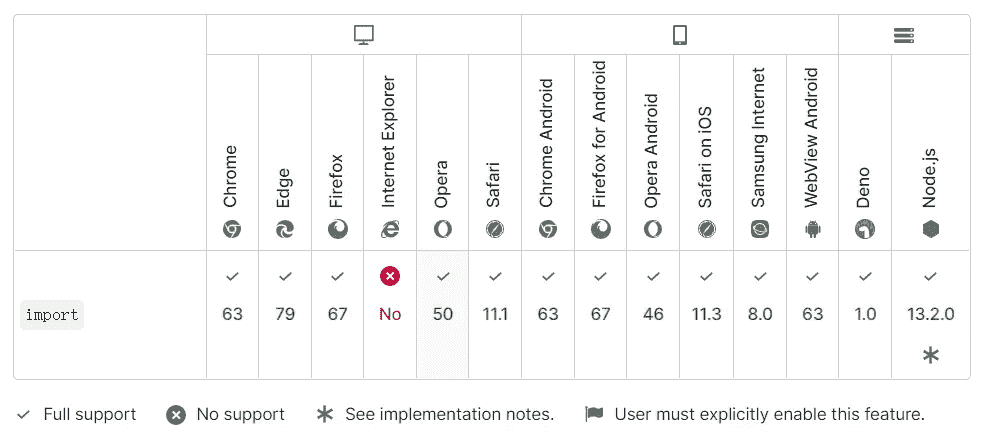
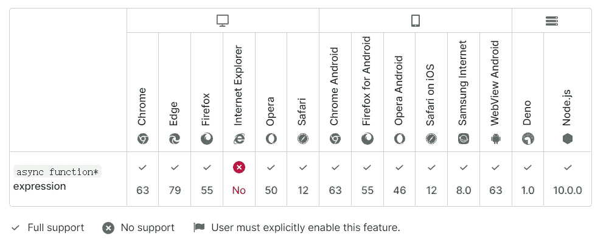
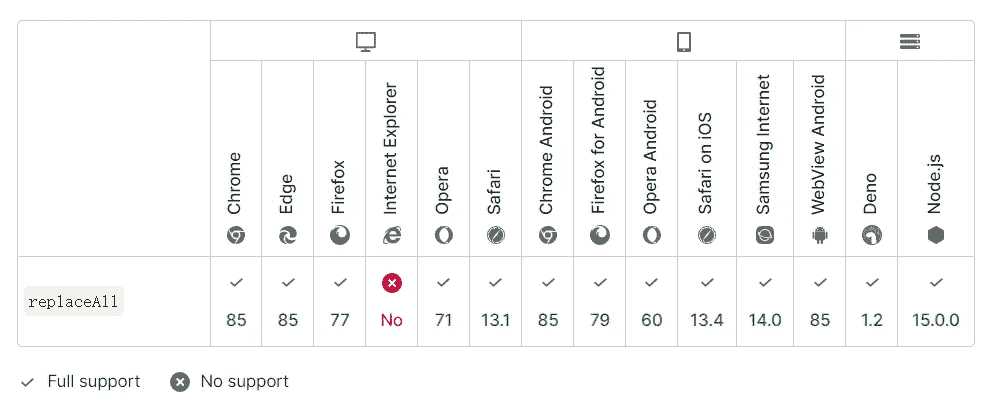
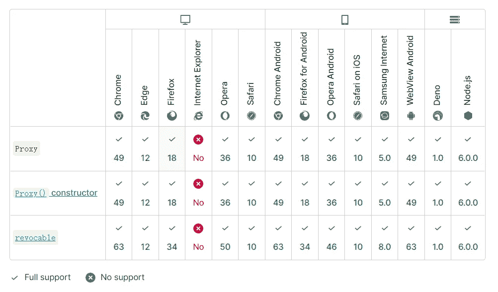
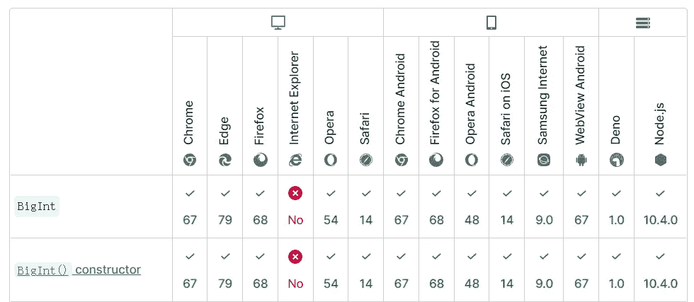
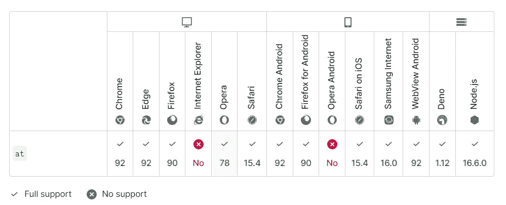

# 2022 年前端开发人员应该知道的 10 个 JavaScript 技巧

> 原文：<https://javascript.plainenglish.io/10-javascript-tricks-front-end-developers-should-know-in-2022-ee6c8cb8767c?source=collection_archive---------5----------------------->

## 这些技巧有助于提高您的 JavaScript 开发效率。


Photo by [Artem Sapegin](https://unsplash.com/es/@sapegin?utm_source=medium&utm_medium=referral) on [Unsplash](https://unsplash.com?utm_source=medium&utm_medium=referral)

**你知道 *0 的值吗？？1***

你好！今天我们将讨论一些你应该在 2022 年了解的新功能！

现在前端发展很快，各种技术和框架层出不穷，百花齐放，很多人都在喊学不下去了！JavaScript 是主要的前端语言，虽然它发展很快，每年都有新的功能出现，但 JavaScript 开发人员发展更快，因为许多相对较新的功能采用率很高！

以下是一些高采用率的新功能和 2022 年你应该知道的 10 个 JS hacks。

## **1。？？**

**使用？？而不是||在将值返回到右边之前，确定运算符左边的值是 null 还是未定义。**
那个？？运算符是由 ES2020 引入的，也称为 Nullish 合并运算符。

其行为类似于||但更严格。

||运算符将左侧后面的值作为空字符串或 false 值(如 false 或 0)返回。那。？运算符左侧必须为空或未定义，才能在右侧返回值。所以 0 || 1 导致 1 和 0？？1 产生 0。

举个例子，

[](https://developer.mozilla.org/en-US/docs/Web/JavaScript/Reference/Operators/Nullish_coalescing_operator) [## 零化合并算子(？？)- JavaScript | MDN

### 早些时候，当一个人想给一个变量赋一个默认值时，一种常见的模式是使用逻辑 OR 运算符…

developer.mozilla.org](https://developer.mozilla.org/en-US/docs/Web/JavaScript/Reference/Operators/Nullish_coalescing_operator) 

## 2.**？。**

**使用？。简化& &和三元运算符
？。ES2020 也推出了，称为可选链接运算符。**

？。以确定左边的对象是空的还是未定义的。如果是，它不会向下运行并返回 undefined。如果没有，它返回右边的值。

举个例子，

注意:常见的写法

[](https://developer.mozilla.org/en-US/docs/Web/JavaScript/Reference/Operators/Optional_chaining) [## 可选链接(？。)- JavaScript | MDN

### 可选的链接操作符提供了一种在可能的情况下简化通过连接对象访问值的方法…

developer.mozilla.org](https://developer.mozilla.org/en-US/docs/Web/JavaScript/Reference/Operators/Optional_chaining) 

## 3.使用动态导入()按需加载(优化静态导入)

我们可以使用 import 语句初始化来加载依赖项。

```
import defaultExport from “module-name”;
import * as name from “module-name”;
//…
```

但是静态引入的导入语句依赖于`type=“module”`脚本标签，有时我们希望能够根据条件按需加载模块，例如以下场景:

*   当静态导入的模块明显降低了代码的加载速度，被使用的可能性很低，或者不是立即需要时。
*   当很明显静态导入的模块占用了大量系统内存并且不太可能占用时。
*   当导入的模块在加载时不存在，需要异步获取时。
*   当导入的模块具有仅在某些条件被触发时才需要的副作用时。

此时，我们可以使用 import()的动态引入，它可以像函数一样用在各种地方，并返回一个承诺。

使用了两种形式。

[](https://developer.mozilla.org/en-US/docs/Web/JavaScript/Reference/Operators/import) [## 导入- JavaScript | MDN

### 导入声明语法(从“某处”导入某物)是静态的，并且总是导致导入的…

developer.mozilla.org](https://developer.mozilla.org/en-US/docs/Web/JavaScript/Reference/Operators/import) 

## 4.用顶级 await 简化异步函数

事实上，上面的代码对以下方面很有用:

```
let module = await import(‘/modules/my-module.js’);
```

顶级 await 允许开发人员在异步函数之外使用 await 字段。

因此，

[](https://developer.mozilla.org/en-US/docs/Web/JavaScript/Reference/Operators/async_function*) [## 异步函数*表达式- JavaScript | MDN

### 函数名。可以省略，在这种情况下，该函数是匿名的。该名称仅适用于该函数…

developer.mozilla.org](https://developer.mozilla.org/en-US/docs/Web/JavaScript/Reference/Operators/async_function*) 

## 5.使用 String.prototype.replaceAll()简化 replace 以一次替换所有子字符串。

String.prototype.replaceAll()类似于 String.prototype.replace()。但是 replace 只替换子串的第一个匹配项，而 replaceAll 替换所有匹配项。

例如，要用 Ahui 替换所有 a:

[](https://developer.mozilla.org/en-US/docs/Web/JavaScript/Reference/Global_Objects/String/replaceAll) [## string . prototype . replace all()-JavaScript | MDN

### replaceAll()方法返回一个新字符串，其中所有匹配的模式都被替换。该模式可以…

developer.mozilla.org](https://developer.mozilla.org/en-US/docs/Web/JavaScript/Reference/Global_Objects/String/replaceAll) 

## 6.使用代理代替 Object.defineProperty

为什么要用 Proxy 而不是 Object.defineProperty？简单总结一下代理的几个优点:

*   代理是整个对象的代理，是一个对象，defineProperty 只能代理某个属性。
*   代理可以侦听添加到对象中的新属性，而 Object.defineProperty 不能。
*   代理可以侦听数组的新更改，但 Object.defineProperty 不能。
*   如果对象内部的所有属性都要递归代理，那么 Proxy 只能在被调用时递归，而 Object.definePropery 需要一次完成所有的递归，这比 Proxy 更糟糕。
*   代理本质上是一个构造函数，它从头开始生成一个对象，并接受两个参数。
*   目标是要拦截的目标对象(代理)。
*   处理程序用于定制拦截行为(13 种)。

比如响应式反应式的基本实现。

[](https://developer.mozilla.org/en-US/docs/Web/JavaScript/Reference/Global_Objects/Proxy) [## 代理- JavaScript | MDN

### 代理对象允许您创建一个可以用来代替原始对象的对象，但是它可能…

developer.mozilla.org](https://developer.mozilla.org/en-US/docs/Web/JavaScript/Reference/Global_Objects/Proxy) 

## 7.Promise.any 快速获得一组 Promise 实例中第一个实现的承诺。

Promise.any 将一组 Promise 实例作为参数。

*   一旦其中一个承诺成功，它就返回已经成功的承诺。
*   如果 iterable 对象集中的承诺都不成功，则返回一个失败的承诺和一个 AggregateError 类型的实例。
    推荐的写法:

## 8.使用 BigInt 支持大整数计算问题

**ES2020 引入了一种新的数据类型 BigInt，用来表示任意位数的整数。**

举个例子，

除了使用 BigInt 来声明大整数之外，您还可以使用后跟 n 的数字，其形式为:

```
1234 // ordinary integer
1234n // BigInt
```

您需要了解对 BigInt 数值运算的支持，以避免陷入这个陷阱。

[](https://developer.mozilla.org/en-US/docs/Web/JavaScript/Reference/Global_Objects/BigInt) [## BigInt - JavaScript | MDN

### 一个 bigint 值，有时也叫做 BigInt，是一个 BigInt 原语，通过在一个…

developer.mozilla.org](https://developer.mozilla.org/en-US/docs/Web/JavaScript/Reference/Global_Objects/BigInt) 

## 9.使用 Array.prototype.at()简化 arr.length

**Array.prototype.at()取一个正整数或负整数作为参数来获取指定位置的成员**

参数的正数表示向下的第一个数字，负数表示向下的第一个数字，这对数组末尾的元素非常方便。

[](https://developer.mozilla.org/en-US/docs/Web/JavaScript/Reference/Global_Objects/Array/at) [## array . prototype . at()-JavaScript | MDN

### at()方法接受一个整数值并返回该索引处的项目，允许使用正整数和负整数…

developer.mozilla.org](https://developer.mozilla.org/en-US/docs/Web/JavaScript/Reference/Global_Objects/Array/at) 

## 10.使用散列前缀#使类字段私有

类中由散列前缀#标记的字段将是私有的，不会被子类实例继承。

## 最后

许多用户目前正在使用许多新功能，尤其是**？？**和**？。**和**导入()**引入；我想知道你用过哪些？

嗯，以上信息构成了文章的内容；如果有任何错误，请让我知道。

**请关注我阅读更多优质文章。**

*更多内容看* [***说白了。报名参加我们的***](https://plainenglish.io/) **[***免费周报***](http://newsletter.plainenglish.io/) *。关注我们上* [***推特***](https://twitter.com/inPlainEngHQ)[***LinkedIn***](https://www.linkedin.com/company/inplainenglish/)*[***不和谐***](https://discord.gg/GtDtUAvyhW) *。****