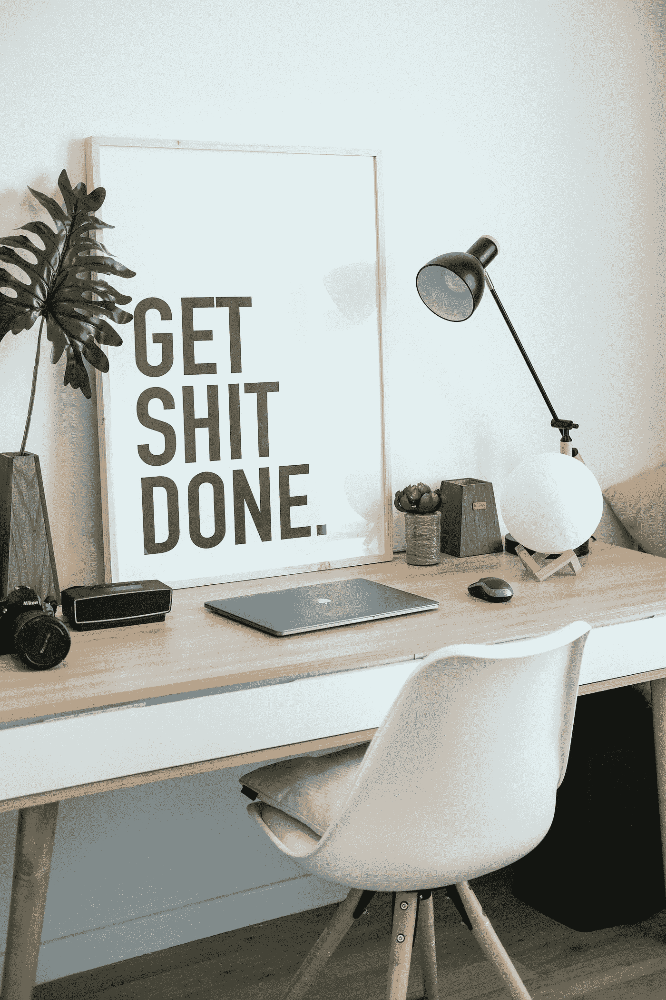

# 软件开发人员的 10 个黑仔生产力技巧

> 原文：<https://javascript.plainenglish.io/10-killer-productivity-tips-for-software-developers-6e5e434c8c7b?source=collection_archive---------15----------------------->

productivity

你好！你好！你好！你在听吗？我为你提供了一些提高工作效率的好建议。我知道大多数开发人员都在努力工作，我也见过很多人整日整夜地工作，但是你有没有分析过你的工作，你所做的事情是否富有成效？

你是否足够聪明，能够快速完成任务，有效地处理工作？

对于一个 2-3 小时的任务，如果你花了 15-16 小时，那么说真的，你需要注意你的工作。我没有责备你，我只是让你知道事实，并指导你如何改进。

通过花一点时间阅读这篇文章，我相信您会找到一种高级的编码方式。

## 态度

是的，我的朋友，态度决定一切。首先，改变你对工作的态度。记住一件事:你的工作是你的上帝，不要玩那个。如果你不喜欢你的工作，你仍然需要热爱你的工作，因为是工作养活了你。对于你的工作，你不应该有任何犹豫。对于每天的任务，不管你在做什么，把它当成一个挑战，带着“我能行”的态度去做。

## 观看本杰明·哈代的视频

好吧，毫无疑问，我知道——有很多鼓舞人心的导师。本·哈迪是一位权威的临床医生，他的工作以实用性为中心。我们指的就是这个，对吧？在很长一段时间里，他是媒体的顶级创造者，他上过《福布斯》、《财富》、《NYT》和《哈佛商业评论》。他有大量重要的 10-15 分钟的 YouTube 录像。他的核心问题之一是“光有决心是不够的。”如果你不经常开玩笑说自己有用，你会希望以此为中心来计划你的一天。

## 区分任务的优先顺序

出色地制作了艾森豪威尔矩阵。这里的目标是提升你工作的价值。不是每个人都可以委派任务，有些任务并不可怕或重要，但最终还是应该完成。专注于你今天想做的事情。明天——做完全相同的事情，制定另一个日程。

## 还有一点

顺从你的艾森豪威尔矩阵，让你自己知道你只需要做“另一件事”试着继续让自己知道这一点。最长的旅程始于孤独的前行。你需要一次专注于一项任务。你越是准备说服自己去做另一件事，当你加速时，再做一件事就变得越简单。你只需要依次关注每一件事。简而言之就是这样。

## 有效地使用您的 IDE

了解更多关于您正在进行编码的开发环境，看看如何在自动化的帮助下优化您的时间。如果你正在使用 VS 代码，那么会有很多很棒的扩展来提高你的生产力。保持更新，像专业人士一样使用代码编辑器。

可以上[https://coder fact . com/blog/top-10-visual-studio-code-extensions-for-web-developers/](https://coderfact.com/blog/top-10-visual-studio-code-extensions-for-web-developers/)看看

## 否定

学会如何说“不”。不要在已经超负荷的情况下接任务。如果你负担过重，和你的主管或 Scrum Master 谈谈，看看 8 层楼的要点任务是否可以委托给另一个开发人员。这需要机智。每次你不想写代码的时候，你都不能要求别人帮你写。从各方面考虑，你可以，但这可能不是你最大的优势。然而，高级开发人员确实经常会变得负担过重。熟悉如何优雅地说“不”的技巧是它自己的秘诀。

## 改变你的思维过程

无论你正在做什么或者将要做什么，首先要设计，考虑如何去做，然后开始编码。大多数时候，开发人员都是盲目地开始编码，然后如果出现任何问题，就需要重新开始努力工作。所以在代码设计之前。如果你拿纸笔画一个逻辑的图表或轮廓会更好。

## 分解任务

把复杂的大任务分成小部分，不要想太多复杂的问题，把它分解，试着解决一小部分，最后你会看到它完成了。大多数开发人员把时间浪费在考虑更大的任务上，从而失去了动力。放轻松，开始执行小任务，你就能实现目标。

## 计算指标

你在追踪你的生产力吗？你在关注你的时间吗？你知道我们每天有 1440 分钟吗？你明智地投资了吗？如果答案是“不”,那就开始做吧，检查你宝贵的每一分钟，做个笔记，计算一下花在哪里，适当地记录下来。

## 心怀感激

在一天结束的时候，对自己表示感激，庆祝你已经取得的成就，不要气馁。不要考虑别人，坚持做自己，每天都做一个更好的自己。当生活真的很糟糕的时候，当你不想编码、调试、重构，甚至不想审查代码的时候——想想如果你不是开发人员，生活会是什么样子。看看世界上最危险的工作。你现在的处境好多了。所以不要担心，永远开心，

我相信你总有一天会成功的。专注于每一刻。你应该高兴——但是要记住！不要仅仅满足于现在的职位。能够接受新的挑战，你应该感到高兴，也有些不满足。

感谢您花宝贵的时间阅读这篇文章。如果你喜欢这个，请在这里以及在[推特](https://twitter.com/callback_suman)上关注我。

*更多内容请看*[***plain English . io***](http://plainenglish.io/)*。报名参加我们的* [***免费周报***](http://newsletter.plainenglish.io/) *。在我们的* [***社区***](https://discord.gg/GtDtUAvyhW) *获得独家获得写作机会和建议。*