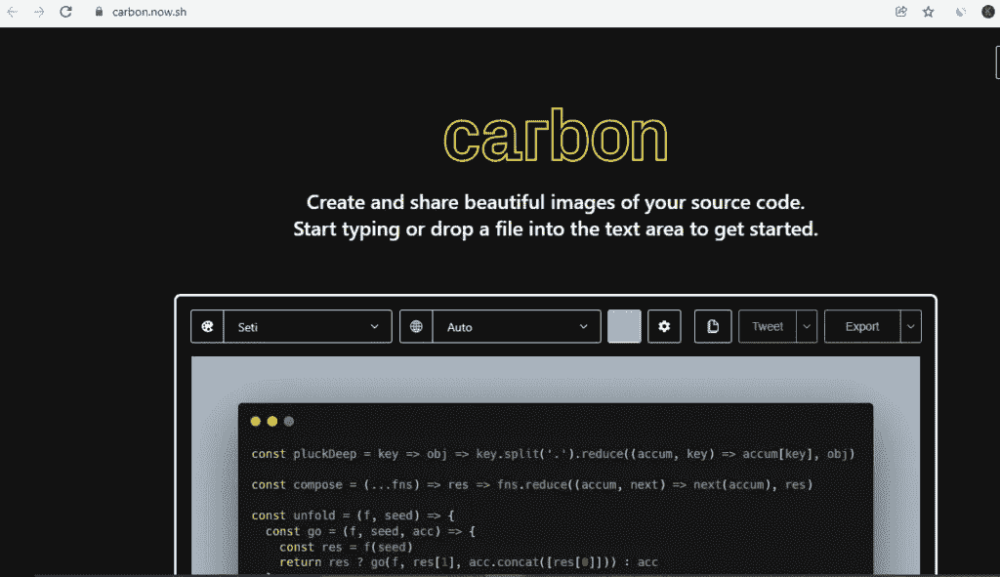

# 10 款黑仔网络应用将提高你的工作效率

> 原文：<https://javascript.plainenglish.io/10-killer-web-apps-that-will-increase-your-productivity-881e77766379?source=collection_archive---------1----------------------->

高效的网络应用

现代世界充满了令人分心的事物。你能坚持多久不检查手机？现在有这么多的应用程序和网站，很难不感到不知所措！但是伴随着所有这些选择而来的是机会——如果我们花时间去发现在我们的个人生活或职业努力中什么最适合我们，那么成功将会比以前容易得多。所以我列出了一些有用的生产力应用程序，让你的生活更轻松。

**1。** [**CSSGradient**](https://cssgradient.io/gradient-backgrounds/)

最好的渐变网站都在一个地方。在这里，你可以从渐变网站的最终列表中发现各种渐变背景。1000+渐变，轻松找色！

**2。**[**neu morphism . io**](https://neumorphism.io/#e0e0e0)

CSS 代码生成器，将有助于颜色，渐变和阴影，以适应这种新的设计趋势，或发现其任何形状的可能性。

3. [Animista](https://animista.net/)

这是一个 CSS 动画库，你可以在这里玩现成的 CSS 动画，并且只下载那些你会用到的。

**4。** [**FontJoy**](https://fontjoy.com/)

Fontjoy 帮助设计师选择最佳字体组合。混合搭配不同的字体，实现完美搭配。

**5。** [**标识 Ipsum**](https://logoipsum.com/)

当你渴望得到一个占位标志时，就使用 logo Ipsum 吧，它提供了大量的选择和不同的 Logo 方案来满足你的需求。

6。 [**碳**](https://carbon.now.sh/)

在 Carbon 的帮助下，你可以创建和分享你的源代码的漂亮图片。开始键入或将文件放入文本区域即可开始。

**7。**[**readme . so**](https://readme.so/)

这个编辑器帮助您快速生成自述文件，使用 markdown 编辑器和模板可以轻松地为您的项目创建自述文件。

**8。**[**favicon . io**](https://favicon.io/)

有了它，你只需点击几下鼠标，就可以从文本、图像或表情符号中创建一个 favicon。

**9。**T2**纯洁**

免费的工具来解包 JavaScript、CSS、HTML、XML 和 JSON 代码，使其可读且美观。

**10。**[**compressor . io**](https://compressor.io/)

它是最快速和最有效的图像压缩器，具有用户友好的用户界面。

如果你喜欢这篇文章，请跟随并分享来激励我。

*原为发表于*[*https://coderfact.com*](https://coderfact.com/blog/10-killer-web-apps-that-will-increase-your-productivity/)*。*

请在推特上关注我 https://twitter.com/callback_suman T21。

*多内容见于* [***中。注册参加我们的***](http://plainenglish.io/) **[***免费周报***](http://newsletter.plainenglish.io/) *。在我们的* [***社区纠纷***](https://discord.gg/GtDtUAvyhW) *中获得独家写作机会和建议。***