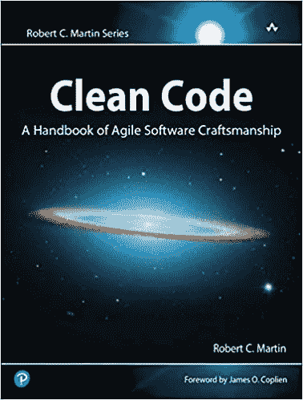

# 每个开发人员都应该阅读的 10 本改变人生的书

> 原文：<https://javascript.plainenglish.io/10-life-changing-books-every-developer-should-read-12124c8cfac5?source=collection_archive---------3----------------------->

## 并不是所有的都和编码有关。

Credits: [John Ray Ebora](https://www.pexels.com/sk-sk/@john-ray-ebora-2096236?utm_content=attributionCopyText&utm_medium=referral&utm_source=pexels) on [Pexels](https://www.pexels.com/sk-sk/fotka/literatura-roztomily-modelka-model-4581325/?utm_content=attributionCopyText&utm_medium=referral&utm_source=pexels)

在我和一个朋友的谈话中，我真的很生气。

我们在谈论我作为一名网页开发者的工作。我能感觉到他对我职业的态度。出于某种原因，他认为开发人员与其他人有些不同。

就像我们是一些神秘的生物，能够坐在屏幕前，在键盘上输入字符。哦，天哪，他离真相太远了。

**编程和其他技能一样，是一种技能。它可以通过投入必要的时间来学习。而且可以通过数小时的常规练习来掌握。**

我们有很多方法可以学习和提高。很多开发人员喜欢从视频教程中学习。我不能责怪他们，这是一个极好的学习资源。

然而，说到学习和提高，镇上还有其他玩家。其中之一就是本文的主题。这是一本普通的旧书。

**在这篇文章中，我将与你分享 10 本改变了我思维方式的书，它们也改变了我(作为一名程序员)的工作方式。**

# 10 本改变开发者生活的书

## **务实的程序员**

Credits: [Amazon](https://www.amazon.com/Pragmatic-Programmer-journey-mastery-Anniversary/dp/0135957052/ref=sr_1_1?keywords=the+pragmatic+programmer&qid=1650184566&sprefix=The+Pragmatic+Programmer%2Caps%2C266&sr=8-1&asin=B07VRS84D1&revisionId=&format=2&depth=1)

*   **⭐评分:** 4.8 分，满分 5 分
*   🔖**本书链接:** [此处](https://amzn.to/3JQQsBs)

我听到了很多关于这本书的负面评论。大多来自所谓的有经验的开发者。但在我看来，他们只是骄傲自大，保护自己的专业知识。

这本书是学习如何有效编程的好方法。它涵盖了一些重要的主题，例如了解如何为不同的受众编写代码，能够调试代码，以及如何优化您的代码。

在我看来，这本书是必读的。

## 代码完成:软件构造实用手册

Credits: [Amazon](https://www.amazon.com/Code-Complete-Practical-Handbook-Construction/dp/0735619670/ref=sr_1_1?crid=22IXYYJHGQD6M&keywords=Code+Complete%3A+A+Practical+Handbook+of+Software+Construction&qid=1650185127&sprefix=code+complete+a+practical+handbook+of+software+construction%2Caps%2C564&sr=8-1&asin=0735619670&revisionId=&format=4&depth=1)

*   **⭐评分:** 4.6 分(满分 5 分)
*   🔖**本书链接:** [此处](https://amzn.to/3xA9Gc8)

另一本涵盖一般编码实践的好书。它并不关注特定语言的编程，而是涵盖了一般的编码。它使用核心编程概念向您展示如何成为一名更好的开发人员。

如果你的目标是成为一名伟大的软件工程师，你必须至少读一遍这本书。

## 干净的代码:敏捷软件工艺手册

Credits: [Amazon](https://images-na.ssl-images-amazon.com/images/I/41xShlnTZTL._SX376_BO1,204,203,200_.jpg)

*   **⭐评分:** 4.7 分(满分 5 分)
*   🔖**本书链接:** [此处](https://amzn.to/3JIY4G4)

你有没有看过一段代码，然后问，“这他妈的是什么？”这在我身上发生过很多次，我总是对自己说。他们显然没有阅读干净的代码。

这本书(顾名思义)告诉你如何编写干净的代码。但它也展示了如何进行软件开发，这样您就可以更快、更有效地编写更好的代码。

## 头先设计模式

Credits: [Amazon](https://d1b14unh5d6w7g.cloudfront.net/0596007124.01.S001.LXXXXXXX.jpg?Expires=1650272814&Signature=QtZn4THNQNwO9HymsdcaMVUb7PfpqhKftLL6uUOVaRrdYquhAyzMfnPaff3~EghQV-es7PIZzc2PZmIukxD~o5soWYn8UHDLR0zmXyp84vZIaRJ6fGJTid4YHCNscqySH~UYudsn-ivlTBOcTC24Yg55Jo~apdzpTicVWnRx5e4_&Key-Pair-Id=APKAIUO27P366FGALUMQ)

*   **⭐评分:** 4.6 分(满分 5 分)
*   🔖**图书链接:** [此处](https://amzn.to/3K2AZhT)

如果你想学习设计模式，这是一本值得一读的巨著。它包含图片、插图、涂鸦和其他引人注目的东西来解释设计模式。

它展示了如何用 Java 实现设计模式，但也告诉了你为什么。最重要的是，它展示了可以使用设计模式的真实世界的例子，以及使用的地方。

## 破解编码面试:189 个编程问题和解决方案

Credits: [Amazon](https://d1b14unh5d6w7g.cloudfront.net/0984782850.01.S001.LXXXXXXX.jpg?Expires=1650273164&Signature=Bg-pT1gnu25ElTPvCUy4SQ1U~N-WAu28SVvFeKm6TiPMhwm46mEFwtw2BPWyubkTOSpVJwLvSU3eSIMskHMupZLOWngiEcgP0PzJEM9dmKz~0V-YGF6TM~MvZyBFLXjMrvVYUlttiJVecAI8TM5hgKgHj4M8FT1~Y4v7ZX3pePw_&Key-Pair-Id=APKAIUO27P366FGALUMQ)

*   **⭐评分:** 4.7 分(满分 5 分)
*   🔖**本书链接:** [此处](https://amzn.to/3uPdKTU)

我打赌你至少听说过这本书一次。这是这份名单上最受欢迎的书，这是有原因的。如果你的目标是被聘为软件工程师，*破解编码面试*将帮助你实现目标。

这本书的作者指导并采访了数百名软件工程师。他把结果写在了这本书里。这本书告诉你最常见的面试问题，以及如何解决这些问题。它还告诉你如何自己找到解决方案。

## 凤凰计划:一部关于它的小说，DevOps，和帮助你的生意

Credits: [Amazon](https://www.amazon.com/Phoenix-Project-DevOps-Helping-Business/dp/1942788290/ref=sr_1_1?crid=1CKY58RNQ1FKV&keywords=The+Phoenix+Project&qid=1650187255&sprefix=the+phoenix+project+a+novel+about+it%2C+devops%2C+and+helping+your+busines%2Caps%2C171&sr=8-1&asin=B078Y98RG8&revisionId=fb5b1552&format=1&depth=1)

*   **⭐评分:** 4.7 分(满分 5 分)
*   🔖**本书链接:** [此处](https://amzn.to/3JNFtsw)

这份名单上的第一部小说。让我说，这是一个好主意！

IT 经理 Bill 被分配了一个对公司未来至关重要的项目，代号为凤凰计划。该项目大大超出预算，落后于时间表，并且要求非常苛刻。

如果比尔不能在 90 天内完成这个项目，整个部门将被解雇，他们的工作将被外包。

我不会告诉你更多，但你可以通过阅读这本书了解整个故事。

## 山谷中的火:个人电脑的诞生与死亡

Credits: [Amazon](https://m.media-amazon.com/images/I/61aSqqYBawL.jpg)

*   **⭐评分:** 4.5 分(满分 5 分)
*   🔖**本书链接:** [此处](https://amzn.to/3xuIpYx)

榜单上的另一部小说《山谷之火》讲述了一部使编程成为可能的机器——个人电脑的历史。

在 20 世纪 70 年代，一群大学辍学生、嬉皮士和电子狂热分子致力于将计算机能力掌握在自己手中的想法。在他们的车库里，他们发起了一场运动，这场运动发展成为一个产业，并最终成为一场技术革命。

这本书讲述了他们的故事。

## 巫师熬夜的地方:互联网的起源

Credits: [Amazon](https://m.media-amazon.com/images/I/51jTWPYahnL.jpg)

*   **⭐评分:** 4.6 分(满分 5 分)
*   🔖**图书链接:** [此处](https://amzn.to/36lF3Mj)

如今，我们认为互联网是理所当然的。但以前不是这样的。

*巫师熬夜的地方*讲述的是自电话发明以来，创造了最具影响力的通信突破的人的故事。

这本书讲述了互联网的发明。

## 软技能:软件开发人员的生活手册

Credits: [Amazon](https://images-na.ssl-images-amazon.com/images/I/51WiLueukSL._SX396_BO1,204,203,200_.jpg)

*   **⭐评分:** 4.3 分，满分 5 分
*   🔖**本书链接:** [此处](https://amzn.to/37Wiiz0)

这本书不是关于编程的。但依我拙见，每个程序员都应该读一读。

软技能:软件开发人员的生活手册是关于程序员生活的其他方面。它告诉你如何管理和改善它们。这是关于你的生活、事业、人际关系、你的身体、你的思想和你的灵魂。

这本书就如何改善你生活的方方面面给了你一些建议。

## 原子习惯:建立好习惯和改掉坏习惯的简单而有效的方法

Credits: [Amazon](https://d1b14unh5d6w7g.cloudfront.net/0735211299.01.S001.LXXXXXXX.jpg?Expires=1650276416&Signature=YjAIMygEag94MiX1kYcMqyJX7rlu-EQNdN2n-EX6HmhzJMMILl8qv9tV4a2C3TweuaLPFRmGQpDF4oqbVinGcjt9kIM~oOPLNepFioMbwpJBaBc7iy7ZSn8lBGh12iJFh3cz0DQICYbnGO9fru~~SOCGCGZNz-zE75t0fQYDwP8_&Key-Pair-Id=APKAIUO27P366FGALUMQ)

*   **⭐评分:** 4.8 分(满分 5 分)
*   🔖**本书链接:** [此处](https://amzn.to/3uQjGMg)

名单上的另一本自助书。再说一遍，这和编程无关。然而，它可以极大地改善你作为程序员的生活。它确实改善了我的生活。

*原子习惯*是一本关于培养好习惯，改掉坏习惯的书。它给你一个框架，你可以在日常生活中遵循和实施。通过这样做，你的手艺会变得更好。

# 我错过了什么吗？

即使在今天这个时代，我仍然相信书籍是学习或提高自己的一个很好的资源。就我个人而言，我喜欢读书，我可以说我从读书中学到了很多。这正是我决定与你分享这份清单的原因。

我分享了我读过的最有影响力的 10 本书。他们改变了我的思考方式。他们改变了我的生活方式。但是现在，我想听听你的意见。

***你能想出一本应该在这个榜单上的书吗？***

如果你使用链接购买本文中的任何一本书，我将从销售中获得一小笔佣金。提前万分感谢！

*更多内容请看*[***plain English . io***](https://plainenglish.io/)*。报名参加我们的* [***免费周报***](http://newsletter.plainenglish.io/) *。关注我们关于*[***Twitter***](https://twitter.com/inPlainEngHQ)*和*[***LinkedIn***](https://www.linkedin.com/company/inplainenglish/)*。加入我们的* [***社区不和谐***](https://discord.gg/GtDtUAvyhW) *。*