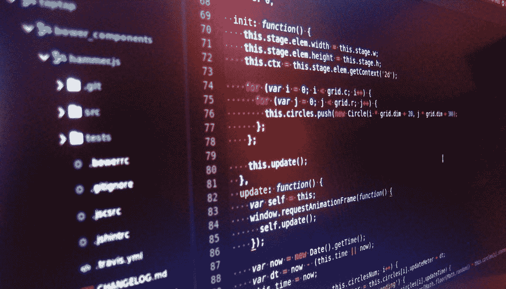

# 10 行 JavaScript 让你看起来像个专家

> 原文：<https://javascript.plainenglish.io/10-lines-of-javascript-that-will-make-you-look-like-an-expert-4756d182aa7d?source=collection_archive---------14----------------------->

JavaScript 可以完成很多令人惊叹的事情，也有很多东西需要学习。今天，我们将看看几个简短而甜蜜的代码片段。

# 1.使用数学随机获得一个布尔值(真/假)。

Math.random()将产生一个介于 0 和 1 之间的随机整数，如果它大于 0.5，您将获得一个有 50%概率为真或假的值。

# 2.确定给定日期是否是工作日。

检查指定的日期是否是工作日。

# 3.反向字符串

有几种反转字符串的方法；下面是最简单的:split()、reverse()和 join()

# 4.检查当前选项卡是否显示。

下面的代码片段确定当前选项卡是否是浏览器中的活动选项卡，因为用户可能打开了许多选项卡。

# 5.找出这个数字是奇数还是偶数。

这项任务非常适合模数运算符。

# 6.十六进制生成器

Math.random 和 padEnd 属性可用于产生随机的十六进制颜色。

# 7.从数组中删除重复项

JavaScript 中的 Set 使得消除重复变得简单。这是一个游戏改变者。

# 8.黑暗模式检测

使用以下代码来查看用户的设备是否处于黑暗模式。

# 9.验证所需的元素已聚焦。

若要查看元素是否处于焦点中，请使用 activeElement。

# 10.验证当前用户能够处理触摸事件。

*更多内容尽在* [***说白了. io***](http://plainenglish.io/) *。报名参加我们的* [***免费周报***](http://newsletter.plainenglish.io/) *。在我们的* [***社区获得独家访问写作机会和建议***](https://discord.gg/GtDtUAvyhW) *。*