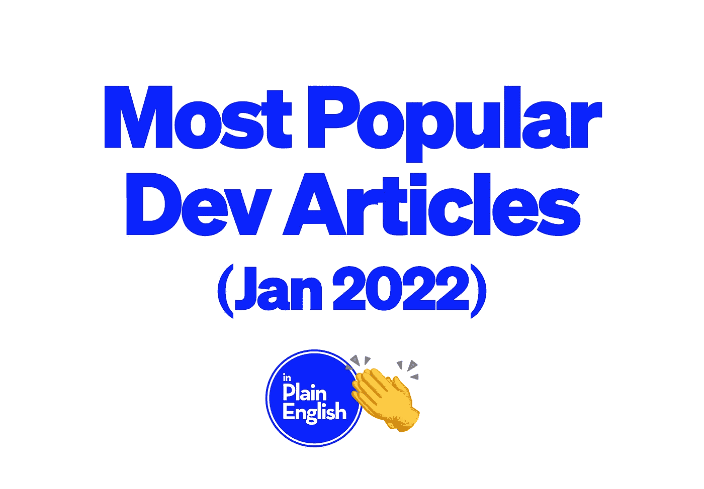

# 10 篇最受欢迎的编程文章(2022 年 1 月)

> 原文：<https://javascript.plainenglish.io/10-most-popular-programming-articles-january-2022-fe7d1cb2d2bc?source=collection_archive---------6----------------------->

## 以下是 10 篇最受欢迎的浅显英语 JavaScript 文章。需要为你的下一篇文章寻找灵感——别再找了！

以下文章是按照获得的掌声数量排列的。这意味着根据浏览量可能会有不同的顺序，尽管掌声通常是一篇文章受欢迎程度/表现如何的良好晴雨表。

## 1.[我遇到了一个富有的程序员，他给了我 3 条改变人生的建议](/i-met-a-rich-programmer-he-gave-me-3-life-changing-pieces-of-advice-a3754d73a50c)

 [## 我遇到了一个富有的程序员，他给了我 3 条改变人生的建议

### #2 永远不要辞职

javascript.plainenglish.io](/i-met-a-rich-programmer-he-gave-me-3-life-changing-pieces-of-advice-a3754d73a50c) 

作者:[安妮特](https://medium.com/u/63e8b30e596f?source=post_page-----fe7d1cb2d2bc--------------------------------)

喜欢:1.5k

## 2.一个没有经验的自学程序员的 5 个奇怪迹象

 [## 一个没有经验的自学程序员的 5 个奇怪迹象

### 这些迹象表明他们缺乏经验。

javascript.plainenglish.io](/5-weird-signs-of-an-inexperienced-self-taught-programmer-a531f4eb6683) 

作者: [Sanjay Priyadarshi](https://medium.com/u/d8fc5db9b016?source=post_page-----fe7d1cb2d2bc--------------------------------)

*喜欢:1.5k*

## 3.[程序员将在 2022 年陷入财务困境](/programmers-will-be-financially-screwed-in-2022-200cfee099ae)

 [## 程序员将在 2022 年陷入财务困境

### 以下是自救的方法

javascript.plainenglish.io](/programmers-will-be-financially-screwed-in-2022-200cfee099ae) 

作者: [Aniket](https://medium.com/u/63e8b30e596f?source=post_page-----fe7d1cb2d2bc--------------------------------)

*喜欢:1.3k*

## 4. [JavaScript 前端速度是下一件大事](/javascript-frontend-speed-is-the-next-big-thing-4caef920e441)

 [## JavaScript 前端速度是下一件大事

### 面向速度的前端解决方案再造的两条路径。

javascript.plainenglish.io](/javascript-frontend-speed-is-the-next-big-thing-4caef920e441) 

作者:[迪奥普·马赫塔尔](https://medium.com/u/4b545d83287?source=post_page-----fe7d1cb2d2bc--------------------------------)

*点赞:840*

## 5.[使用 React Native 创建实时医疗应用](/create-a-real-time-medical-app-with-react-native-637618b7883f)

 [## 使用 React Native 创建实时医疗应用程序

### 用 React Native 创建一个健康技术应用程序:它的成本、流程和特性

javascript.plainenglish.io](/create-a-real-time-medical-app-with-react-native-637618b7883f) 

作者:[索菲亚·马丁](https://medium.com/u/a003439d3910?source=post_page-----fe7d1cb2d2bc--------------------------------)

*点赞数:760*

## 6.[Python 算法交易:两周的幅度影响当前回报吗](https://python.plainenglish.io/algorithmic-trading-with-python-strategy-1-does-two-week-magnitude-effect-current-returns-d17282ddd6e8)

 [## 用 Python 进行算法交易:策略 1——两周的幅度会影响当前回报吗

### 测试历史回报是否有助于显示未来的日动量

python .平原英语. io](https://python.plainenglish.io/algorithmic-trading-with-python-strategy-1-does-two-week-magnitude-effect-current-returns-d17282ddd6e8) 

作者:[丹·鲁特](https://medium.com/u/9f5a1cb77de?source=post_page-----fe7d1cb2d2bc--------------------------------)

*点赞数:750*

## 7. [Python 被炒作](https://python.plainenglish.io/python-is-being-over-hyped-81d25c985db7)

 [## Python 被过度宣传了😡

### 我将用三个理由来说服你

python .平原英语. io](https://python.plainenglish.io/python-is-being-over-hyped-81d25c985db7) 

作者:[塞布丽娜·卡彭特🐍](https://medium.com/u/485b66b63fbf?source=post_page-----fe7d1cb2d2bc--------------------------------)

*点赞:610*

## 8.[我将如何在 2022 年再次学习前端开发成为一名职业玩家](/how-i-would-learn-frontend-development-again-in-2022-to-become-a-pro-4b0f4e881203)

 [## 我将如何在 2022 年再次学习前端开发以成为一名专业人员

### 请不要犯我的错误。

javascript.plainenglish.io](/how-i-would-learn-frontend-development-again-in-2022-to-become-a-pro-4b0f4e881203) 

作者:[皮耶罗·博雷利](https://medium.com/u/91fcf0e83495?source=post_page-----fe7d1cb2d2bc--------------------------------)

*喜欢数:490*

## 9.[我希望在开始使用 Python 时就知道的 10 个工具](https://python.plainenglish.io/10-tools-to-help-claw-your-way-back-to-sanity-while-coding-python-df0af160c33e)

 [## 开始使用 Python 时我希望知道的 10 个工具

### 了解 venvs、flake8、black、isort、pytest、commitizen、semantic-release、预提交挂钩和 Github 操作如何…

python .平原英语. io](https://python.plainenglish.io/10-tools-to-help-claw-your-way-back-to-sanity-while-coding-python-df0af160c33e) 

作者:[凯文](https://medium.com/u/1743f74b447c?source=post_page-----fe7d1cb2d2bc--------------------------------)

*喜欢数:470*

## 10.[将在 2022 年统治世界的顶级 JavaScript 框架和库](/top-javascript-frameworks-and-libraries-that-will-rule-in-2022-dbd410103c5)

 [## 将在 2022 年统治世界的顶级 JavaScript 框架和库

### 2022 年实现稳健开发的最佳 JavaScript 框架和库

javascript.plainenglish.io](/top-javascript-frameworks-and-libraries-that-will-rule-in-2022-dbd410103c5) 

作者:[索菲亚·马丁](https://medium.com/u/a003439d3910?source=post_page-----fe7d1cb2d2bc--------------------------------)

*点赞数:440*

# 结论

我们做到了！上个月用简单英语发表的最受欢迎的十篇文章。恭喜那些上榜的人！🎉非常感谢你们每一个关注我们出版物并参与其中的人！

**多爱！** ❤️

你愿意用简单的英语为 2022 年做贡献吗？ [***点击这里了解***](https://medium.com/javascript-in-plain-english/https-medium-com-javascript-in-plain-english-join-our-team-b0854ead7d14) ***！***

*更多内容看* [***说白了。报名参加我们的***](http://plainenglish.io/) **[***免费每周简讯***](http://newsletter.plainenglish.io/) *。在我们的* [***社区不和谐***](https://discord.gg/GtDtUAvyhW) *获得独家获得写作机会和建议。***