# 网络开发者必备的 10 个 Chrome 扩展

> 原文：<https://javascript.plainenglish.io/10-must-have-chrome-extensions-for-web-developers-6a30f3fe9296?source=collection_archive---------1----------------------->

## 1.维斯布格，2。主题化，3。WhatFont，4。瓦帕里斯，5 岁。Talend API 测试器，6。波，7。假数据，8。果酱，9。SVG 抓取器，10。尺寸。

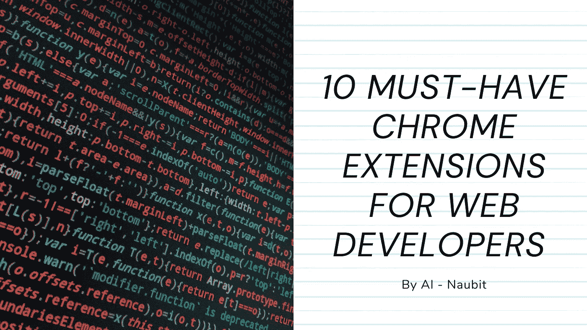

Chrome 浏览器早在 2008 年就问世了，此后一直呈指数增长；截至 2021 年 10 月，**它拥有 68%的全球市场份额**。鉴于此，可以肯定地说，大多数 web 开发人员使用 Chrome ( *或基于 Chrome 的浏览器，如 Brave 或 Edge* )。

扩展是一种很好的方式，可以用改进您工作的特性来增强您的浏览器。我们在这里为网络开发者准备了一些 Chrome 扩展，如果你感兴趣的话，可以去看看！

在这篇小帖子中，我试图只列出对开发有用的扩展(*，而不是像黑暗模式工具或广告拦截器*这样的扩展，因为这些将是一个完全不同的主题。我还尝试列出了**不太为人所知的扩展**，所以这不是你所熟知的扩展的典型列表。我希望其中一些对你有所帮助！

# 1.VisBug

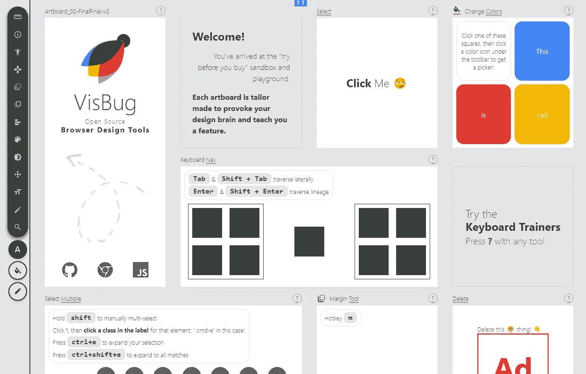

一个很好的检验不同设计如何被接受的方法是使用一个简单的设计工具 VisBug。有了它，你可以重新设计任何网站的用户界面，它会实时向你显示更新的预览，这样你就可以进行精确的修改&永远不需要刷新页面。

言语不能说明它有多有用；一定要查看他们的网站([https://visbug.web.app/](https://visbug.web.app/))获取实用样本！

星星⭐: 4.8

下载📥:100k+。

[给 Chrome / Brave 添加 VisBug](https://chrome.google.com/webstore/detail/visbug/cdockenadnadldjbbgcallicgledbeoc)

# 2.主题化

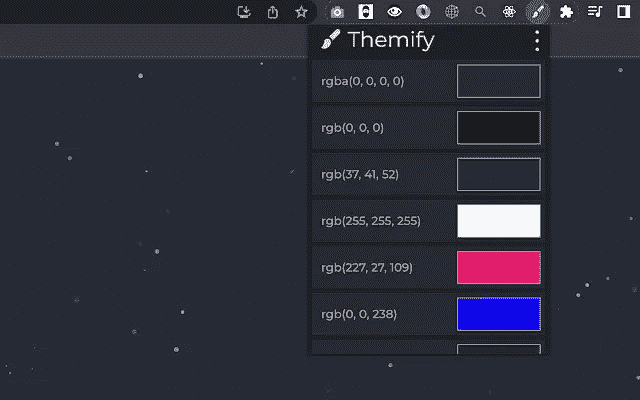

根据您的需要，以各种颜色代码制作一个 CSS 颜色列表。它有一个颜色选择器，可以在你的屏幕上工作，包括其他应用程序。这款扩展是旧 [ColorZilla](https://chrome.google.com/webstore/detail/colorzilla/bhlhnicpbhignbdhedgjhgdocnmhomnp) 的合适替代品，拥有更多功能！

明星⭐: 5

下载📥: 223

[给 Chrome / Brave 添加主题化](https://chrome.google.com/webstore/detail/themify/depilomfokpbdjhmagangenafijekkjc)

# 3.什么字体

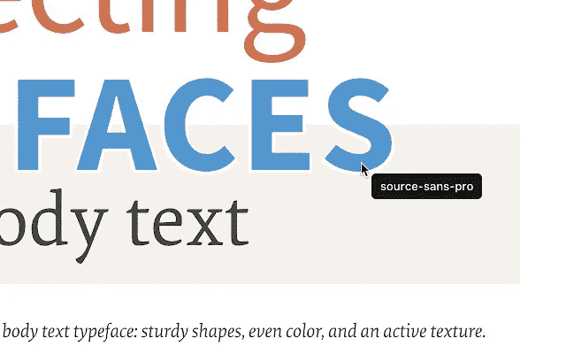

查找网页中使用的字体的最简单方法是什么？Firebug 和 Webkit Inspector 对开发人员来说很容易使用。然而，对于其他人来说，这应该不是必要的。有了这个扩展，你可以通过悬停在网页字体上来检查它们。就是这么简单优雅。

明星⭐: 4

下载📥:2M+

[给 Chrome / Brave 添加 what font](https://chrome.google.com/webstore/detail/whatfont/jabopobgcpjmedljpbcaablpmlmfcogm)

# 4.瓦帕里斯

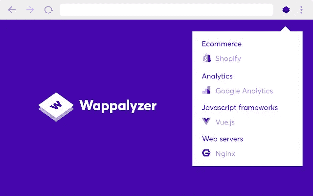

Wappalyzer 是一个技术概述，它向您展示了网站是用什么构建的。

了解网站使用的内容管理系统、框架、电子商务平台、JavaScript 库等等。

Wappalyzer 不仅仅是一个 CMS 检测器或框架检测器:它揭示了几十个类别中的一千多种技术，如编程语言、分析、营销工具、支付处理器、CRM、CDN 等。

明星⭐: 4.7

下载📥:+1M

[将瓦帕利泽添加到铬/勇敢](https://chrome.google.com/webstore/detail/wappalyzer-technology-pro/gppongmhjkpfnbhagpmjfkannfbllamg)

[将 Wappalyzer 添加到火狐](https://addons.mozilla.org/en-US/firefox/addon/wappalyzer/)

# 5.Talend API 测试仪

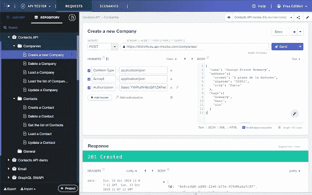

与 REST、SOAP 和 HTTP APIs 进行可视化交互。它使调用、发现和测试 HTTP 和 REST APIs 变得很容易，基本上是邮差或失眠，但在浏览器中。

明星⭐: 4.9

下载📥:500k+

[将 Talend API Tester 添加至 Chrome / Brave](https://chrome.google.com/webstore/detail/talend-api-tester-free-ed/aejoelaoggembcahagimdiliamlcdmfm)

# 6.波浪

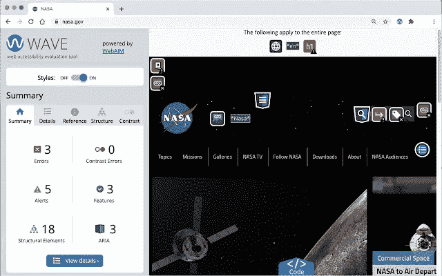

这是一个开发的网络可访问性评估工具(我们知道可访问性对我们的网站至关重要！).它通过向页面中注入图标和指示器，提供有关 web 内容可访问性的视觉反馈。没有自动化的工具可以告诉你你的页面是否是可访问的，但是 WAVE 促进了人的评估并教导了关于可访问性的问题。

所有的分析都完全在 Chrome 浏览器中完成，允许对内部网、本地、密码保护和其他敏感网页进行快速评估。

明星⭐: 4

下载📥:400k+

[向铬/勇敢添加波浪](https://chrome.google.com/webstore/detail/wave-evaluation-tool/jbbplnpkjmmeebjpijfedlgcdilocofh)

# 7.虚假数据

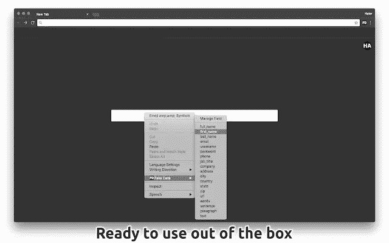

一种比[假填充器](https://chrome.google.com/webstore/detail/fake-filler/bnjjngeaknajbdcgpfkgnonkmififhfo)更可定制的替代品，正如他们所说，是用假的随机数据填充表格的最先进的工具。

明星⭐: 4.9

下载📥:20k+

[给 Chrome / Brave 添加虚假数据](https://chrome.google.com/webstore/detail/fake-data-a-form-filler-y/gchcfdihakkhjgfmokemfeembfokkajj/)

[在火狐中添加虚假数据](https://addons.mozilla.org/ro/firefox/addon/fake-data-haterapps/)

# 8.困境

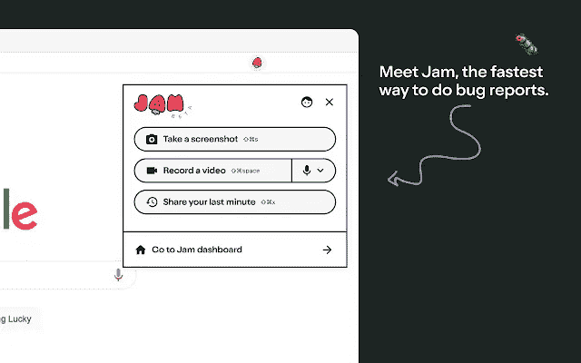

这个扩展是为一个小的初创公司设计的，但是它是一个很好的扩展。它可以让你一次点击就把完美的臭虫报告发送给你的开发者。没有形式，没有混乱，只是一个简单的链接在你的浏览器中的臭虫的理想记录。

明星⭐: 4.9

下载📥:+5k

[给 Chrome / Brave 加果酱](https://chrome.google.com/webstore/detail/jam/iohjgamcilhbgmhbnllfolmkmmekfmci)

# 9.SVG 抓取器

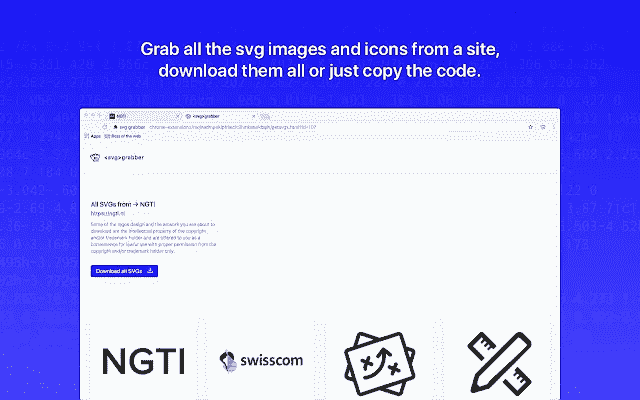

一个从网站上快速预览和获取所有 SVG 资源的工具。

svg-grabber 允许你预览、下载和复制网站上所有 svg 图标和插图的代码。

星星⭐: 4.1

下载📥:100k+。

[给 Chrome / Brave 添加 SVG 抓取器](https://chrome.google.com/webstore/detail/svg-grabber-get-all-the-s/ndakggdliegnegeclmfgodmgemdokdmg)

# 10.规模

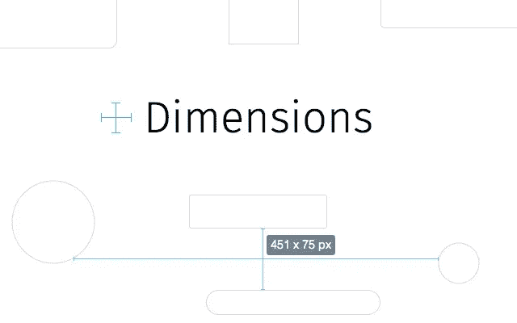

设计师测量屏幕尺寸的工具。

这个扩展测量从鼠标指针向上/向下和向左/向右直到碰到边界的尺寸。因此，如果你想测量一个网站上元素之间的距离，这是完美的。

顺便说一句，它对图像不太适用，因为图像上的像素与像素之间的颜色变化很大。

星星⭐: 4.1

下载📥:20 万以上

[给 Chrome / Brave 增加尺寸](https://chrome.google.com/webstore/detail/dimensions/baocaagndhipibgklemoalmkljaimfdj)

# 扩展！

每个人都喜欢富有成效，我很确定至少其中一些扩展会以某种方式帮助你；他们在编码的时候给了我很大的帮助！

如果你喜欢这篇文章，我会在我的时事通讯中发布更多精彩的内容；您可以在这里免费查看:[立即查看 Coderpreneurs！](https://coderpreneurs.substack.com/)

此外，我喜欢在 Twitter 上发布有趣的内容和帖子，所以我也建议关注我！[这是我的推特:@thenaubit](https://twitter.com/thenaubit) 。

*更多内容请看*[***plain English . io***](https://plainenglish.io/)*。报名参加我们的* [***免费周报***](http://newsletter.plainenglish.io/) *。关注我们关于*[***Twitter***](https://twitter.com/inPlainEngHQ)[***LinkedIn***](https://www.linkedin.com/company/inplainenglish/)*[***YouTube***](https://www.youtube.com/channel/UCtipWUghju290NWcn8jhyAw)*[***不和***](https://discord.gg/GtDtUAvyhW) *。对增长黑客感兴趣？检查* [***电路***](https://circuit.ooo/) *。***