# 关于 Reduce 的 10 个必须知道的 JavaScript 技巧和提示

> 原文：<https://javascript.plainenglish.io/10-must-know-javascript-tricks-tips-about-reduce-1368766d99da?source=collection_archive---------0----------------------->

## 关于 Reduce 的 10 个技巧，让你写得更少，做得更多。

Photo by [Shamin Haky](https://unsplash.com/@haky?utm_source=medium&utm_medium=referral) on [Unsplash](https://unsplash.com?utm_source=medium&utm_medium=referral)

我的好朋友，作为一个前端开发者，你一定经常使用`reduce`函数，它是一个强大而有用的数组 API，但是今天我要和你分享**关于它的 10 个高级招数和技巧**，加油！

# 1.作为加法器和累加器

利用“归约”，我们可以很容易地实现几个数相加或累加的功能。

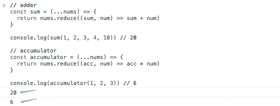

# 2.计算数组的最大值和最小值

有多少种方法可以得到一个数组的最大值或最小值？

**1:使用 Math.max 和 Math.min**

我们不得不承认，使用 Math 的 API 是最简单的方法。

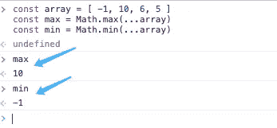

**2:使用 reduce**

是的，你只需要一行代码就可以达到和 Math 的 API 一样的效果。

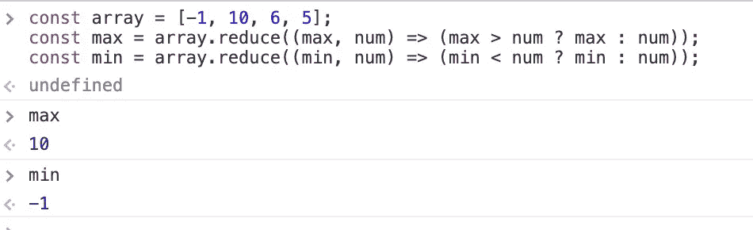

# 3.格式化搜索参数

获取链接上的搜索参数是我们经常要处理的事情。如何解析它们？

**例如**

**1。正常方式**

这是大多数人的使用方式。

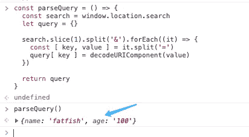

**2。使用 reduce**

Reduce 实际上可以完成这个，而且看起来更简单。

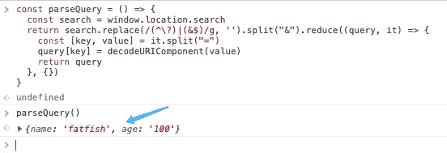

它是如何工作的？

# 4.反序列化搜索参数

当我们想跳转到一个链接，给它添加一些搜索参数的时候，手动串接的方式不是很方便。

如果有很多参数要串接，那就成了灾难。

幸运的是,“reduce”可以帮助我们轻松解决这个问题。

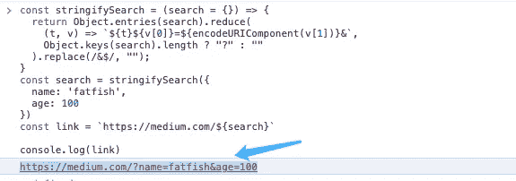

# 5.展平多层嵌套数组

你知道如何展平多层嵌套数组吗？

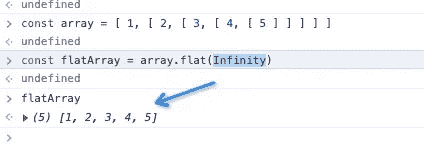

“flat”是一个非常强大的 API。请点击[此处](https://developer.mozilla.org/en-US/docs/Web/JavaScript/Reference/Global_Objects/Array/flat)查看详情。

**使用 reduce 实现与 flat** 相同的功能

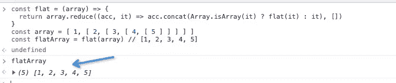

# 6.模拟平面特征的功能

虽然我们实现了扁平化深度嵌套数组的功能，但是如何才能完全实现扁平化的功能呢？

太好了，我们做到了。

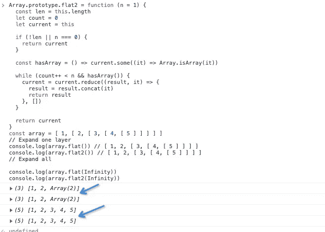

# 7.保持数组唯一

对于`reduce`来说，保持数组的唯一性也很容易。

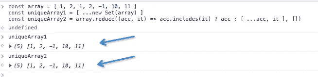

# 8.计算数组成员的数量

如何计算数组中每个成员的个数？

为什么用`Map`而不用`object`？

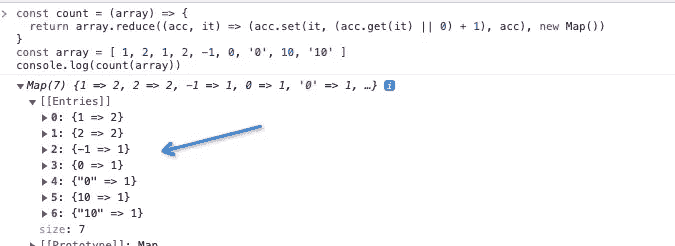

# 9.获取一个对象的多个属性

朋友们，我们来看看你们在工作中会遇到的一个场景。

**用 reduce 解决**

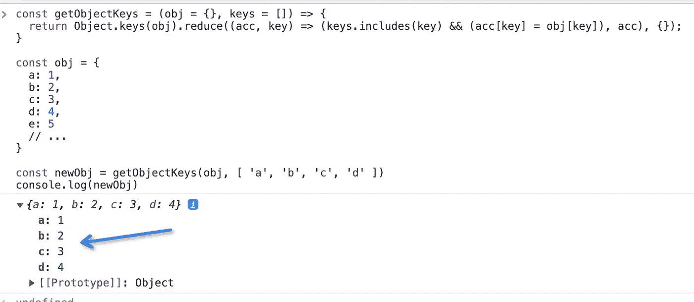

# 10.反向字符串

# 最后

**感谢阅读。我期待着您的关注和阅读更多高质量的文章。**

 [## 让你看起来像高级开发人员的 8 个很酷的 GitHub 技巧

### 使用 GitHub 可以做的 8 件很酷的事情

javascript.plainenglish.io](/8-cool-github-tricks-to-make-you-look-like-a-senior-developer-ab8fe9ae9b14)  [## 面试官:可以“x！== x "在 JavaScript 中返回 True？

### 你可能不知道的五个神奇的 JavaScript 知识点！

javascript.plainenglish.io](/interviewer-can-x-x-return-true-in-javascript-7e1d1fa7b5cd)  [## 123['toString']。length + 123)用 JavaScript 打印出来？

### 95%的前端开发者回答错误的问题。

javascript.plainenglish.io](/what-does-123-tostring-length-123-print-out-in-javascript-2c804a414325) 

*更多内容请看*[***plain English . io***](https://plainenglish.io/)*。报名参加我们的* [***免费周报***](http://newsletter.plainenglish.io/) *。关注我们关于*[***Twitter***](https://twitter.com/inPlainEngHQ)*和*[***LinkedIn***](https://www.linkedin.com/company/inplainenglish/)*。查看我们的* [***社区不和谐***](https://discord.gg/GtDtUAvyhW) *加入我们的* [***人才集体***](https://inplainenglish.pallet.com/talent/welcome) *。*