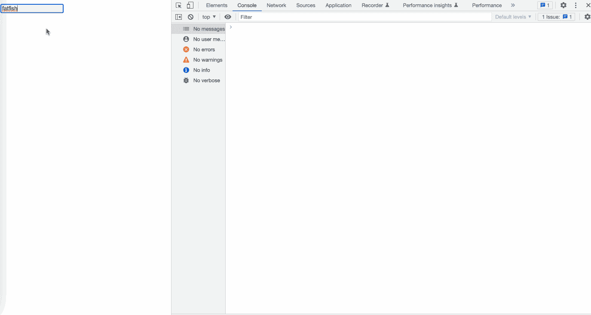
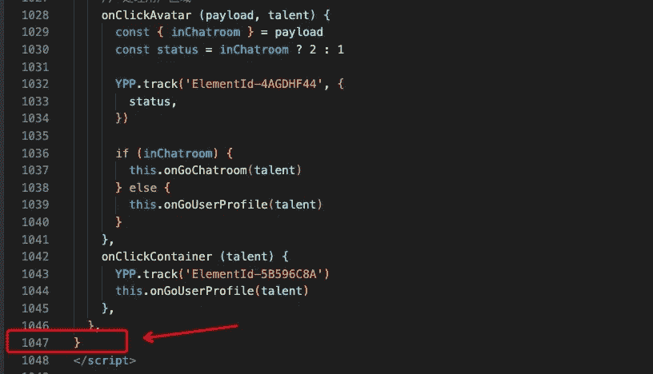

# 让你成为更好的程序员的 10 个必须知道的 JavaScript 技巧和提示

> 原文：<https://javascript.plainenglish.io/10-must-know-javascript-tricks-tips-to-make-you-a-better-programmer-d08f58e123c3?source=collection_archive---------1----------------------->

## 请一定要学会这些技巧

Photo by [David Emrich](https://unsplash.com/@davidemrich?utm_source=medium&utm_medium=referral) on [Unsplash](https://unsplash.com?utm_source=medium&utm_medium=referral)

# 前言

以前写了很多垃圾代码，现在**那个看起来很可怕。**

当我再次看到那些代码片段的时候，我甚至怀疑自己是否适合做程序员…

# 1.承诺回调地狱

**承诺**提供了一种优雅的方式来处理 JavaScript 中的异步操作。这也是避免“**回调地狱**”的解决方案之一。但是我没有真正理解它的意思，所以我写了这个代码片段。

我做了这些事情:

1.  先获取用户的基本信息。
2.  通过用户信息获取所有文章的简要摘要。
3.  通过文章简单获取文章细节。

我一点也没有利用承诺。我们应该像下面的代码片段一样处理它:

# 2.不处理错误消息

我经常只写成功请求的代码逻辑，而忽略失败的请求。

这是没有经验的，我们应该给出一个用户友好的提示，而不是什么都不做。

# 3.为一个函数设置太多参数。

当一个函数有太多的参数时，它会变得可读性更差，甚至让我们想知道如何正确地传递参数。

**示例**

我们想获得用户的一些基本信息，如**姓名**、**性别**、**年龄**、**等**。

太可怕了。如果你的同事这样写代码，你会揍他一顿吗？

事实上，当函数参数过多时，应该使用对象来传递所需的信息，这样其可读性和可扩展性都会得到提高。

# 4.幻数

朋友们，你们写过这样的代码吗？很多地方用数字做逻辑判断似乎很正常。是的，我搞不清楚`1`、`2`、`3`到底是什么意思。

我们最好将这些数字定义为常数。

# 5.使用。l `ength`判断字符串的长度

大多数时候，我们使用`.length`来判断字符串的长度是安全的，但是在表单输入的情况下，你应该小心。

当我们键入`🍫`时，`nameLen`的值是 2 —这不奇怪吗？

是的，这是有原因的，你猜怎么着？

# 6.永远不要写代码注释

我们经常向别人抱怨“为什么不写代码注释？”但实际上我从来没有写过！。

天哪，你知道‘DPR’是什么意思吗？我从来没想过它的意思是`window devicePixelRatio`.

# 7.无意义的代码注释

与其不写代码注释，不如写无意义的代码注释，因为浪费你的时间。

你不妨解释一下“a”是什么意思，或者使用有意义的变量名！

# 8.随机命名

过去，我常常编写一些笨拙的代码片段，随机命名变量。

朋友们，请不要学我。你应该给变量一个合适的有意义的名字。

# 9.不要删除不推荐使用的代码

很多时候，我们的网站会不断调整功能，有新功能，也有弃用的功能，但我总是担心以后会用到，所以只是评论，而不是删除。

其实这种担心完全没有必要，因为以后用上的可能性非常小。即使将来会用到，也可以通过‘git’追溯。

# 10.超过一千行组件代码

我在一个组件中写了一千多行代码。这太糟糕了，我们应该将组件的功能进一步分割成更小的组件。

# 最后

**感谢阅读。**我期待期待您的关注和阅读更多高质量的文章。

 [## 采访者:“npm 跑 xxx”怎么了？

### 一个大多数人都不知道的秘密。

javascript.plainenglish.io](/interviewer-what-happened-to-npm-run-xxx-cdcb37dbaf44)  [## 我老板:你根本不知道反应！😠

### 你必须知道的 React 的 3 种错误用法。

javascript.plainenglish.io](/my-boss-you-dont-know-react-at-all-f493970f1807)  [## 让你看起来像高级开发人员的 8 个很酷的 GitHub 技巧

### 使用 GitHub 可以做的 8 件很酷的事情

javascript.plainenglish.io](/8-cool-github-tricks-to-make-you-look-like-a-senior-developer-ab8fe9ae9b14)  [## 面试官:可以“x！== x "在 JavaScript 中返回 True？

### 你可能不知道的五个神奇的 JavaScript 知识点！

javascript.plainenglish.io](/interviewer-can-x-x-return-true-in-javascript-7e1d1fa7b5cd)  [## 123['toString']。length + 123)用 JavaScript 打印出来？

### 95%的前端开发者回答错误的问题。

javascript.plainenglish.io](/what-does-123-tostring-length-123-print-out-in-javascript-2c804a414325) 

*更多内容看* [***说白了就是***](https://plainenglish.io/) *。报名参加我们的* [***免费周报***](http://newsletter.plainenglish.io/) *。关注我们关于*[***Twitter***](https://twitter.com/inPlainEngHQ)*和*[***LinkedIn***](https://www.linkedin.com/company/inplainenglish/)*。查看我们的* [***社区不和谐***](https://discord.gg/GtDtUAvyhW) *加入我们的* [***人才集体***](https://inplainenglish.pallet.com/talent/welcome) *。*