# IT 人士必读的 10 个搞笑炸弹

> 原文：<https://javascript.plainenglish.io/10-must-read-laugher-bombs-for-it-people-6459d54851e?source=collection_archive---------1----------------------->

## 面向程序员的互联网最佳搞笑内容汇编

Photo by [Tim Mossholder](https://unsplash.com/@timmossholder?utm_source=medium&utm_medium=referral) on [Unsplash](https://unsplash.com?utm_source=medium&utm_medium=referral)

***笑话和快乐有什么联系吗？*** 如果你是我这种类型的人，那么你可能也爱在下班后查看手机。猜猜我在那里看到了什么？

我主要是在网上看到**的视频、抖音和笑话**。我不知道为什么，但这有助于我提神醒脑，减轻工作压力。

# 这就是为什么我相信笑是人类最好的刷新按钮。

在这篇文章中，我收集了一些我喜欢的网络迷因。

# 谢谢你的建议！

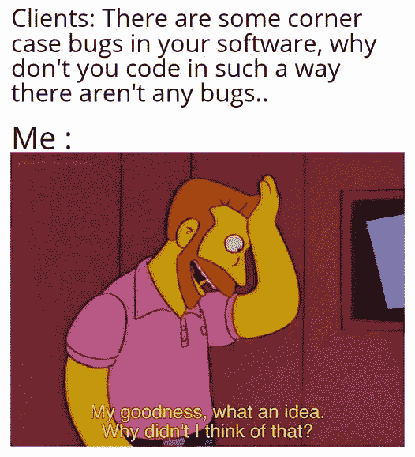

Picture Credit:[https://www.facebook.com/yuva.krishna.memes](https://www.facebook.com/yuva.krishna.memes)

# Scrum 处于最佳状态。

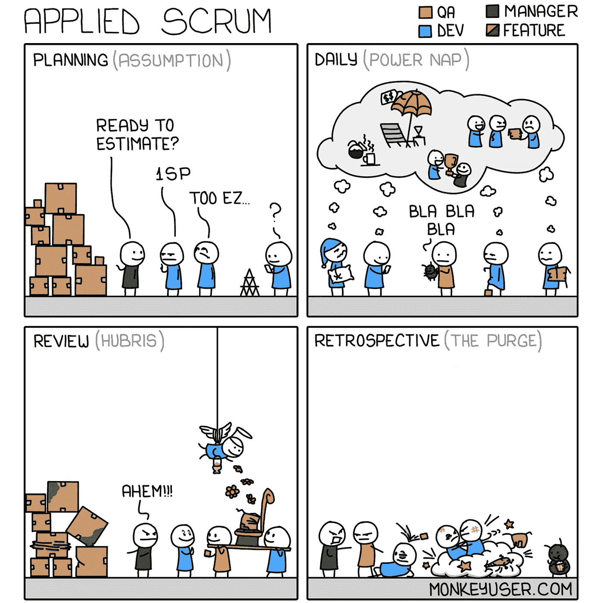

Picture Credit:[https://www.monkeyuser.com/](https://www.monkeyuser.com/)

# 非 IT 人看到你的历史…我的会是“怎么拆钥匙”“怎么强制组件”等。

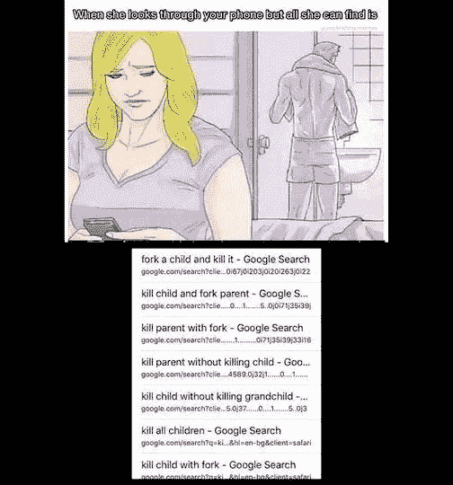

Picture Credit:[https://www.facebook.com/yuva.krishna.memes](https://www.facebook.com/yuva.krishna.memes)

# 如果有用，别碰它。普遍规律。

Picture Credit: [https://www.facebook.com/javascriptJS](https://www.facebook.com/javascriptJS)

# 我一生中最棒的剧集:

Picture Credit: [https://www.facebook.com/javascriptJS](https://www.facebook.com/javascriptJS)

# 哦，我能理解这种痛苦，亲爱的。

Picture Credit:[https://www.facebook.com/groups/programmer.wey](https://www.facebook.com/groups/programmer.wey)

# 抱歉。没有比这更好的心脏病发作方式了…

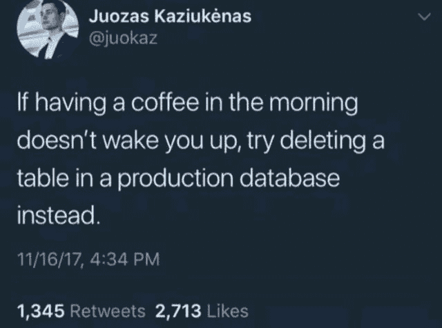

Picture Credit:[https://www.facebook.com/groups/programmer.wey](https://www.facebook.com/groups/programmer.wey)

# 页面来了…

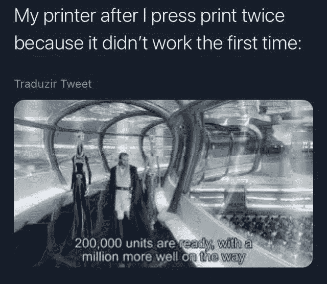

Picture Credit:[https://www.facebook.com/groups/programmer.wey](https://www.facebook.com/groups/programmer.wey)

# 我搜索了什么？我连 100 个标签的历史都查不到。

Picture Credit:[https://www.facebook.com/javascript.shitposting](https://www.facebook.com/javascript.shitposting)

# 啊，当我试图删除节点模块时

Picture Credit:[https://www.facebook.com/jokesvala/](https://www.facebook.com/jokesvala/)

# 我生活的现实

Picture Credit:[https://www.facebook.com/jokesvala/](https://www.facebook.com/jokesvala/)

# 对不起，我们不能做朋友…

Picture Credit:[https://www.facebook.com/jokesvala/](https://www.facebook.com/jokesvala/)

# 奖励内容:

# 当你是一名 UI 开发人员时的那种感觉…

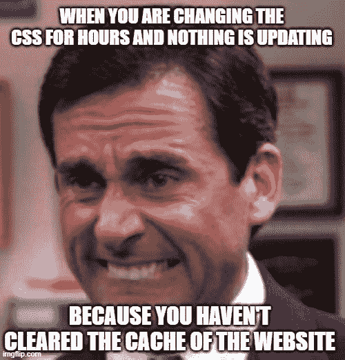

[https://www.facebook.com/DZoneInc/photos/a.336758034711/10159569905119712/](https://www.facebook.com/DZoneInc/photos/a.336758034711/10159569905119712/)

**来源:**[https://www.facebook.com/DZoneInc](https://www.facebook.com/DZoneInc/photos/a.336758034711/10159569905119712/)

# 好主意！

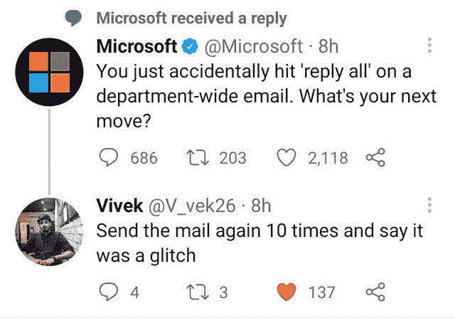

[https://www.facebook.com/DZoneInc/photos/a.336758034711/10159571645609712/](https://www.facebook.com/DZoneInc/photos/a.336758034711/10159571645609712/)

**来源:**[https://www.facebook.com/DZoneInc](https://www.facebook.com/DZoneInc/photos/a.336758034711/10159571645609712/)

# 应用程序没有问题。也许操作系统有问题…

[https://www.facebook.com/yuva.krishna.memes/photos/a.105527467815845/393835342318388/](https://www.facebook.com/yuva.krishna.memes/photos/a.105527467815845/393835342318388/)

**来源:**[https://www.facebook.com/yuva.krishna.memes/](https://www.facebook.com/yuva.krishna.memes/photos/a.105527467815845/393835342318388/)

# 当我选择了不同的解释，结果却是错的…

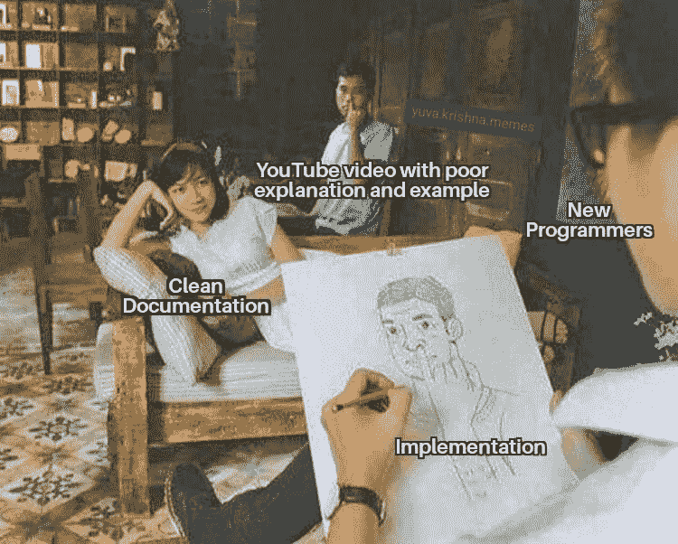

[https://www.facebook.com/yuva.krishna.memes/photos/a.105527467815845/392224995812756/](https://www.facebook.com/yuva.krishna.memes/photos/a.105527467815845/392224995812756/)

**来源:【https://www.facebook.com/yuva.krishna.memes/】T22**

# Printf 和 Console.log 永远是调试的首选…

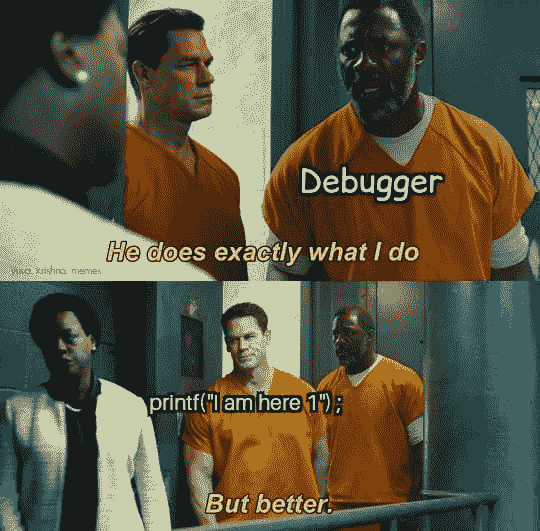

[https://www.facebook.com/yuva.krishna.memes/photos/a.105527467815845/392218212480101/](https://www.facebook.com/yuva.krishna.memes/photos/a.105527467815845/392218212480101/)

**来源:**[https://www.facebook.com/yuva.krishna.memes/](https://www.facebook.com/yuva.krishna.memes/photos/a.105527467815845/393835342318388/)

# 哈哈，但这也是客户代表给出的第一个建议

[https://www.facebook.com/photo/?fbid=2200511293425288&set=gm.6577293868963008](https://www.facebook.com/photo/?fbid=2200511293425288&set=gm.6577293868963008)

**来源:**[https://www.facebook.com/groups/it.humor.and.memes](https://www.facebook.com/groups/it.humor.and.memes)

# 广告—他们创建一个弹出窗口，“看起来你正在使用广告程序”

[https://www.facebook.com/socialhax/photos/a.814008878654578/4263937503661681/](https://www.facebook.com/socialhax/photos/a.814008878654578/4263937503661681/)

**来源:**【https://www.facebook.com/groups/it.humor.and.memes】T2

# 当我的光标玩捉迷藏的时候经常发生

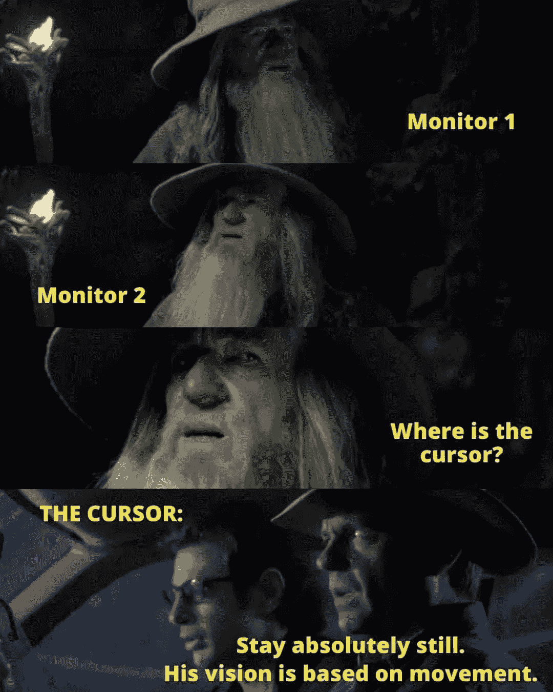

[https://www.facebook.com/codevweb95/photos/a.109799858049136/122073340155121/](https://www.facebook.com/codevweb95/photos/a.109799858049136/122073340155121/)

【https://www.facebook.com/groups/programmer.wey/】来源:

# 你的代码，你的问题。即使你们在同一个团队

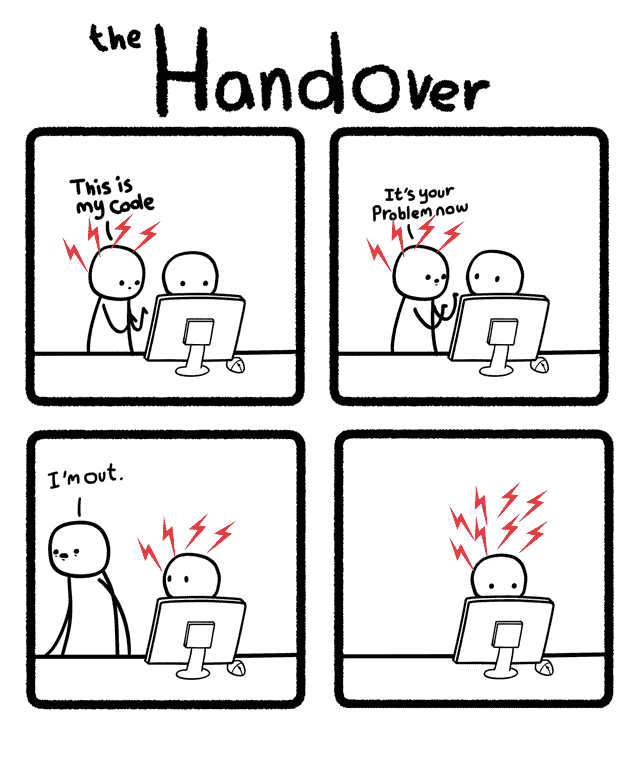

[https://www.facebook.com/codevweb95/photos/a.109799858049136/121960703499718/](https://www.facebook.com/codevweb95/photos/a.109799858049136/121960703499718/)

**来源:**[https://www.facebook.com/codevweb95/](https://www.facebook.com/codevweb95/)

# 当我忘记周五在做什么的时候，这种事情经常发生

[https://www.facebook.com/codevweb95/photos/a.109799858049136/122580386771083/](https://www.facebook.com/codevweb95/photos/a.109799858049136/122580386771083/)

**来源:**[https://www.facebook.com/codevweb95/](https://www.facebook.com/codevweb95/)

# 有时你被一些工作困住，需要参加一个会议…

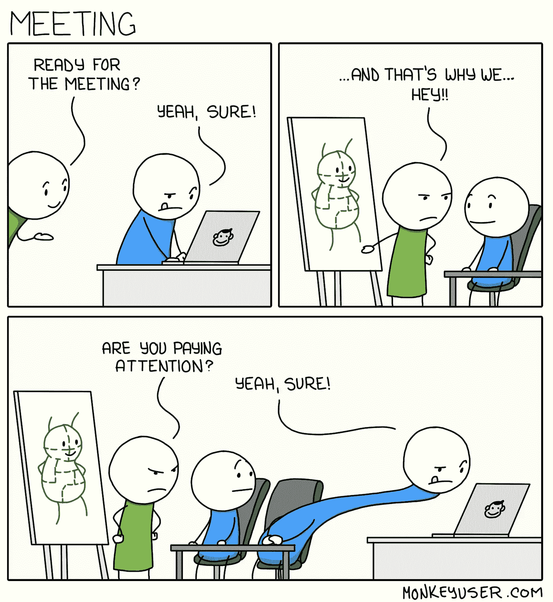

[https://www.monkeyuser.com/2019/meeting/?sc=true&dir=random](https://www.monkeyuser.com/2019/meeting/?sc=true&dir=random)

**来源:**[https://www.monkeyuser.com/](https://www.monkeyuser.com/)

# 当 QA 发现一个不同的场景失败了，bug 被重新打开

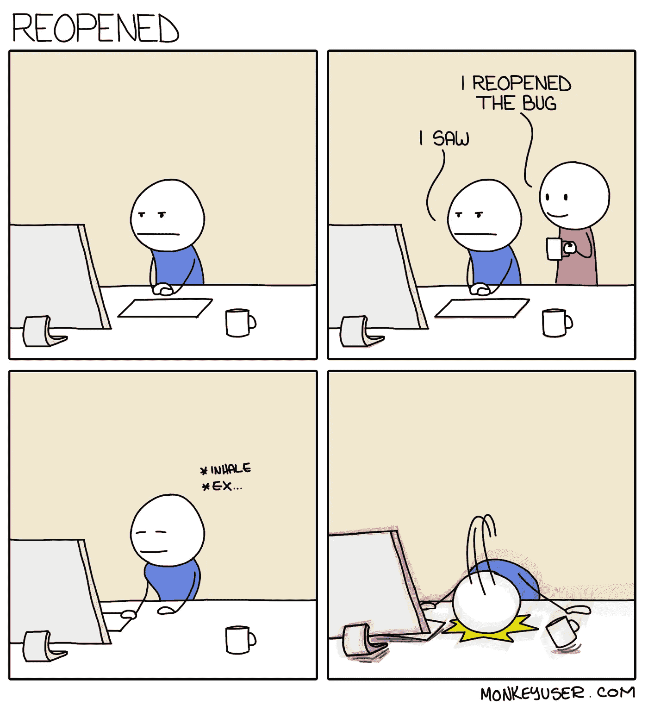

[https://www.monkeyuser.com/2018/reopened/?sc=true&dir=random](https://www.monkeyuser.com/2018/reopened/?sc=true&dir=random)

希望你喜欢这个！带着新的笑料炸弹再见！

*更多内容请看* [***说白了就是***](https://plainenglish.io/) *。报名参加我们的* [***免费每周简讯***](http://newsletter.plainenglish.io/) *。关注我们*[***Twitter***](https://twitter.com/inPlainEngHQ)*和*[***LinkedIn***](https://www.linkedin.com/company/inplainenglish/)*。查看我们的* [***社区不和谐***](https://discord.gg/GtDtUAvyhW) *加入我们的* [***人才集体***](https://inplainenglish.pallet.com/talent/welcome) *。*