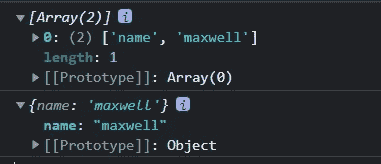

# 你必须学习的 10 个 JavaScript 新特性

> 原文：<https://javascript.plainenglish.io/10-new-javascript-features-you-must-learn-54f9a622b0c6?source=collection_archive---------2----------------------->

## 掌握新的 JavaScript 特性，让编写代码变得干净有趣


JavaScript 在不断升级和迭代，越来越多的新特性让我们的代码变得干净有趣，在本文中我们介绍了 10 个新特性。

## 1.字符串.原型. replaceAll

`replaceAll()`返回一个新字符串，其中模式的所有匹配项都被替换项替换。模式可以是字符串或正则表达式，替换项可以是为每个匹配执行的字符串或函数。

```
 let str = 'I like apple ,I eat apple sometimes';
    let newStr = str.replaceAll('apple', 'orange');

    console.log(newStr);

    /**** Output ****/
    //I like orange ,I eat orange sometimes
```

## 2.使用“BigInt”支持大数计算

JS 中的 MAX_SAFE_INTEGER”计算超过“Number”的数字将是不安全的。

```
 let v = Math.pow(2, 55) === Math.pow(2, 55) + 1 // true
    console.log(v);
    let v2 = Math.pow(2, 55);   
    console.log(v2); //36028797018963970

    let v3 = Math.pow(2, 55) + 1;  
    console.log(v3);   //36028797018963970
```

使用“BigInt”可以完全避免这个问题:

```
BigInt(Math.pow(2, 55)) === BigInt(Math.pow(2, 55)) + BigInt(1) // false
```

## 3.使用“Object.hasOwn”而不是“in”运算符

有时我们想知道一个属性是否存在于一个对象上，我们通常使用“in”操作符，但这是有缺陷的。

`in` 如果指定的属性位于对象或其原型链中，运算符返回 true:

```
const Person = function (age) {
  this.age = age
}
Person.prototype.name = 'Lily'

const p = new Person(24)
console.log('age' in p) // true 
console.log('name' in p) // true 
```

`**Object.hasOwn**`

```
let object = { age: 24 }
Object.hasOwn(object, 'age') // true
let object2 = Object.create({ age: 24 })
Object.hasOwn(object2, 'age') // false  
let object3 = Object.create(null)
Object.hasOwn(object3, 'age') // false
```

## 4.数字分隔符

新引入的值分隔符使用 _(下划线)字符来分隔各组值，使它们更易于阅读

```
let count = 1_000;
let number = 1_000_000;
let account = 1_000.0_001;
```

## 5.string . prototype . trim start()/string . prototype . trimend()

`String.prototype.trim()`用于删除空格、换行符等。从头尾，到现在头尾分别由`trimStart()`控制，`trimEnd(). trimLeft(), trimRight()`都是他们的别名。

```
 let str = '  Hello JavaScript  ';
    str.trimLeft();
    //'Hello JavaScript  '
    str.trimRight();
    //'  Hello JavaScript'
```

## 6.array . prototype . flat()/array . prototype . flat map()

展平数组是数组原型的一项新功能，它允许您通过传入一个 level depth 参数(默认为 1)来提高较低数组的级别。如果你想提高所有级别，你可以写一个更大的数字，但不建议这样做。`flatMap()`方法首先使用 map 函数映射每个元素，然后将结果展平到一个新数组中。

```
 const a1 = [1, 2, [3, 4]].flat();
    console.log(a1);  // [1, 2, 3, 4]

    const a2 = [1, 2, [3, 4, [5, 6]]].flat(2);
    console.log(a2); // [1, 2, 3, 4, 5, 6]

    const a3 = [1, 2, 3, 4].flatMap(v => [v, v * 2]);
    console.log(a3);  // [1, 2, 2, 4, 3, 6, 4, 8]
```

## 7.将 catch 参数更改为可选参数

在 try…catch 错误处理期间，如果没有参数传递给 catch，代码将报告一个错误。在新规范中，可以省略 catch 绑定参数和括号。

```
try{
 return true;
}catch{
 return false;
}
```

## 8.空合并运算符(？？？)

当左操作数为空或未定义时，它返回右操作数。否则，它返回左边的操作数。

```
const str = null ?? 'default string';
console.log(str);
// expected output: "default string"

const num = 0 ?? 42;
console.log(num);
// expected output: 0

/**  Note
 * Unlike the logical or (||) operator, the logical or returns the right-hand operand if the left operand is false, e.g. '' or 0
 */
```

## 9.可选的链运算符(？。)

如果要访问对象上不存在的属性的特性，请使用。运算符将直接报告错误，使用？。返回未定义的

```
let obj = {};
console.log(obj.person.name)
// Cannot read properties of undefined (reading 'name')

console.log(obj.?person?.name)
// expected output:undefine
```

## 10.Object.fromEntries()

`Object.entries`将一个对象转换成一个`[key, value]` 键值对。`object.fromEntries()` 用于将键值对简化为一个对象结构。

```
 const entries = [['name', 'maxwell']];
    console.log(entries);
````const object = Object.fromEntries(entries);
    console.log(object);
```

[](https://levelup.gitconnected.com/10-advanced-typescript-tips-for-development-2666298d50f) [## 用于开发的 10 个高级打字技巧

### 高级打字技巧

用于开发高级打字稿 Tipslevelup.gitconnected.com](https://levelup.gitconnected.com/10-advanced-typescript-tips-for-development-2666298d50f) [](https://levelup.gitconnected.com/how-to-add-a-watermark-to-your-website-with-html-canvas-f2c39474308a) [## 如何用 HTML 画布给你的网站添加水印

### Web 水印生成解决方案

levelup.gitconnected.com](https://levelup.gitconnected.com/how-to-add-a-watermark-to-your-website-with-html-canvas-f2c39474308a) [](https://levelup.gitconnected.com/8-commonly-used-javascript-libraries-become-a-real-master-6d8a4e98eb89) [## 8 个常用 JavaScript 库，成为真正的高手

### 掌握这些 JavaScript 工具库，让你的项目看起来很棒。

levelup.gitconnected.com](https://levelup.gitconnected.com/8-commonly-used-javascript-libraries-become-a-real-master-6d8a4e98eb89) [](https://levelup.gitconnected.com/javascript-design-patterns-strategy-pattern-c013d3dbc059) [## JavaScript 设计模式:策略模式

### 学习设计模式的目的是代码的可重用性，使代码更容易被其他人理解，并且…

levelup.gitconnected.com](https://levelup.gitconnected.com/javascript-design-patterns-strategy-pattern-c013d3dbc059) [](https://levelup.gitconnected.com/8-tools-and-methods-often-used-in-javascript-6fcebaf339ce) [## JavaScript 中常用的 8 种工具和方法

### 8 工作中经常用到的 Javascript 方法，记住这些方法，避免多此一举。

levelup.gitconnected.com](https://levelup.gitconnected.com/8-tools-and-methods-often-used-in-javascript-6fcebaf339ce) 

*更多内容尽在* [***说白了. io***](https://plainenglish.io/) *。报名参加我们的* [***免费周报***](http://newsletter.plainenglish.io/) *。关注我们上* [***推特***](https://twitter.com/inPlainEngHQ)[***领英***](https://www.linkedin.com/company/inplainenglish/)*[***YouTube***](https://www.youtube.com/channel/UCtipWUghju290NWcn8jhyAw)**和* [***不和***](https://discord.gg/GtDtUAvyhW) *对成长黑客感兴趣？检查出* [***电路***](https://circuit.ooo/) ***。*****