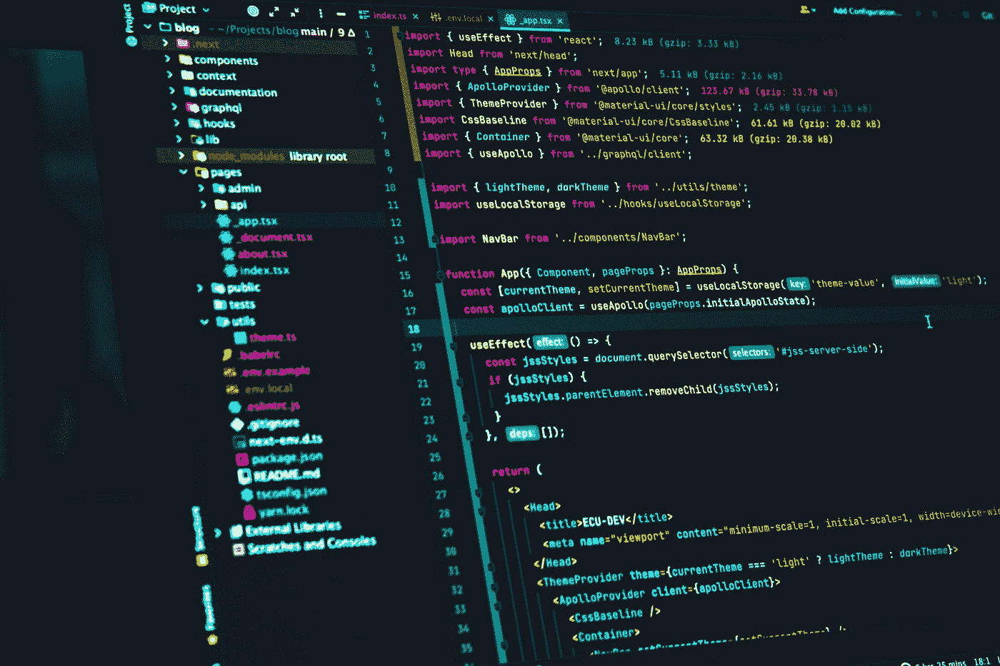

# 10 个最常见的 JavaScript 问题——以及如何解决它们

> 原文：<https://javascript.plainenglish.io/10-of-the-most-common-javascript-problems-and-how-to-fix-them-a80b08c369f3?source=collection_archive---------14----------------------->

## JavaScript 问题？我们掩护你！

Photo by [AltumCode](https://unsplash.com/@altumcode?utm_source=medium&utm_medium=referral) on [Unsplash](https://unsplash.com?utm_source=medium&utm_medium=referral)

JavaScript 对于 web 开发人员来说可能是一个强大的工具，但也可能是一个巨大的痛苦。在本文中，我们将看看一些最常见的 JavaScript 问题以及如何避免它们。

**1。确保你的代码整洁有序。**

JavaScript 最常见的一个问题是它可能非常混乱，难以阅读。这使得调试变得困难，并可能导致错误。确保你的代码整洁有序，便于阅读和理解。

**2。用注释来解释你的代码。**

JavaScript 的另一个常见问题是很难理解一段代码做了什么。使用注释来解释您的代码，以便其他人能够理解它。

**3。不要使用太多的全局变量。**

全局变量会使调试代码变得困难。如果你使用了太多的全局变量，很难跟踪它们。尽量限制使用的全局变量的数量。

Photo by [Claudio Schwarz](https://unsplash.com/@purzlbaum?utm_source=medium&utm_medium=referral) on [Unsplash](https://unsplash.com?utm_source=medium&utm_medium=referral)

**4。小心嵌套函数。**

嵌套函数可能很难调试。如果你对嵌套函数有困难，试着简化它。

**5。使用正确的数据类型。**

使用错误的数据类型会导致错误。确保对您正在处理的数据使用正确的数据类型。

**6。不要使用 eval()。**

Eval()是一个危险的函数，可用于执行任意代码。它可用于恶意利用系统。除非绝对需要，否则避免使用 eval()。

Photo by [Lautaro Andreani](https://unsplash.com/@lautaroandreani?utm_source=medium&utm_medium=referral) on [Unsplash](https://unsplash.com?utm_source=medium&utm_medium=referral)

**7。小心第三方库。**

第三方库是扩展网站功能的好方法。但是，使用它们时应该小心。请确保您信任该库的来源。

**8。使用 JavaScript linter。**

JavaScript linter 是一个可以帮助你发现代码中错误的工具。它还可以帮助您实施编码标准。有许多不同的棉绒，所以选择一个适合你的需求。

**9。使用代码质量工具。**

代码质量工具可以帮助您找到代码中的错误。它还可以帮助您提高代码的质量。有许多不同的代码质量工具可用，所以选择一个适合你的需要。

Photo by [Juanjo Jaramillo](https://unsplash.com/es/@juanjodev02?utm_source=medium&utm_medium=referral) on [Unsplash](https://unsplash.com?utm_source=medium&utm_medium=referral)

**10。测试您的代码。**

测试代码是发现错误的最好方法。确保在发布代码之前对其进行彻底的测试。

总之，JavaScript 对于 web 开发人员来说是一个很好的工具。然而，这也可能是一种巨大的痛苦。在本文中，我们研究了一些最常见的 JavaScript 问题以及如何避免它们。通过遵循这些提示，您可以避免许多常见的 JavaScript 问题。

***离开之前:***

 [## 如果你还不是灵媒会员，今天就加入灵媒吧！——阿兰·s

### 每月只需 5 美元，你就可以接触到该媒体的所有文章。你的会员费的一部分给了你所阅读的作家，这是一个不可思议的交易，而且对你来说没有额外的费用。

medium.com](https://medium.com/@alains/membership) 

所以不要等待，现在就注册，开始享受这一媒介所提供的一切。

***如果你喜欢这篇文章，*** 请[跟着我](https://medium.com/@alains)给我几个掌声，或者也许*如果你想支持我，* [***请我喝杯咖啡！***](https://ko-fi.com/alains)*我将不胜感激！提前感谢。*

****我所有的文章都可以在*** [***这个页面上找到******。***](https://medium.com/@alains)*

*[*在 Twitter 上关注我*](https://twitter.com/alainsamego) *如果你想了解更多内容:**

*-网上赚钱
-被动收入
-数字资产
-副业
-自我提升
-个人发展
-关系
-编程
-数据科学
-人工智能
-小说*

**更多内容看* [***说白了. io***](https://plainenglish.io/) *。报名参加我们的**[***免费周报***](http://newsletter.plainenglish.io/) *。关注我们关于*[***Twitter***](https://twitter.com/inPlainEngHQ)*和*[***LinkedIn***](https://www.linkedin.com/company/inplainenglish/)*。查看我们的* [***社区不和谐***](https://discord.gg/GtDtUAvyhW) *加入我们的* [***人才集体***](https://inplainenglish.pallet.com/talent/welcome) *。***