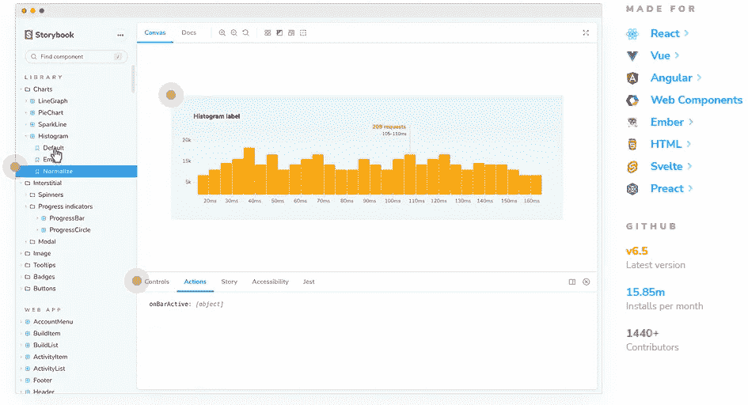
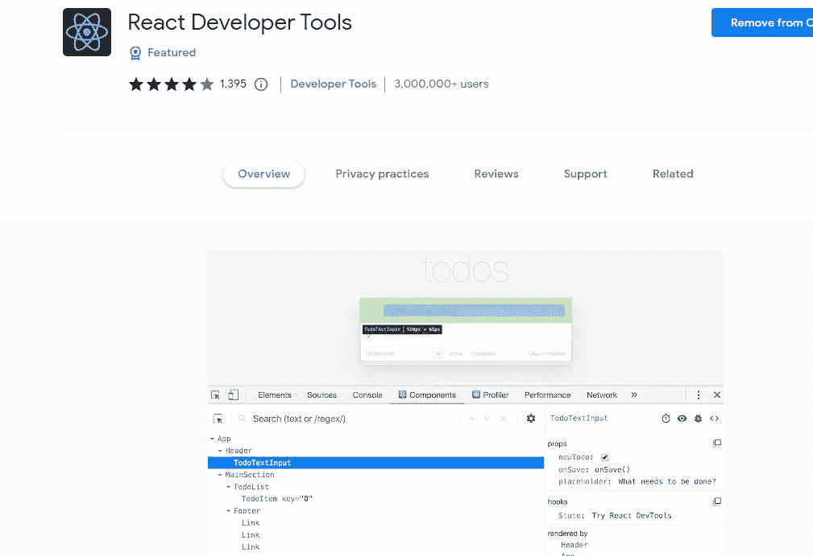
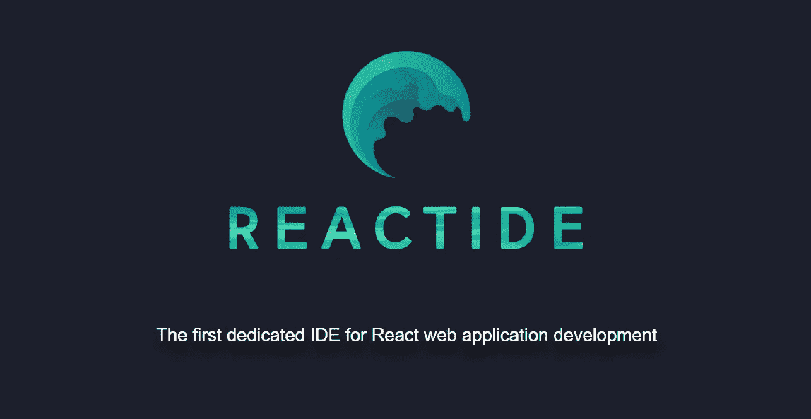
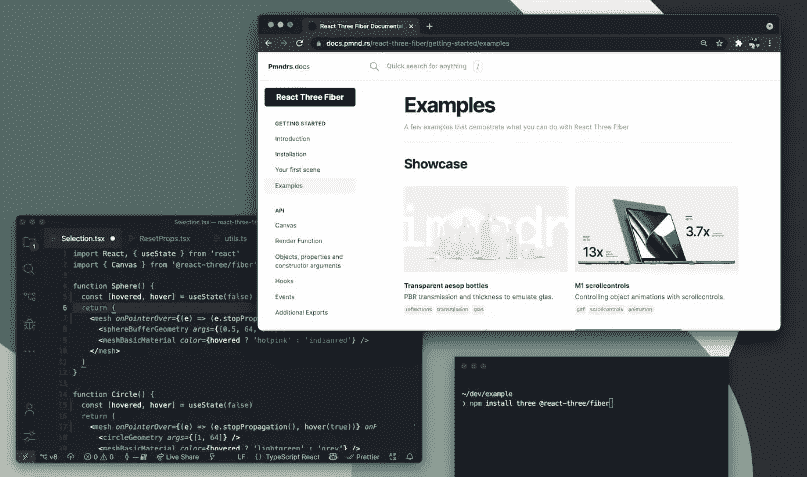
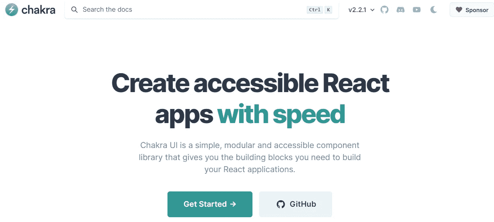
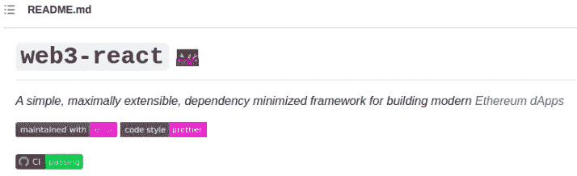
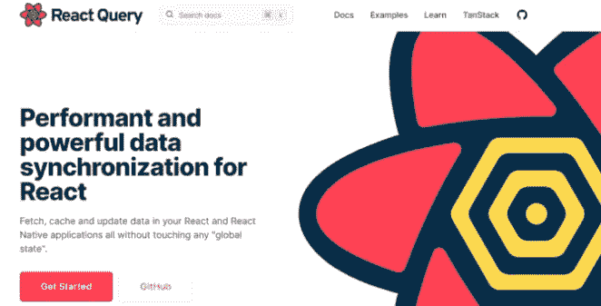
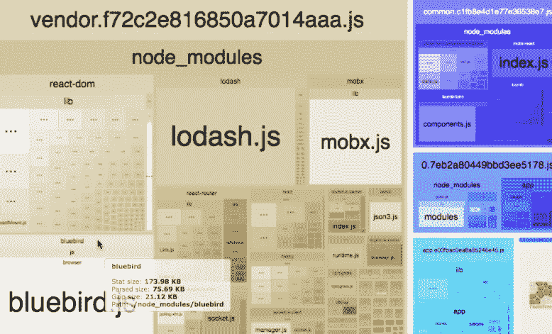
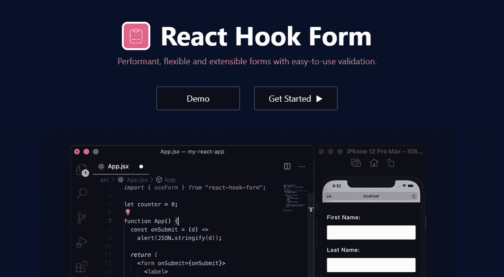
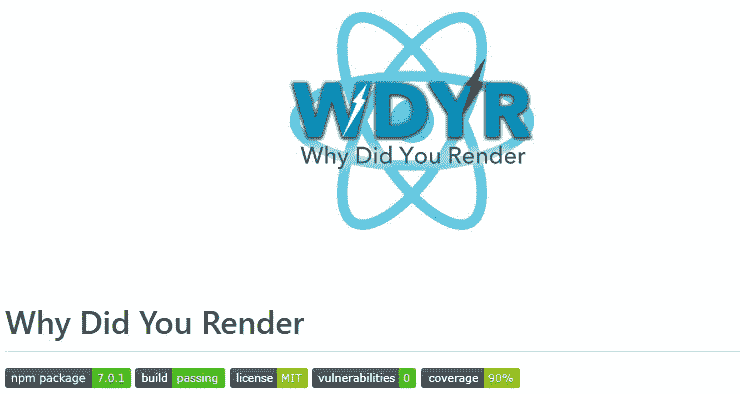

# 2022 年你应该知道的 10 个强大的反应工具

> 原文：<https://javascript.plainenglish.io/10-powerful-react-tools-that-you-should-know-in-2022-76efa7fa711d?source=collection_archive---------1----------------------->

## 牛逼的 React 开发者工具，帮你为项目写干净的代码。

Photo by [Mohammad Rahmani](https://unsplash.com/@afgprogrammer?utm_source=medium&utm_medium=referral) on [Unsplash](https://unsplash.com?utm_source=medium&utm_medium=referral)

React 是一个非常强大和流行的开源 JavaScript 库，现在大多数 web 开发人员都在使用它。它有很多有用的特性，使得创建更快、更易访问的现代网站和网络应用程序变得更加容易。

React 为您提供了一种为单页面应用程序构建用户界面的简单方法。如今，许多科技公司都在使用这个强大的库来创建他们需要的超快的网络应用程序。

因此，对知道并掌握反应的开发人员有很高的要求。这是所有 web 开发人员都应该具备的技能之一。React 库的好处是它有许多有用的开发工具，可以帮助您为项目编写高效、干净的代码。

这些工具可以是任何东西，比如库、框架、测试工具、扩展、代码生成器等等。

因此，有很多强大的 React 工具可以帮助我们编写干净、健壮、更高效的代码。除此之外，工具可以节省我们一些开发时间，帮助我们作为开发人员更有效率。

在这篇文章中，我们将看看 2022 年所有 web 开发人员需要使用的一些最好的 React 工具。所以让我们开始吧。

# 1.故事书

当你在做 UI 开发时，故事书是一个非常棒的开源工具。它可以帮助您更快地独立构建用户界面组件和页面。

Capture by the author from Storybook.

Storybook 是为许多其他库和框架设计的，不仅仅是 React。Storybook 的美妙之处在于，它是一个开发环境，允许您独立创建 UI 组件，并在该环境中展示它们。

Storybook 运行在 React 应用程序之外，允许您创建 UI 组件，而无需考虑业务逻辑将如何工作。因此，对于当今的每个 React 开发人员来说，它都是一个很好的有用的工具。

# 2.React 开发工具

React 开发者工具是每个使用 React 的人必备的扩展。这是调试 React 代码和访问页面上呈现的所有组件的好方法。

Capture by the author from React dev tools.

这将为您提供大量关于您的代码和 web 应用程序中的组件的信息。所以你可以在你的浏览器中下载[扩展](https://chrome.google.com/webstore/detail/react-developer-tools/fmkadmapgofadopljbjfkapdkoienihi?hl=en)，并开始在你的项目中使用它。

# 3.反应素

[Reactide](https://reactide.io/) 是一个非常棒的 ide，致力于开发 React web 应用。它有许多现成的特性，比如组件可视化和热模块重载。

Capture by the author from Reactide.

Reactide 为您提供了一个集成了服务器和浏览器模拟器的优秀开发环境。所以如果你想使用这个很酷的 IDE，你不需要配置任何服务器或者任何构建工具。

# 4.反应三种纤维

[React Three Fiber](https://github.com/pmndrs/react-three-fiber) 是 JavaScript 3D 动画库 three.js 的出色渲染器工具。

如果你不知道 three.js，它是一个使用 WebGL 的 3D 动画库，你可以使用它在浏览器中创建令人敬畏的 3D 动画环境。

Capture by the author from React Three Fiber.

因此，使用 React Three Fiber，您可以在 React 应用程序上创建许多非常酷、非常棒的 3D 动画。你可以取得很多成就。这只是需要一点学习，但是一旦你从他们的文档中学习，你就可以创造出很多东西，比如 3D 菜单或者有很酷动画的游戏。

# 5.Chakra UI

[Chakra UI](https://chakra-ui.com/) 是最好和最现代的 React UI 组件库之一，它为您提供了 React 应用程序所需的所有构建模块。

Chakra UI 非常基于 Tailwind CSS，它允许您通过使用基于道具的系统轻松地设计组件的风格。

Capture by the author from Chakra UI.

因此，如果您想在为应用程序构建 React 组件时节省时间并提高效率，这是一个非常好的可访问库。

# 6.web 3-反应

[Web3-React](https://github.com/Uniswap/web3-react) 是流行库 *Web3* 的一个很棒的 React 实现，这个库用于与以太坊区块链以及其他运行以太坊虚拟机的区块链进行通信，包括 Avalanche、币安智能链和 Solana。

Capture by the author from Web3-React.

# 7.反应查询

React Query 是另一个很棒的库，用于获取数据。它为您在 React 应用程序中同步、检索、缓存和更新服务器状态提供了一种简单的方法。

Capture by the author from React Query.

# 8.束分析器

[Bundle Analyzer](https://github.com/webpack-contrib/webpack-bundle-analyzer) 是一个非常有用的 CLI 实用程序和 Webpack 插件。它为您提供了一个可缩放的动态树形图，为您的应用程序包提供了一个可视化的表示。

Capture by the author from Bundle Analyzer.

这个工具可以帮助我们查看捆绑包的内容，并确定哪些模块应该删除，哪些模块占用的空间最大。

# 9.反应挂钩形式

在 React 和 React Native 中创建性能表单验证时，React Hook Form 是另一个很棒的库。

Capture by the author from React Hook Form.

在我看来，这个有用的库使用起来更快更简单。如果你还没有尝试过，我总是建议你这样做。

# 10.你为什么渲染？

如果你正在寻找一个有用的工具来通知你关于可避免的组件重渲染，那么`[why did you render](https://github.com/welldone-software/why-did-you-render)`是一个在你的项目中使用的很好的 React 路径。

Capture by the author from WDYR.

它使您可以很容易地知道组件重新渲染的时间和原因。这非常有用，尤其是在调试和性能问题上。

# 结论

因此，这是 2022 年每个 React 开发人员的一些强大工具的小列表。使用这些强大的 React 工具不仅可以让你更快地构建应用程序，还可以编写出性能更好、更简洁的代码。

作为 React 开发人员，这些令人敬畏的工具对于您的生产力非常有用和重要。所以试着将它们用在你的优势上。

*感谢您阅读本文。此外，如果你发现我的内容有用，而你不是一个媒体成员，你可以抓住你的媒体成员* [***这里***](https://mehdiouss.medium.com/membership) *(媒体推荐链接)获得无限制的* ***访问媒体上的所有内容*** *和支持我们作为作家。*

 [## 通过我的推荐链接加入 Medium-Mehdi Aoussiad

### 阅读 Mehdi Aoussiad(以及媒体上成千上万的其他作家)的每一个故事。您的会员费直接支持…

mehdiouss.medium.com](https://mehdiouss.medium.com/membership) 

**延伸阅读:**

 [## 11 个有用的前端 Web 开发人员 Web 应用程序来提高工作效率

### 2022 年每个网络开发者都应该使用的令人敬畏的网络应用。

javascript.plainenglish.io](/11-useful-frontend-web-developer-web-apps-to-boost-productivity-c8b2afeab251)  [## 您应该知道的 6 个非常棒的 JavaScript DOM 技巧和窍门

### 作为开发人员，您需要了解的强大的 JavaScript DOM 技巧和提示。

javascript.plainenglish.io](/6-awesome-javascript-dom-tips-and-tricks-you-should-know-d784ef3a5232)  [## 帮助您在 React 中更快开发的 5 种工具和实践

### React 工具、技巧和最佳实践将帮助您更快地构建应用

javascript.plainenglish.io](/5-tools-practices-to-help-you-develop-faster-in-react-b884c1b20fc2)  [## 像专家一样记录 React 代码的 5 个开发工具

### 游泳，合流，咕噜，组队堆栈溢出，平板。这些是你应该在 2023 年尝试的顶级 React doc 工具

javascript.plainenglish.io](/5-dev-tools-for-documenting-react-code-like-a-pro-b9bb70420a9d) 

*更多内容请看*[***plain English . io***](https://plainenglish.io/)*。报名参加我们的* [***免费周报***](http://newsletter.plainenglish.io/) *。关注我们关于*[***Twitter***](https://twitter.com/inPlainEngHQ)[***LinkedIn***](https://www.linkedin.com/company/inplainenglish/)*[***YouTube***](https://www.youtube.com/channel/UCtipWUghju290NWcn8jhyAw)*[***不和***](https://discord.gg/GtDtUAvyhW) ***。*****

*****对缩放您的软件启动感兴趣*** *？检查* [***电路***](https://circuit.ooo?utm=publication-post-cta) *。***