# 让你的一天充满活力的 10 个编程迷因

> 原文：<https://javascript.plainenglish.io/10-programming-memes-to-make-your-day-843c919f8b95?source=collection_archive---------3----------------------->

## 医生为 IT 专业人士开出的幽默模因每日汇编

Photo by [Megan Bucknall](https://unsplash.com/@meganmarkham?utm_source=medium&utm_medium=referral) on [Unsplash](https://unsplash.com?utm_source=medium&utm_medium=referral)

我们很多人都有打开脸书或 Instagram 开始新一天的习惯。像我这样的一些人喜欢在忙碌了一天后刷新我们的心情，或者只是让我们的脸上带着微笑。

在这里，我正在创建一个每日文章系列，可能需要 1-2 分钟来阅读，但保证会让你脸上带着微笑。

# 我们开始吧

# 未来是人工智能，但有时它是这样的…

Picture Credit: [https://www.facebook.com/yuva.krishna.memes/](https://www.facebook.com/yuva.krishna.memes/)

# 你偷的是我的代码...它来自堆栈溢出

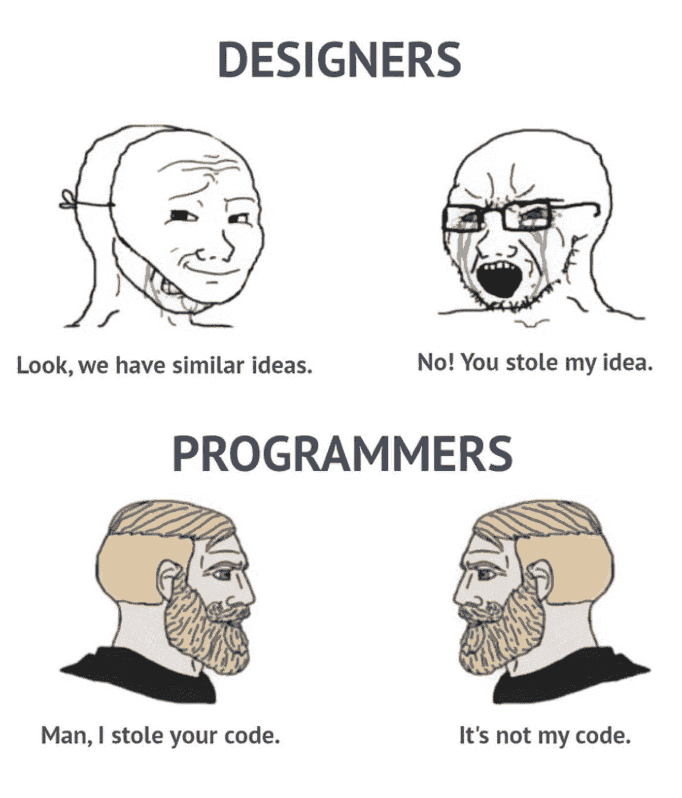

Picture Credit:[https://www.facebook.com/javascriptJS](https://www.facebook.com/javascriptJS)

# 谷歌是我们的生命线…

Picture Credit:[https://www.facebook.com/groups/it.humor.and.memes](https://www.facebook.com/groups/it.humor.and.memes)

# 嘘…

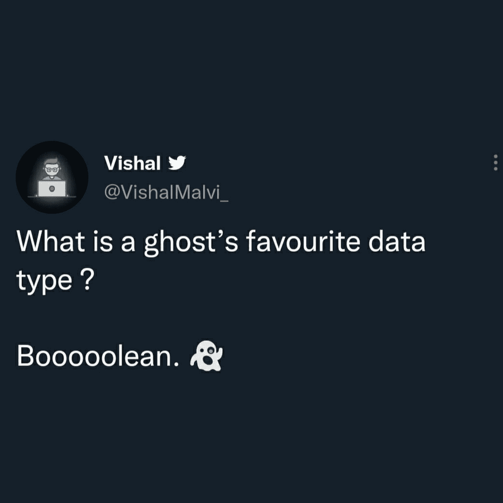

Picture Credit: [https://www.facebook.com/groups/programmingmemesworld/](https://www.facebook.com/groups/programmingmemesworld/)

# 我们这里不这样做…

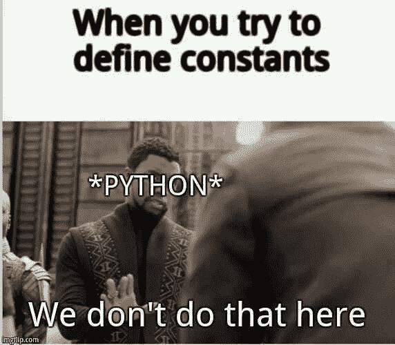

Picture Credit: [https://www.facebook.com/groups/programmingmemesworld/](https://www.facebook.com/groups/programmingmemesworld/)

# 程序员是如何…

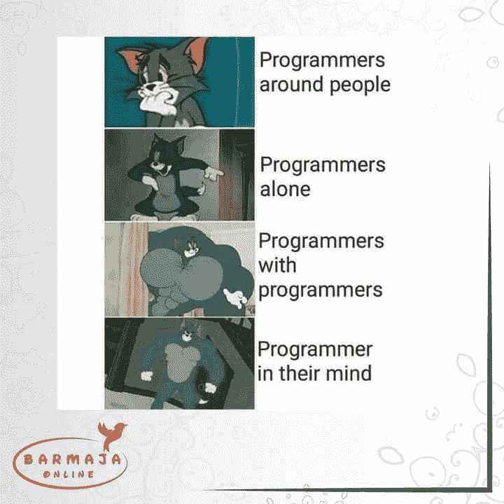

Picture Credit:[https://www.facebook.com/groups/151139362111349/media](https://www.facebook.com/groups/151139362111349/media)

# 为什么是我？

Picture Credit:[https://www.facebook.com/groups/programmer.wey/media](https://www.facebook.com/groups/programmer.wey/media)

# 那是我吗？

Picture Credit:[https://www.facebook.com/jokesvala/](https://www.facebook.com/jokesvala/)

# 谁更喜欢 if-else 而不是 switch？

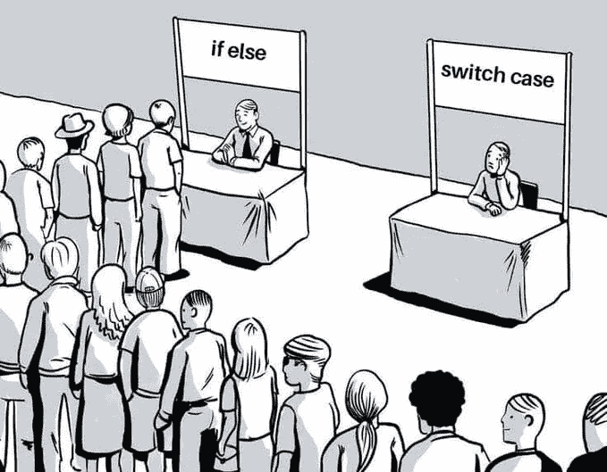

Picture Credit:[https://www.reddit.com/r/ProgrammerHumor](https://www.reddit.com/r/ProgrammerHumor)

# 我们回去工作吧。LOL。

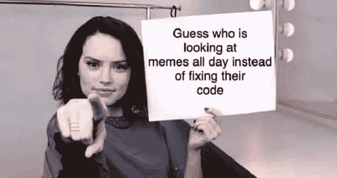

Picture Credit:[https://programmerhumor.io/programming-memes/you-got-me/](https://programmerhumor.io/programming-memes/you-got-me/)

# 额外内容

# 新员工的工资是基于市场的吗？老员工的加薪是基于市场的吗？？？

[https://www.monkeyuser.com/2020/new-hire/?sc=true&dir=random](https://www.monkeyuser.com/2020/new-hire/?sc=true&dir=random)

# 它直接进入我的大脑…

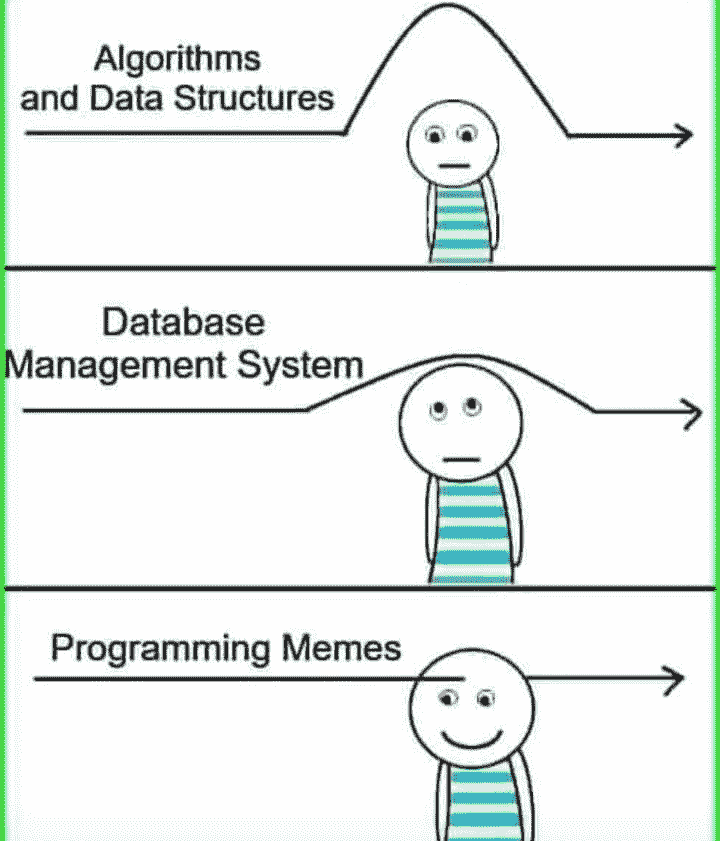

[https://www.facebook.com/photo/?fbid=319001836626514&set=gm.2881565295444354](https://www.facebook.com/photo/?fbid=319001836626514&set=gm.2881565295444354)

# 我需要问是谁帮助了我… LOL

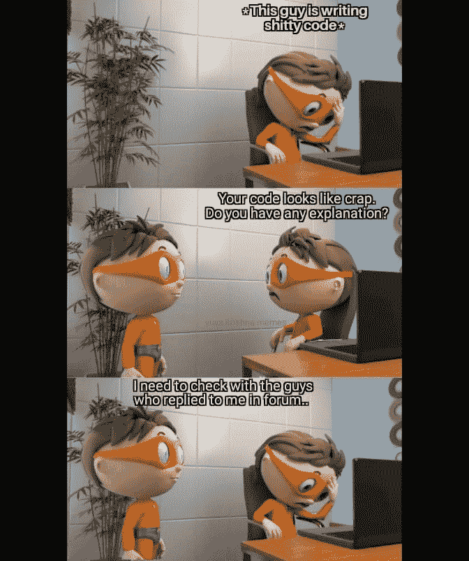

[https://www.facebook.com/yuva.krishna.memes/photos/a.105527467815845/376844277350828/](https://www.facebook.com/yuva.krishna.memes/photos/a.105527467815845/376844277350828/)

# 从哪里开始？

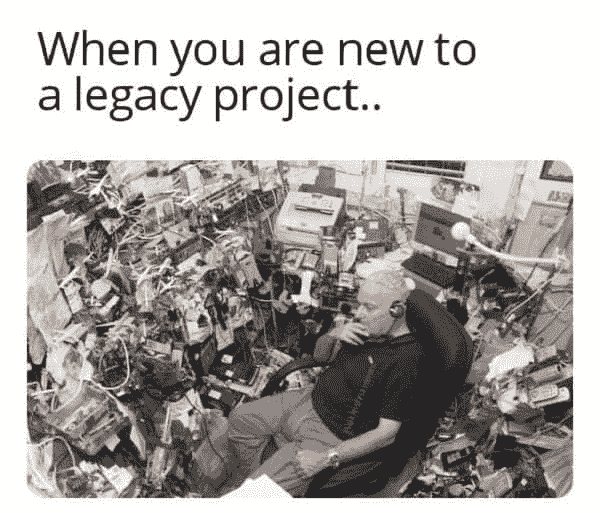

[https://www.facebook.com/javascriptJS/photos/a.1387402908063976/2261895900614668/](https://www.facebook.com/javascriptJS/photos/a.1387402908063976/2261895900614668/)

# 在家工作或学习时可以考虑哪些交通？

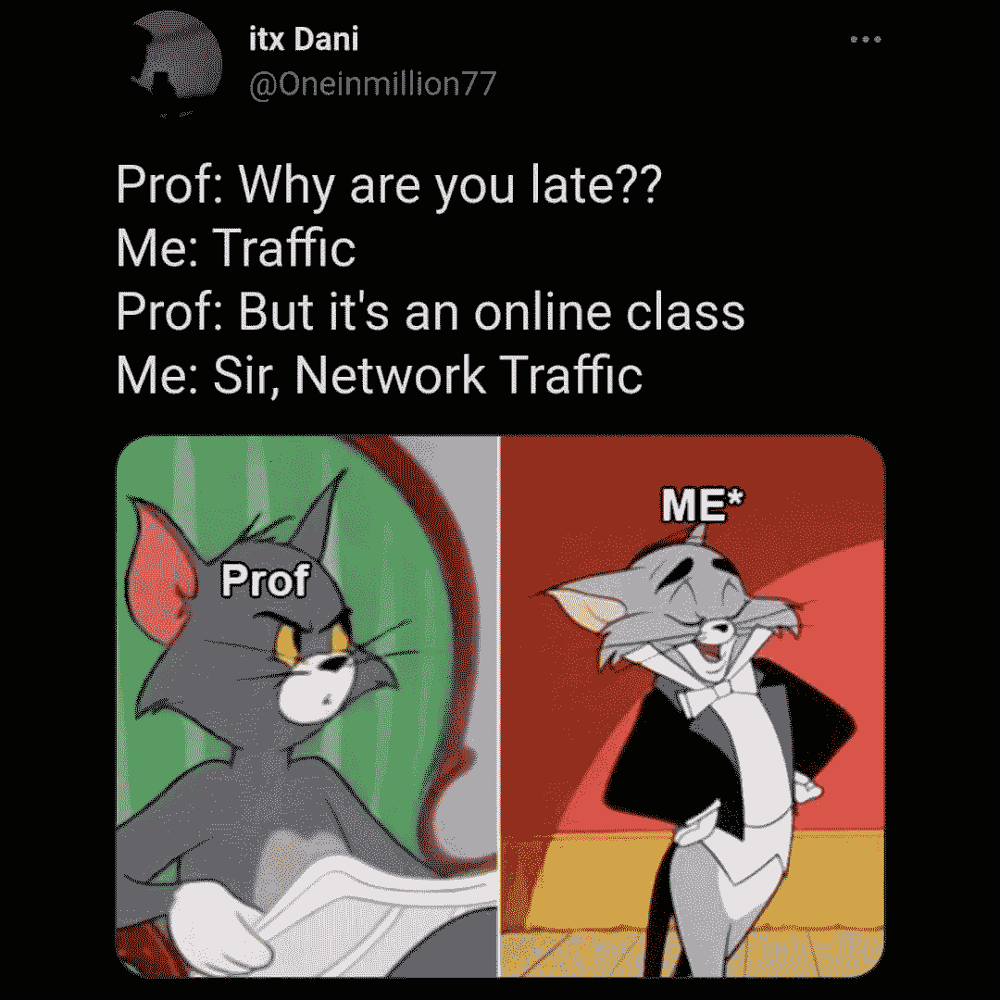

[https://www.facebook.com/adultswholovecartoons/photos/a.105042201224485/361407612254608/](https://www.facebook.com/adultswholovecartoons/photos/a.105042201224485/361407612254608/)

# 现在让我们来评论一下..我们稍后会修复它…

[https://www.facebook.com/jokesvala/photos/a.2330223400336101/6283557961669272/](https://www.facebook.com/jokesvala/photos/a.2330223400336101/6283557961669272/)

# 正则表达式可以在网上找到…老实说，从来没有试图学习这个东西…

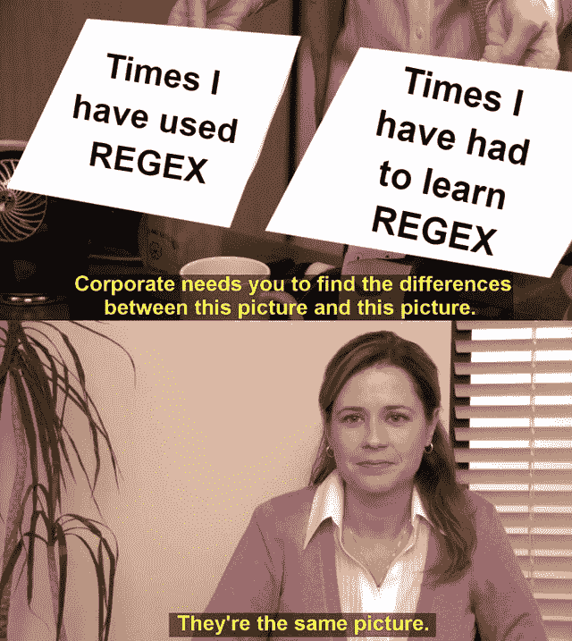

[https://www.facebook.com/DZoneInc/photos/10159094540494712](https://www.facebook.com/DZoneInc/photos/10159094540494712)

# 所以编程给你守卫还是成为守卫？

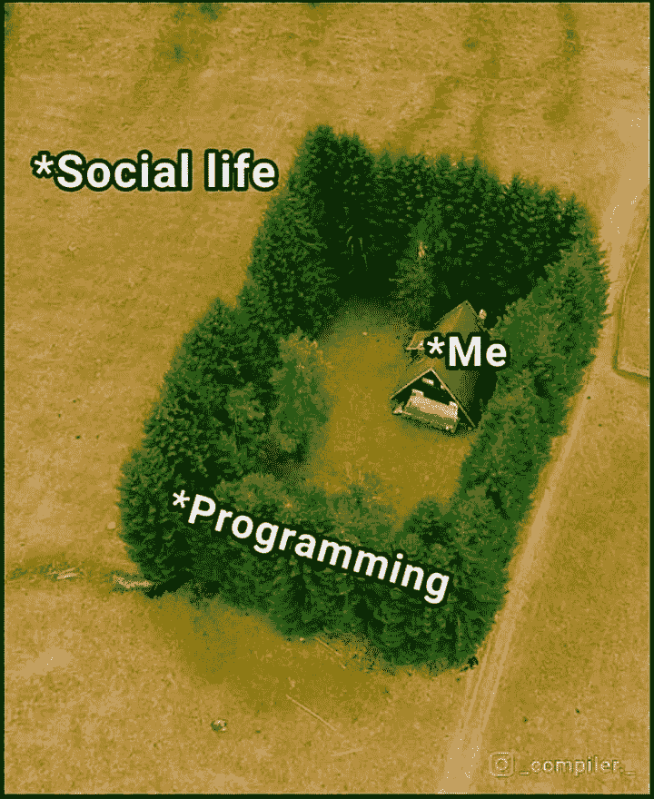

[https://www.facebook.com/Coding000/photos/a.100326075349488/210613724320722/](https://www.facebook.com/Coding000/photos/a.100326075349488/210613724320722/)

# 她的眼睛说明了一切…

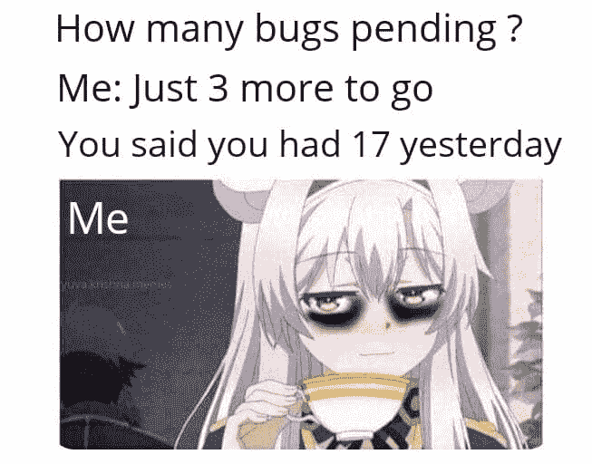

[https://www.facebook.com/yuva.krishna.memes/photos/a.105527467815845/376834894018433/](https://www.facebook.com/yuva.krishna.memes/photos/a.105527467815845/376834894018433/)

# 测试人员无论如何都能找到 bug 即使它是有效的或无效的…

[https://www.facebook.com/javascriptJS/photos/2210011465803112](https://www.facebook.com/javascriptJS/photos/2210011465803112)

# 为什么有人问它，盖伊？他们应该打电话给医生…

[https://www.facebook.com/photo/?fbid=10159583001913436&set=gm.6450394781652918](https://www.facebook.com/photo/?fbid=10159583001913436&set=gm.6450394781652918)

# 你的地址是什么？让我们检查一下你的 IT 幽默…

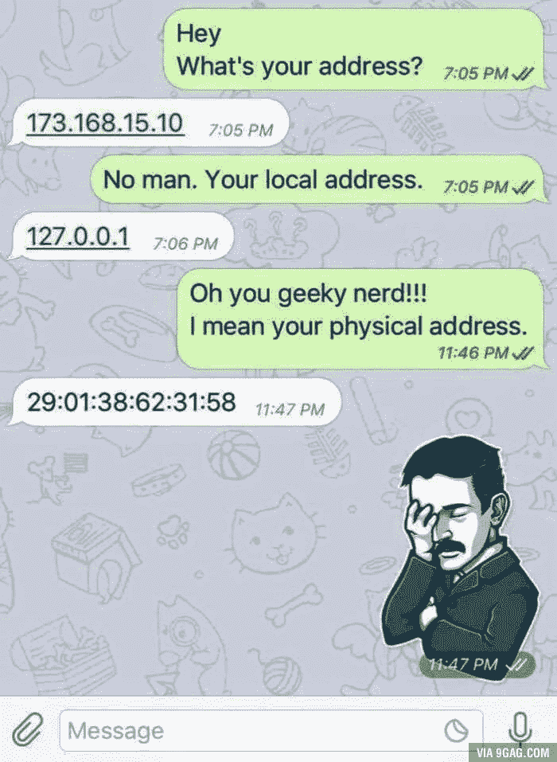

[https://www.facebook.com/techwithcodex/photos/a.137007467972178/333269081679348/](https://www.facebook.com/techwithcodex/photos/a.137007467972178/333269081679348/)

祝你度过快乐的一天。

*更多内容看* [***说白了。报名参加我们的***](https://plainenglish.io/) **[***免费周报***](http://newsletter.plainenglish.io/) *。关注我们关于*[***Twitter***](https://twitter.com/inPlainEngHQ)*和*[***LinkedIn***](https://www.linkedin.com/company/inplainenglish/)*。加入我们的* [***社区***](https://discord.gg/GtDtUAvyhW) *。***