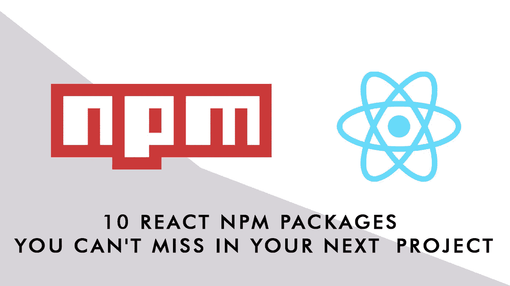

# 在下一个项目中，你不能错过的 10 个 React NPM 软件包

> 原文：<https://javascript.plainenglish.io/10-react-npm-packages-you-cant-miss-in-your-next-project-e8cf3df195d4?source=collection_archive---------8----------------------->

## 10 个 NPM(专业)软件包你将需要在 React 中搭建你的下一个项目

每当你开始一个新的项目，尤其是一个客户的项目，你都会被给予一些要求:*“我需要我的用户可以订阅我的时事通讯，”*或者，*“我需要找回被遗弃的购物车，”或者，“我需要在黑暗模式下浏览网站。”“我需要……我需要……我需要。”*

有时，您需要自己编写所需功能的代码，但有时有一些包(制作良好的包)可以简化您的生活，并处理最繁琐(或复杂)的任务。这里我列出了我在开发过程中经常使用的 10 个(+1)包。我从我在上一个项目中最常用的一个中选择了它们，现在至少有 4 个在我的应用样板中是默认的。

这个简短的指南只描述了这些包，它没有提供任何示例代码或真正的实现。如果你需要更详细的教程，包括代码和例子，请给我留言(或者通过 Medium 联系我)

## Firebase + React Firebase 挂钩(+React Firebase UI)

在 Firebase API v9 之前，这是在 React 项目中集成 Firebase 的完美组合，不幸的是 UI 部分还不兼容 v9。https://www.npmjs.com/package/firebase 是 React 中利用所有谷歌 Firebase 服务的主要工具，最新版本 9 完全重新设计，采用模块化结构，占地面积更小

React Firebase 挂钩([https://github.com/csfrequency/react-firebase-hooks](https://github.com/csfrequency/react-firebase-hooks))，适用于 v9 和之前的 Firebase 版本，是一组 React 挂钩，用于与 Firebase 进行交互，尤其是与身份验证和 Firestore 模块进行交互(但也与存储、功能和消息传递进行交互)。使用这个模块保持与 Firebase 的工作非常简单明了。
**FirebaseUI React 组件**([https://www.npmjs.com/package/react-firebaseui](https://www.npmjs.com/package/react-firebaseui))，如果你还没有使用 Firebase 的第 9 版(但你肯定应该使用)，或者你正在以 *compat* 模式使用 Firebase，这个模块有助于用预构建的组件构建接口(主要用于身份验证)。

我个人建议使用 v9(尤其是在新项目中)并手工编写接口组件，这是值得的，因为 v9 包含了很大的改进。

## Mailchimp

官方的 mailchimp 库([https://www . npmjs . com/package/@ mailchimp/Mailchimp _ marketing](https://www.npmjs.com/package/@mailchimp/mailchimp_marketing))向客户端公开了所有的 Mailchimp API 端点(v3)，以便您可以构建一个包含 Mailchimp 功能的项目，从简单的(例如，一个带有新闻邮件注册表单的组件)，到复杂的(一个将电子商务产品同步到 Mailchimp 的功能)，到非常清晰的(您的 Mailchimp 帐户的完整管理界面)。

## Fontsource

font Source(【https://fontsource.org/】T2)是来自 Vercel 的一个项目，它允许你的 React 应用程序使用 NPM 包自托管开源字体(例如谷歌字体，甚至更多)。使用自承载字体可以提高性能并减少呈现阻塞的 HTTP 请求。简单地安装字体，就像你对其他 NPM 软件包所做的那样，字体就可以被需要和使用了。

## 反应挂钩形式

react Hook Form(【https://react-hook-form.com/】T4)是一个非常灵活和多功能的表单生成器，具有内置的验证功能。如果您需要向应用程序添加复杂的表单(大量字段、大量验证规则)，React Hook Form 可以简化编写代码的任务，绕过所有手动状态更新，并优化重新呈现以获得更好的性能。

## 框架运动

一个简单但强大的动画库，Framer Motion([https://www.framer.com/motion/](https://www.framer.com/motion/))，它比 GSAP 更容易实现和使用，但它将覆盖 99%的动画和页面过渡需求。它可以处理动画、路径动画、手势、滚动行为等等，使用了一个声明性的语法，非常容易使用，但是功能非常强大。

## GraphQL 请求

如果您的应用程序只需要从 GraphQL source 获取数据，graph QL-request([https://github.com/prisma-labs/graphql-request](https://github.com/prisma-labs/graphql-request))是查询(和改变)您的端点的最简单和最小的客户端。它支持头认证，因此可以用来查询需要 JWT 认证的 GraphQL。

## 祖斯坦德

这是我目前最喜欢的状态管理系统。它非常简单易用，不需要将你的应用程序包装在提供商中，你可以创建你的商店作为一个挂钩，然后它可以与你的应用程序一起在任何地方使用。它还支持持久性中间件在本地保存状态。如果您需要管理像电子商务购物车、用户首选项等状态，并且不需要 Redux 的复杂性，这非常有用(即使 Zustand 可以使用 Redux 样式的语法，如果您需要的话)。

## 顺风(+插件)

顺风 CSS(【https://tailwindcss.com/】)是我 CSS 框架的首选，我启动了包括它在内的每个新项目(及其表单插件【https://tailwindcss.com/docs/plugins#forms】)。使用它开箱即用或扩展它与您的自定义设置的 CSS 实用工具。

## 反应日历

react Calendar([https://github.com/wojtekmaj/react-calendar](https://github.com/wojtekmaj/react-calendar))当我需要在项目中添加交互式日历时，这是我的首选。它有大量的道具和回调来定制它的每个方面。构建预订和预约应用程序的完美伴侣，交付调度程序，其中您需要在运行时启用/禁用日期。

## 节点邮件(+手柄)

node mailer([https://nodemailer.com/about/](https://nodemailer.com/about/))当我需要从 React 应用程序发送电子邮件时，这是我的标准；它需要(当然)访问 SMTP 主机来发送电子邮件(但你可以免费找到一些免费的 SMTP 层)。此外，如果你需要增强电子邮件的外观，也可以安装把手([https://handlebarsjs.com/](https://handlebarsjs.com/))，这是一个模板系统，你可以用它来制作电子邮件的内容。

## +1 下一个主题

如果你(像我一样)正在使用 NextJs 作为框架，你不能错过 Next Theme([https://github.com/pacocoursey/next-themes](https://github.com/pacocoursey/next-themes))一个主题的抽象提供者。通过几行代码，它将允许你的站点在黑暗模式下显示，通过几行代码，你也可以构建一个黑暗主题切换器。

*更多内容请看*[***plain English . io***](http://plainenglish.io/)*。报名参加我们的* [***免费周报***](http://newsletter.plainenglish.io/) *。在我们的* [***社区***](https://discord.gg/GtDtUAvyhW) *获得独家获得写作机会和建议。*