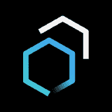

# 2022 年你需要知道的 10 个 React UI 组件库和框架

> 原文：<https://javascript.plainenglish.io/10-react-ui-component-libraries-frameworks-you-need-to-know-in-2022-6079f1e002b2?source=collection_archive---------5----------------------->

## 当今最有用、最强大、总体上最好的 React UI 组件库和框架。

Image Source: Massive Pixel Creation

React UI 组件库和框架允许您比以前更快、更容易地构建现代 web 应用程序。随着竞争和创新的不断增加，React UI 组件库生态系统在过去几年中以惊人的速度增长。

Image Source: thin slices

为了帮助你挑选出最好的 React UI 组件库和框架，我们整理了这个列表，在这里你可以找到当今可用的前 10 个最有用、最强大和最全面的选项。

*   **MUI(原 Material-UI)**

Image Source: mui.com

实现谷歌材质设计的一整套 React 组件。它还提供自定义渲染器来创建原生 iOS 和 Android 组件。

它被脸书、阿里巴巴和 Evernote 等公司使用。MUI 使用了一种名为 Material Design 的设计语言，由 Google 于 2014 年推出，主要关注大胆的颜色和干净的线条。它非常强调良好的用户体验。

Material-UI 附带了 60 多个现成的高质量组件，这些组件完全可定制且易于使用。这对于初学者来说是一个很棒的库，因为你所需要的只是一个 npm 安装命令！

大多数文档页面都有实时代码示例和每个组件的详细信息。使用 material-UI 框架的另一个优点是它是轻量级的、快速的，并且一点也不臃肿。

根据其官方网站，它涵盖了 Bootstrap v4 的 70% ~ 80%的功能，加上它在构建应用程序时节省了您的时间:无需从头重写。

*   **语义 UI**

Image Source: Semantic UI

语义是一个受欢迎的选择，因为它简单，不需要花费太多精力去学习，并且提供了企业级的特性。它庞大的元素库包括边栏、工具提示、导航菜单、下拉菜单、标题栏和按钮。布局选项包括选项卡、卡片和折叠。

默认情况下，它还包括 20 种颜色主题，因此您不必花费时间来设计适合您品牌的外观。

除了所有这些令人惊叹的特性，Semantic 还内置了自动完成字段和日期选择器等功能，这些对于开发人员来说很难自己创建，但是 Semantic 只需一行代码就可以完成。

这些特性听起来可能不太重要，但是如果你想要项目间的一致性，并且真的想要一种简单的方法来创建高质量的网站，像 Semantic 这样的库应该是你的首选。

为了在您的项目中充分利用语义用户界面， [**雇佣反动开发者**](https://www.valuecoders.com/hire-developers/hire-reactjs-developers?utm_source=reactjs&utm_medium=Guest_Blog&utm_campaign=Medium&utm_id=NKY) 在最好的**反动开发公司**工作。通过这样做，您将得到一个专家，他可以充分利用语义用户界面的特性来提高应用程序的性能。

*   **蚂蚁设计**

Image Source: GitHub

这种设计语言是为了让你的组件可以理解。他们希望他们的用户能够阅读他们的代码，并理解他们在看代码时在做什么。

这个用户界面框架是由阿里巴巴编写的，并已经在他们的许多旗舰网站上使用，比如淘宝和阿里快递。它目前有超过 100 万下载从 NPM，所以你知道它的工作为他们。

Ant Design 强调简单而有意义的代码，可以很容易地在项目之间移植或合并。

其最终目标是通过其出色的用户界面设计技能为开发人员节省时间并提高团队内部的效率，这基本上消除了不会说彼此语言的团队成员之间沟通不畅的问题。有了这些目标，蚂蚁设计似乎是一个明确的胜利！

***此外，请阅读*** [***了解美国、欧洲和印度的反应性开发成本***](https://www.valuecoders.com/blog/top-and-best-companies/glean-insight-into-reactjs-development-cost-in-usa-europe-and-india/)

*   **反应堆陷阱**

Image Source: 6–4–0 — reactstrap.netlify.app

这是一组建立在引导 4 之上的反应引导组件。它提供了多种方式来开始反应——引导和定制应用程序的外观和感觉。

生成的组件已经为 JIT 和 AOT 环境做好了准备(Webpack，Browserify 等)。它还附带有用的开发工具。这意味着您可以在没有额外配置的情况下使用 CSS 模块或 SASS。

如果您正在使用巴贝尔，也可以对其进行现成的配置。或者，如果您不想使用可配置的构建设置，有一个包含所有各种设置的伞形构建。选择权在你手中！

此外，它还附带了三个不再遵循推特风格指南的额外主题:棱镜、米和比率。您可以彼此独立地配置它们——根据您的颜色偏好修改主题变量！

重写样式也变得非常容易，因为它们有自己的专用文件 ScopedCss 模块中的 CSS 块。

除此之外，它还包含其他实用工具，比如 PWA Toolkit:一个轻量级的初学者工具包，包含构建渐进式 Web 应用程序时使用的公共库。PWA Toolkit 已经被一些非常受欢迎的应用程序使用，比如漂亮照片和 Pinterest，仅举几个例子。

*   **反应自举**

Image Source: GitHub

Bootstrap 是已经被移植、分叉和使用了很多次的框架之一，以至于你不再需要它了。

但是在经历了它的每一次迭代(1，2，3)，以及像 Foundation 和 Semantic UI 这样的替代方案之后，我可以毫无疑问地说一件事——它至少仍然是一个灵感，如果不是对其他前端框架的直接影响的话。Bootstrap 的广泛采用意味着它的足迹只会随着时间的推移而增加。

如果您想确保您的开发工作是基于您的同事现在和几年后正在使用的东西，Bootstrap 值得一试。

事实上，无论如何，它都值得熟悉，如果只是因为它的核心组件影响了几乎所有其他东西的话。绝对值得添加到您的阅读列表中。

如果您发现很难使用 React Bootstrap，您可以**雇佣 React 开发者**。这不仅能帮你利用它的功能，还能帮你获得增强应用功能的个人建议。

*   **美女**

Image Source: StackShare

它是一个用于构建接口组件的简单而强大的 UI 库。Belle 允许您使用 JavaScript 而不是 CSS 来构建 ui，因此您的代码变得更容易理解、可测试、可重用并且更有趣！

它建立在语义用户界面反应的基础上，这使得它与语义用户界面的生态系统完全兼容。

例如，您可以与 Belle 一起使用任何现有的语义 UI 组件，甚至编写您自己的组件。通过一个小的学习曲线，Belle 允许不太了解 CSS 或 JSX 语法的开发人员创建看起来很漂亮的网络应用程序。

此外，它在网络(使用浏览器)和使用 Cordova/PhoneGap 的移动设备上都可以工作。它还带有许多内置主题，可以从其配置选项中进行选择。

如果您正在寻找一个伟大但简约的 CSS 替代品，Belle 绝对值得一试！

*   **脉轮 UI**

Image Source: Open Collective

Chakra 是一个基于网络的开源框架，用于构建 JavaScript 应用程序。它旨在基于组件模型创建复杂的用户界面。

Chakra 最近得到了积极的开发，它的创建者微软正在努力增加对服务器端渲染的支持。组件是使用标准 DOM APIs 构建的，但是它们可以组合到自定义视图中，这些视图的行为类似于本机组件。

还有用网络组件标准和一整套材料设计小部件制作的定制元素，以及对所有两个 Angular 模块的支持。

该文档提供了关于设置 Webpack 或 Gulp 等工具的详细信息，包括有用的提示和示例，以及演示组件如何在应用程序上下文中工作的代码示例。

*   **主题 UI**

Image Source: Facebook

随着越来越多的设计师和开发人员采用 React，他们正在寻找丰富的 UI 元素来帮助他们从竞争中脱颖而出。主题 UI 是一个流行的组件库，可以通过其状态驱动的 API 进行定制。

用户通过选择一个包含他们所有风格和品牌指南的主题，从预构建的组件构建应用程序，比如引导或材料设计。

如果你正在开发一个有几十个独立屏幕的大型应用程序，那么主题可能是一个很好的选择，可以减少你的开发时间，并保持每个屏幕与其他屏幕一致。但它也允许用户(和公司)快速改变风格，如果他们想彻底检查他们的品牌或如果它开始感到陈旧。

这就像在创建 CSS 类的同时添加 SASS 或更少版本中的便利特性一样。这使得在整个项目中创建多组主题选项变得很容易，因此，随着时间的推移进行更改，在几年后可能成长为大型产品的整个过程中，一切都保持一致和统一。

因为每个组件都使用虚拟 DOM 技术，这种技术可以在重新渲染后触发快速渲染，而不会有任何缓慢的更新，所以当在状态或主题之间切换时，这些状态都不会失效。

这可以保持动画流畅，并提供快速的页面加载时间，而不管一次有多少组件被加载到页面上。

***也，阅读*** [***顶尖 React 开发公司打造健壮的 Web Apps***](https://www.valuecoders.com/blog/top-and-best-companies/top-5-reactjs-development-companies-to-build-robust-web-apps/)

*   **索环**

Image Source: GitHub

Grommet 是一个组件库，用于使用 Grommet 和 CSS 构建具有现代设计的本机跨平台应用程序。从传统的按钮和表单输入到更高级的组件，如模态、侧栏、标签、工具提示、通知等等，Grommet 包含了几十个组件。

对于希望构建原生应用的设计人员来说，这是一个好消息。你不用花几个月的时间去重新发明基本的界面元素，你只需要用 Grommet 把它们放到他们的应用程序中。

与我们列表中的其他框架(以及许多其他流行的库)不同，Grommet 本身不是开源软件；相反，它是一个第三方组件的集合，这些组件可能是免费的，也可能不是免费的，这取决于您使用的组件。

*   **蓝图**

Image Source: Awesome

虽然完全从头开始设计前端很诱人，但您可能会发现自己在重新发明轮子。Blueprint 是一个流行的预制 web 组件集合。

因为它们是开源的，所以不需要大量的许可费用。它们非常适合移动设备，被当今许多最受欢迎的公司使用，包括谷歌和 Twitter。

即使它们看起来很熟悉，Blueprint 也给了你足够的自由来定制任何需要的东西——甚至调整单个 CSS 类。该图书馆自 2011 年就已存在，但随着时间的推移才越来越受欢迎。

这意味着比以往更多的支持，因此您的所有问题都将得到快速准确的解决。支持渠道包括 GitHub Gitter 聊天室，以及更传统的堆栈溢出论坛和电子邮件联系形式。

这也有助于 Blueprint 是由 Zurb 开发的，它以比其他 UI 组件库或框架(如 Bootstrap)更低的价格提供出色的客户服务而闻名。

总的来说，Blueprint 是另一个极好的例子，告诉我们如何在开始一个新项目时不要扔掉所有东西。

***也，读*** [***选择脸书的 7 个理由***](https://www.valuecoders.com/blog/technology-and-apps/5-reasons-choose-facebooks-reactjs/)

# 结论

这些只是目前可用的最流行的 React UI 组件库和框架中的一小部分。正如您所看到的，每种方法都有自己的优点，适合不同类型的项目。

如果你从零开始一个新项目，你可能想考虑使用这些库或框架来节省你的时间和麻烦。

但是，如果您正在处理一个现有的项目，最好评估一下您的需求并选择最适合您的库或框架。为了更好地利用任何 React UI 组件库和框架，你可以**从优秀的 [**React web 开发公司**](https://www.valuecoders.com/react-js-development-services-company?utm_source=reactjs_comp&utm_medium=Guest_Blog&utm_campaign=Medium&utm_id=NKY) 中雇佣 React 开发人员**。

现在你已经了解了一些最流行的 React UI 组件库和框架，你会为你的下一个项目选择哪一个呢？

## 进一步阅读

 [## 2023 年最佳的 5 个 React UI 框架和组件库——开发者指南

### MUI，Saas UI，Mantine，Tailwind。基于组件多样性、性能和效率的 React UI 库综合指南

javascript.plainenglish.io](/best-react-ui-frameworks-and-component-libraries-408df66a1f31)  [## 构建可组合的 UI 组件库

### 如何构建组件库？React 组件库，包含可组合的组件。

比特云](https://bit.cloud/blog/building-a-composable-ui-component-library--l33jy1vs) 

*更多内容请看*[***plain English . io***](https://plainenglish.io/)*。报名参加我们的* [***免费周报***](http://newsletter.plainenglish.io/) *。关注我们关于*[***Twitter***](https://twitter.com/inPlainEngHQ)[***LinkedIn***](https://www.linkedin.com/company/inplainenglish/)*[***YouTube***](https://www.youtube.com/channel/UCtipWUghju290NWcn8jhyAw)***，以及****[***不和***](https://discord.gg/GtDtUAvyhW) *对成长黑客感兴趣？检查* [***电路***](https://circuit.ooo/) ***。*****