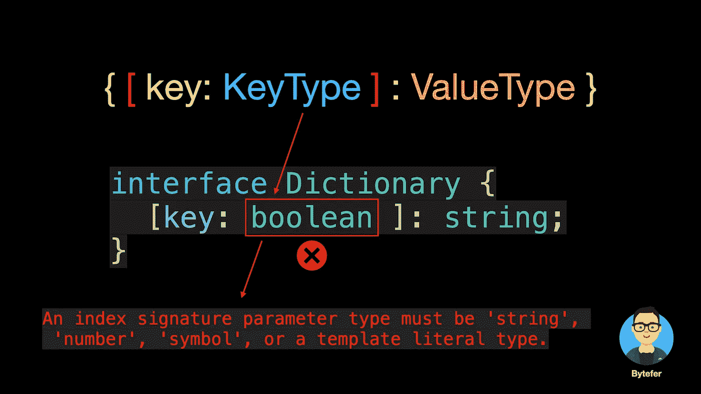
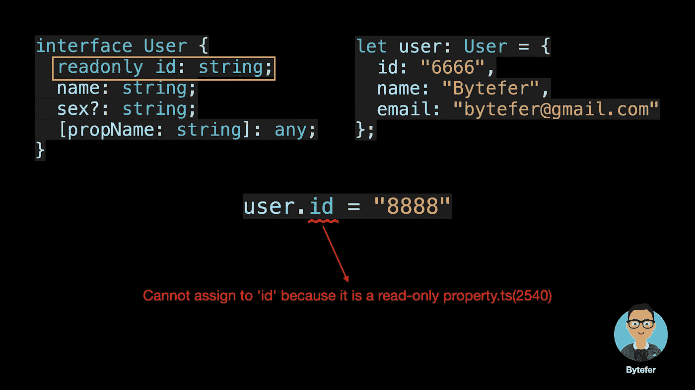

# 关于 TypeScript 接口你需要知道的 10 件事

> 原文：<https://javascript.plainenglish.io/10-things-you-need-to-know-about-typescript-interface-b24b13f4d870?source=collection_archive---------1----------------------->

## TypeScript 接口的 10 种使用场景——可能只有 20%的 web 开发人员掌握所有这些场景


Photo by [Towfiqu barbhuiya](https://unsplash.com/@towfiqu999999?utm_source=medium&utm_medium=referral) on [Unsplash](https://unsplash.com?utm_source=medium&utm_medium=referral)

欢迎来到**掌握打字稿**系列。本系列将以动画的形式介绍 TypeScript 的核心知识和技术。让我们一起学习吧！以前的文章如下:

*   [**不再混淆 TypeScript 的类型和接口**](/no-more-confusion-about-typescripts-type-and-interface-63c39418ae35)
*   [**使用 TypeScript 像 Pro 一样映射类型**](/using-typescript-mapped-types-like-a-pro-be10aef5511a)
*   [**使用 TypeScript 条件类型像亲**](/use-typescript-conditional-types-like-a-pro-7baea0ad05c5)
*   [**使用 TypeScript 交集类型像亲**](/using-typescript-intersection-types-like-a-pro-a55da6a6a5f7)
*   [**使用打字稿推断像亲**](https://levelup.gitconnected.com/using-typescript-infer-like-a-pro-f30ab8ab41c7)

TypeScript 中的接口是一个非常灵活的概念。除了抽象一个类的部分行为，还经常用来描述一个对象的**形状。**

# 必需的属性

当定义一个接口时，你需要使用`interface`关键字:

```
interface User {
  name: string;
  sex: string;
}const user: User = {
  name: "Bytefer",
  sex: "male",
};
```

在上面的代码中，我们定义了一个`User`接口。然后定义一个`user`变量，将其类型设置为`User`类型。但是如果我们给`user`变量赋值，相关的属性就会丢失。然后 TypeScript 编译器会提示相关错误。例如，在下面的代码中，我们在赋值时缺少了`sex`属性:


那么如何解决上述错误呢？解决方案之一是在定义接口时使用`?`声明一些属性是可选的。

# 可选属性

```
interface User {
  name: string;
  sex?: string;
}let user: User = { // OK
  name: "Bytefer",
};user = { // Ok
  name: "Bytefer",
  sex: "male",
};
```

既然不允许缺少属性，那么添加未声明的属性可以吗？


从上图可以看出，使用对象文字赋值时，包括未声明的`age`属性，也会出错。解决这个问题最简单的方法是给`User`类型添加一个`age`属性:

```
interface User {
  name: string;
  sex?: string;
  age: number;
}
```

虽然这个方案可以解决问题，但是如果要添加其他任意属性，这种方式就不太好了。为了满足上述要求，我们可以使用**索引签名**。

# 索引签名

索引签名的语法如下:


**键的类型只能是字符串、数字、符号或模板文字类型**，值的类型可以是任意类型。



现在我们已经理解了索引签名的语法，让我们更新一下`User`类型:

```
interface User {
  name: string;
  sex?: string;
  [propName: string]: any; // Index Signatures
}
```

在更新了`User`类型，并添加了新的`age`和`email`属性之后，TypeScript 编译器将不会提示错误。

```
let user: User = {
  name: "Bytefer",
  sex: "male",
  age: 30,
  email: "[bytefer@gmail.com](mailto:bytefer@gmail.com)"
};
```

# 只读属性

在 web 系统中，我们需要区分不同的用户，一般情况下，我们会用一个`id`属性来标识不同的用户。该属性由 Web 系统自动生成，用户不能修改。对于上面的场景，我们可以使用`readonly`修饰符来定义只读属性。



除了属性，对象还可能包含方法。当使用一个接口定义一个对象类型时，我们也可以同时声明对象上存在的方法:

```
interface User {
  id: string;
  name: string;
  say(words: string): void;
}let user: User = {
  id: "6666",
  name: "Bytefer",
  say(words: string) {
    console.log(words);
  },
};
```

# 呼叫签名

描述函数最简单的方法是用**函数类型表达式**。这些类型在语法上类似于箭头函数:

```
const log: (msg: string) => void = (msg: string) => {
  console.log(msg);
};log("Bytefer");
```

语法`(msg: string) => void`的意思是“一个带有一个名为`msg`的 string 类型参数的函数，它没有返回值”。当然，我们可以使用类型别名来命名函数类型:

```
type LogFn = (msg: string) => void;const log: LogFn = (msg: string) => {
  console.log(msg);
};
```

如果我们想描述一些可以用属性调用的东西，函数本身也是一个对象。那么函数类型表达式就不能满足这个要求。对于这个场景，我们可以在定义对象类型时使用**调用签名**:


应该注意，在声明调用签名时，也支持重载:

```
interface Logger {
  type: string;
  (msg: string): void;
  (msg: string, timestamp: number): void
  (msg: string, timestamp: number, module: string): void
}
```

如果您不了解函数重载，可以阅读下面的文章:

[](/what-are-function-overloads-in-typescript-abcc06af42cb) [## 什么是 TypeScript 中的函数重载？

### 对 TypeScript 中函数重载的简单解释，有助于您理解重载签名和实现…

javascript.plainenglish.io](/what-are-function-overloads-in-typescript-abcc06af42cb) 

# 构建签名

除了直接调用函数，我们还可以使用`new`运算符调用函数，一般称为构造函数。我们可以通过在调用签名前添加`new`关键字来编写**构造签名**:

```
interface PointConstructor {
  new (x: number, y: number): { x: number; y: number };
}function createPoint(ctor: PointConstructor, 
  x: number = 0, y: number = 0) {
  return new ctor(x, y);
}class Point {
  constructor(public x: number, public y: number) {}
}const zero = createPoint(Point);
console.log(zero);
```

# 混合类型

**那么在定义一个接口时，我们可以同时使用调用签名和构造签名吗？**答案是肯定的，我们常用的`Date`对象，它的类型是`DateConstructor`，其中同时使用了调用签名和构造签名:

```
declare var Date: DateConstructor;
```


在上面的代码中，除了调用签名和构造签名，还定义了`Date`构造函数的属性和方法。

# 通用接口

泛型类型也可以与接口一起使用。下面是一个通用接口。

```
interface KeyPair<T, U> {
  key: T;
  value: U;
}let kv1: KeyPair<number, string> = { key: 1, value: "Bytefer" };
```

上面代码中的`T`和`U`都是类型参数，如果你想了解更多，可以看下面这篇文章:

[](https://medium.com/frontend-canteen/what-are-k-t-and-v-in-typescript-generics-9fabe1d0f0f3) [## TypeScript 泛型中的 K，T，V 是什么？

### 用动画讲解，让你轻松掌握 TypeScript 泛型类型参数。

medium.com](https://medium.com/frontend-canteen/what-are-k-t-and-v-in-typescript-generics-9fabe1d0f0f3) 

# 扩展接口

接口可以扩展一个或多个接口。这使得编写界面变得灵活和可重用。

```
interface Point1D {
  x: number;
}interface Point2D extends Point1D {
  y: number;
}interface Point3D extends Point2D {
  z: number;
}const point1D = { x: 0 };
const point2D = { x: 0, y: 0 };
const point3D = { x: 0, y: 0, z: 0 };
```

除了扩展单个接口，TypeScript 还允许我们扩展多个接口:

```
interface CanSay {
   say(words: string) :void 
}interface CanWalk {
  walk(): void;
}interface Human extends CanSay, CanWalk {
  name: string;
}
```

# 扩展类

当声明一个接口时，我们可以扩展一个或多个接口。事实上，我们也可以扩展一个声明的类:

```
class Point1D {
  public x!: number;
}interface Point2D extends Point1D {
  y: number;
}const point2D: Point2D = { x: 0, y: 0 }
```

对于一个类，在声明该类时，它可以同时实现多个接口:

```
interface CanSay {
   say(words: string) :void 
}interface CanWalk {
  walk(): void;
}class Person implements CanSay, CanWalk {
  constructor(public name: string) {} public say(words: string) :void {
    console.log(`${this.name} says：${words}`);  
  } public walk(): void {
    console.log(`${this.name} walk with feet`);
  }
}
```

**对于 TypeScript 开发者来说，接口和类型有很多相似之处，当然也有一些不同。**如果你想了解它们之间的区别，我推荐你阅读下面这篇文章:

[](/no-more-confusion-about-typescripts-type-and-interface-63c39418ae35) [## 不再对 TypeScript 的类型和接口感到困惑

### 用动画解释。掌握类型和接口的异同，了解它们的…

javascript.plainenglish.io](/no-more-confusion-about-typescripts-type-and-interface-63c39418ae35) 

如果你喜欢学习 TypeScript，可以在 [Medium](https://medium.com/@bytefer) 或者 [Twitter](https://twitter.com/Tbytefer) 上关注我，阅读更多关于 TS 和 JS 的内容！

# 资源


[Bytefer](https://medium.com/@bytefer?source=post_page-----b24b13f4d870--------------------------------)

## 掌握打字稿系列

[View list](https://medium.com/@bytefer/list/mastering-typescript-series-688ee7c12807?source=post_page-----b24b13f4d870--------------------------------)47 stories

*更多内容请看*[***plain English . io***](https://plainenglish.io/)*。报名参加我们的* [***免费周报***](http://newsletter.plainenglish.io/) *。关注我们关于*[***Twitter***](https://twitter.com/inPlainEngHQ)[***LinkedIn***](https://www.linkedin.com/company/inplainenglish/)*[***YouTube***](https://www.youtube.com/channel/UCtipWUghju290NWcn8jhyAw)*[***不和***](https://discord.gg/GtDtUAvyhW) *。对增长黑客感兴趣？检查* [***电路***](https://circuit.ooo/) *。***