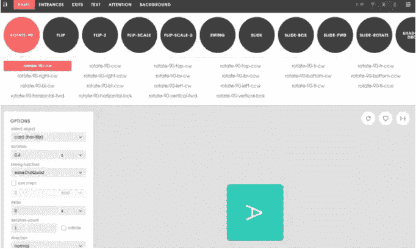
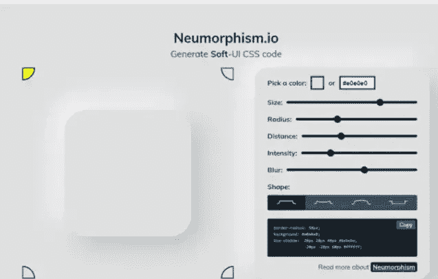
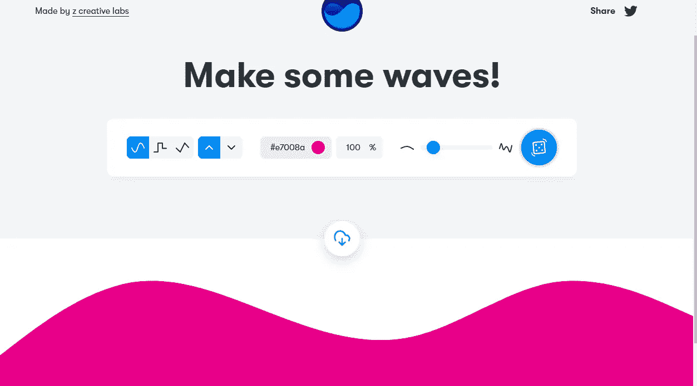
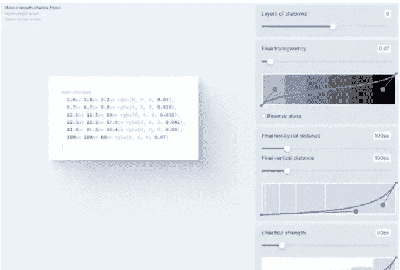
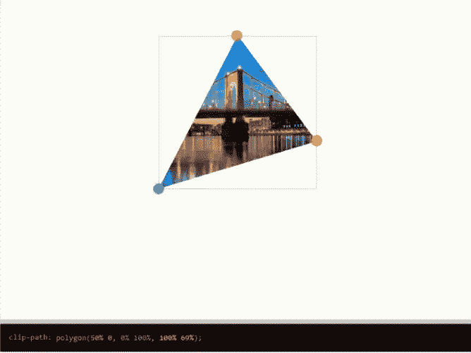
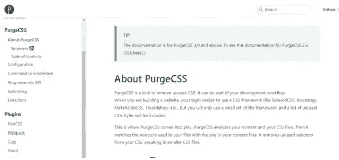
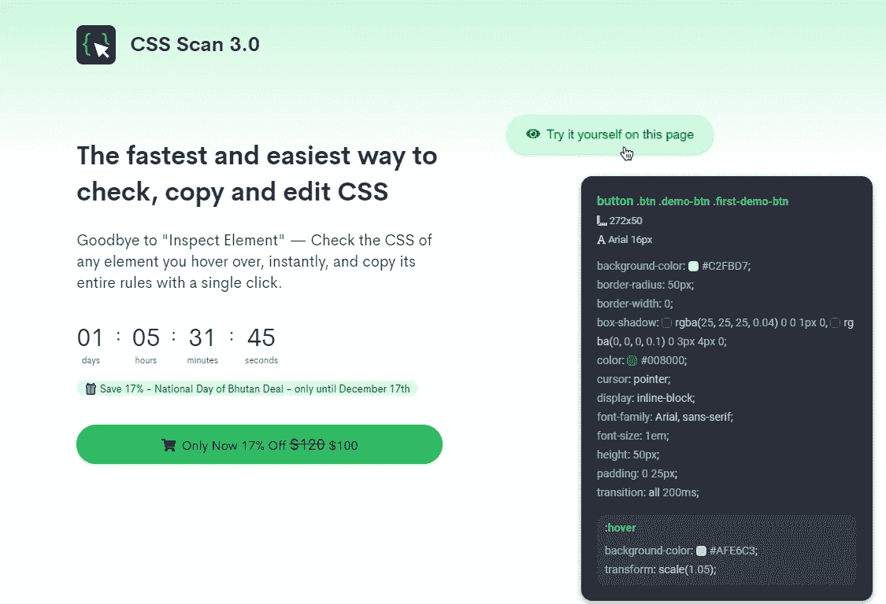
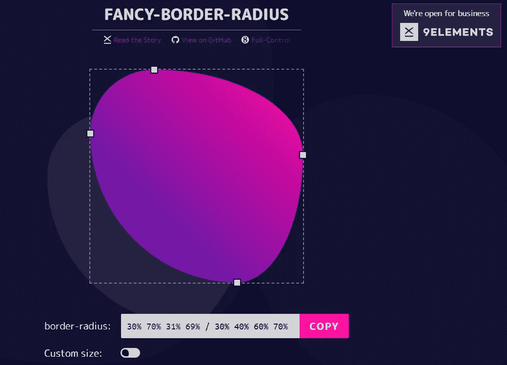
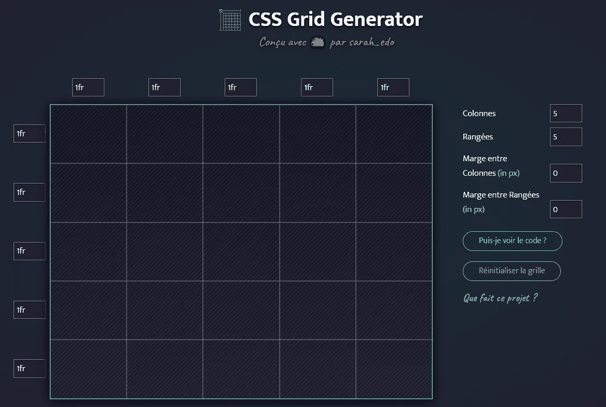
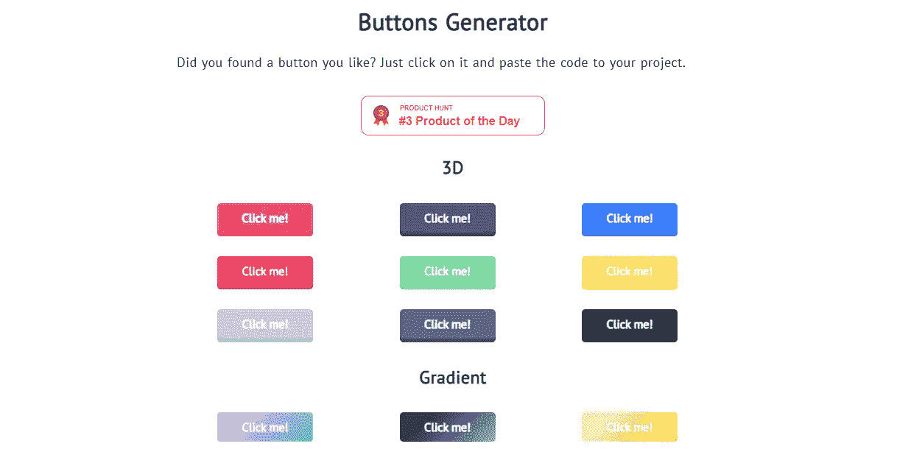

# 你应该在 2023 年使用的 10 个有用的 CSS 生成器工具

> 原文：<https://javascript.plainenglish.io/10-useful-css-generator-tools-that-you-should-use-in-2023-14fde4cd225d?source=collection_archive---------0----------------------->

## 优秀的 CSS 工具列表，帮助您提高 web 开发人员的工作效率。

Photo by [Christina @ wocintechchat.com](https://unsplash.com/es/@wocintechchat?utm_source=medium&utm_medium=referral) on [Unsplash](https://unsplash.com?utm_source=medium&utm_medium=referral)

当谈到 CSS 时，你总是要写很多代码行来使你的项目在样式上看起来漂亮和像样。当然，专注于为你的前端编写好的 CSS 是很重要的，但是这个过程可能会花费很多时间。

作为 web 开发人员，CSS 是我们从事项目时必不可少的语言之一。我知道现在有很多框架使得编写 CSS 代码比以前容易多了。

然而，当涉及到编码时，我们总是需要一些快捷方式或工具来使我们的生活变得更容易。幸运的是，有很多免费的开源 CSS 工具和生成器可以帮助我们提高开发人员的生产力。

因为有时候我们没有时间，或者也许我们必须按时交付项目。这就是为什么最好使用一些 CSS 生成器，它们可以帮助我们为项目生成 CSS 代码。

在这篇文章中，我将与你分享一个有用的 CSS 生成器列表，你可以在 2023 年使用。所以让我们开始吧。

# 1.CSS 渐变

CSS 渐变是一个很棒的工具，可以帮助你为你正在做的项目创建渐变背景。

您可以选择和编辑您想要的颜色。这个工具给了你很多选项来获得你想要的渐变背景，并为你的 CSS 生成代码。

Image captured by the author from CSS Gradient.

# 2.泛灵论者

当谈到 CSS 网页动画和过渡， [Animista](https://animista.net/) 是一个非常有用的工具，给你一个完整的 CSS 动画库，你可以在你的项目中使用。

Image by the author from Animista.

该工具为您提供了一个可以使用的预先制作的 CSS 动画集合。您可以重放每种类型的动画，并根据需要进行编辑。你将有很多选择，你可以自定义，以获得一个完美的动画，你需要的。

除此之外，该工具还允许您为动画生成 CSS 代码。当然，这样你就可以在你的项目中使用它。

# 3.神经形态

如今，随着变形设计的流行，许多设计师和 web 开发人员在 web 项目中使用这种类型的设计。

[Neumorphism](https://neumorphism.io/) 是一个为你的设计生成软 UI CSS 代码的有用工具。这也是一个非常神奇的工具，可以帮助你创建一个神经形态设计。

Image captured by the author from Neumorphism.

这个工具给了你很多选择。您可以选择和编辑颜色、大小、半径、UI 距离等等。只要试一试，你就会爱上它。

# 4.获得波浪

如果你想为你的网站设计生成漂亮的 SVG 波浪形状， [Get Waves](https://getwaves.io/) 会帮你做到这一点。

Image captured by the author from Get Waves.

该工具帮助您为项目生成引人注目的 SVG 形状和波形。

它允许您编辑形状，并根据需要自定义它们。然后，您可以复制该形状的 SVG 代码，或者根据需要下载 SVG 格式的代码。

# 5.阴影布鲁姆

是另一个很棒的 CSS 生成器工具，允许你生成平滑的基于 CSS 的阴影。

Image by the author from Shadow Brumm.

这个工具可以让你更容易地创建漂亮和酷的阴影，而不必用 CSS 来写。

你得到一些你刚刚定制的设计选项，比如图层和透明度，然后这个工具为你生成所有的 CSS 代码。

# 6.CSS 剪辑路径生成器

CSS clip-path maker 是一个工具，可以让你轻松地创建令人惊叹的复杂形状，然后为你生成 CSS 代码。

这个工具基于 CSS 属性 clip-path，它可以创建复杂的形状(*多边形、圆形、椭圆形等*)。

The image was captured by the author from [bennettfeely](https://bennettfeely.com/clippy/)(external link outside Medium).

如果您不熟悉这个 CSS 属性，不要担心，因为这个剪辑路径生成器工具可以帮助您创建复杂的形状，而不必在 CSS 中从头开始编写它们。

# 7.采购

如果你想轻松地从你的 CSS 文件中删除不用的代码，那么 [PurgeCSS](https://purgecss.com/) 是一个非常有用的工具。

The image was captured by the author from PurgeCSS.

这是一个很棒的工具，尤其是当你使用 CSS 框架的时候。这是因为我们使用的大多数框架都带有许多我们并不真正需要的代码行。

所以 PurgeCSS 是一个工具，可以帮助你减少 CSS 文件的大小，提高网站或应用程序的性能。您可以查看文档以了解更多信息。

# 8.CSS 扫描

CSS Scan 是一个非常棒的高级工具，允许你在浏览的任何网页上查看 CSS 代码。您只需要将鼠标悬停在网页上的某个元素上，该工具就会为您生成 CSS 代码。

Image by the author from CSS Scan.

除此之外，只需一次点击，您就可以轻松地复制和编辑 CSS 代码。如果你不想总是花很多时间使用“inspect element”浏览器功能检查 CSS，这是一个很好的工具。

# 9.花式边框半径生成器

如果你想使用 CSS 属性`border-radius`创建漂亮复杂的形状，你必须在指定属性的值时使用八个值。

这就是为什么[花哨的边框半径](https://9elements.github.io/fancy-border-radius/)开始发挥作用，帮助您构建复杂的有机外观的形状，并为您生成 CSS 代码，而不必从头开始编写。

The image was captured by the author from Fancy Border Radius.

# 10.CSS 网格生成器

如今，使用 CSS grid 是在网页上创建响应式网格布局的好方法。为网站或应用程序创建网格布局时，可以使用许多 CSS 网格属性和函数。

这就是为什么 [CSS 网格生成器](https://cssgrid-generator.netlify.app/)开始发挥作用来帮助你。这是一个很棒的工具，可以为你生成 CSS 网格代码，可以帮助你了解更多关于 CSS 网格的知识，并使你更容易使用它。

The image was captured by the author from CSS Grid Generator.

您只需要编辑列、行和单位。因此，如果有必要，该工具将生成 CSS 甚至 HTML 代码。

# 奖励工具:CSS 按钮生成器

这个令人敬畏的[按钮生成器](https://markodenic.com/tools/buttons-generator/)工具允许你生成许多漂亮的按钮 CSS 样式和效果，你可以在你的项目中使用。

The image was captured by the author from [Marko Denic](https://markodenic.com/) website.

这个工具包含了很多很酷的按钮，有很棒的 CSS 悬停效果。你只需要点击你想要的按钮，然后你就会得到 CSS 代码。

# 结论

从上面的列表可以看出。如果您想节省时间并提高 CSS 编码效率，这些工具会非常有用。

它们能让你在短时间内创造出惊人的东西，而不必写很多 CSS 代码。

*感谢您阅读这篇文章。此外，如果您发现我的内容有用，并且您不是媒体会员，您可以在此处获取您的媒体会员资格***(媒体推荐链接)以无限制访问媒体上的所有文章，并支持我们作为作家。**

* [## 通过我的推荐链接加入 Medium-Mehdi Aoussiad

### 阅读 Mehdi Aoussiad(以及媒体上成千上万的其他作家)的每一个故事。您的会员费直接支持…

mehdiouss.medium.com](https://mehdiouss.medium.com/membership) 

**延伸阅读:**

 [## 每个 Web 开发人员都应该知道的 7 个有用的 JavaScript 备忘单

### 一个伟大的 JavaScript 清单，以提高您的生产力。

javascript.plainenglish.io](/7-useful-javascript-cheatsheets-every-web-developer-should-know-9f67924d83f1)  [## 9 个强大的 Node.js 工具，成为 2022 年更好的开发者

### 你应该知道这些有用的 Node.js 工具，才能成为一名优秀的开发者。

javascript.plainenglish.io](/x-powerful-nodejs-tools-to-become-a-better-developer-in-2022-ec83ff1bb67d) 

*更多内容请看*[***plain English . io***](https://plainenglish.io/)*。报名参加我们的* [***免费周报***](http://newsletter.plainenglish.io/) *。关注我们关于*[***Twitter***](https://twitter.com/inPlainEngHQ)[***LinkedIn***](https://www.linkedin.com/company/inplainenglish/)*[***YouTube***](https://www.youtube.com/channel/UCtipWUghju290NWcn8jhyAw)*[***不和***](https://discord.gg/GtDtUAvyhW) ***。*****

*****对缩放您的软件启动感兴趣*** *？检查* [***电路***](https://circuit.ooo?utm=publication-post-cta) *。****