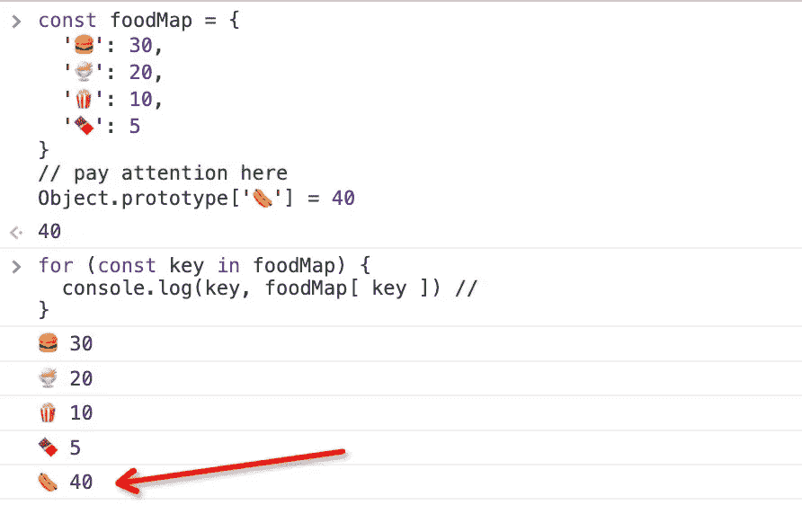
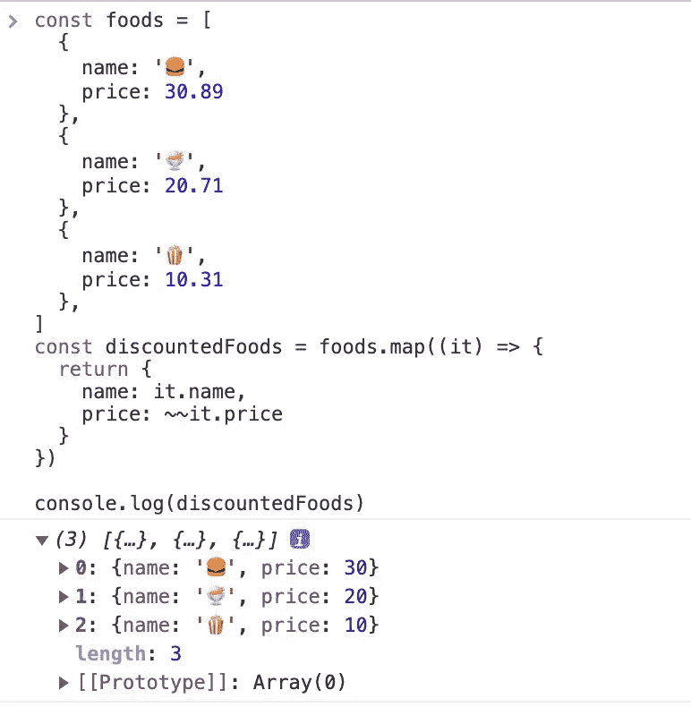

# 您应该使用的 10 种有用的 JavaScript 编码技术

> 原文：<https://javascript.plainenglish.io/10-useful-javascript-coding-techniques-that-you-should-use-772b17c2d90b?source=collection_archive---------0----------------------->

## 使用这些代码提示，让您的 JavaScript 更具可读性和可扩展性。

Photo by [Gaelle Marcel](https://unsplash.com/@gaellemarcel?utm_source=medium&utm_medium=referral) on [Unsplash](https://unsplash.com?utm_source=medium&utm_medium=referral)

优化我们的 JavaScript 代码有很多方法，本文总结了我在工作中经常用到的 10 个 **JavaScript 窍门**，希望也能帮到你。

# 1.请不要使用否定判断条件

我不止一次在工作中遇到过用否定作为判断依据的情况，也许你也有类似的感受，那真的很糟糕。

**这让你的同事感到困惑，甚至怀疑他们是不是没吃早餐……**

**更好的方法**

我们只是试图确定一个食品是否是新上架的，您可以使用一个更简单的代码。

# 2.请远离数字，它是魔鬼

我们在工作中经常用到数字，几乎在任何地方都能看到数字。

试想一下，如果有人在你的项目里写了一大堆看不懂的数字，你会发疯吗？比如这段代码:

朋友们，你们知道数字`35`代表什么吗？能否猜测它代表了一个中年人的年龄？

有时候我们不得不查看所有的代码来弄清楚它的含义，每当我在我的项目中看到神奇的数字时，我都感觉自己快要窒息了。

**更好的方法**

请将数字定义为一个常数，并给它一个容易理解的名字，你的同事一定会为此感谢你。

# 3.多重判断条件

朋友们，你们经常这样写代码吗…

我们需要多个条件判断来决定是否执行一段逻辑代码。

那似乎不是一个问题，但是你能保证你在一段时间之后仍然能阅读它吗？

**更好的方法**

请用函数或常数包装多个条件判断，我们来试试。

或者你也可以这样做…

哇，所以这是一个测试，看看作者是否可以申请`medium` mpp。

# 4.减少如果…否则面条代码

写两个以上`if ... else`的时候要思考是否有更好的优化方式。例如，我们需要根据汉堡的名称来计算它的价格。你可能会这么做。

这样写会有很多条件判断语句，当我们要添加新的食物时，需要在函数中添加一个`if...else`语句。哦，那太痛苦了。

**更好的方法**

这是一个经典的优化，我们可以用一张地图来保存所有的食物。

# 5.使用`filter" and "map”`代替`for”`循环

现在，如果让你找出属于第一组的食物，你会怎么找？

**这里是数据**

经常使用上述方法。显然，替换`filter`和`map`不仅可以简化代码，还可以使语义更加清晰。

# 6.使用析构交换两个值

现在我吃汉堡，你吃巧克力。我们是好朋友，想交换食物。我们平时是怎么做的？

**更好的方法**

我们可以使用数组析构赋值来简化食物交换。

# 7.智能对象.条目

如果你想知道仓库里食物的名称和价格，你该怎么做？

**一般方式**

使用`for in`来迭代 foodMap，但是🌭也是打印出来的，这是我们不想看到的。

**更好的方法**

使用`Object.entries`至少有两个好处:

1.  仅打印对象的属性，忽略原型的属性。
2.  直接获取对象的值，而不是使用`obj[key]`来读取它。

# 8.展平阵列的简单方法

有一些食物混乱；怎么才能把它们放在一个篮子里呢？如果`[]`是篮子。

**第一种方式**

**第二种方式**

你有更短的方法来达到这个目的吗？可以，我们可以用`[].flat`，更简单更智能的方式。

使用`Infinity`意味着我们不关心食物嵌套了多少层。

# 9.舍入技巧

哇，万圣节到了，为了庆祝这个节日，所有的食物都打折了，小数都被抹掉了。

我们可以用`Math.floor`，但是有没有更简单的方法？`~~`算子怎么样？

# 10.使用`reduce`计算总和

现在一个顾客买了很多东西。我需要知道他应该付多少钱。

**也许你会这样做:**

**更好的办法**

像上面这样写可以达到目的，但是代码量还是太多，我们有更简单的方法。

# 最后

感谢阅读。我期待着您的关注和阅读更多高质量的文章。

 [## “我失去了一个工作机会，只是因为承诺。所有”

### 一次让我好难过的面试经历。

javascript.plainenglish.io](/i-lost-a-job-opportunity-just-because-of-promise-all-be396f6efe87)  [## 采访者:“npm 跑 xxx”怎么了？

### 一个大多数人都不知道的秘密。

javascript.plainenglish.io](/interviewer-what-happened-to-npm-run-xxx-cdcb37dbaf44)  [## 面试官:可以“x！== x "在 JavaScript 中返回 True？

### 你可能不知道的五个神奇的 JavaScript 知识点！

javascript.plainenglish.io](/interviewer-can-x-x-return-true-in-javascript-7e1d1fa7b5cd)  [## 现在是 2022 年，不要再滥用箭头功能了

### 不应该使用箭头函数的 4 种情况。

javascript.plainenglish.io](/its-2022-don-t-abuse-the-arrow-function-anymore-905862a9c668) 

## 更多内容请访问 [PlainEnglish.io](https://plainenglish.io/) 。

*报名参加我们的* [***免费周报***](http://newsletter.plainenglish.io/) *。关注我们上* [***推特***](https://twitter.com/inPlainEngHQ) ， [***领英***](https://www.linkedin.com/company/inplainenglish/) ***，***[***YouTube***](https://www.youtube.com/channel/UCtipWUghju290NWcn8jhyAw)***，以及****[***不和***](https://discord.gg/GtDtUAvyhW) *

## *想扩大你的软件创业规模吗？检查[电路](https://circuit.ooo/?utm=publication-post-cta)。*