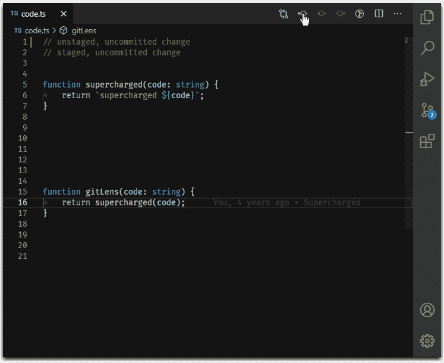

# 作为开发人员，您绝对需要 9 个 VSCode 扩展

> 原文：<https://javascript.plainenglish.io/10-vscode-extensions-you-definitely-need-as-a-developer-cab2fd87b33f?source=collection_archive---------0----------------------->

## VSCODE

## 这些扩展将帮助您提高工作效率，改进工作流程，让您的 VSCode 看起来更漂亮！

Photo by [AltumCode](https://unsplash.com/@altumcode?utm_source=unsplash&utm_medium=referral&utm_content=creditCopyText) on [Unsplash](https://unsplash.com/photos/fLEwqKoIQDo?utm_source=unsplash&utm_medium=referral&utm_content=creditCopyText)

VS 代码是几乎所有编程语言中最流行的 ide 之一。它简单，强大，有很多很酷的功能，并且是由微软制造的。因此，对于任何开发人员来说，这都是一个非常棒的工具，如果您还没有使用它，您一定应该查看一下。

VS Code 可以定制，并通过安装其市场上各种免费扩展之一，让您的工作流程更舒适。这些扩展将添加更多的自定义特性，这肯定会帮助您的编码。您将更快地开始编写代码！它会更令人愉快，更漂亮，所以您和您的同事会更好地理解您的代码！

# [1。随机一切](https://marketplace.visualstudio.com/items?itemName=helixquar.randomeverything)

我已经在其他列表中覆盖了这个扩展。虽然我认为这真的很酷，但如果您经常使用数据库或者只是需要一些随机信息来进行测试，这绝对是适合您的。姓名、数字，甚至电子邮件地址都可以使用随机一切随机生成。所以，是的，这很酷，对每个人来说都不重要！

Random Everything

# [2 .项目经理](https://marketplace.visualstudio.com/items?itemName=alefragnani.project-manager)

第三个，也可能是最重要的扩展之一，是项目经理。当您有大量不同的项目时，您可以使用这个扩展同时处理它们。它极大地改进了您的工作流程。通过使用这个扩展，您可以将所有东西保存在它的特殊文件夹中，并随时使用，确保没有混乱，并且所有东西都被严格组织起来。因此，如果你有很多项目，你会更容易把注意力集中在主要项目上。

Project Manager

# [3 .GitLens](https://marketplace.visualstudio.com/items?itemName=eamodio.gitlens)

任何使用 GIT 的人都必须拥有的扩展是 GitLens。简单地说，它显示了对 GIT 存储库所做的所有更改的历史，以及大量其他很酷的特性，您可以通过简单地安装它来查看这些特性！此外，如果您从未使用过 GIT，那么您当然需要！这是完成你的项目最简单也是最愉快的方式，尤其是当你独自工作的时候！

Gitlens

# [4 .实时服务器](https://marketplace.visualstudio.com/items?itemName=ritwickdey.LiveServer)

您可以使用活动服务器为您的静态和动态 web 应用程序运行本地开发服务器。对于不想花太多时间手动重载页面，直接通过 VS 代码测试自己的 web 应用的 web 开发者来说，非常有帮助。它节省了大量的时间，你可以像往常一样在你的 ide 中写你的代码，它会在浏览器中自动更新。是不是很神奇？

Live Server

# [5。待办事项树](https://marketplace.visualstudio.com/items?itemName=Gruntfuggly.todo-tree)

Todo Tree 是一个完整的待办事项列表应用程序，运行在 VS 代码内部。你可以写下你想对代码做的任何更改或添加，下次你参加编码考试时，你会确切地知道首先要做什么。由于不再需要记住你想用代码做的每件事，你的生产率将会显著提高——你可以把它写下来或者高亮显示！

Todo Tree

# [6。Tabnine AI 自动完成](https://marketplace.visualstudio.com/items?itemName=TabNine.tabnine-vscode)

在人工智能服务或程序 Tabnine 的帮助下，你可以自动完成你当前正在编写的特定代码行，甚至可以看到你可以在那里编写的几个替代代码。它兼容最流行的编程语言，包括 Java、Python 和 JavaScript。换句话说，这是一个由人工智能驱动的升级版自动完成器，将显著提高你的写作速度。想象一下，如果你不用等着写完一行代码，你会写得多快！

如果不喜欢使用 Tab9，那么也可以使用其他 AI 驱动的扩展进行自动完成扩展，比如[**Kite**](https://marketplace.visualstudio.com/items?itemName=kiteco.kite)[**Visual Studio IntelliCode**](https://marketplace.visualstudio.com/items?itemName=VisualStudioExptTeam.vscodeintellicode)，或者**[**JavaScript(ES6)代码片段**](https://marketplace.visualstudio.com/items?itemName=xabikos.JavaScriptSnippets) 。Kite 和其他几乎相似的扩展之间的主要区别是，它们大多使用一种语言，而它们几乎使用每一种编程语言，并且还使用升级的人工智能。**

****

**Tabnine**

# **[7。内嵌折叠](https://marketplace.visualstudio.com/items?itemName=moalamri.inline-fold)**

**内联文件夹是一个自定义装饰器，它将匹配内容“折叠”在一行中。这在处理使用大量实用程序类的框架时特别有用，这些实用程序类通常会破坏代码的视觉结构。您可以通过单击来展开折叠。您还可以配置扩展，以标记中的特定属性为目标。可以在设置中配置用作掩码的字符，并且可以更新 regex 表达式以匹配您想要的任何编码模式。该扩展还支持 HTML 标记中属性值的折叠。它使你的代码更整洁，更容易导航。**

****

**Inline Fold**

# **[8。素材图标主题](https://marketplace.visualstudio.com/items?itemName=PKief.material-icon-theme)和[一人一暗亲](https://marketplace.visualstudio.com/items?itemName=zhuangtongfa.Material-theme)**

**我决定把它们结合起来，因为它们纯粹是为了让你的 VS 代码更漂亮，并且是一个易于导航的 IDE。**

**例如，如果您曾经快速处理过三个或更多的文件，那么记住 HTML 或 JavaScript 文件的位置可能会很困难，因为创建一个网站几乎总是需要遍历所有文件。材料图标主题肯定会使这种类型的任务对你来说容易得多。它为你当前使用的每个文件添加了许多可视图标。**

**我是那种不能只给 VS 代码用内置设计主题的家伙，所以我用了一个 Dark Pro 让我的代码更吸引人。一切都可以根据你的喜好进行配置；例如，您可以改变字体大小或使所有内容倾斜。对于大多数人来说，这是最受欢迎的解决方案之一。不过你可以轻松使用其他扩展，比如 [**Atom 主题**](https://marketplace.visualstudio.com/items?itemName=akamud.vscode-theme-onedark) 或者甚至是类似 [**Dracula 官方**](https://marketplace.visualstudio.com/items?itemName=dracula-theme.theme-dracula) 的东西。**

****

**Material Icon Theme**

****

**One Dark Pro**

# **[9。存在不一致](https://marketplace.visualstudio.com/items?itemName=icrawl.discord-vscode)**

**这个列表中最新的扩展是一个不和谐的存在。这是一个显示你不和谐状态的程序。事实上，它不会提供任何有用的功能，比如更舒适的工作流程或更高的生产率。相反，它会向你所有不和谐的朋友显示你正忙着编辑你的 VS 代码中的文件。**

****

# **结论**

**就是这样。这些是每个开发人员都应该使用的 VS 代码的 10 大扩展。你可能已经听说过其中的大部分，并且可能厌倦了一遍又一遍地阅读同样的东西。但是我的目标是那些对 VS 代码和所有这些基本扩展一无所知的初学者。我希望这篇文章对您有所帮助，即使您已经强调了至少一个扩展！**

**如果你喜欢这篇文章，别忘了鼓掌并留下评论！此外，如果你不同意某些东西或发现了错误，不要害怕在下面留下评论，我一定会回答你！**

****

***更多内容请看*[***plain English . io***](https://plainenglish.io/)*。报名参加我们的* [***免费周报***](http://newsletter.plainenglish.io/) *。关注我们关于*[***Twitter***](https://twitter.com/inPlainEngHQ)[***LinkedIn***](https://www.linkedin.com/company/inplainenglish/)*[***YouTube***](https://www.youtube.com/channel/UCtipWUghju290NWcn8jhyAw)*[***不和***](https://discord.gg/GtDtUAvyhW) *。对增长黑客感兴趣？检查* [***电路***](https://circuit.ooo/) *。*****