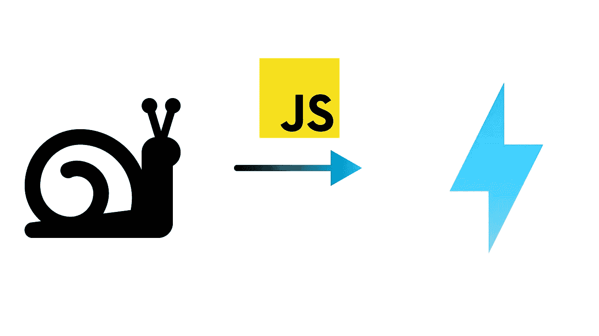

# 加速 JavaScript 加载的 10 种方法

> 原文：<https://javascript.plainenglish.io/10-ways-to-speed-up-javascript-loading-235892adbcf?source=collection_archive---------11----------------------->

## JavaScript 是导致网站加载时间过长的最大因素之一。以下是加快 JavaScript 加载速度的方法。

在许多现代网站中，有大量的 JavaScript。事实上，根据 HTTP 档案，平均桌面页面有超过 500 千字节的 JavaScript。问题是 JavaScript 下载和解析都需要时间，这使得网站加载速度慢了很多，因此影响了用户的保留，因为如果网站加载时间太长，用户就会离开。幸运的是，有一些简单的方法可以减少你在网站上加载的 JavaScript 代码量，并且让你加载的 JavaScript 代码加载得更快，这就是我们今天要讨论的。

# 如何让你的 JavaScript 加载更快

## 1.惰性装载

当用户第一次访问网站时，并不是所有的 JavaScript 都需要即时加载。例如，您可以在页面底部设置电子邮件注册提示。除非用户向下滚动到那里，否则没有必要加载。

因此，许多 web 开发人员使用一种叫做惰性加载的技术。延迟加载不是一次加载所有的 JavaScript，而是卸载一些 JavaScript。有多种不同形式的延迟加载。

例如，对于不需要立即激活但仍然应该很快激活的元素，您可以使用`requestIdleCallback()`等到页面空闲。

或者，正如我们已经讨论过的，如果页面下方有一个交互元素，您可以等待，直到用户使用`intersectionObserver`向下滚动到该元素。

现在，问题仍然存在:你如何在以后加载代码？最好的方法之一是动态的`import()`，它是 [ECMAScript 模块(ESM)](https://developer.mozilla.org/en-US/docs/Web/JavaScript/Guide/Modules) 的一部分。通过运行`import()`函数，动态导入可以帮助您随时加载脚本。例如，这将在浏览器空闲时加载一个脚本:

另一个选择是简单地在脚本上使用`async`或`defer`属性。这种技术不太灵活，但这是一种让脚本等待 DOM 组装完成的简单方法。

## 2.缩小

缩小是一种提高性能的简单方法。这通常是使用自动化挖掘器来完成的，如 [Terser](https://terser.org/) 或 [ESBuild](https://esbuild.github.io/) 。这些工具通过删除空格、长变量名和其他对开发有帮助但在生产中会增加脚本大小的内容，从本质上缩小了代码。例如，假设我用 Terser 精简了这段代码:

输出将是:

这减少了 67 个字节，从 203 个字节减少到 136 个字节！这一点点不会产生明显的差异，但对于较大的脚本，缩小会产生相当大的影响。

## 3.集束

脚本大小并不是唯一重要的事情。请求计数也是如此，因为每个请求都会增加开销。基本上，您希望将脚本数量保持在最低水平。然而，分割代码通常是保持代码整洁的一种代码实践。幸运的是，像迷你编辑器一样，有自动化的工具来解决这个问题。这些被称为捆扎机。Bundlers 分析你的代码，看看哪些脚本是互相导入的，弄清楚怎么组合。最知名的捆绑机有 [Webpack](https://webpack.js.org/) 、 [Rollup](https://www.rollupjs.org/guide/en/) 和 [Vite](https://vitejs.dev/) 。

使用 bundler 的另一个优点是大多数 bundler 也可以作为构建工具，这样可以很容易地完成诸如缩小和类型脚本编译之类的事情。更多关于捆扎机的信息，请查看我的文章。

## 4.代码拆分

您可能会惊讶，这是捆绑后的权利。"我捆绑我的代码仅仅是为了把它分开？"不一定。其实这是 bundlers 的一个特点。虽然减少请求数量很好，但你不希望用户必须一次加载网站上的所有代码。您可以通过为每个页面创建一个新的完整包来解决这个问题，但是这会抵消缓存的一些好处(我们将在后面讨论)。

为了解决这个问题，我们有代码分割。代码拆分结合了绑定和延迟加载的优点，同时确保不会加载页面的任何不必要的代码。bundler 通过分析导入映射来执行代码分割，并找出哪些脚本需要包含在自己的包中。大多数绑定器都是自动完成的，尽管编写更容易分析的代码会有所帮助(例如，尽可能使用静态导入)。

## 5.树摇晃

捆扎机的另一个共同特征是摇晃树木。您可以导入库的一部分，但不需要其余部分。然而，如果你这样做而不摇晃树，最终用户将会加载整个库，这会增加很多 JavaScript。摇树解决了这个问题；支持树抖动的捆绑器会自动移除库的未使用部分，这大大减少了您导入的代码。

例如，看看 Lodash(具体来说是 lodash-es)，这是一个大型的 JavaScript 实用程序库。整个模块几乎缩小了 100 千字节，但是如果您只是使用`intersect()`函数，您将只导入 2.7 千字节的代码。现在，在 Lodash 的例子中，有只包含单个函数的包，但是如果你正在使用大量的函数，这些包可能会更烦人，而且许多库不这样做。

## 6.ECMAScript 模块

对于前面提到的许多功能来说，ECMAScript 模块(ESM)非常有用，甚至是必不可少的。ESM 是一个模块规范，旨在规范如何在不同文件之间共享代码。在 ESM 之前，有一些相互冲突的标准，如 CommonJS 和 UMD，它们甚至不受浏览器的本地支持。ESM 统一了这些标准，并提供了有助于树摇动等功能的语法(注意我在前面说过如何使用 lodash-es 而不是标准 lodash)。此外，由于浏览器本身支持 ESM，因此您不需要沉重的 polyfill 即可使用 ESM。

## 7.加拿大

在你自己的服务器上托管静态文件是没有意义的。使用完整的服务器进行实际的服务器端计算会增加您的成本、开发复杂性和网站加载时间。相反，cdn 是更好的解决方案。CDN(内容交付网络)是一个服务器网络，旨在快速、廉价地提供静态文件。您可以从数十台或数百台服务器(取决于 CDN)提供文件，而不是仅从一台服务器提供服务，这样可以减少延迟，因为服务器离用户更近。

此外，cdn 通常会为您配置缓存和压缩等功能，从而节省时间。CDN 的一些流行例子是 [Cloudflare CDN](https://www.cloudflare.com/cdn/) 和亚马逊 [CloudFront](https://aws.amazon.com/cloudfront/) 。

## 8.贮藏

虽然首次加载体验很重要，但你也需要考虑网站回头客的性能。一种显著提高重复访问速度的方法是通过缓存。浏览器缓存的工作原理是保存网站资源的副本并使用该副本，而不是再次下载。这意味着重复访问感觉几乎是瞬间的。

要设置缓存，您需要在您缓存的资源的响应中设置 [Cache-Control](https://developer.mozilla.org/en-US/docs/Web/HTTP/Headers/Cache-Control) 头。如果您使用的是 CDN，这可能会自动为您配置。如果你不是，这是足够简单的设置。

## 9.压缩

我相信你一定遇到过`.zip`或`.tag.gz`文件。您可能还知道，除了将目录转换为文件之外，它们还会减小文件的大小。大小的减小是通过压缩完成的。压缩的工作原理是运行一种算法，通过收缩重复的语句和根据使用的算法做一些其他事情来找到使文件变小的方法。有许多流行的压缩算法，如 deflate、lz4、Brotli 和 Zstandard。zip 和 gzipped 文件使用压缩是 deflate。

实现压缩可能有点难，但是有一些简单的方法可以做到。最简单的方法是使用自动压缩文件的 CDN，就像我们在第 7 点讨论的那样。实现压缩的另一个简单方法是运行支持压缩的文件服务器。

然而，如果你不能做到这些，还有一些其他的解决方案。很多构建工具/捆绑器都有插件，可以自动生成压缩格式的文件，你可以让浏览器自动解压。浏览器使用`Accept-Encoding`头告诉你它支持什么压缩算法，你的服务器使用`Content-Encoding`头告诉浏览器在响应中使用什么压缩算法。

更多信息，请查看 [MDN 关于 HTTP 压缩的文章](https://developer.mozilla.org/en-US/docs/Web/HTTP/Compression)。

## 10.灯塔&自动化绩效审计

Lighthouse 是一个帮助你自动审核网站性能的工具，还有一些其他的类别，比如 SEO 和可访问性。这对于发现性能问题非常有帮助，并提供了解决这些问题的简单方法。如果你有 Chrome 或者其他基于 Chrome 的浏览器，Lighthouse 应该默认可用。如果您正在使用另一个浏览器，您可以下载该扩展或使用 [PageSpeed Insights](https://pagespeed.web.dev/) 。PageSpeed Insights 还提供来自真实用户的数据，如果你想了解用户的真实体验，这些数据会很有帮助。

# 结论

有了这些建议，你应该可以在你的网站上获得巨大的性能收益，转化为更多的保留和转化。感谢阅读！

*原载于 2022 年 8 月 18 日 https://byteofdev.com***。**

**更多内容请看*[***plain English . io***](https://plainenglish.io/)*。报名参加我们的* [***免费周报***](http://newsletter.plainenglish.io/) *。关注我们关于*[***Twitter***](https://twitter.com/inPlainEngHQ)[***LinkedIn***](https://www.linkedin.com/company/inplainenglish/)*[***YouTube***](https://www.youtube.com/channel/UCtipWUghju290NWcn8jhyAw)*[***不和***](https://discord.gg/GtDtUAvyhW) *。****