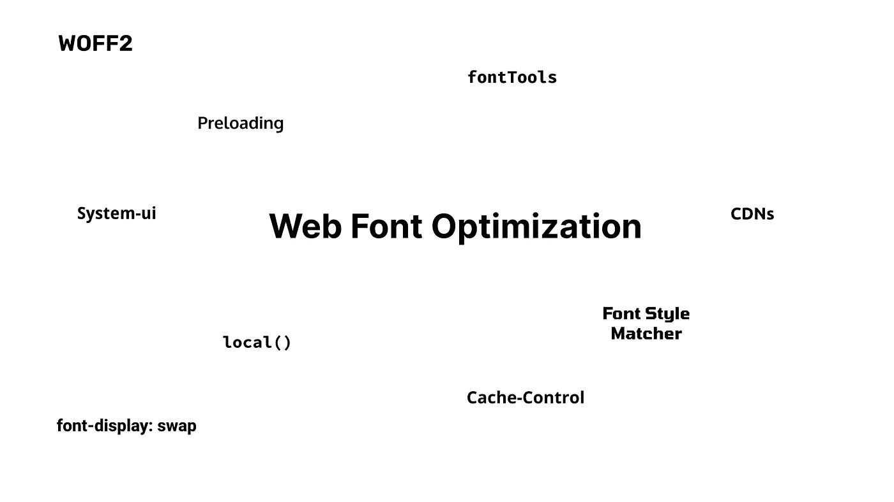
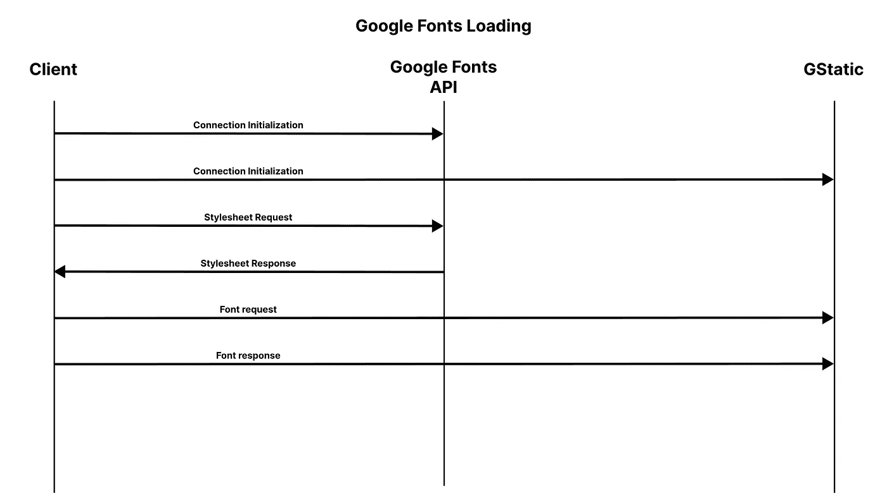
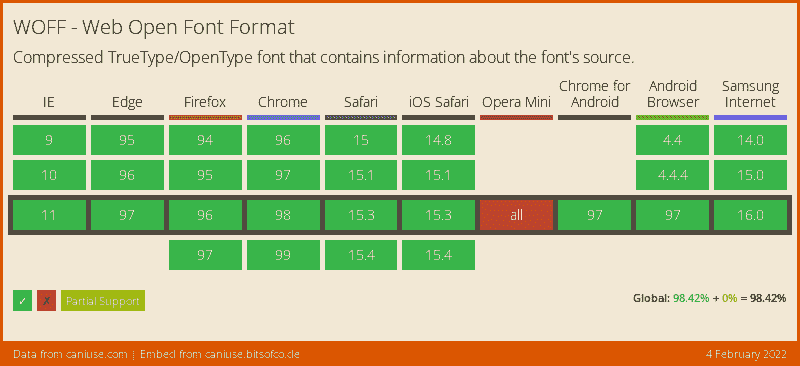

# 10 种加速网页字体加载的方法

> 原文：<https://javascript.plainenglish.io/10-ways-to-speed-up-web-font-loading-fcc3eb136923?source=collection_archive---------6----------------------->

## 字体加载会严重影响性能。本文向您展示了如何减少这种影响。

字体是当今网络上流行的工具。大多数现代网站使用自定义字体，通常来自谷歌字体，因为它给界面添加了自定义的风格，并允许更多的选项。然而，web 上的字体有许多性能问题。字体通常有数百千字节，并且在另一个域中，这降低了网站的速度。幸运的是，你可以解决这些问题。以下是提高网站字体加载性能的十个技巧。

# 名单

## 1.自我你的字体

当你浏览一个网站时，你经常会看到这样的内容:

这意味着该网站正在使用谷歌字体加载字体。Google Fonts 非常适合做原型，因为它很简单，但是性能很差。性能很差，因为 Google Fonts 有一个复杂的字符串请求来获取字体，这大大增加了延迟。

正如你所看到的，谷歌字体的字体加载会很复杂。但是，通过自托管字体并将`@font-face`声明放入 CSS 包而不是外部样式表，可以将需要的请求数量减少到一个。像[谷歌网页字体助手](https://google-webfonts-helper.herokuapp.com/)这样的工具可以对此有所帮助。

## 2.使用现代网络字体格式

字体就像网页上的图像，因为它们的格式是如何工作的。有了图像，像 AVIF 和 WebP 这样的现代网络格式取代了像 PNG 和 JPEG 这样压缩程度较低的格式。类似地，web 字体有 WOFF 和 WOFF2，它们提供了比 TrueType 和 OpenType (TTF 和 OTF)更好的压缩。此外，web 字体几乎得到普遍支持:

在这一点上，由于几乎普遍的浏览器支持，最好的做法是使用 WOFF2 和 WOFF 回退，尽管你甚至可以只使用 WOFF2，因为大约 96%的用户支持它。

## 3.子集您的字体

字体子集化意味着将你的字体修剪成你需要的字符。只要不使用要删除的字符，子集化可以节省大量的空间，而且没有任何缺点。最简单的方法是设置子集来删除不使用的语言。以 Inter 为例，它是最流行的字体之一。如果包含所有语言，包括拉丁字母、西里尔字母、越南语和希腊语，则 WOFF2 字体的大小为 **95kb** 。然而，有可能你没有使用所有这些语言。如果您删除英语语言之外的所有字符，大小将减少到只有 **16kb** ！有很多方法可以对字体进行子集化，包括 Google Fonts(通过扩展，Google Webfonts Helper)、 [Everything Fonts](https://everythingfonts.com/subsetter) 和 [fontTools](https://github.com/fonttools/fonttools) 。

尺寸的减小对性能是有益的，但是如果你愿意承担更多的复杂性，你甚至可以做得更好。您可以通过子集化来精确地包含您所使用的内容，而不是通过广泛的字符范围来进行子集化。像 fontTools 这样的工具允许你通过任意的字符列表来选择字体。这种方法的问题是，您需要一个复杂的构建过程来获得您使用的每个字符。当然，您也可以手动添加每个字符，但这需要大量的工作🙁。

## 4.使用字体显示

默认情况下，在加载正确的字体之前，文本不会在许多浏览器中显示。这种行为被称为不可见文本的闪现，简称 FOIT。其他一些浏览器在加载时使用后备字体显示文本，这确保文本不可见，但会导致[布局偏移](https://web.dev/optimize-cls/#web-fonts-causing-foutfoit)。

幸运的是，您可以通过`@font-face`声明中的`font-display`选项定制字体加载。`font-display`的两个推荐值是`swap`和`optional`。`swap`使用后备字体，然后在加载后切换到自定义字体，并且`optional`阻止页面加载最长 100ms 以让字体加载，如果没有，则使用后备字体。

`font-display: optional`是不需要加载字体时的最佳选择，因为它可以防止任何布局偏移，并确保文本不可见。然而，当你需要字体加载时，`font-display: swap`是最好的，因为即使它需要超过 100 毫秒，它也会在字体中交换。

## 5.将您的备用字体与您的自定义字体相匹配

字体的间距和大小通常不同。比如 Merriweather 比 Georgia 大，即使 CSS 字体大小一样。如果你使用`font-display: swap`，这些不一致会导致布局偏移，如果你使用`font-display: optional`，会使字体不一致。幸运的是，您可以配置后备字体，使其看起来更像您正在使用的 web 字体。匹配两种字体可以通过定制间距和字体大小来消除不一致。一个有用的工具是[字体样式匹配器](https://meowni.ca/font-style-matcher/)，它允许你查看两种不同的字体，配置不同的间距属性，并查看布局变化的演示。

## 6.使用 CDN

cdn 对于加速静态内容交付非常有用。它们将内容交付给更接近用户的用户，并经常提供其他加速交付的方式。将你的字体和所有其他静态资产放在 CDN 上是一个好主意。使用 CDN 还具有降低服务器成本的优势，因为与从源服务器服务请求相比，CDN 通常更便宜。

## 7.预加载您的字体

对于各种资源来说，预加载通常是一个好主意，因为它让浏览器知道它需要更快地下载资源，并提高该资源的优先级。字体也是同样的道理。但是，您并不总是希望预加载字体，因为这可能会使字体不必要地加载。这是因为在下载之前，浏览器会自动检测网站是否使用了页面上的字体，即使存在`@font-face`。现在，您可能知道您总是使用包含在`@font-face`中的字体。还有一个潜在的问题。如果你的字体优先级低，它可能会使其他资源花费更长的时间来加载。然而，如果这两种情况都不是真的，预加载可以是加快字体加载速度的好方法。

## 8.使用本地()

根据字体的不同，用户通常可以在他们的计算机上本地安装您正在使用的字体。如果是这样，您可以很容易地在本地使用该字体，以防止自定义字体带来的任何性能下降。您可以在您的`@font-face` `src`规则中使用`local()`语句来实现这一点。

这个`@font-face`检查用户本地是否有字体，如果没有，就远程下载。这意味着使用该字体的用户可以获得免费的性能提升，同时不会增加代码的复杂性，并且不会对本地没有该字体的用户造成不利影响。

## 9.实现缓存

缓存非常重要，尤其是如果你有很多回头客。缓存允许字体在第一次下载后从磁盘加载。您可以通过`Cache-Control`头实现缓存。如果您使用像 Cloudflare 这样的 CDN，从仪表板上进行操作很简单。否则，您只需发送带有字体响应的标题即可。

## 10.不要使用自定义字体

我打赌你没看到那个😉。我说的是[系统字体栈](https://systemfontstack.com/)。系统字体非常适合正文或其他对品牌不重要的文本，因为它是内置的，而且界面更舒适，因为它与操作系统的字体相同。您可以通过上面链接的系统字体堆栈或`system-ui`字体系列来实现系统用户界面字体。

# 结论

就这样！我希望你喜欢学习如何优化你的网页字体，我希望这有助于你优化你网站上的字体。如果您喜欢阅读本邮件，请务必在此处注册邮件列表[。谢谢你的阅读！](https://byteofdev.com/signup)

*原为 2022 年 2 月 11 日在*[*https://byteofdev.com*](https://byteofdev.com/posts/speed-up-font-loading/)*发表。*

*多内容于* [***中。注册我们的***](http://plainenglish.io/) **[***免费周报***](http://newsletter.plainenglish.io/) *。在我们的* [***社区纠纷***](https://discord.gg/GtDtUAvyhW) *中获得独家写作机会和建议。***