# 帮助你成为高级前端开发人员的 11 个技巧

> 原文：<https://javascript.plainenglish.io/11-chrome-devtools-tricks-to-help-make-you-a-senior-front-end-developer-67b4ae3e6562?source=collection_archive---------1----------------------->

## 如果你选择 Chrome 作为开发工具，你必须知道的 11 个技巧

# 前言

相信你对 Chrome 浏览器一定很熟悉，因为它是前端开发者最亲密的伙伴。我们可以用它来查看网络请求、分析网页性能以及调试最新的 JavaScript 特性。

除了这些，它还提供了很多强大但不常见的功能，可以大大提高我们的开发效率。

让我们看一看。

# 1.重新发送 XHR 请求

在我们的工作中，经常需要和后端开发人员一起调试接口。使用这个功能可以提高我们的对接效率。

**你只需要做这些步骤:**

1.  选择`Network`面板
2.  点击`Fetch/XHR`
3.  选择要重新发送的请求
4.  右击并选择`Replay XHR`

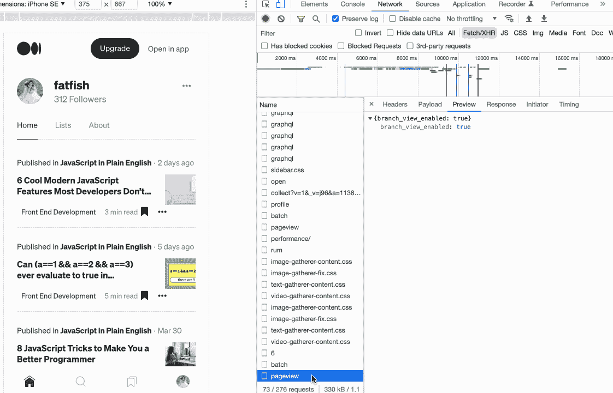

# 2.在控制台中快速发送请求

对于同一个请求，有时需要修改输入参数并重新发送。捷径是什么？

**你只需要做这些步骤:**

1.  选择`Network`面板。
2.  点击`Fetch/XHR`。
3.  选择要重新发送的请求。
4.  选择`Copy as fetch`面板。
5.  修改输入参数并重新发送。

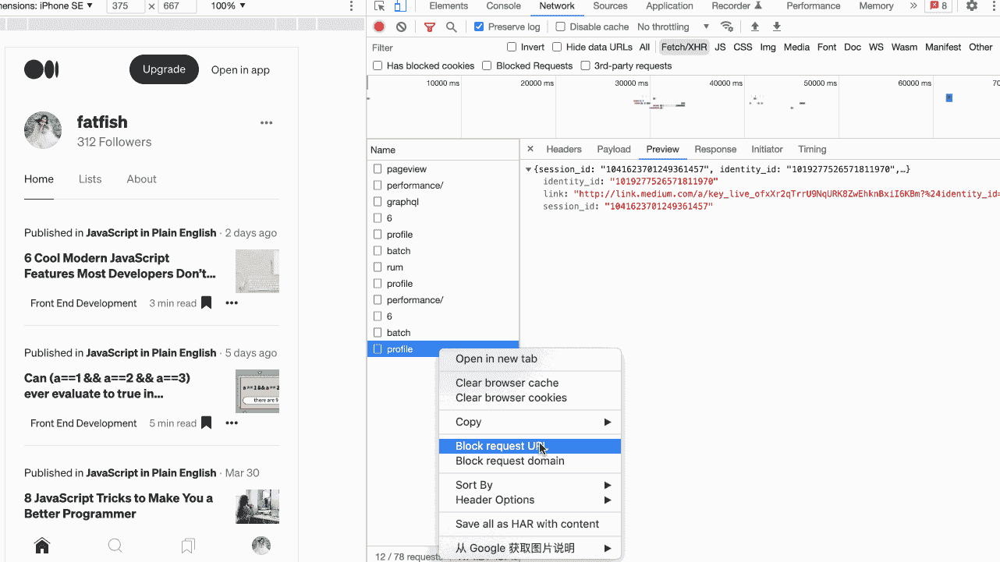

# 3.复制 JavaScript 变量

如何将复杂的数据复制到剪贴板？

太神奇了。你可以使用 Chrome 浏览器提供的`Copy`功能来完成。

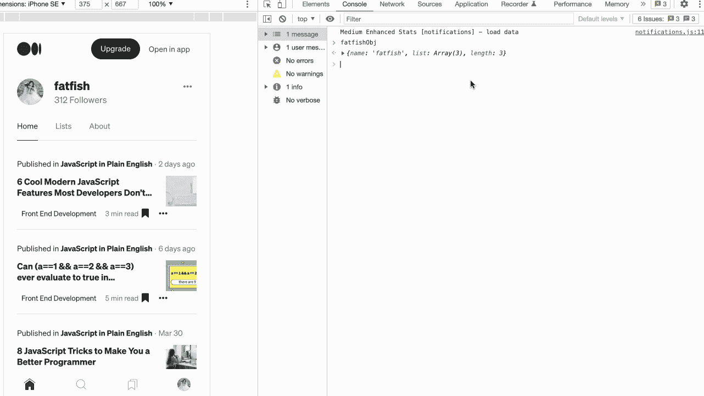

# 4.在控制台中获取选定的 DOM 元素

当我们通过“Elements”面板选中一个元素，想通过 JavaScript 打印它的一些属性，比如宽度、高度、位置等，应该怎么做？

1.  通过`Elements panel`选择 DOM 元素。
2.  使用`$0`访问控制台中的元件。

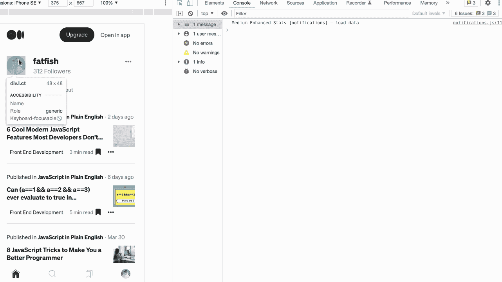

# 5.捕捉全尺寸截图

如果我们想对一个不止一屏的页面进行截图，有什么好的方法吗？

强大的 Chrome 浏览器可以轻松做到这一点。

1.  准备您想要捕获的页面内容
2.  `CMD + Shift + P`执行`Command`
3.  输入`Capture full size screenshot`并按回车键

哇，太酷了！

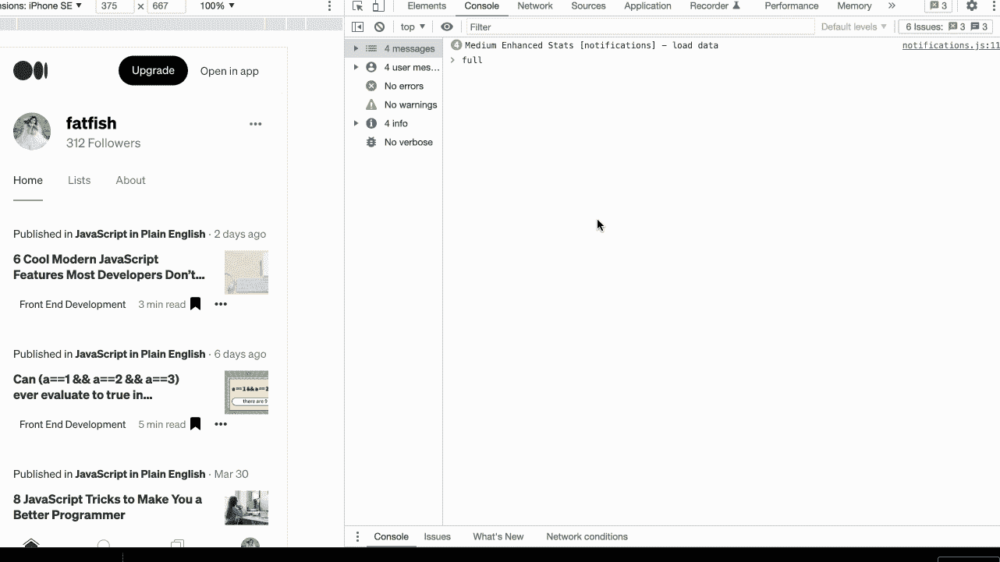

现在有了一个新问题。我们只是想拍一部分截图页面。我们做什么呢

也很简单，第三步输入**“抓取节点截图”**即可。

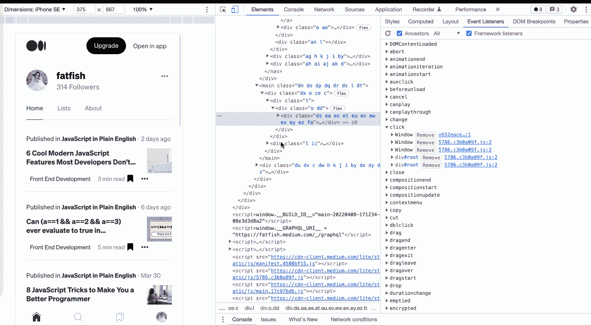

# 6.展开所有子节点

如何一次展开一个 DOM 元素的所有子节点？不是一个一个来？

您可以使用“元素”面板中的组合键“Alt + click”来一次展开所有子节点。

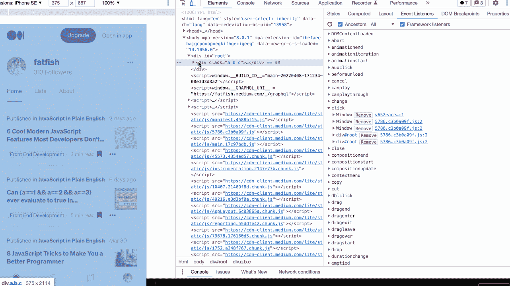

# 7.使用“$”引用上次执行的结果

我们来看看这个场景:我们对字符串进行了各种操作，然后想知道每一步的结果，该怎么办？

**你可能会这样做**

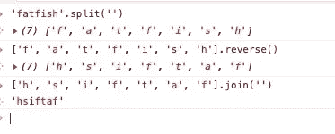

**更简单的方法:**

使用“$”获得上一次操作的结果，而不用每次都复制它。

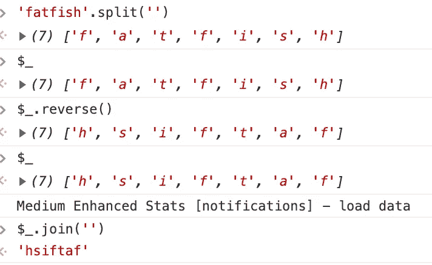

# 8.快速切换主题颜色

有人喜欢 Chrome 的白色主题，有人喜欢黑色。我们可以使用快捷键在两个主题之间快速切换。

1.  `cmd + shift + p`执行命令命令
2.  输入“切换到暗主题”或“切换到亮主题”来切换主题

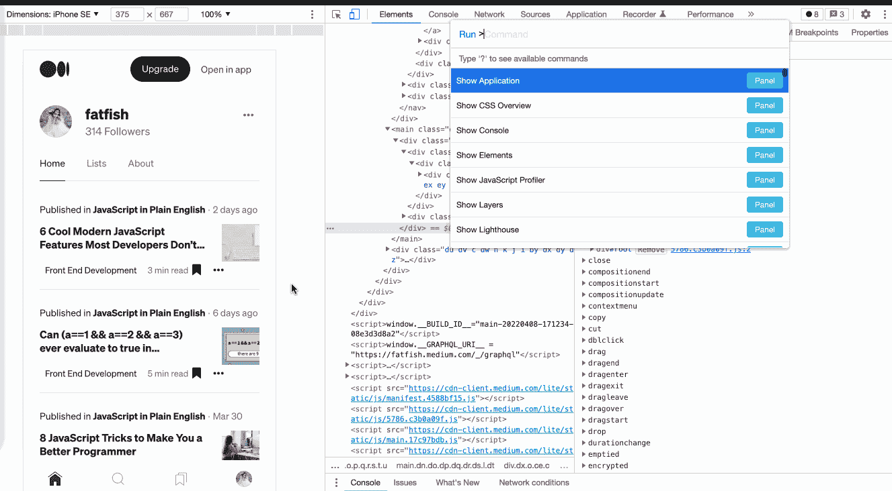

# 9.使用`$`和`$$`快速选择 DOM 元素

在控制台中使用`document.querySelector`和`document.querySelectorAll`来选择当前页面的元素是最常见的需求，但是有点太长了，我们可以用`$`和`$$`来代替。

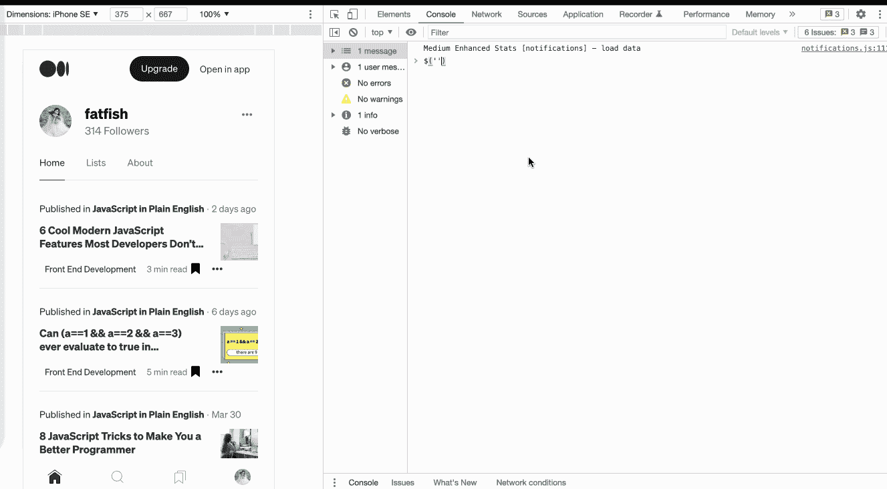

# 10.使用“$I”在控制台中安装 npm 软件包

有时候想用一个`API`比如`dayjs`或者`lodash`，但是又不想去官网查。如果能直接在主机上试试就好了。

1.  安装[控制台导入器](https://chrome.google.com/webstore/detail/console-importer/hgajpakhafplebkdljleajgbpdmplhie/related)插件
2.  $i('name ')安装 npm 软件包

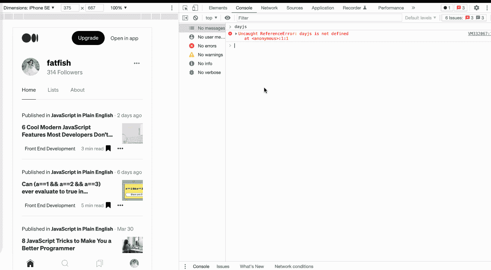

# 11.添加条件断点

使用下面的代码，我们希望断点被触发时食物的名称是 `🍫`。我该怎么做？

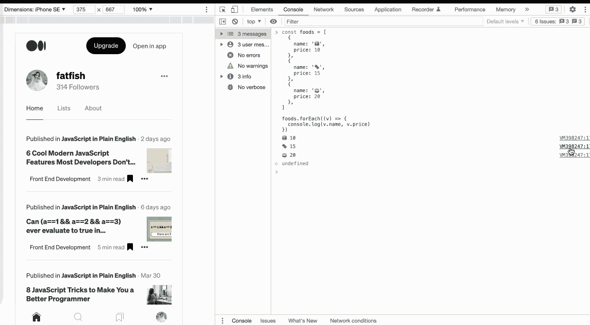

在数据量大的情况下，使用条件断点对开发工作会有很大的帮助，大大提高效率。

# 最后

**感谢阅读。**期待期待您的关注和阅读更多高质量的文章。

 [## 大多数开发人员不知道的 6 个很酷的现代 JavaScript 特性

### 编写简明 JavaScript 代码的技巧

javascript.plainenglish.io](/6-cool-modern-javascript-features-most-developers-dont-know-about-432f7652dd4c)  [## 在 JavaScript 中实现(a==1 && a==2 && a==3) === true 的 9 种方法

### 是的，这可能是真的，而且有 9 种方式——太神奇了！

javascript.plainenglish.io](/9-ways-to-make-a-1-a-2-a-3-true-in-javascript-c2e1903b24b)  [## 面试官:你工作 3 年了，这种算法题你都不会答？

### 一个女生的面试经历

javascript.plainenglish.io](/interviewer-you-have-been-working-for-3-years-and-you-cant-answer-this-algorithm-question-5f79cba18e06)  [## 让你成为更好的程序员的 8 个 JavaScript 技巧

### 使用这些代码提示，让您的 JavaScript 更具可读性和可扩展性。

javascript.plainenglish.io](/8-javascript-tricks-to-make-you-a-better-programmer-948b5a3c35b4)  [## 我老板:你知道 ES6，为什么不用？😠

### 老板的 10 条抱怨让我受益匪浅。

javascript.plainenglish.io](/my-boss-you-know-es6-but-why-dont-you-use-it-5e0316f14c67)  [## 面向网络开发人员的 15 个黑仔网站

### 99.9%的开发者都不知道。

javascript.plainenglish.io](/15-killer-websites-for-web-developers-35a4c007942a) 

*更多内容请看*[***plain English . io***](https://plainenglish.io/)*。报名参加我们的* [***免费周报***](http://newsletter.plainenglish.io/) *。关注我们关于*[***Twitter***](https://twitter.com/inPlainEngHQ)*和*[***LinkedIn***](https://www.linkedin.com/company/inplainenglish/)*。加入我们的* [***社区不和谐***](https://discord.gg/GtDtUAvyhW) *。*