# 11 个很酷的 Chrome Devtools 提示和技巧，我希望我已经知道了

> 原文：<https://javascript.plainenglish.io/11-cool-chrome-devtools-tips-and-tricks-i-wish-i-knew-already-a9e2e078f78?source=collection_archive---------0----------------------->

## 如果你选择 Chrome 作为开发工具，你必须知道的 11 个技巧

Photo by [Rajeshwar Bachu](https://unsplash.com/@rajeshwerbatchu7?utm_source=medium&utm_medium=referral) on [Unsplash](https://unsplash.com?utm_source=medium&utm_medium=referral)

Chrome 浏览器，作为前端开发者最亲密的伙伴，相信你一定很熟悉。我们可以用它来查看网络请求，分析网页性能，调试最新的 JavaScript 特性…

**除了这些，它还提供了很多强大但不常见的功能，可以大大提高我们的开发效率。**

**我们来看看。**

# 1.添加条件断点

用下面的代码，我们希望断点触发时食物的名字是 `🍫`，怎么做？

在数据量大的情况下，使用条件断点对开发工作会有很大的帮助，大大提高效率。

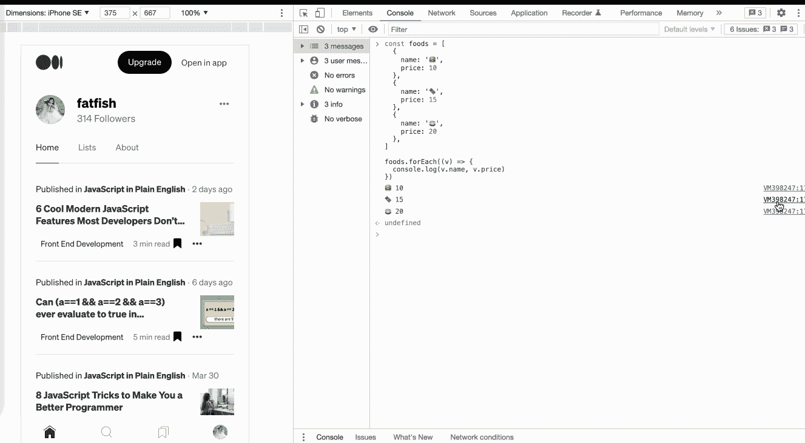

# 2.使用“$I”在控制台上安装 npm 软件包

有时候想用一个`API`比如`dayjs`或者`lodash`，但是又不想去官网查。如果能直接在主机上试试就好了。

1.  安装[控制台导入器](https://chrome.google.com/webstore/detail/console-importer/hgajpakhafplebkdljleajgbpdmplhie/related)插件
2.  $i('name ')安装 npm 软件包

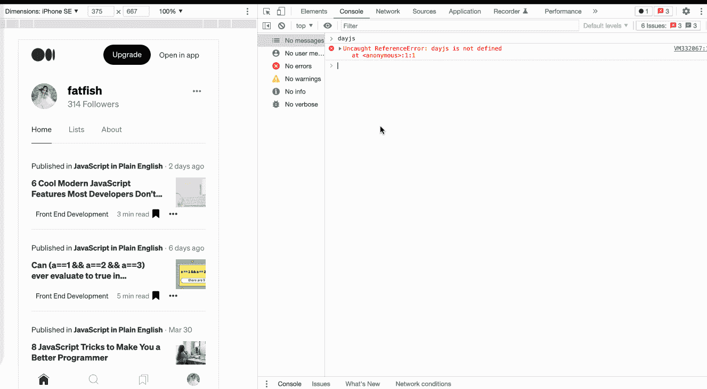

# 3.重新发送 XHR 请求

我们在工作中经常需要和后端开发人员一起调试接口。使用这个功能可以提高我们的对接效率。

**你只需要做这些步骤:**

1.  选择`Network`面板
2.  点击`Fetch/XHR`
3.  选择要重新发送的请求
4.  右击并选择`Replay XHR`

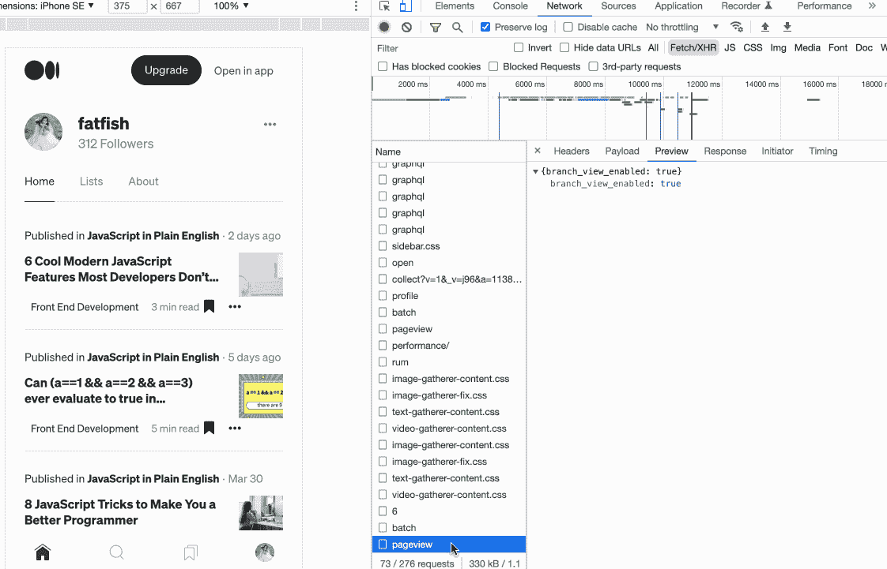

# 4.快速切换主题颜色

有人喜欢 chrome 的白色主题，有人喜欢黑色，我们可以使用快捷键在两种主题之间快速切换。

1.  `cmd + shift + p`执行命令命令
2.  输入“切换到暗主题”或“切换到亮主题”来切换主题

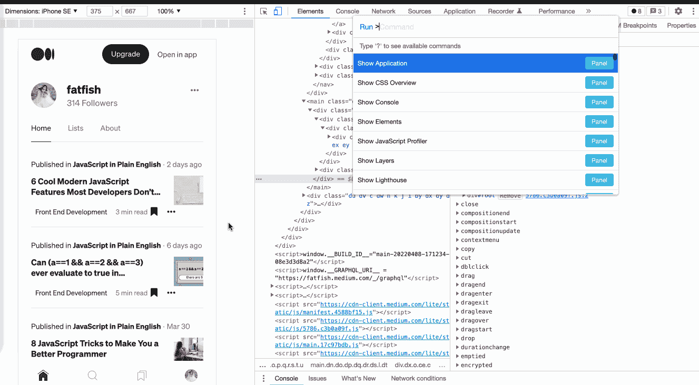

# 5.在控制台中快速发送请求

对于同一个请求，有时需要修改输入参数，重新发送。捷径是什么？

你只需要做这些步骤:

1.  选择`Network`面板。
2.  点击`Fetch/XHR`。
3.  选择要重新发送的请求。
4.  选择`Copy as fetch`面板。
5.  修改输入参数并重新发送。

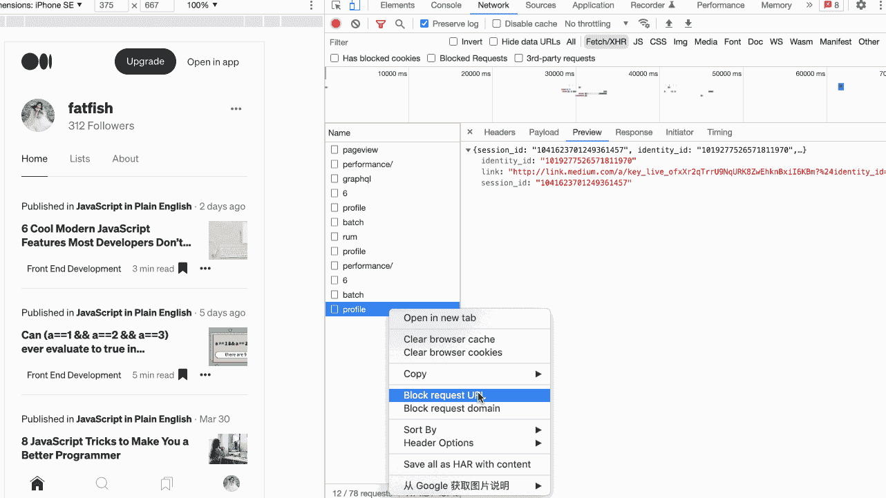

# 6.复制 JavaScript 变量

如何将复杂的数据复制到剪贴板？

太神奇了。可以使用 Chrome 浏览器提供的`Copy`功能来完成。

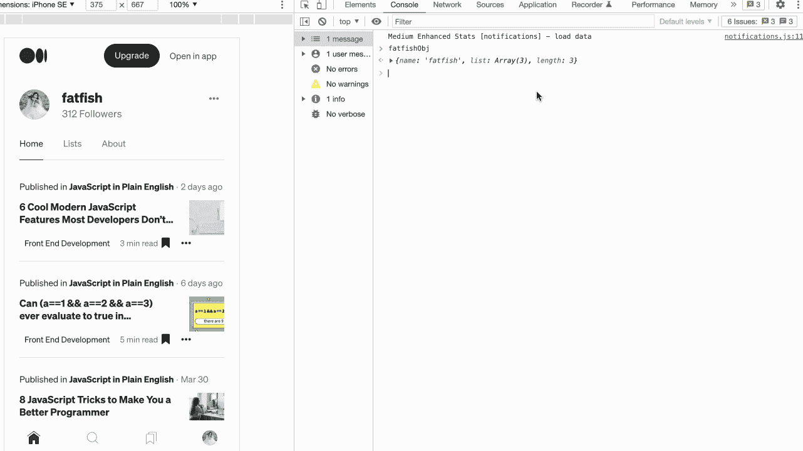

# 7.在控制台中获取选定的 DOM 元素

当我们通过“Elements”面板选中一个元素，想通过 JavaScript 打印它的一些属性，比如宽度、高度、位置等，应该怎么做？

1.  通过`Elements panel`选择 DOM 元素。
2.  使用`$0`访问控制台中的元件。

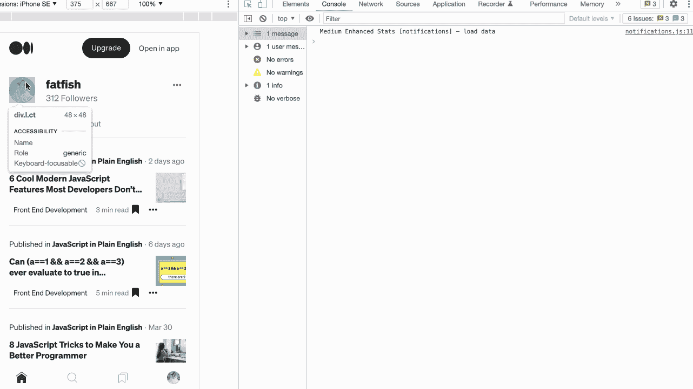

# 8.捕捉全尺寸截图

如果我们想对一个不止一屏的页面进行截图，有什么好的方法吗？

强大的 Chrome 浏览器可以轻松做到这一点。

1.  准备您想要捕获的页面内容
2.  `CMD + Shift + P`执行`Command`
3.  输入`Capture full size screenshot`并按回车键

哇，太酷了！！！

现在有了一个新问题。我们只是想拍一部分截图页面。我们做什么呢

也很简单，第三步输入“抓取节点截图”即可。

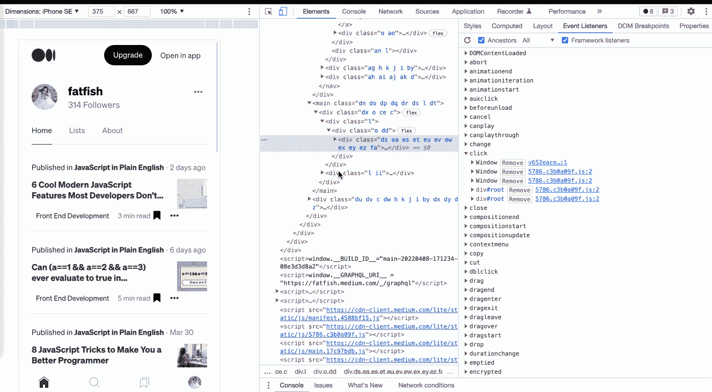

# 9.展开所有子节点

如何一次展开一个 DOM 元素的所有子节点？不是一个一个来？

您可以使用“元素”面板中的组合键“Alt + click”来一次展开所有子节点。

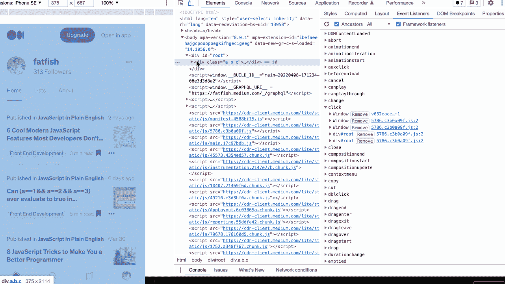

# 10.使用“$”引用上次执行的结果

我们来看一下这个场景，我们对字符串进行了各种操作，然后我们想知道每一步的结果，应该怎么做？

**你可能会这样做**

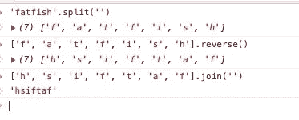

**更简单的方法**

使用“$”获得上一次操作的结果，而不用每次都复制它。

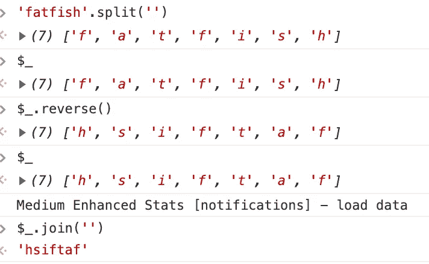

# 11.使用“`$`”和“`$$`”快速选择 DOM 元素

使用`document.querySelector`和`document.querySelectorAll`在控制台中选择当前页面的元素是最常见的需求，但是有点太长了，我们可以用`$`和`$$`来代替。

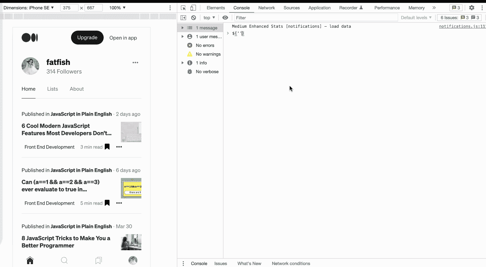

# 最后

**感谢阅读。**我期待着您的关注和阅读更多高质量的文章。

 [## “我失去了一个工作机会，只是因为承诺。所有”

### 一次让我好难过的面试经历。

javascript.plainenglish.io](/i-lost-a-job-opportunity-just-because-of-promise-all-be396f6efe87)  [## 采访者:“npm 跑 xxx”怎么了？

### 一个大多数人都不知道的秘密。

javascript.plainenglish.io](/interviewer-what-happened-to-npm-run-xxx-cdcb37dbaf44)  [## 面试官:可以“x！== x "在 JavaScript 中返回 True？

### 你可能不知道的五个神奇的 JavaScript 知识点！

javascript.plainenglish.io](/interviewer-can-x-x-return-true-in-javascript-7e1d1fa7b5cd)  [## 现在是 2022 年，不要再滥用箭头功能了

### 不应该使用箭头函数的 4 种情况。

javascript.plainenglish.io](/its-2022-don-t-abuse-the-arrow-function-anymore-905862a9c668) 

*更多内容请看*[***plain English . io***](https://plainenglish.io/)*。报名参加我们的* [***免费周报***](http://newsletter.plainenglish.io/) *。关注我们关于*[***Twitter***](https://twitter.com/inPlainEngHQ)[***LinkedIn***](https://www.linkedin.com/company/inplainenglish/)*[***YouTube***](https://www.youtube.com/channel/UCtipWUghju290NWcn8jhyAw)*[***不和***](https://discord.gg/GtDtUAvyhW) *。对增长黑客感兴趣？检查* [***电路***](https://circuit.ooo/) *。***