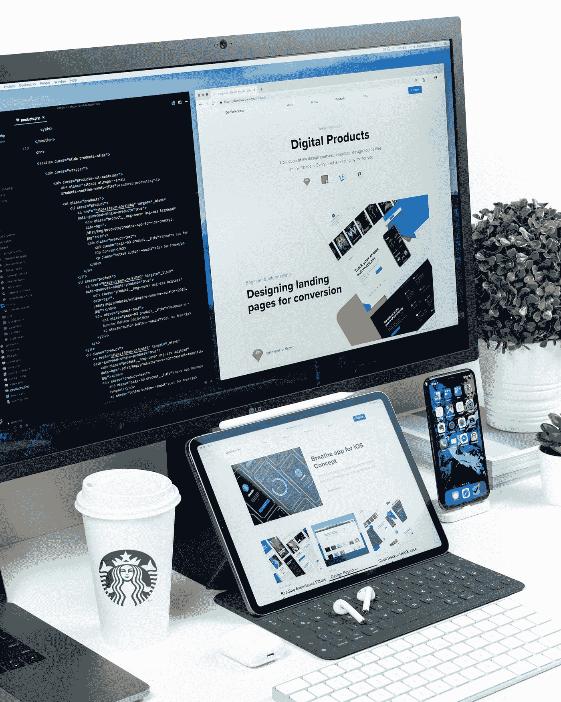

# 11 个优秀的 CSS 框架

> 原文：<https://javascript.plainenglish.io/11-excellent-css-frameworks-45132beb04ad?source=collection_archive---------8----------------------->

## 向 HTML 元素添加一些特定的类，以快速获得一些想要的效果。

Photo by [Daniel Korpai](https://unsplash.com/@danielkorpai?utm_source=medium&utm_medium=referral) on [Unsplash](https://unsplash.com?utm_source=medium&utm_medium=referral)

对于 UI/UX 设计师来说，做一个漂亮的网站并不是一件容易的事情。当创建网站布局并使其美观时，开发人员必须考虑所有应用程序，包括移动、桌面和平板电脑。今天，这些框架节省了大量时间，并有助于以更好、更快的方式构建响应迅速的 web 应用程序。这些框架提供了基本的结构，包括网格、交互式 UI 模式、web 排版、工具提示、按钮、表单元素、图标。

分享每个网页设计师和前端开发者在制作网站时需要的工具。CSS 框架可以在各种设备上提供最佳的浏览体验，从桌面、显示器到移动电话。然而，每个 CSS 框架都有其优点和缺点，所以这取决于您的具体需求。

本文中列出的所有框架都是免费和开源的。

1.  [**自举**](https://getbootstrap.com/)

开发者马克·奥托和雅各布·桑顿在 2011 年创建了 Bootstrap。它是 Twitter 在 2011 年推出的。Bootstrap 是开发响应式网页最流行的 HTML、CSS 和 JS 框架。Bootstrap 使前端开发更快更容易。Bootstrap 提供了一个响应式网格系统、大量用于构建布局的预构建组件以及基于 Jquery 的强大插件。Bootstrap 4 包括一些额外的特性，如新的配色方案、新的修改器、新的实用程序类。Bootstrap 5 的一些重大变化，比如随意使用 jQuery 和增加 RTL ( [从右到左)](https://blog.scottlogic.com/2015/02/13/rtl.html)支持，结合现成的组件和实用程序类。

优势:

*   快速原型
*   大型生态系统
*   大量的组件
*   简单的文档和低学习曲线

您还可以找到许多免费的引导模板和 UI 工具包，使您的 web 开发更快。

[25 款网页设计最佳引导 UI 套件](https://superdevresources.com/bootstrap-ui-kits/)

*   [软 UI 设计系统](https://www.creative-tim.com/product/soft-ui-design-system-pro)
*   [Fabrx UI 套件](https://fabrx.co/)
*   [呼唤](https://uideck.com/templates/lindy-bootstrap-5-ui-kit/)
*   [纸张套件 2](https://www.creative-tim.com/product/paper-kit-2)
*   [现在 UI 套件](https://demos.creative-tim.com/now-ui-kit/index.html)
*   [材料包](https://demos.creative-tim.com/material-kit/)
*   【Bootstrap 4 的冲击设计系统
*   [BLK 为自举 4 设计](https://www.creative-tim.com/product/blk-design-system)
*   [搞定 Bootstrap UI 套件](https://www.creative-tim.com/product/get-shit-done-kit)
*   [用于引导程序的氩气设计系统](https://www.creative-tim.com/product/argon-design-system)
*   [Pixel Pro](https://themesberg.com/product/ui-kit/pixel-pro-premium-bootstrap-5-ui-kit)
*   [软 UI](https://www.creative-tim.com/product/soft-ui-dashboard)
*   [MDB UI 套件](https://mdbootstrap.com/)
*   [碎片](https://designrevision.com/downloads/shards/)
*   [主播](https://bootstrap-anchor.com/)

[20+最佳自举模板免费下载](https://superdevresources.com/bootstrap-templates/)

**2。** [**顺风 CSS**](https://tailwindcss.com/)

Tailwind 是一种相对现代的基于实用程序的方法，用于构建响应性网站。它提供了低级的实用程序类，让您可以构建自己的设计，而不是使用预构建的组件。它用 PostCSS 编写，用 JavaScript 配置。我们可以定义元素的视觉方面。它有大量的实用类，不用写 CSS 就能建立现代网站。它可以向 HTML 元素添加样式，并提供大量的设计样式。例如，您可以赋予按钮药丸、轮廓和 3D 外观。你可以个性化每个方面。

优势

*   易于定制
*   低级实用程序类

[开发者最佳 10+顺风 CSS 资源](https://superdevresources.com/best-tailwind-css-resources-for-developers/)

*   [Notus JS](https://www.creative-tim.com/product/notus-js)
*   [不是角度](https://www.creative-tim.com/product/notus-angular)
*   [顺风启动套件](https://www.creative-tim.com/learning-lab/tailwind-starter-kit/presentation)
*   [Notus NextJS](https://www.creative-tim.com/product/notus-nextjs)
*   [Notus svelite](https://www.creative-tim.com/product/notus-svelte)
*   [Vue Notus](https://www.creative-tim.com/product/vue-notus)
*   [没有反应](https://www.creative-tim.com/product/notus-react)
*   [埃及艳后](https://github.com/moesaid/cleopatra)
*   [顺风工具箱登陆页面](https://www.tailwindtoolbox.com/templates/landing-page)
*   [Digizu 产品展示区](https://github.com/rosstopping/tailwindcss-templates)
*   [Maizzle](https://maizzle.com/)

**3。** [**超光子**](https://tachyons.io/)

超光速粒子也是一种基于实用的方法来建立响应网站。它提供了许多现成的复杂特性，无需编写大量 CSS 代码。它是轻量级的，可定制的，可扩展的，不需要额外的设置。它可以向类名添加属性的新样式，而不用担心命名冲突或样式覆盖。

[人类功能 CSS](https://github.com/tachyons-css/tachyons)

4. [**骷髅**](http://getskeleton.com/)

如果你正在做一个较小的项目，你不需要一个较大框架的所有工具，Skeleton 是合适的。它是最简单、响应最慢的 CSS 框架。

有 3 大优势

*   它仅包含 400 行代码，但提供了多种使用选项。网格、版式、按钮、表格、列表、媒体查询、表格等功能
*   样式被设计成一个起点，而不是一个 UI 框架
*   快速入门，无需编译或安装

5.[**基础**](https://get.foundation/)

许多一流的公司，如脸书、易贝、Mozilla、Adobe 和迪斯尼都在使用这个框架。ZURB 从 1998 年开始生产 web 产品和服务，并创建了一个适应性前端框架 Foundation。它是最先进的响应框架，提供了许多定制特性。与其他工具相比，Foundation 提供了更好的移动解决方案，因为它对不同类型设备中的内容结构的呈现进行了相应的预设。例如，它提供了一个 Fastclick.js 工具，可以在移动设备上更快地进行渲染。

优势

*   强大的电子邮件框架
*   非常灵活
*   在线网络研讨会培训支持
*   易于定制
*   提供完整的模块化工具集

6.[UIkit](https://getuikit.com/)

它是一个轻量级的最小 CSS 框架，用于开发强大的 web 界面。它是可定制和可扩展的。它提供了 HTML、CSS 和 JS 组件的综合库集合。例如，您可以使用最大空白和许多 UI 组件，如 SVG 图标、进度条、图像生成器等。创造一个漂亮的网络界面。您可以使用 Nestable 之类的组件创建高级接口。

优势

*   有用的 UI 组件的大集合
*   包含 JavaScript
*   适应所有设备

7. [**纯**](https://purecss.io/)

Pure 是雅虎开发的。这是一个轻量级的响应 CSS 框架。Pure.css 是一组小型响应 css 模块，可以在任何 web 项目中使用。例如，一个完整的时钟模块只有 4.0 KB。Pure 是用 Normalize.css 构建的，帮助创建带有网格和菜单的响应性布局。可以根据您的喜好导入不同的模块。与 Bootstrap 不同，它不允许创建固定布局。

优势

*   手机友好型
*   简单易学

8. [**布尔玛**](https://bulma.io/)

相对于其他 CSS 框架，布尔玛是市场上相对较新的基于 flexbox 布局模型的框架，但它在短时间内获得了用户的大量关注。它提供了响应式设计和移动优先的 UI 组件，可以导入的模块化结构。它根本不需要 javascript。

优势

*   所有的 CSS 类名都是逻辑命名的，所以语法很容易学。
*   纯 CSS，没有 JavaScript
*   模块化:使用 Saas 构建，您可以只导入您需要的必要模块
*   大量组件，如垂直对齐解决方案、布局和媒体对象

9. [**语义 UI**](https://semantic-ui.com/)

语义 UI 以其令人难以置信的主题化效果和简单优雅的设计而闻名。它是一个高级的 CSS 框架，提供 50+ UI 元素，300+ CSS 变量进行定制，并使用 EM 值进行响应式设计。

它可以支持 React、Angular、Meteor 和 Ember 等第三方库，在这些库中，您可以用您的应用程序逻辑组织您的 UI 层，以便您可以创建一个独特而美丽的网站，而无需进行多次更改。

10. [**物化**](https://materializecss.com/)

是基于材料设计的现代响应式前端框架。它是由谷歌在 2014 年创建的，该框架适用于任何想要设计网站或 Andriod web 应用程序的人。许多 Google 产品都是在这个框架上实现的，比如 YouTube、Gmail、Google Drive 和 Google Docs。该框架使用基于 12 列网格的布局，通过引导、响应动画和过渡、填充以及光影等深度效果来构建。

**优势**

*   大量组件可供选择
*   易于定制
*   材料设计

11. [**毫克**](https://milligram.io/)

毫克是一个最小的 CSS 框架，不依赖于 JavaScript。它很轻。框架的大小只有 2 Kb，但是它有许多特性和 web 开发工具来满足您的需求。它为开发人员提供了灵活性，允许他们使用 CSS3 提供的所有功能。它还提供了一个基于 flexbox 的网格系统。

优势

*   超级设计主题

如果你比较这些框架，你会发现 Bootstrap、Tailwind 和 Foundation 在受欢迎程度上远远领先于其他框架。设计公司更喜欢 Bootstrap，因为它提供了开箱即用的组件，并且易于定制。基本上在欧美流行 Bootstrap。它是基于更少。最近升级到 2.0 后，完全模块化，不需要太多配置，非常好用。但是它有一个缺点，许多开发者设计相同风格的网页。

**进一步的框架**

1.  [厉鬼。CSS](https://picturepan2.github.io/spectre/)
2.  [底座](https://getbase.org/)
3.  [图层](http://labs.jerryjappinen.com/layers/)
4.  [可爱背带](https://www.cutestrap.com/)
5.  [mobi.css](https://github.com/mobi-css/mobi.css)
6.  [樱花](https://github.com/oxalorg/sakura)
7.  [mini.css](https://minicss.org/)
8.  [馆](https://pavilion.io/)
9.  [简单](https://github.com/jmjuanes/siimple)
10.  [滑板车](https://github.com/dropbox/scooter)
11.  [无工作](http://workless.ikreativ.com/)
12.  [反应灵敏](https://responsivebp.com/)
13.  [简洁。CSS](https://concisecss.com/)
14.  [库里苏](https://kurisubrooks.com/)
15.  [死简单网格](https://github.com/mourner/dead-simple-grid)
16.  [野餐 CSS](https://picnicss.com/)
17.  [苏西](https://susy.readthedocs.io/)
18.  [动画。CSS](https://animate.style/)
19.  [Paper.css](https://www.getpapercss.com/)
20.  [NES.css](https://nostalgic-css.github.io/NES.css/)
21.  [Tent.css](https://css.sitetent.com/)
22.  [简单网格](https://simplegrid.io/)
23.  [芥末 UI](https://kylelogue.github.io/mustard-ui/index.html)
24.  [甘比](https://github.com/GumbyFramework/Gumby)
25.  [蓝图](https://blueprintcss.dev/)

**参考文献**

 [## 2017 年 20 个最佳最小 CSS 框架— Bashooka

### 如果你对极简主义的热爱只有我的一半，这里有 20 个最好的极简 CSS 框架，可以帮助你节省时间…

bashooka.com](https://bashooka.com/resources/20-best-minimal-css-frameworks-2017/) 

如果你发现我的任何文章有帮助或有用，那么请考虑给我一杯咖啡，帮助支持我的工作或给我赞助😊，通过使用

[**Patreon**](https://www.patreon.com/jinlowmedium)

[**Ko-fi.com**](https://ko-fi.com/jinlowmedium)

[buymeacoffee](https://www.buymeacoffee.com/jinlowmedium)

最后但同样重要的是，如果你还不是一个中等会员，并打算成为一个，我恳请你使用下面的链接。我将收取你的一部分会员费，不增加你的额外费用。

 [## 用我的引荐链接-金加入 Medium

### 作为一个媒体会员，你的会员费的一部分会给你阅读的作家，你可以完全接触到每一个故事…

jinlow.medium.com](https://jinlow.medium.com/membership) 

*更多内容看* [***说白了。报名参加我们的***](http://plainenglish.io/) **[***免费周报***](http://newsletter.plainenglish.io/) *。在我们的* [***社区获得独家访问写作机会和建议***](https://discord.gg/GtDtUAvyhW) *。***