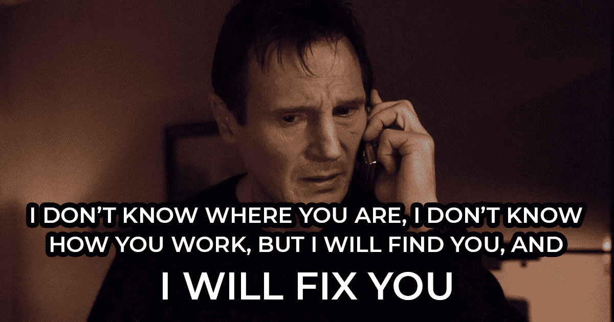

# 程序员日常使用的 11 个有趣借口

> 原文：<https://javascript.plainenglish.io/11-funny-excuses-that-programmers-use-daily-e20e3ae16180?source=collection_archive---------16----------------------->

## 我们都对这些感到内疚

Captured by [Craig Adderley](https://www.pexels.com/sk-sk/@thatguycraig000?utm_content=attributionCopyText&utm_medium=referral&utm_source=pexels) on [Pexels](https://www.pexels.com/sk-sk/fotka/oci-sedenie-vyraz-tvare-mlady-1518754/?utm_content=attributionCopyText&utm_medium=referral&utm_source=pexels)

**“是的！那是我的错，让我来弥补吧！”如果有人带着你的代码中的问题来找你，你可能从来没有对他说过这些话。如果你做了，我的道具给你。**

这可能是有原因的。我们在给定解决方案的编码上花费了大量的精力。我们尝试它是否工作正常，我们甚至验证了所有我们能想到的边缘情况。

一切似乎都井井有条……**直到有人去尝试！**

当其他人开始测试我们的更改时，他们总是会遇到一些问题。对于我们这些强大的创造者来说，这没有任何意义。毕竟，我们是坚如磐石的程序员，我们不会犯错。

所以我们开始做别人会做的事。**我们开始找借口。**

读完这篇文章，你会知道懒惰的程序员最常使用的借口是什么。但最重要的是，你可以选择**为自己挑选一个。**

下一次，当你觉得时机成熟的时候，**你可以随意使用它！**

说到这里，让我们直接进入列表。

Photo by [Robert Kubíček](https://unsplash.com/@roboot_cz?utm_source=unsplash&utm_medium=referral&utm_content=creditCopyText) on [Unsplash](https://unsplash.com/s/photos/suricata?utm_source=unsplash&utm_medium=referral&utm_content=creditCopyText)

# 节目使用的借口

## 它在我的机器上工作

除了选择这棵古老的常青树，还有什么更好的方式来开始这个列表呢？如果这些话还没从你嘴里说出来，你就没资格称自己是开发者。

这个借口会为你争取几分钟。最好的情况是，甚至有几个小时的空闲时间。如果这还不够，你可以让别人使用你的机器。毕竟在那里行得通！

## 你一定是用错了数据

错误的数据，错误的输入，或者有人忘记删除的旧数据。这些事情会永远困扰我们。当然，它们需要我们立即关注。

然而，注意力是我们不喜欢提供的东西。因此，我们找借口。“它必须失败，你使用的是损坏的数据。我们收到了一个失败，这是件好事。”这些话会成为你最好的朋友。

## 我没有在那上面工作

我不喜欢玩指责游戏。但我更讨厌的是修正别人的错误。我相信我已经不一样了。

对那些同情我的人来说，我们有这个万事通。如果有人问我要修理什么东西。我们可以简单地说我们没有做。

为了证明这一点，更重要的是，如果说错误的作者**更清楚该做什么**，以及如何修复它呢？

## 我没有时间写单元测试

时间是宝贵的，通过编写单元测试来浪费时间，就相当于在餐馆里要一份菜谱。你得到你的食物，你只是吃它。而且如果不好吃就投诉！

写代码也是如此。

Created by Author

## 我不知道如何编写好的单元测试

让我们暂时停留在单元测试的主题上。让我们假设你必须写它们，并且你没有办法摆脱它们。在这种情况下我们该怎么办？我们是不是应该放弃编写单元测试？

哦，拜托，我们比那更好。最有效的借口是**说我们不知道如何编写好的单元测试。**当然，这么说，我们降低了自己作为开发者的价值。但是我们在增加时间，我们什么都不用做。

因此，如果你想避免编写单元测试，就**承认你不擅长编写单元测试。**毕竟，我们是开发人员，不是质量保证人员。

## 您的浏览器必须缓存旧内容

如果我们想玩指责游戏，有一个好的候选人可以承担所有的指责。它甚至不会说一句话。原因是因为它不会说话。

如果你想责怪某些东西不能正常工作，那就责怪浏览器吧。浏览器缓存会导致很多问题和混乱。那么为什么不把它变成我们的优势呢？

谁知道呢？**也许你的指责会是正确的。**

## 这在要求中没有具体说明

如果你使用敏捷方法，你所有的任务都应该被正确定义。定义和评估它们可能会很痛苦。但是一旦你做到了，一个新的可能性就会为你打开。一个新的借口，如果你愿意的话。

现在，你可以在敏捷开发中使用 evergreen。你**就说需求里没有规定**。如果任务描述里没有，你为什么要这么做？

你做得越多，事情破裂的可能性就越大。所以耐心等待，阅读描述，并完全按照它所说的去做。

## 几分钟前还能用

这个借口简单明了，最重要的是，它缺乏一定的专业性。但这并不意味着我们应该避免它。不过，**我只推荐在特定场景下使用**。

你正在展示你的作品，却有东西不小心散开了吗？你正在展示你的改变，而它们突然停止工作了吗？这是最理想的场合。

通过说几分钟前它还能用，你可以向对方保证你做得很好。但是发生了一些意想不到的事情，导致了这个问题。

Credits: [Taken](https://www.imdb.com/title/tt0936501/)

## 我的代码没有任何问题

我看到这些词经常出现。我甚至在我曾经工作过的地方听到过。但是我不会用它们。

这个借口没有任何根据。你不能向任何人保证被破坏的东西会起作用。你甚至没有表现出你在乎的迹象。这只是一个直截了当的傲慢回应。**使用风险自担！**

## 您使用的不是最新版本

对于网站来说，这可能是由浏览器缓存造成的。但并不是所有的开发者都在创建网站。也就是说**我们不能打浏览器缓存卡。**

然而，**我们仍然可以指责旧版本。**发生这种情况的原因有很多。毕竟，我们是人类。我们会犯错，我们会忘记。让别人仔细检查他们是否使用了正确的版本也无妨。

## 这不是一个 Bug，而是一个特性

如果前面提到的借口都不合适。有一个万福玛利亚我们可以一直使用。有时候，向别人推销可能很难，但是**试一试也无妨。**

正如迈克尔·斯科特所说…

Credits: [The Office](https://www.imdb.com/title/tt0386676/)

“这不是一个错误，这是一个功能”是最后一个上榜的借口。剩下的是说几句最后的话。

# 遗言

如果你认为这不是一个严肃的建议，你是对的。不是的！无论如何，你应该只是出现在工作中，然后开始到处找借口。

我只是想找点乐子，听起来有点讽刺。我成功了吗？好吧，我让你来判断。

现在，当尘埃落定。我想听听你的意见！

***你有我忘记提的借口吗？***

我希望你喜欢这个故事。如果你想从我这里听到更多或者阅读更多，可以考虑使用 [***这个链接***](https://bernardbad.medium.com/membership) ***成为一个中等会员。***

*更多内容看* [***说白了就是***](https://plainenglish.io/) *。报名参加我们的* [***免费每周简讯***](http://newsletter.plainenglish.io/) *。关注我们关于**[***推特***](https://twitter.com/inPlainEngHQ) *和*[***LinkedIn***](https://www.linkedin.com/company/inplainenglish/)*。加入我们的* [***社区不和谐***](https://discord.gg/GtDtUAvyhW) *。**