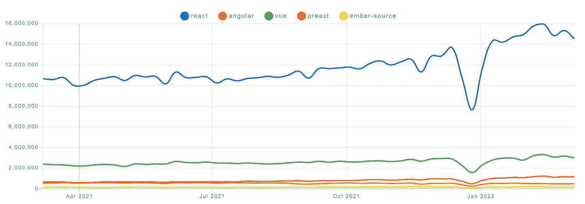

# 成为 JavaScript 全栈工程师的 11 个阶段

> 原文：<https://javascript.plainenglish.io/11-stages-to-become-a-javascript-full-stack-engineer-70d8a8365ee9?source=collection_archive---------11----------------------->

## 进入编码的世界！

## 开始你的职业生涯，成为一名全栈开发者

Photo by [Caspar Camille Rubin](https://unsplash.com/@casparrubin?utm_source=medium&utm_medium=referral) on [Unsplash](https://unsplash.com?utm_source=medium&utm_medium=referral)

最近收到多条消息，大多是刚毕业踏入编码界的新人。问的问题大多是关于如何快速提升自己的技能，如何成为一名全栈开发者，或者如何选择职业方向。

虽然我试图逐一回复每个人，但我想结合自己的经验，就如何成为一名全栈工程师制定一个路线图，并与大家分享。

# 阶段 1 — HTML

在开始学习任何编程语言之前，你应该学习基本的 HTML。一个好的开始是 W3Schools 的教程，它教授所有的基础知识和一些高级信息:[在这里找到](https://www.w3schools.com/html/default.asp)

# 阶段 2 — CSS(网格、Flex)

有了 HTML 的知识，你应该学习 CSS 来设计你的网站。再次，W3Schools 提供了一个很好的教程:[在这里找到](https://www.w3schools.com/css/default.asp)

# 阶段 3 — JavaScript + DOM

现在是时候学习 JavaScript 了。JavaScript 是全世界最常用的编程语言之一。要学习它，你可以使用另一个 [W3Schools 教程](https://www.w3schools.com/js/default.asp)。还有，我有一篇学习高级 JavaScript 游戏化的文章:

 [## 玩游戏的同时学习 JavaScript 让学习游戏化

### 用游戏化来放大你的软件开发技能，学习 JavaScript。

javascript.plainenglish.io](/learn-javascript-while-playing-games-gamify-your-learning-9f41d4d3dad9) 

# 阶段 4 — Node.js

Node.js 是一个强大的基于 JavaScript 的平台，它建立在 Google Chrome 的 JavaScript V8 引擎之上，为使用 JavaScript 构建高度可伸缩的服务器端应用程序提供了一个事件驱动、非阻塞(异步)I/O 和跨平台的运行时环境。

首先在 [nodejs.dev](https://nodejs.dev) 上下载并安装您的操作系统的最新节点版本。这是 JavaScript (TypeScript)开发人员进一步发展的必备条件。

之后，你应该[看看他们的介绍](https://nodejs.dev/learn/introduction-to-nodejs)来学习一些关于 Node.js 的基础知识。

在进入下一阶段之前，你应该熟悉 npm 生态系统。在开始使用 React 之前，请考虑回答以下问题:

*   什么是 NPM？
*   我怎样才能安装一些东西？
*   什么是 package.json
*   我需要 XX 套餐，我该怎么做？

# 第 5 阶段—做出反应

如果你精通 JavaScript(也许还有 TypeScript ),你应该学习 React，因为它是基于 npmtrends.com 数据的最常用的框架:

[https://www.npmtrends.com/react-vs-angular-vs-vue-vs-preact-vs-ember-source](https://www.npmtrends.com/react-vs-angular-vs-vue-vs-preact-vs-ember-source)

掌握 React 需要一些时间，因为它有许多不同的概念，这些概念在开发过程中都变得很重要。

我个人的建议是，在继续使用 MySQL 之前，一步一步地做好以下三个清单:

## 基础

1.  [了解反应](https://reactjs.org/tutorial/tutorial.html#what-is-react)
2.  如何设置您的 DevEnv
3.  JSX
4.  成分
5.  状态
6.  小道具
7.  列表/键
8.  生命周期方法

## 高级反应概念

1.  式样
2.  表单处理
3.  数据处理
4.  调节过程
5.  钩住
6.  定制挂钩
7.  语境

## 掌握反应

1.  惰性装载
2.  门户网站
3.  状态管理
4.  按指定路线发送
5.  主题
6.  模式
7.  反模式

# 第 6 阶段— MySQL

在你掌握了 JavaScript 和 React 来创建漂亮的网站之后，下一步将是在这些网站中使用持久数据。通常，这是通过连接到 MySQL、PostgreSQL 或 SQLite 等数据库来实现的。

**为了简单起见，你应该学习 MySQL 而不是 PostgreSQL！**

作为一名开发人员，你必须熟悉 MySQL，因为它对于小型和大型应用程序都是理想的(PostgreSQL 是 DBMS 的进步，但 MySQL 是基础知识)。

要学习 MySQL，你可以使用 [W3School 教程](https://www.w3schools.com/mySQl/default.asp)，它将教你所有的基础知识，以理解你将在不同应用中遇到的每一个 MySQL 查询。

一件重要的事情是，你必须**理解数据库设计**而不是查询，因为在未来的阶段，你将使用一种技术(ORM)来帮助你处理查询。**为此，你必须了解数据库规范化。如果您想使用关系数据库，这一点非常重要！**

# 第 7 阶段— MongoDB

与 MySQL 不同，MongoDB 是一个面向文档的数据库，被归类为 NoSQL。它使用带有可选模式的类似 JSON 的文档来存储数据。

熟悉 NoSQL 数据库设计和[阅读并理解本](https://www.mongodb.com/nosql-explained/data-modeling)。

# 阶段 8 —积垢模式

如果您正在处理持久数据，那么您必须了解 CRUD 模式。CRUD 代表**创建**，**读取**，**更新**，**删除**，描述了持久数据的四种基本操作。

在维基百科上阅读相关内容就足够了。

# 第 9 阶段— ORM 和 ODM

ORM 代表[对象关系映射](https://en.wikipedia.org/wiki/Object%E2%80%93relational_mapping)；ODM 代表对象文档映射器。两者都是使用面向对象的范例从数据库中查询和操作数据的技术。

**通常，当开发人员谈论 ORM 或 ODM 时，他们指的是实现这些技术的库。**

您应该至少学习以下两种数据库技术中的一种:

*   [**类型表**](https://github.com/typeorm/typeorm) (SQL 和 NoSQL)
*   [**Prisma**](https://www.prisma.io) (SQL 和 MongoDB)
*   [猫鼬](https://mongoosejs.com)(仅限 MongoDB)
*   [打字鹅](https://github.com/typegoose/typegoose)(打字稿用猫鼬)
*   [Knex.js](http://knexjs.org)
*   [序列化](https://sequelize.org) (SQL)

我个人会推荐学习 **TypeOrm** 和 **Prisma！**

# 阶段 10——建立辅助项目以获得经验

既然你已经知道了编程语言、框架以及如何使用数据库，你就可以开始创建一些项目了。

这一阶段对于成为全栈开发人员非常重要，因为您在自己的项目中工作时，永远不会遇到教程中的实际问题。

以下是一些很酷的项目创意

## 目标跟踪应用

跟踪你个人目标的简单应用程序。将目标保存在数据库中，并在前端以漂亮的方式显示出来。

## 克隆一个网站

搜索一个好的网站，试着克隆它。复制内容并尝试推断网站使用的功能。然后试着为自己的网站实现。

## 开发者组合

你应该创建的一个非常重要的项目是作品集。作品集是一个代表你自己的重要网站。如果你申请一份工作，你会有一个好看的网站，展示你的技能或介绍你自己。

从这里获得灵感:

 [## 使用 Next.js、Tailwind CSS、Stripe 和 PayPal 创建您的投资组合

### 使用 Next.js 和支持黑暗模式的 Tailwind CSS 创建一个作品集网站，这是一个集成了…

better 编程. pub](https://betterprogramming.pub/create-your-portfolio-using-next-js-tailwind-css-stripe-and-paypal-80c723bb3fef) 

# 阶段 11 —部署您的辅助项目

最后一个阶段是在服务器上部署您的项目。这个阶段也是强制性的，因为作为一个全栈开发者，你应该知道如何在生产环境中部署你的应用。

**我建议**了解 Docker 以及如何使用它来托管不同的网站。首先，你可以[点击这里](https://medium.com/geekculture/beginner-friendly-introduction-into-devops-with-docker-on-windows-6aac2de2db33)查看我对 Docker 的介绍。如果你已经进入 Docker [了，你可以看看这篇文章](https://levelup.gitconnected.com/how-to-setup-traefik-v2-with-automatic-lets-encrypt-certificate-resolver-83de0ed0f542)，在这篇文章中我解释了如何部署 Traefik(一个负载均衡器),它可以为你将部署在服务器上的每个服务自动创建 SSL 证书。

如果你已经阅读并理解了这两篇文章，你可以看看这篇文章

 [## 使用 Docker 和 Traefik 部署任何 SSL 安全网站

### 了解如何使用 Docker 和 Traefik 部署任何 SSL 安全的网站-包括所有文件！

better 编程. pub](https://betterprogramming.pub/deploy-any-ssl-secured-website-with-docker-and-traefik-27fbeb1343d3) 

它描述了如何在已经运行 Traefik 的 Docker 环境中部署一个简单的网站。

**恭喜你，你可以称自己为全栈开发者了！**

# 结束语

希望这些资源能帮助你成为一名全栈开发人员。

另外，如果你有任何问题、想法或建议，请写在下面。如果可能的话，我试着回答他们。

写作一直是我的激情所在，帮助和激励他人给我带来了快乐。

在 [Twitter](https://www.twitter.com/paulknulst) 、 [LinkedIn](https://www.linkedin.com/in/paulknulst/) 和 [GitHub](https://github.com/paulknulst) 上连接我！

本文最初发表在我的博客上[https://www . paulsblog . dev/11-stages-to-be-a-JavaScript-full-stack-engineer/](https://www.paulsblog.dev/11-stages-to-become-a-javascript-full-stack-engineer/)

*更多内容请看*[***plain English . io***](https://plainenglish.io/)*。报名参加我们的* [***免费周报***](http://newsletter.plainenglish.io/) *。关注我们关于*[***Twitter***](https://twitter.com/inPlainEngHQ)*和*[***LinkedIn***](https://www.linkedin.com/company/inplainenglish/)*。加入我们的* [***社区不和谐***](https://discord.gg/GtDtUAvyhW) *。*