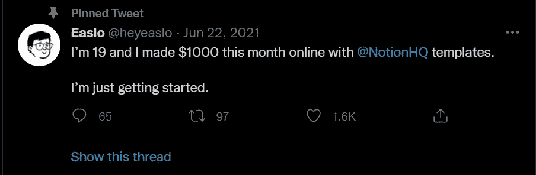

# 11 愚蠢的简单的一面，作为一个程序员赚取额外的钱

> 原文：<https://javascript.plainenglish.io/11-stupidly-simple-side-hustles-to-earn-extra-money-as-a-programmer-23fd30ca5cda?source=collection_archive---------0----------------------->

## 没有废话，请不要期待博客，YouTube，自由职业者，或媒体。

Photo by [Vitaly Taranov](https://unsplash.com/@gooner?utm_source=medium&utm_medium=referral) on [Unsplash](https://unsplash.com?utm_source=medium&utm_medium=referral)

在过去的几年里，我涉足了各种行业，学到了一些新技能，开展了一些副业，并结识了一些优秀的个人。

作为所有这些的结果，我学到了更多。我们现在有一个志同道合的人组成的网络，他们互相帮助我们赚钱或增加我们的财富。

让我给你举个例子:我的一个朋友经常试图投资股票，当他发现一些有趣的东西时，他会与我们分享，这样我们就可以在几周或几个月内把钱投入其中。

一位是科技企业家，他讨论了最新的科技趋势，以及我们如何投资于这些趋势。在他的建议下，我们将部分资金投资于分散土地，并对 Web3 有了更多的了解。

我们相信与他人分享可以让我们学到更多，发现最好的机会，并获得更多。

是的，我发表了几篇关于副业的文章，但是都很短。

现在，我想和你分享一些副业，你可以研究一下，了解一下，从中赚钱。此外，不要期待任何不正当的工作或不需要工作的副业。因为这种旁门左道是不存在的。

毫无疑问，每一个侧面的骗局都很容易，因为我们大多数人(我和我的朋友)都做过，而且都在赚钱。然而，每一次侧面冲撞都需要连贯性和一些努力。

**注意**:将不会有附属链接，网站将在一定程度上免费使用。换句话说，我不会从它们的主人那里赚取任何报酬。

让我们开始吧。

## 1.卖代码挣钱

是的，你没看错。一些网站可能会通过出售代码来帮助你赚钱。

但是具体怎么做呢？一些艺术家、企业家和公司老板需要网站来完成他们的工作。为此，他们必须雇佣自由职业者，使用 WordPress 或其他网站编辑器，或者购买网站。

为了购买一个网站，必须有人出售。而卖家是程序员，更确切的说是开发者。

例如，Git Market 和 Codecanyon 是两个可以出售代码的地方。是一个提供网站和 app 代码的网站。有成千上万的 PHP 脚本、移动应用程序模板、HTML5 模板、JavaScript 代码和其他资源。

有几个网站和 app 代码可供选择。例如，如果你想创建一个电子商务商店，你可能会支付 Codecanyon 并获得你的电子商务网站或应用程序。

还有什么好说的？你不必支付 1000 美元。有几个网站出售价格从 5 美元到 50 美元不等的代码。

同样，你可以开发网站、应用程序或插件，并在 CodeCanyon 或 GitMarket 上出售。

## **2。销售概念模板**

老实说，我还没有卖出任何概念模板。是的，我在 Gumroad 和 Etsy 上卖过 Canva 模板，卖过数字物品，也在 Codecanyon 上卖过代码。

我首先想到的是，是否有人通过观念收到了钱。答案比你预想的还要出乎意料。

这里有一个现实生活中的例子。

因此，其中一位读者告诉我，在之前的三个月里，他用概念赚了大约 1500 美元。

这不是很好吗？每天工作 2-3 小时后。

其次，我在 Twitter 上发现了一个名叫 [Easlo](https://twitter.com/heyeaslo) 的家伙，他声称这个月从 ideal 赚了 1000 美元。

所以，如果你想入门或者了解更多，你可以看一些 YouTube 教程。

## **3。销售 API**

销售 API 是最新和最受欢迎的副业之一。更重要的是，如果你是一名 web 开发人员，你不必学习新技术，因为你大部分时间都在使用 API。

有平台，比如 RapidAPI，开发者可能卖 API 赚钱。

之后，我在上面看了[的一个 YouTube 视频](https://youtu.be/GK4Pl-GmPHk)。然后我输了去做别的。
后来，我收到一家公司的邮件，要求我开发 API 供他们销售。我真是吃了一惊。他们赚钱了吗，还是只是给我的收件箱发垃圾邮件？因此，我试图通过他们的关系安排一次会面，并与他们交谈。

我问他们在讨论了我的技能并了解了我的技能后，他们的生意是否在赚钱。

“我们不能与你分享我们的全部收入，但让我告诉你，我们每个月都会接待近 15-20 个客户，”他们声称。为了完成这项工作，我们需要你每天工作 3-4 个小时。

所以，如果你懂 JavaScript 或者 Python，就可以从这个副业入手了。

## **4。成为在线创作者**

如果我告诉你创意经济的钱比世界其他地方的钱加起来还多呢？

你知道程序员享有过多的额外福利吗？

以下是这背后的两种解释:

*   像 LinkedIn、脸书甚至 Medium 这样的顶级公司都在投资雇佣更多的创作者。你可能知道 LinkedIn 已经引入了一个创建者模式，并且这个媒介已经获得了 Knowable 来为站点添加音频。
*   程序员的需求量很大，所以如果你知道如何编码，你就可以教学，帮助，提供价值，挣钱。

你想做什么完全取决于你自己。你可以在 YouTube 上创建课程，在 Skillshare 和 Udemy 等网站上出售。

如果你不想做，你可以在媒体上发布，而不是制作视频。您还可以创建关于新资助、购买或推出的技术或企业的内容。

根据我的经验，你会赚很多钱，你的收益会随着你提供更多的价值而增长。

最好的入门方式是什么？从你现在知道的开始；你不需要成为专家。

让我告诉你一个清醒的事实。首先，第一年你不会赚到任何钱。其中一个原因是，你还处于学习阶段，必须专注于学习新方法和创造价值。

从第二年开始，你会赚很多，真的很多。然而，请记住，权力越大，责任越大。如何接近和实现完全取决于你自己。

## **5。用 Canva** 赚钱

我的一些同事使用 Figma 或 Adobe XD 创建网站。他们中的大部分人并不知道我们可以使用 Canva 模板并定制它们来满足我们自己的需求。

后来我的另一个朋友也尝试了，工作量明显减少。因为他们可以很容易地在 Canva 上进行设计，他们可以通过向客户销售来赚取更多的钱。

让我告诉你我参加的另一个网站设计公司的活动。我和一个平面设计师一起工作，他每天只工作三个小时。当我问他时，他说他订阅了 Canva pro，每次他想制作一些东西，他都会去找 Canva。

下一个是通过在 Canva 上卖模板。

你知道 Canva 的模板是谁做的吗？像我们这样的设计师。
有一个叫做 [Canva Creators](https://www.canva.com/en_in/creators/) 的页面，你可以在那里申请，如果被接受，就可以通过在 Canva 上出售模板来赚钱。他们目前只与精选的创作者合作。如果你知道如何设计，你可以申请。

Canva 团队将在某个时间给您发送电子邮件。

我也见过一些通过向客户教授画布来赚钱的人。

如果你创作 Canva 设计并在 Canva 或 Gumroad 上出售，你会发现你很容易赚钱。

## **6。加密、定义、NFT 和虚拟世界**

大多数工程师在顶级 IT 企业甚至初创公司工作，因此他们精通加密货币和股票等技术。

因此，绝大多数开发人员将能够创建任何与 Crypto、NFTs 和其他热门技术相关的东西。

你可能也意识到 NFTs，Defi 和虚拟土地正在引起很多关注。更不用说元宇宙的新发明了。

为了这个目标，你也可以掌握区块链技术。此外，提供绝大多数人需要的服务。

因此，如果你是一名开发人员，你在学习新技术和从中赚钱方面就有优势。

毫无疑问，您必须深入研究这些技术。

## **7。销售产品**

你可能听说过亚马逊 KDP、Redbubble、Gumroad、Etsy 和其他市场，人们在这些市场出售商品，以便在每次有人购买时赚钱。

我的朋友约翰建议我写一本 80-100 页的书，然后提交给亚马逊 KDP。我测试了它，你会惊讶地听到我每个月都有 Kindle 的佣金。

我的好友乔治在 Twitter 上有很多粉丝，他也在 Gumroad 上免费发布了他的第一本书。不过，大部分客户都为此买单。在三个月内，他收集了 656 美元。

另外，我的朋友 Alia 全职工作，尝试创作 t 恤和靠垫。因此，她在 Redbubble、Teespring 和 Zazzle 上出售了一些设计，在五个月内赚了大约 2341 美元。

同样，如果你有东西要做，你可能会自由地去做，用各种方式去卖。

## **8。成为在线顾问**

我总是试图从专家那里学到一些东西，不管他们从事什么行业。甚至，我不断更新我的读者关于它的信息。你可能读过我的一些帖子，比如:

*   一位有着 30 多年经验的程序员教了我，他给了我一些改变人生的建议。

同样，如果你有专门的知识，你可以为一个企业或公司提供建议来赚钱。

我举一个我自己经历的例子。六个月前，LinkedIn 的一家企业找到我，说他们正在寻找一位有一些 Web 编程经验的顾问。

我要求他们提供更多的信息。所以他们告诉我，他们需要一个开发人员，当他们遇到重大困难时可以帮助他们的开发人员，并在客户会议上回答客户的一些问题。

这就是全部了。我不需要编码或者朝九晚五地工作。我同意了，因为我熟悉 Next.js 和 React.js，所以对我来说很简单。

我的其他朋友，比如萨姆，按小时收取咨询费。此外，一些公司雇佣他为他们的目的更新最好的技术。

是不是很酷？我明白，作为一个开始，你将无法深入这些副业。然而，在中级水平，你可以尝试这种形式的侧推。

## **9。打造 NFT 市场、行业或应用**

当我看到标题像[为什么一只动画飞猫的身体卖了将近 60 万美元](https://www.nytimes.com/2021/02/22/business/nft-nba-top-shot-crypto.html)时，我变得有点紧张。我认为 NFTs 的概念是一个诡计，它依赖于运气。

也许你对这些也有同样的想法。

然而，我们大多数人都错了。

NFTs 的概念远远超出了我们的想象；如果实施得当，它有可能扰乱许多部门。除了数字艺术品，NFT 还可以有多种应用方式。

例如，确保物品的真实性。假冒食品，如补充剂和药物，是当前全球关注的问题；NFTs 可以通过跟踪和追踪食品来帮助解决这个问题。想象一下，扫描您在线购买的营养补充剂上的二维码，并查看该补充剂从生产到交付的完整路径。

甚至[的音乐人也可能采用](https://www.forbes.com/sites/forbestechcouncil/2021/06/29/beyond-the-hype-examining-practical-use-cases-for-nfts/?sh=68031f693343)智能合同技术将他们的版权转让给 NFTs，确保他们的歌曲每次播放时都能得到报酬。

还有很多更多的例子。

为什么这么简单？因为其他人没有很好地利用 NFT。因此，如果你是一名程序员，你可以为各种目的建立一个 NFT 市场。

## **10。成为 Web3 开发者**

我是一名 web 开发人员，对支撑 Web3、区块链和元宇宙的技术感兴趣，这些技术在我们的社会中产生了巨大的轰动。

更有趣的是，对于像我这样的 web 开发人员来说，成为 web3 开发人员非常简单。

我不需要学习很多新技术；我需要知道的是如何在网络技术中使用 Solidity、Truffle 和 Ganache。

根据大量的民意调查，绝大多数人不知道 Defi、Web3 或 CBDC。此外，不要认为区块链只对银行业或数字支付有利。当然，事情远不止如此。

它可能对投票流程、供应链管理、法规遵从性、审计、物联网操作系统和许多其他应用有用。请允许我向你透露一些秘密。

绝大多数 IT 巨头已经开始创造与区块链相关的技术。此外，大多数组织已经开始支付更多的 web3 工程师。

总之，如果你是一个网站开发者，你可以快速了解区块链技术，并利用它来创造更多的钱。

## 11。写技术内容相关的书

我最近和卢卡斯聊天，是在我的一个朋友向我提到他之后。他是一名专业开发人员，主要为一家法国大公司工作。

由于他的理解，他尝试开发电子书并在网上销售。一开始，他认为这是一份兼职。

他的第十本书出版后不久，他的收入就直线上升。亚马逊通常每月支付他一次工资。他还告诉我，他的书现在可以在 Kindle 上买到了。结果他将能赚更多的钱。

我催促他提供进一步的细节。你能详细描述一下你遇到的挑战吗？所以他告诉我，当我第一次开始写书时，我尝试了像《Python 入门》和《React 入门》这样的名字。

然而，附近有许多书。因此，我无法工作。更具体地说，从亚马逊上这类出版物的数量来看，任何人都可以创作这样的书。

你想知道我现在做了什么吗？简单地说，我努力用我所拥有的知识写短篇小说。它顺利地进行了。

我认识到，我们大多数人都无法从我列出的所有副业中赚钱。试着从一个开始，然后再到其他的。

而且，正如我在某些例子中展示的，你必须相信赚钱是可以实现的。

准确地说，这篇文章是我过去写的许多故事的大杂烩。

就这样——谢谢。

[*如果你喜欢阅读这样的故事，并想帮助我成为一名作家，可以考虑成为一名中等会员*](https://nitinfab.medium.com/membership) *。每月花费 5 美元，你可以无限制地访问媒体内容。如果你通过我的链接注册，我会得到一点佣金。*

*更多内容看* [***说白了。报名参加我们的***](https://plainenglish.io/) **[***免费周报***](http://newsletter.plainenglish.io/) *。关注我们*[***Twitter***](https://twitter.com/inPlainEngHQ)*和*[***LinkedIn***](https://www.linkedin.com/company/inplainenglish/)*。加入我们的* [***社区***](https://discord.gg/GtDtUAvyhW) *。***